****

# 目录

[目录](#目录)

[内容简介](#内容简介)

[名词说明](#名词说明)

[※入门篇※](#入门篇)

[第1章 McgsPro组态软件概述](#第1章-mcgspro组态软件概述)

[1.1 软件简介](#_Toc49767120)

[1.2 产品结构](#12-产品结构)

[第2章 McgsPro组态软件基础应用](#第2章-mcgspro组态软件基础应用)

[2.1 软件下载](#_Toc49767123)

[2.2 安装和卸载](#22-安装和卸载)

[2.2.1 软件安装](#221-软件安装)

[2.2.2 软件卸载](#222-软件卸载)

[2.3 运行和退出McgsPro](#23-运行和退出mcgspro)

[2.3.1 运行McgsPro](#231-运行mcgspro)

[2.3.2 退出McgsPro](#232-退出mcgspro)

[2.4 新建工程](#24-新建工程)

[2.5 工程下载和上传](#25-工程下载和上传)

[2.5.1 模拟运行](#251-模拟运行)

[2.5.2 U盘下载和上传工程](#252-u盘下载和上传工程)

[2.5.3 USB从口下载和上传工程](#253-usb从口下载和上传工程)

[2.5.4 网线下载和上传工程](#254-网线下载和上传工程)

[2.6 运行环境升级](#26-运行环境升级)

[2.6.1 U盘升级运行环境](#261-u盘升级运行环境)

[2.6.2 网线升级运行环境](#262-网线升级运行环境)

[2.7 工程兼容性](#27-工程兼容性)

[2.7.1 McgsPro软件打开McgsPro工程](#271-mcgspro软件打开mcgspro工程)

[2.7.2 McgsPro软件打开MCGSE工程](#272-mcgspro软件打开mcgse工程)

[2.8 工程备份](#28-工程备份)

[2.9 软件帮助](#29-软件帮助)

[2.9.1 McgsPro帮助手册](#291-mcgspro帮助手册)

[2.9.2 设备帮助](#292-设备帮助)

[第3章 McgsPro简单工程制作](#第3章-mcgspro简单工程制作)

[3.1 工程组成](#_Toc49767147)

[3.2 工程需求分析](#_Toc49767148)

[3.3 控制系统分析](#_Toc49767149)

[3.3.1 系统组成](#_Toc49767150)

[3.3.2 软硬件选型](#_Toc49767151)

[3.3.3 PLC地址和McgsPro工程画面规划](#_Toc49767152)

[3.4 PLC工程组态](#_Toc49767153)

[3.5 McgsPro工程组态](#_Toc49767154)

[3.5.1 创建工程](#_Toc49767155)

[3.5.2 设备窗口组态](#_Toc49767156)

[3.5.3 实时数据库组态](#_Toc49767157)

[3.5.4 将变量和通道相连接](#354-将变量和通道相连接)

[3.5.5 用户窗口组态](#_Toc49767159)

[3.5.6 模拟运行](#_Toc49767160)

[3.5.7 下载工程到TPC](#_Toc49767161)

[※进阶篇※](#进阶篇)

[第1章 McgsPro软件功能](#_Toc49767163)

[1.1 界面布局](#11-界面布局)

[1.2 菜单栏](#12-菜单栏)

[1.2.1 文件菜单](#121-文件菜单)

[1.2.2 编辑菜单](#122-编辑菜单)

[1.2.3 查看菜单](#123-查看菜单)

[1.2.4 排列菜单](#124-排列菜单)

[1.2.5 工具菜单](#125-工具菜单)

[1.2.6 窗口菜单](#126-窗口菜单)

[1.2.7 帮助菜单](#127-帮助菜单)

[1.3 工具栏](#13-工具栏)

[1.3.1 工作台窗口工具条](#131-工作台窗口工具条)

[1.3.3 动画组态窗口工具条](#_Toc49767175)

[1.3.4 动画组态窗口绘图编辑条](#134-动画组态窗口绘图编辑条)

[1.3.5 脚本程序窗口工具条](#_Toc49767177)

[1.4 工作台](#14-工作台)

[1.4.1 主控窗口介绍](#141-主控窗口介绍)

[1.4.2 设备窗口介绍](#_Toc49767180)

[1.4.3 用户窗口介绍](#143-用户窗口介绍)

[1.4.4 实时数据库介绍](#144-实时数据库介绍)

[1.4.5 运行策略介绍](#_Toc49767183)

[第2章 窗口画面应用实例](#第2章-窗口画面应用实例)

[2.1 工程名片](#21-工程名片)

[2.1.1 封面窗口和启动窗口设置](#_Toc49767186)

[2.1.2 二维码展示信息](#212-二维码展示信息)

[2.2 数据显示和输入](#22-数据显示和输入)

[2.2.1 数据显示](#_Toc49767189)

[2.2.2 数据输入](#_Toc49767190)

[2.3 输入键盘设置](#23-输入键盘设置)

[2.3.1 系统默认键盘](#231-系统默认键盘)

[2.3.2 自定义键盘](#232-自定义键盘)

[2.4 公共窗口功能](#24-公共窗口功能)

[2.5 条件满足自动弹窗](#25-条件满足自动弹窗)

[2.5.1 条件满足弹窗功能组态](#251-条件满足弹窗功能组态)

[第3章 动画功能应用实例](#第3章-动画功能应用实例)

[3.1 模拟仪表显示](#31-模拟仪表显示)

[3.2 动画功能组态](#32-动画功能组态)

[3.2.1 GIF](#321-gif)

[3.2.2 闪烁](#322-闪烁)

[3.2.3 可见度](#323-可见度)

[3.2.4 跑马灯](#324-跑马灯)

[3.3 多状态显示](#33-多状态显示)

[3.3.1 动画显示](#331-动画显示)

[3.3.2 动画按钮](#332-动画按钮)

[3.4 下拉式菜单选择功能](#34-下拉式菜单选择功能)

[3.5 构件或窗口的属性和方法](#_Toc49767208)

[3.5.1 功能概述](#351-功能概述)

[3.5.2 构件属性](#352-构件属性)

[3.5.3 窗口属性](#353-窗口属性)

[3.5.4 构件方法](#_Toc49767212)

[3.5.5 窗口方法](#355-窗口方法)

[3.6 构件或窗口的事件](#36-构件或窗口的事件)

[3.6.1 功能概述](#361-功能概述)

[3.6.2 构件事件](#_Toc49767216)

[3.6.3 窗口事件](#363-窗口事件)

[3.6.4 样例演示](#364-样例演示)

[3.6.5 运行展示](#365-运行展示)

[第4章 报警功能应用实例](#第4章-报警功能应用实例)

[4.1 报警功能介绍](#41-报警功能介绍)

[4.2 实时报警组态](#_Toc49767222)

[4.2.1 位报警组态](#_Toc49767223)

[4.2.2 上下限报警](#_Toc49767224)

[4.2.3 多状态报警](#423-多状态报警)

[4.2.4 报警弹窗](#424-报警弹窗)

[4.3 历史报警功能](#_Toc49767227)

[4.3.1 历史报警组态](#431-历史报警组态)

[4.3.2 历史报警删除](#432-历史报警删除)

[4.3.3 历史报警导出](#433-历史报警导出)

[4.4 报警信息显示和操作](#44-报警信息显示和操作)

[4.4.1 报警信息翻页](#441-报警信息翻页)

[4.4.2 报警值修改](#442-报警值修改)

[4.5 报警信息配置](#45-报警信息配置)

[4.5.1 进入报警统一配置](#451-进入报警统一配置)

[4.5.2 设置统一报警配置](#452-设置统一报警配置)

[4.5.3 报警信息导出和导入](#453-报警信息导出和导入)

[第5章 趋势曲线和数据处理](#第5章-趋势曲线和数据处理)

[5.1 实时趋势曲线](#_Toc49767239)

[5.1.1 绝对时钟趋势曲线](#_Toc49767240)

[5.1.2 相对时钟趋势曲线](#512-相对时钟趋势曲线)

[5.2 历史数据功能](#_Toc49767242)

[5.2.1 历史数据存盘](#521-历史数据存盘)

[5.2.2 历史数据显示](#522-历史数据显示)

[5.2.3 历史数据统计](#_Toc49767245)

[5.2.4 历史数据导出](#_Toc49767246)

[5.2.5 历史数据删除](#_Toc49767247)

[5.3 数据处理](#53-数据处理)

[5.3.1 数据前处理](#531-数据前处理)

[5.3.2 数据后处理](#532-数据后处理)

[5.4 变量初值保存功能](#_Toc49767251)

[5.4.1设置初值属性](#541设置初值属性)

[5.4.2 初值存盘函数](#542-初值存盘函数)

[第6章 多重复制应用实例](#_Toc49767254)

[6.1 单一控件的多重复制](#61-单一控件的多重复制)

[6.2 单元的多重复制](#62-单元的多重复制)

[第7章 指针功能应用实例](#第7章-指针功能应用实例)

[7.1 地址偏移应用样例](#71-地址偏移应用样例)

[7.2 变量指针应用样例](#72-变量指针应用样例)

[第8章 配方功能应用实例](#第8章-配方功能应用实例)

[8.1组态配方组](#81组态配方组)

[8.2 配方构件控制生产工艺](#82-配方构件控制生产工艺)

[8.2.1 组态配方构件](#821-组态配方构件)

[8.2.2 配方构件方法应用](#_Toc49767264)

[8.3 配方函数控制生产工艺](#83-配方函数控制生产工艺)

[8.3.1 配方的加载和关闭](#831-配方的加载和关闭)

[8.3.2 选择与修改配方](#832-选择与修改配方)

[8.3.3 配方数据的上传与下载](#833-配方数据的上传与下载)

[8.3.4 配方的导入导出](#834-配方的导入导出)

[8.3.5 配方的保存](#835-配方的保存)

[8.4 顺序控制器功能](#84-顺序控制器功能)

[第9章 生产工艺流程预览应用实例](#第9章-生产工艺流程预览应用实例)

[9.1 XY曲线的基本属性和标注属性](#91-xy曲线的基本属性和标注属性)

[9.2 XY曲线的曲线属性](#92-xy曲线的曲线属性)

[9.2.1 XY曲线_历史数据](#921-xy曲线_历史数据)

[9.2.2 XY曲线_CSV](#_Toc49767276)

[9.2.3 XY曲线_字符串](#_Toc49767277)

[9.2.4 趋势图_历史数据](#_Toc49767278)

[9.2.5 趋势图_CSV](#_Toc49767279)

[9.2.6 趋势图_字符串](#_Toc49767280)

[9.3 XY曲线的方法函数](#93-xy曲线的方法函数)

[9.4 XY曲线的注意事项](#_Toc49767282)

[第10章 脚本程序功能介绍](#第10章-脚本程序功能介绍)

[10.1 脚本知识概要](#101-脚本知识概要)

[10.1.1 编辑环境介绍](#1011-编辑环境介绍)

[10.1.2 语言要素介绍](#1012-语言要素介绍)

[10.2基本语句规则及应用](#102基本语句规则及应用)

[10.2.1 赋值语句](#1021-赋值语句)

[10.2.2 条件语句](#1022-条件语句)

[10.2.3 循环语句](#1023-循环语句)

[10.2.4 注释语句](#1024-注释语句)

[10.2.5 跳出语句](#_Toc49767292)

[10.2.6 退出语句](#_Toc49767293)

[10.2.7 声明语句](#1027-声明语句)

[10.3 脚本查错](#103-脚本查错)

[第11章 脚本函数应用实例](#_Toc49767296)

[11.1 使用帮助引导](#111-使用帮助引导)

[11.2 运行环境函数](#112-运行环境函数)

[11.2.1 数组操作函数](#1121-数组操作函数)

[11.2.2 运行策略函数](#1122-运行策略函数)

[11.2.3 窗口操作函数](#1123-窗口操作函数)

[11.2.4 系统操作函数](#1124-系统操作函数)

[11.2.5 操作日志函数](#1125-操作日志函数)

[11.3 数据对象操作函数](#113-数据对象操作函数)

[11.3.1 数据设置函数](#1131-数据设置函数)

[11.3.2 组对象操作函数](#1132-组对象操作函数)

[11.3.3 历史数据操作函数](#1133-历史数据操作函数)

[11.3.4 保存初值（掉电保持）函数](#1134-保存初值掉电保持函数)

[11.3.5 报警操作函数](#1135-报警操作函数)

[11.4 用户权限函数](#114-用户权限函数)

[11.5 时间函数](#115-时间函数)

[11.5.1 常用函数介绍](#1151-常用函数介绍)

[11.5.2 样例演示](#1152-样例演示)

[11.6 数学函数](#116-数学函数)

[11.7 字符串函数](#117-字符串函数)

[11.7.1 进制转换函数](#1171-进制转换函数)

[11.7.2 字符串操作函数](#1172-字符串操作函数)

[11.7.3 数据解析函数](#1173-数据解析函数)

[11.8 系统变量](#_Toc49767319)

[11.8.1 常用系统变量介绍](#1181-常用系统变量介绍)

[11.8.2 样例演示_显示当天日期](#1182-样例演示_显示当天日期)

[11.8.3 样例演示_显示当天星期](#1183-样例演示_显示当天星期)

[11.9 文件操作函数](#119-文件操作函数)

[11.9.1 常用函数介绍](#1191-常用函数介绍)

[11.9.2 样例演示_文件（夹）的创建、查找和删除](#1192-样例演示_文件夹的创建查找和删除)

[11.9.3 样例演示_文件写入和文件读取](#1193-样例演示_文件写入和文件读取)

[11.10 内存操作函数](#1110-内存操作函数)

[11.10.1 常用函数介绍](#11101-常用函数介绍)

[11.10.2 样例演示](#11102-样例演示)

[11.11 计时器函数](#1111-计时器函数)

[11.11.1 常用函数介绍](#11111-常用函数介绍)

[11.11.2 样例演示_启动、停止、获取当前值、获取状态](#11112-样例演示_启动停止获取当前值获取状态)

[11.11.3 样例演示_获取当前值、重置当前值](#11113-样例演示_获取当前值重置当前值)

[11.11.4 样例演示_锁定屏幕N秒](#11114-样例演示_锁定屏幕n秒)

[第12章 多语言功能应用实例](#第12章-多语言功能应用实例)

[12.1 多语言：中文、英语](#121-多语言中文英语)

[12.2 多语言：中文、自定义语种](#122-多语言中文自定义语种)

[12.3 多语言的导入导出](#123-多语言的导入导出)

[第13章 安全功能应用实例](#第13章-安全功能应用实例)

[13.1 工程运行安全机制](#131-工程运行安全机制)

[13.1.1 安全属性](#1311-安全属性)

[13.1.2 用户权限设置](#1312-用户权限设置)

[13.1.3 操作日志记录](#1313-操作日志记录)

[13.2 工程师权益保护](#132-工程师权益保护)

[13.2.1 工程密码设置](#1321-工程密码设置)

[13.2.2 TPC系统密码设置](#1322-tpc系统密码设置)

[13.2.3 工程文件保护](#_Toc49767347)

[13.2.4 工程上传](#1324-工程上传)

[13.2.5 工程运行期限](#_Toc49767349)

[第14章 打印功能应用实例](#第14章-打印功能应用实例)

[14.1 建立设备通道](#141-建立设备通道)

[14.2 组态画面](#142-组态画面)

[14.3 设置炜煌打印机](#143-设置炜煌打印机)

[14.4 运行工程](#144-运行工程)

[第15章 McgsPro监控应用](#第15章-mcgspro监控应用)

[15.1 设备驱动](#151-设备驱动)

[15.1.1 添加设备驱动](#1511-添加设备驱动)

[15.1.2 增加设备驱动](#1512-增加设备驱动)

[15.1.3 安装设备驱动](#1513-安装设备驱动)

[15.1.4 查找设备驱动](#1514-查找设备驱动)

[15.2 设置设备参数](#152-设置设备参数)

[15.2.1 父设备参数](#1521-父设备参数)

[15.2.2 子设备参数](#1522-子设备参数)

[15.2.3 设备命令](#_Toc49767364)

[15.3 添加通道并连接变量](#153-添加通道并连接变量)

[15.3.1 添加通道](#_Toc49767366)

[15.3.2 快速连接变量](#1532-快速连接变量)

[15.3.3 其他连接变量的方式](#_Toc49767368)

[15.4 McgsPro与西门子200PPI串口通讯及监控](#154-mcgspro与西门子200ppi串口通讯及监控)

[15.4.1 硬件连接](#1541-硬件连接)

[15.4.2 TPC通讯设置](#1542-tpc通讯设置)

[15.4.3 PLC通讯设置](#1543-plc通讯设置)

[15.4.4 组态画面](#1544-组态画面)

[15.5 McgsPro与三菱FX3U网口通讯及监控](#155-mcgspro与三菱fx3u网口通讯及监控)

[15.5.1 硬件连接](#_Toc49767375)

[15.5.2 TPC通讯设置](#_Toc49767376)

[15.5.3 PLC通讯设置](#_Toc49767377)

[15.5.4 组态画面](#1554-组态画面)

[15.6 模拟通讯](#156-模拟通讯)

[15.6.1 硬件连接](#1561-硬件连接)

[15.6.2 通讯设置](#1562-通讯设置)

[15.6.3 组态画面](#1563-组态画面)

[15.6.4 模拟运行](#1564-模拟运行)

[15.7 通过通道导入导出替换PLC](#157-通过通道导入导出替换plc)

[15.7.1 西门子_SMART200设备工程情况](#1571-西门子_smart200设备工程情况)

[15.7.2 西门子_SMART200与三菱_FX3U通道对应关系](#1572-西门子_smart200与三菱_fx3u通道对应关系)

[15.7.3 通过设备通道的导入导出进行设备替换](#1573-通过设备通道的导入导出进行设备替换)

[15.8 TPC系统控制](#158-tpc系统控制)

[15.8.1 TPC系统控制功能介绍](#1581-tpc系统控制功能介绍)

[15.8.2 TPC系统控制的设备命令](#1582-tpc系统控制的设备命令)

[15.8.3 TPC系统控制应用举例](#_Toc49767391)

[15.9 模拟设备](#159-模拟设备)

[15.10 屏与屏之间的数据同步](#1510-屏与屏之间的数据同步)

[15.10.1 硬件连接](#15101-硬件连接)

[15.10.2 组态画面](#15102-组态画面)

[15.10.3 通讯设置](#15103-通讯设置)

[15.10.4 运行展示](#15104-运行展示)

[15.11 PLC通过TPC1同TPC2传输数据](#1511-plc通过tpc1同tpc2传输数据)

[15.11.1 硬件连接](#15111-硬件连接)

[15.11.2 组态设备](#15112-组态设备)

[15.11.3 通讯设置](#15113-通讯设置)

[15.11.4 组态PLC](#15114-组态plc)

[15.11.5 运行展示](#15115-运行展示)

[15.12 通讯常见问题分析处理](#1512-通讯常见问题分析处理)

[15.12.1 通讯与否](#15121-通讯与否)

[15.12.2 驱动最新](#_Toc49767406)

[15.12.3 通讯状态](#_Toc49767407)

[15.12.4 注意事项](#15124-注意事项)

[※硬件篇※](#硬件篇)

[第1章 TPC产品介绍](#第1章-tpc产品介绍)

[第2章 TPC系统功能](#第2章-tpc系统功能)

[2.1 TPC系统功能](#_Toc49767412)

[2.1.1 TPC产品信息](#_Toc49767413)

[2.1.2 TPC系统设置](#_Toc49767414)

[2.2 TPC常见异常](#22-tpc常见异常)

[※辅助工具※](#辅助工具)

[第1章 TPC辅助工具](#第1章-tpc辅助工具)

[1.1 运行环境升级包](#11-运行环境升级包)

[1.2 U盘功能包](#12-u盘功能包)

[1.3 NK升级包](#13-nk升级包)

[1.4 特殊功能包](#14-特殊功能包)

[附录1 McgsPro支持的驱动](#附录1-mcgspro支持的驱动)

[附录2 样例工程](#附录2-样例工程)

# 内容简介

McgsPro组态软件是深圳昆仑通态科技有限责任公司（以下简称“昆仑通态”），为G系列、E系列和K系列等基于Linux系统的触摸屏开发的专用人机界面组态编辑软件，该软件为用户提供了一个简单易用、功能齐全的开发环境，可满足不同行业用户的使用需求。

关于本教程

本教程以实际应用为导向，按照循序渐进的方式，系统地介绍了McgsPro组态软件的使用方法及功能应用。教程共分为五个部分：

-   入门篇：McgsPro组态软件从安装到入门
-   进阶篇：McgsPro组态软件功能详解
-   硬件篇：适配McgsPro组态软件的TPC产品介绍
-   辅助工具：TPC系统维护工具和特殊功能部署工具介绍
-   附录：TPC支持的通讯协议列表，以及其他补充资料

本教程涉及的内容可能会由于组态软件版本更新、TPC产品改进等原因发生变化，请以最新版本教程内容为准，如有改动恕不另行通知。

联系我们

公 司：深圳昆仑通态科技有限责任公司

地 址：深圳市龙岗区雪岗路2018号天安云谷一期3栋B座2401室

官 网：www.mcgs.cn

电 话：4006007062

# 

# 名词说明

为了便于读者对本教程的理解，本节对教程中出现的专有名词进行说明。

| **专有名词**             | **含义**                                                                                                                                                                                                                              |
|--------------------------|---------------------------------------------------------------------------------------------------------------------------------------------------------------------------------------------------------------------------------------|
| 昆仑通态                 | 深圳昆仑通态科技有限责任公司                                                                                                                                                                                                          |
| HMI                      | 人机界面,又称用户界面或使用者界面,是系统和用户之间进行交互和信息交换的媒介， 它实现信息的内部形式与人类可以接受形式之间的转换。凡参与人机信息交流的领域都存在着人机界面。                                                             |
| TPC                      | 昆仑通态生产的HMI人机界面，提供工程运行的硬件平台                                                                                                                                                                                     |
| McgsPro/ McgsPro组态软件 | 昆仑通态开发的安装、运行于电脑端的组态软件，工程师在此完成HMI工程开发和调试工作                                                                                                                                                       |
| 系统NK                   | 系统NK可以简单的看作TPC的操作系统，McgsPro运行环境就运行在TPC系统NK中，标准TPC产品自带系统NK                                                                                                                                          |
| McgsPro运行环境          | 用于在TPC上运行用户开发的McgsPro工程，标准TPC产品自带McgsPro运行环境                                                                                                                                                                  |
| 工作台                   | 工作台是进入工程之后看到的第一个窗口，它包含5个窗口页：主控窗口、设备窗口、用户窗口、实时数据库、运行策略。工作台相当于一个大的容器，可以放置一个主控窗口、一个设备窗口和多个用户窗口，负责这些窗口的管理和调度，并调度用户策略的运行 |
| 主控窗口                 | 是组态工程结构的主框架，它位于控制台的首位，用户可在主控窗口内设置系统运行流程及特征参数                                                                                                                                              |
| 设备窗口                 | 在设备窗口中建立系统与外部硬件设备的连接关系，使系统能够从外部设备读取数据并控制外部设备的工作状态，实现对工业过程的实时监控                                                                                                          |
| 用户窗口                 | 用来放置图元、图符和动画构件等各种图形对象，通过对图形对象的组态设置，建立与实时数据库的连接，来完成图形界面的设计工作。                                                                                                              |
| 实时数据库               | 是整个软件的核心，从外部硬件采集的数据送到实时数据库，再通过【用户窗口】更改数据库的值，最后由【设备窗口】输出到外部硬件。                                                                                                            |
| 运行策略                 | 是用户为实现对系统运行流程自由控制所组态生成的一系列功能块的总称。                                                                                                                                                                    |
| 图元                     | 是构成图形对象的最小单元。多种图元的组合可以构成新的、复杂的图形对象。                                                                                                                                                                |
| 图符                     | 多个图元对象按照一定规则组合在一起所形成的图形对象，称为图符对象。图符对象是作为一个整体而存在的，可以随意移动和改变大小                                                                                                              |
| 动画构件                 | 是将工程监控作业中经常操作或观测用的一些功能性器件软件化，做成外观相似、功能相同的构件，存入组态软件的“工具箱”中，供用户在图形对象组态配置时选用，完成一个特定的动画功能。                                                            |
| 数据对象                 | 相当于全局变量和组对象，在所有的程序段共用，在实时数据库中定义                                                                                                                                                                        |
| 变量                     | 包括全局变量、局部变量、系统变量                                                                                                                                                                                                      |
| 系统变量                 | McgsPro定义的内部数据对象作为系统内部变量，在脚本程序中可自由使用。在使用系统变量时，变量的前面必须加“\$”符号                                                                                                                         |
| 局部变量                 | 只能在当前脚本中使用的变量，用脚本“Dim…As…”语句声明                                                                                                                                                                                   |
| 组对象                   | 一种特殊类型的数据对象，类似于编程语言中的数组和结构体，用于把相关的多个数据对象集合在一起，作为一个整体的定义和处理                                                                                                                  |
| 局部数组变量             | 只能在当前脚本中使用，支持整数数组、浮点数数组、字符串数组、字节型数组四种数据类型，用脚本“Dim…As…”语句声明                                                                                                                           |
| 父设备                   | 父设备可以看作硬件接口                                                                                                                                                                                                                |
| 子设备                   | 子设备放在父设备下，用于与该父设备对应的接口所连接的设备进行通讯                                                                                                                                                                      |
| 属性                     | 通过属性，可以对构件或用户窗口有一个基本的描述和设置                                                                                                                                                                                  |
| 方法                     | 方法相当于针对构件和用户窗口的脚本操作函数                                                                                                                                                                                            |
| 事件                     | 事件就是当用户在对构件或在窗口中进行某些操作时，该构件或用户窗口会根据用户不同的操作进行相应的处理                                                                                                                                    |
| 时间值                   | 所有的时间在电脑端的模拟将以1970年1月1日8时0分0秒为基线，而人机界面端的实际运行将以1970年1月1日0时0分0秒为基线，时间值为以基线作为基准增加的秒数                                                                                      |
| 存盘                     | 在运行过程中，根据设定周期或通过脚本调用将指定数据的值写入磁盘文件进行保存的过程，就是历史数据存盘                                                                                                                                    |
| 主口                     | USB-A口，作用：USB打印，U盘上传/下载工程，数据导入/导出，运行U盘功能包                                                                                                                                                                |
| 从口                     | USB-B口，作用：上传/下载工程                                                                                                                                                                                                          |

# ※入门篇※

# 

# 第1章 McgsPro组态软件概述

本章主要讲解McgsPro组态软件产品构成。

## 1.1 软件简介

>   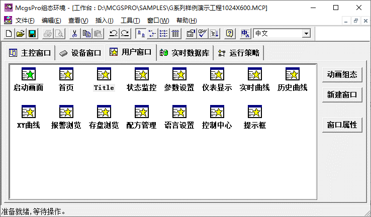

图1.1-1 McgsPro组态软件界面

McgsPro组态软件拥有强大的界面显示组态功能、丰富的功能模块、良好的开放性、强大的数据库、可编程的脚本命令、完善的安全机制、便捷的仿真功能，可适应不同用户的需要。广泛应用于电力设备、纺织机械、生产设备、铁路行业、橡胶机械、中央空调、印刷机械、重工机械等行业。

## 1.2 产品结构

McgsPro组态软件是昆仑通态研发的人机界面产品的一部分。人机界面产品由以下四个部分组成：

-   McgsPro组态软件：安装、运行于PC端，自动化工程师在此完成McgsPro工程开发和调试工作；
-   McgsPro运行环境：用于运行用户开发的McgsPro工程，标准TPC产品自带McgsPro运行环境；
-   TPC系统NK：系统NK可以简单的看作TPC的操作系统，McgsPro运行环境就运行在TPC系统NK中，标准TPC产品自带系统NK；
-   TPC：昆仑通态生产的HMI人机界面，提供工程运行的硬件平台。

# 第2章 McgsPro组态软件基础应用

本章主要介绍McgsPro组态软件的下载、安装、卸载、运行、工程下载、工程上传、工程兼容性、工程恢复，以及软件帮助等基础应用。

## 2.1 软件下载

McgsPro组态软件可在昆仑通态官网：[www.mcgs.cn](http://www.mcgs.cn) → 【下载中心】下载，或拨打热线电话4006007062获取。

## 2.2 安装和卸载

### 2.2.1 软件安装

1、支持的的操作系统：

-   Windows 7 (中文简体)
-   Windows 8 (中文简体)
-   Windows 8.1 (中文简体)
-   Windows 10 (中文简体)

2、McgsPro安装步骤如下：

1.  关闭电脑中的安全软件（杀毒软件和防火墙软件）；
2.  解压McgsPro组态软件压缩包；
3.  双击【Setup.exe】，运行安装程序；
4.  进入欢迎界面，如图2.2-1所示，点击【下一步】：

>   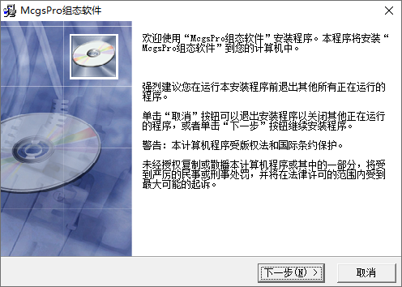

图2.2-1 欢迎界面

1.  如图2.2-2所示，阅读“自述文件”后，点击【下一步】：

>   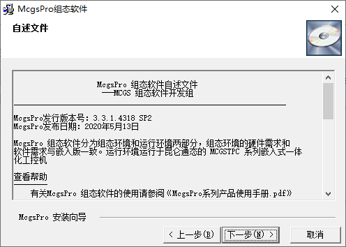

图2.2-2 自述文件

1.  如图2.2-3所示， McgsPro默认安装到“D:\\McgsPro”。如需指定安装路径，请单击【浏览】更改。设置完成后，点击【下一步】：

>   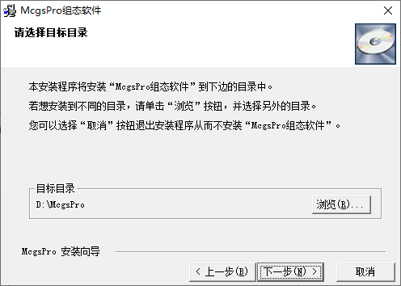

图2.2-3 选择安装路径

1.  完成安装步骤⑥，再次点击【下一步】，McgsPro软件启动安装。安装完成后，自动在桌面生成图2.2-4所示的快捷方式：“ McgsPro组态软件”、“ McgsPro模拟器”。

>   

图2.2-4 McgsPro快捷方式

在上述安装过程中，用户单击【取消】，可退出安装。

### 2.2.2 软件卸载

执行卸载前，请先退出McgsPro组态软件。卸载步骤如下：

1.  在电脑端依次打开【控制面板】→【卸载程序】或【程序和功能】；
2.  在【卸载或更改程序】界面，单击选中【McgsPro组态软件】→ 点击鼠标右键 →【卸载/更改】；
3.  如图2.2-5所示，卸载方式选择【自动】，点击【下一步】，等待McgsPro卸载完成。

>   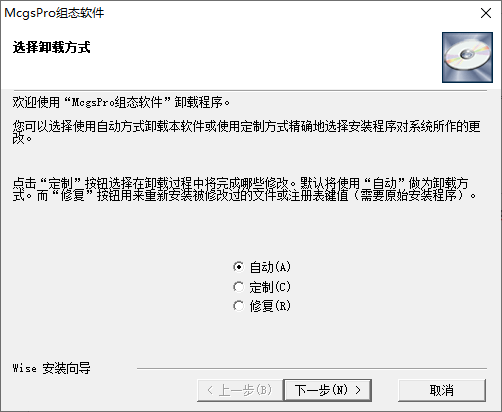

图2.2-5 卸载McgsPro组态软件

## 2.3 运行和退出McgsPro

### 2.3.1 运行McgsPro

方法1：从“开始”菜单启动，步骤如下：

【开始】→【所有程序】→【McgsPro组态软件】→【McgsPro组态软件】快捷方式

方法2：双击 “McgsPro组态软件”快捷方式，如图2.3-1所示：

>   

图2.3-1 运行McgsPro组态软件

-   首次启动McgsPro组态软件，默认打开如图2.3-2所示的样例演示工程：

>   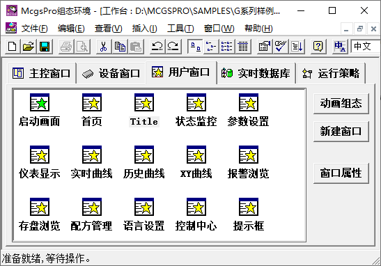

图2.3-2 样例演示工程

-   非首次启动McgsPro组态软件，将自动打开上次操作的工程项目。

### 2.3.2 退出McgsPro

启动McgsPro组态软件后，可使用下列任意一种方法退出：

-   单击McgsPro组态软件主界面右上角的【关闭】按钮；
-   如图2.3-3所示，单击McgsPro组态软件菜单栏的【文件】→【退出】。

>   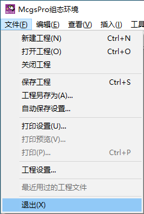

图2.3-3 退出McgsPro

注意：退出McgsPro组态软件前，请确保工程已保存。

## 2.4 新建工程

新建工程步骤如下：

1.  运行McgsPro组态软件；
2.  依次点击菜单栏【文件】→【新建工程】，或者直接在工具栏单击图标 ，进行新建工程；
3.  如图2.4-1所示，依次设置新工程的HMI配置、组态配置参数（包括网格、构件风格、工程旋转），设置完成后，点击【确定】，完成新建工程操作。

>   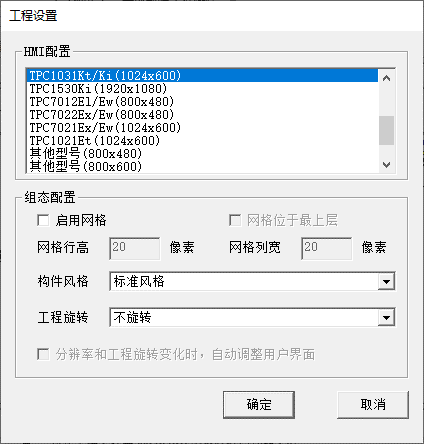

图2.4-1 新建工程设置

a. 选择TPC型号分辨率（如未找到或不清楚TPC型号，请选择“其他型号”中对应的分辨率）；

b. 启用网格（网格仅组态时显示，运行时不显示）；

c. 选择默认的构件绘制风格；

d. 设置工程运行时画面旋转角度，支持不旋转、旋转90度、180度、270度；

e. 分辨率自动调整设置，通过【文件】→【工程设置】修改工程设置时有效。修改工程分辨率或旋转角度时勾选此项，可

实现构件大小自动调整。

注意：

-   工程新建完成后，图2.4-1中所有的参数设置，均可通过【文件】→【工程设置】重新修改。
-   新建工程名称由McgsPro组态软件自动命名为【新建工程N】（N为≥0的整数）;
-   新建工程的路径与上一次运行McgsPro组态软件打开的工程路径一致。用户可以通过【文件】→【工程另存为】，重命名工程或将工程保存到指定路径。

## 2.5 工程下载和上传

McgsPro组态软件可以在电脑端模拟运行工程，还可以通过U盘、USB从口线（[USBTYPE-B4Pin](https://b2b.baidu.com/b2bsearch/jump?url=https%3A%2F%2Fwww.taoic.com%2Fproduct%2F5c2f6ad6-287f-11ea-8230-00163e1552d4-24&query=USB-4PIN&logid=3303929692&srcId=27729&brand=QYT&category=%E7%94%B5%E5%AD%90%E4%BB%AA%E8%A1%A8%3B%E9%9B%86%E6%88%90%E7%94%B5%E8%B7%AF%3B%E5%85%B6%E4%BB%96%E9%9B%86%E6%88%90%E7%94%B5%E8%B7%AF&sv_cr=0&uign=5ba79e1baca424d843007ad44705632d&iid=23740fe6719c8bdf80e4e27776d9c60f&timeSignOri=1597997096&xzhid=29704578&miniId=8469&ii_pos=5&from=b2b_straight&srcid=5103&from_restype=elec&from_index=6)）、网线的方式下载工程到TPC中运行，以及从TPC中上传工程。注意，下载工程到TPC会清除原TPC中的工程。

通过菜单栏【工具】→【下载工程】，或者直接点击工具栏中的图标 ，进入图2.5-1所示的下载配置界面。在图中的【下载选项】，选择是否清除TPC中的用户数据，以及是否允许从TPC中上传工程。

>   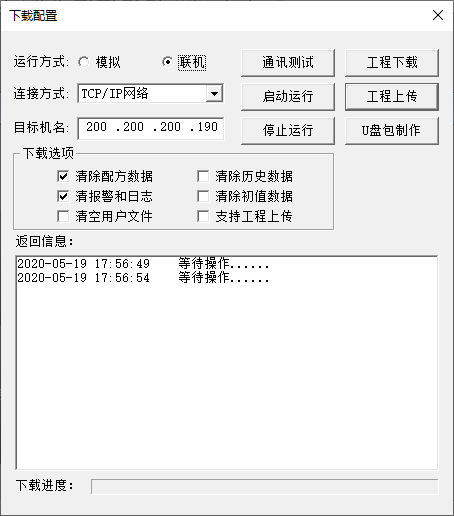

图2.5-1 下载配置

图2.5-1【下载选项】功能解释：

-   清除配方数据**：**更新工程时，清除TPC中保存的配方数据；
-   清除历史数据**：**更新工程时，清除TPC中保存的历史数据；
-   清报警和日志：更新工程时，清除TPC中保存的历史报警数据和操作日志数据；
-   清除初值数据：更新工程时，清除TPC中保存的初值数据；
-   清空用户文件：更新工程时，清除TPC中用户文件区内的保存的用户文件（可通过菜单栏【工具】→【TPC文件操作】、【U盘包制作】→【附带文件功能】、或函数“!FileCopy”和“!FileDelete”，修改用户文件区中的文件）；
-   支持工程上传：允许用户上传本次更新到TPC中的工程。

### 2.5.1 模拟运行

使用McgsPro组态软件完成工程组态工作后，图2.5-1中运行方式选择【模拟】，再依次点击【工程下载】→【启动运行】，可将工程下载到模拟器中模拟运行，样例演示工程模拟运行画面如图2.5-2所示：

>   

图2.5-2 模拟运行画面

### 2.5.2 U盘下载和上传工程

适用范围：所有型号的TPC均支持U盘下载或上传工程，U盘必须为FAT32格式。

-   **U盘下载工程**
1.  准备一只FAT32格式的U盘，插入电脑；
2.  运行McgsPro组态软件，打开工程，进入下载配置界面；
3.  如图2.5-3所示，单击【U盘包制作】→【U盘功能包内容选择对话框】，功能包目录选择U盘目录，点击【确定】，完成U盘功能包制作；（可将多个不同名称的工程通过U盘包的方式制作到同一个U盘中）

>   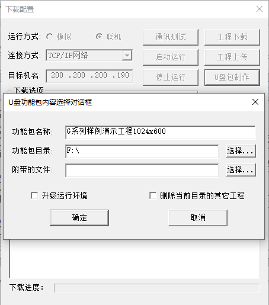

图2.5-3 U盘功能包制作

名词解释

a. 编辑功能包名称

b. 选择U盘功能包制作路径（可选择非U盘路径，只需制作完成后手动拷贝“tpcbackup”到U盘根目录即可）

c. 选择附带的文件（附带文件会在下载工程时拷贝到用户文件区，用户文件区文件操作方法将在后续章节进行讲解。）

d. 打包当前版本McgsPro组态软件对应的运行环境到U盘功能包，供升级时使用

e. 选择是否删除“功能包目录”指向路径中的其他工程

1.  将U盘插入TPC的USB主口，TPC弹出图2.5-4所示的提示界面，依次点击【是】→【用户工程更新】

>   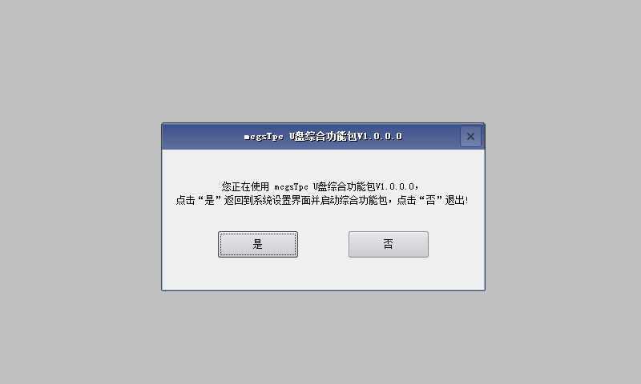 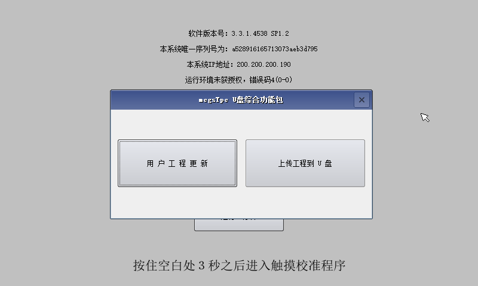

图2.5-4 准备更新工程

1.  如图2.5-5所示，在下载工程列表中单击选择需要下载的工程，点击【开始下载】，等待工程下载完成后重启TPC即可。

>   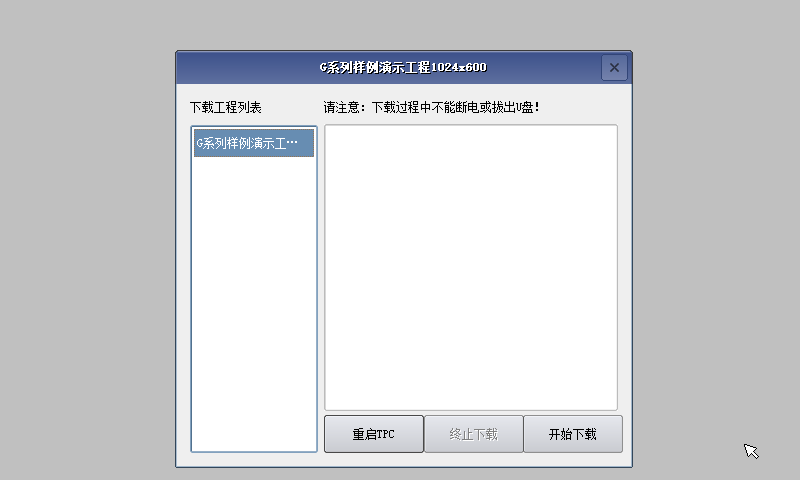 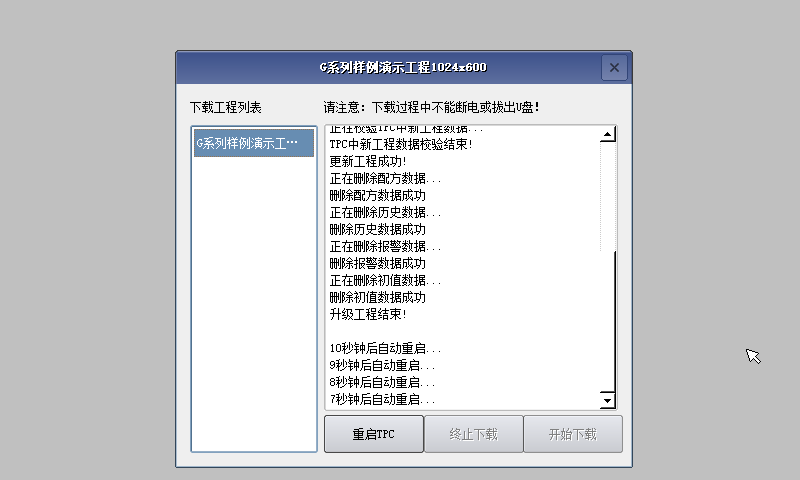

图2.5-5 U盘更新工程

-   **U盘上传工程**

前提：下载工程时勾选了图2.5-1所示的【支持工程上传】。

1.  首先完成“U盘下载工程”步骤①、②、③；
2.  将U盘插入TPC的USB主口，TPC弹出图2.5-6所示的提示界面，依次点击【是】→【上传工程到U盘】

>    

图2.5-6 准备上传工程到U盘

1.  如图2.5-7所示在TPC中工程支持上传的前提下，点击【上传】，工程将被上传到“U盘/tpcbackup/McgsTcpProject.mcp”

>   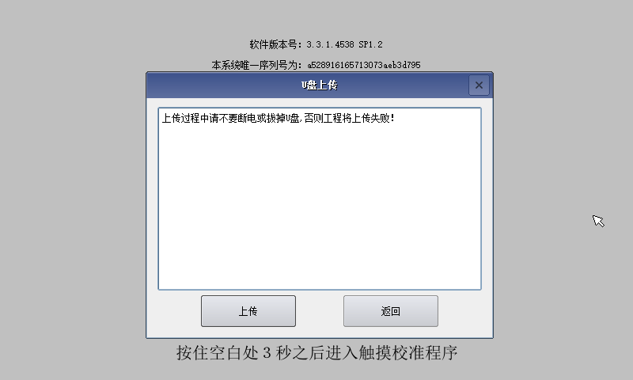 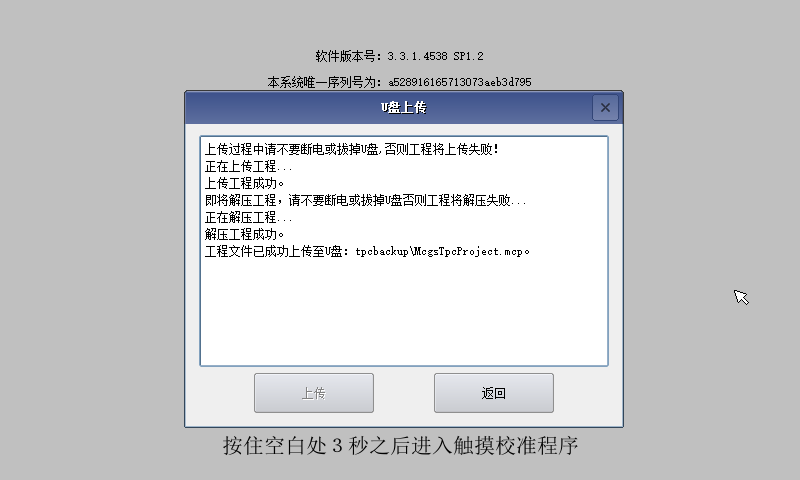

图2.5-7 完成上传工程到U盘

### 2.5.3 USB从口下载和上传工程

使用USB从口下载和上传工程，需要事先在【TPC系统设置】中将USB模式设置为【从口模式】，设置方法请参考硬件篇章节2.1.2。

-   **USB从口下载工程**
1.  使用图2.5-8所示的从口线连接电脑和TPC；

>   

图2.5-8 USB从口线

1.  运行McgsPro组态软件，打开工程，进入下载配置界面。如图2.5-9所示，运行方式：【联机】，连接方式【USB通讯】。设置完成，点击【通讯测试】正常后，再点击【工程下载】即可。

>   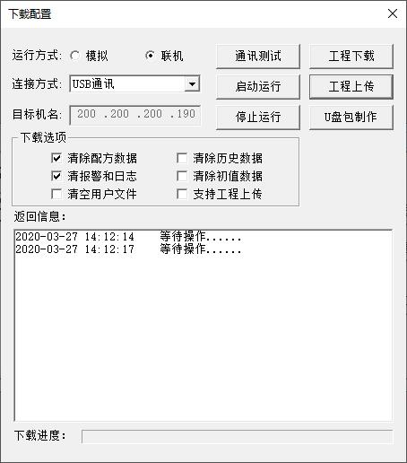

图2.5-9 USB从口下载工程设置

-   **USB从口上传工程**

前提：下载工程时勾选了图2.5-1所示的【支持工程上传】。

1.  使用从口线连接电脑和TPC；
2.  运行McgsPro组态软件，任意打开一个工程。点击【菜单栏】→【工具】→【上传工程】，进入图2.5-10所示的“上传工程”界面；（也可点击图2.5-9中的【工程上传】，进入“上传工程”界面）

>   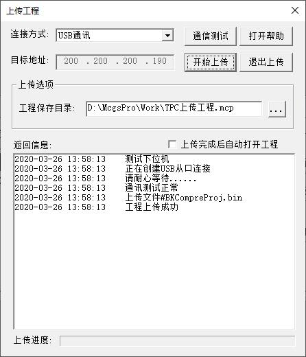

图2.5-10 USB从口上传工程

1.  在图2.5-10所示界面，连接方式选择【USB通讯】，设置【工程保存目录】，最后进行通讯测试，完成后点击【开始上传】即可。

### 2.5.4 网线下载和上传工程

网线上传和下载工程，需要将电脑和TPC的IP地址修改为同一网段。TPC的IP地址修改方法请参考硬件篇章节2.1.2。

-   **网线下载和上传工程**

    通过网线下载和上传工程操作步骤与“USB从口下载和上传工程”类似。区别在于，下载和上传工程时，连接方式选择：【TCP/IP网络】；目标机名：输入TPC的IP地址，如图2.5-11所示：

>   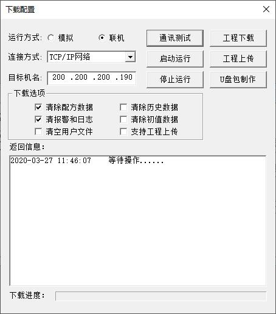

图2.5-11 网线下载工程设置

## 2.6 运行环境升级

TPC的运行环境可以看作运行在TPC中McgsPro软件平台，运行环境升级指的就是升级运行在TPC中的McgsPro软件版本，用户可以使用U盘或网线更新TPC运行环境。

-   McgsPro组态软件版本查看方法：打开组态软件 →菜单栏 →【帮助】→【关于】；
-   TPC运行环境版本查看方法：重启TPC → 进度条界面按住TPC液晶面板 → 进入系统配置。

注意：

1.  高版本的运行环境可以兼容低版本McgsPro软件组态的工程；
2.  低版本的运行环境可能无法兼容高版本McgsPro软件组态的工程。

### 2.6.1 U盘升级运行环境

有2种U盘包可以实现TPC运行环境升级功能，分别是：U盘功能包、McgsPro运行环境升级包。（U盘必须使用FAT32格式）

-   **U盘功能包**

    U盘功能包：指入门篇章节2.5.2制作的U盘功能包，需要用户在制作U盘功能包时，勾选【升级运行环境】，如图2.6-1所示：

>   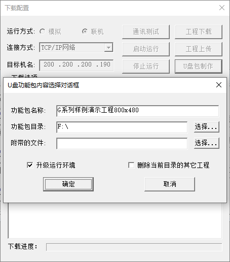

图2.6-1打包运行环境到U盘包

注意：使用打包了运行环境的U盘功能包更新工程时，当U盘功能包中的运行环境版本高于TPC时，会自动触发TPC运行环境升级提示，由用户选择是否升级。

-   **McgsPro运行环境升级包**

跟随McgsPro组态软件一起发布的运行环境U盘升级包，该升级包提供运行环境升级功能，可无视TPC当前运行环境版本，强制将TPC运行环境升级到目标版本。

解压“运行环境升级包.rar”，拷贝解压后的“tpcbackup”文件夹到U盘，将U盘插入待升级的TPC，按照提示即可完成运行环境升级，详请参考辅助工具章节1.1。

### 2.6.2 网线升级运行环境

网线升级运行环境要求：电脑端安装的McgsPro组态软件版本不低于3.3.1.3010 SP1，TPC自身运行环境版本不低于3.3.1.3955 SP1。网线升级运行环境操作步骤如下：

1.  按照章节2.5.4中网线下载工程操作方法，用网线连接电脑与TPC，进行工程下载；
2.  当组态环境版本高于TPC运行环境版本，系统自动弹出图2.6-2所示的运行环境升级确认框，点击【确定】，自动将触摸屏运行环境升级后再下载工程；点击【取消】不升级运行环境，直接下载工程。

>   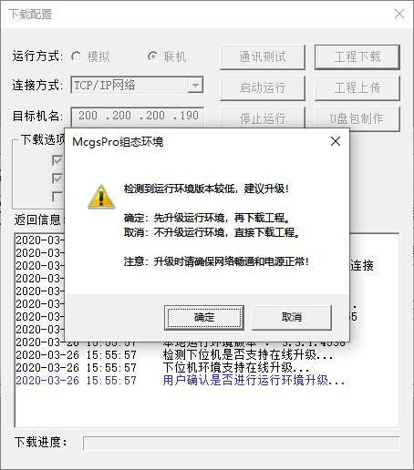

图2.6-2 网线更新运行环境

## 2.7 工程兼容性

### 2.7.1 McgsPro软件打开McgsPro工程

McgsPro软件版本向上兼容，遵循如下原则：

-   老版本McgsPro组态软件开发的工程可以用新版本McgsPro组态软件打开

    注意：

    新版本软件打开旧版本软件组态的工程，会在工程所在目录生成1个旧版工程备份文件，文件命名方式：“ 旧工程名称 + 旧工程软件版本 + 序号 + .old”。手动修改旧版工程备份文件后缀名为“.mcp”，可以恢复旧工程。

    例如：使用McgsPro 3.3.1 SP2 打开3.3.1 SP1.3组态的工程，原工程名“测试工程.MCP”，备份文件如图2.7-1所示：

>   

图2.7-1自动备份的工程文件示例

-   新版本McgsPro组态软件开发的工程无法用老版本McgsPro组态软件打开

### 2.7.2 McgsPro软件打开MCGSE工程

McgsPro支持打开MCGSE嵌入版组态的工程。操作步骤如下：

1.  如图2.7-2所示，首先运行McgsPro，点击菜单栏图标 ；
2.  打开的文件类型选择【所有文件】；
3.  选择需要打开的MCGSE嵌入版工程（后缀：MCE）；
4.  单击按钮【打开】，按照提示打开MCE工程。

注意：McgsPro打开MCGSE开发的工程，仍然会在工程所在目录生成1个旧版工程备份文件，文件命名方式：“ 旧工程名称 + 旧工程软件版本 + 序号 + .old”（参考图2.7-1）。手动修改旧版工程备份文件后缀名为“.MCE”，可以恢复旧工程。

>   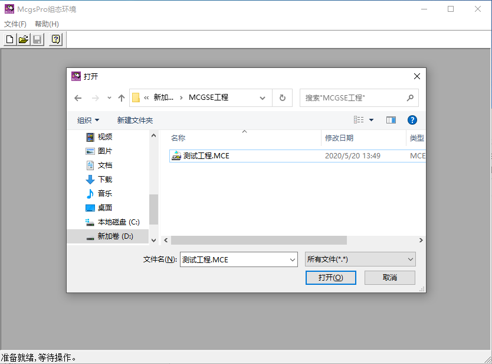

图2.7-2 McgsPro打开MCGSE工程

## 2.8 工程备份

用户在工程开发过程中，每次打开工程时，McgsPro组态软件都会对工程进行一次备份操作，路径为McgsPro安装目录下： “McgsPro\\Program\\bakprj_MCP\\工程名称”。

如图2.8-1所示，备份内容包括：bakprj.ini（存储原工程路径）、工程文件（命名：工程名 + 打开时间 + .bak）。将备份的“工程文件”后缀名修改为“.mcp”，再使用McgsPro组态软件打开，可以恢复工程。

>   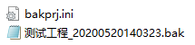

图2.8-1 McgsPro备份内容

注意：该备份方式是以工程名进行备份，同名工程会覆盖。

## 2.9 软件帮助

McgsPro组态软件提供McgsPro帮助手册和设备帮助。

### 2.9.1 McgsPro帮助手册

提供McgsPro组态软件功能和使用方法帮助。在已运行McgsPro组态软件的前提下，可通过以下三种方法打开McgsPro帮助手册：

-   按下键盘上的【F1】键；
-   点击McgsPro组态软件菜单栏的【帮助】；
-   通过构件属性设置对话框右下角的【帮助】按钮，直接打开对应构件帮助文档。

### 2.9.2 设备帮助

提供McgsPro驱动设备帮助，主要介绍TPC与不同驱动设备通讯时硬件接线、McgsPro端通讯参数设置、驱动通道信息、驱动设备命令、通讯故障分析处理、以及PLC端通讯参数设置等。驱动设备帮助可以协助用户快速在TPC与下位机之间建立通讯，或者根据“通讯状态”处理可能出现的通讯故障。

以“Siemens_1200”驱动为例，其设备帮助打开方法如下：

1.  运行McgsPro组态软件，新建一个工程，双击图2.9-1所示的【设备窗口】；

>   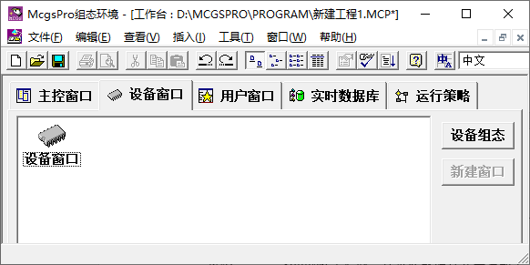

图2.9-1 设备窗口

1.  在设备窗口中依次添加“通用TCPIP父设备”和“Siemens_1200”驱动，如图2.9-2所示；

>   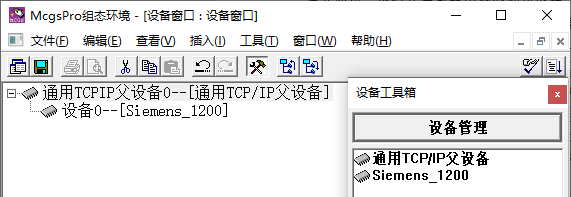

图2.9-2 添加设备驱动

1.  双击添加的“Siemens_1200”，进入其设备编辑窗口，点击【打开设备帮助】，即可进入“Siemens_1200”驱动的设备帮助，如图2.9-3所示；

>   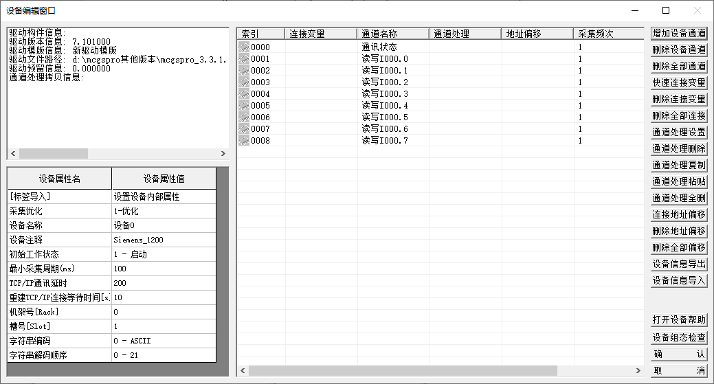

图2.9-3 打开设备帮助

注意：不同驱动设备打开的设备帮助是不一样的，通过“Siemens_1200”只能打开“Siemens_1200”驱动对应的设备帮助，如需参考其他驱动的设备帮助，请按照上述步骤，选择需要的驱动设备进行操作。

# 

# 第3章 McgsPro简单工程制作

本章以【液位保持系统】为例，演示简单McgsPro工程制作过程。让大家对使用McgsPro的组态流程有一个直观的认识，以及对软件界面、软件基本功能和组态方式有初步的印象。

在实际应用中，用户可以选择先组态设备通道，建立TPC与外部设备的连接，再组态画面；或者先组态画面，再组态设备通道。本章样例使用第一种组态流程。

工程组态流程：

1.  建立新工程
2.  组态设备窗口
3.  组态实时数据库
4.  将变量与通道相连
5.  组态用户窗口
6.  模拟运行测试
7.  下载工程到TPC

## 3.1 工程组成

McgsPro组态软件由主控窗口、设备窗口、用户窗口、实时数据库和运行策略五个部分构成，如图3.1-1所示：

>   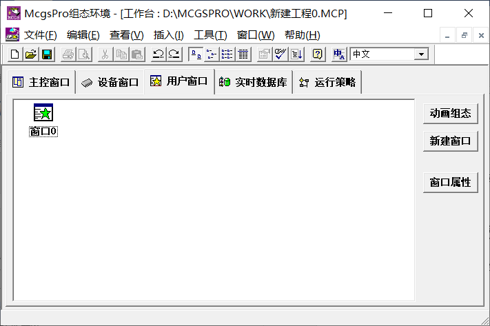

图3.1-1 McgsPro组态软件界面

a.主控窗口；b.设备窗口；c.用户窗口；d.实时数据库；e.运行策略

## 3.2 工程需求分析

现有一个蓄水池，它有一根进水管和一根出水管。进水管和出水管上各有一个水泵和一个电动阀门，由PLC控制。用一个液位计将蓄水池中的水位数据实时传递给PLC，根据下游管网用水需要，PLC对进出水泵和阀门进行控制。当蓄水池液位过高或过低时，系统报警。

>   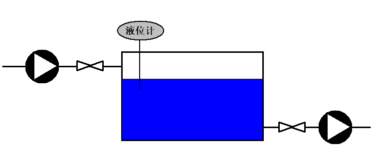

图3.2-1 工程工艺流程图

## 3.3 控制系统分析

### 3.3.1 系统组成

根据工程需求，我们采用上位机、PLC和检测仪表等构建该控制系统。

PLC主要完成数据（液位计）采集、控制设备（水泵、电动阀）启动/停止等任务；上位机则使用TPC通过以太网与PLC进行通信，提供直观的人机交互界面，方便用户操作。

### 3.3.2 软硬件选型

根据以上系统分析，需配备以下设备和参数：

-   软件环境：McgsPro组态软件

    STEP 7 MicroWIN SMART

-   硬件环境：运行Windows 7/8/8.1/10操作系统的个人电脑一台

    G系列TPC一台（本例中选用TPC1071Gi）

工业PLC一款（本例中选用西门子_Smart200）

电源（DC24V电源一个，为TPC供电；AC220V电源一个，为PLC供电）

网线（用于TPC、PLC和电脑三者之间通讯）

### 3.3.3 PLC地址和McgsPro工程画面规划

-   PLC地址规划

| **序号** | **设备** | **地址** | **McgsPro对应变量名** | **备注**                             |
|----------|----------|----------|-----------------------|--------------------------------------|
| 1        | 进水泵   | I0.0     | 进水泵启停状态        |                                      |
| 2        | 出水泵   | I0.1     | 出水泵启停状态        |                                      |
| 3        | 进水阀   | I0.2     | 进水阀开闭状态        |                                      |
| 4        | 出水阀   | I0.3     | 出水阀开闭状态        |                                      |
| 5        | 进水泵   | Q0.0     | 启停进水泵            |                                      |
| 6        | 出水泵   | Q0.1     | 启停出水泵            |                                      |
| 7        | 进水阀   | Q0.2     | 开关进水阀            |                                      |
| 8        | 出水阀   | Q0.3     | 开关出水阀            |                                      |
| 9        | 液位计   | AIW0     | 液位值                | 低于1米下限位报警，高于9米上限位报警 |

-   McgsPro工程画面规划

>   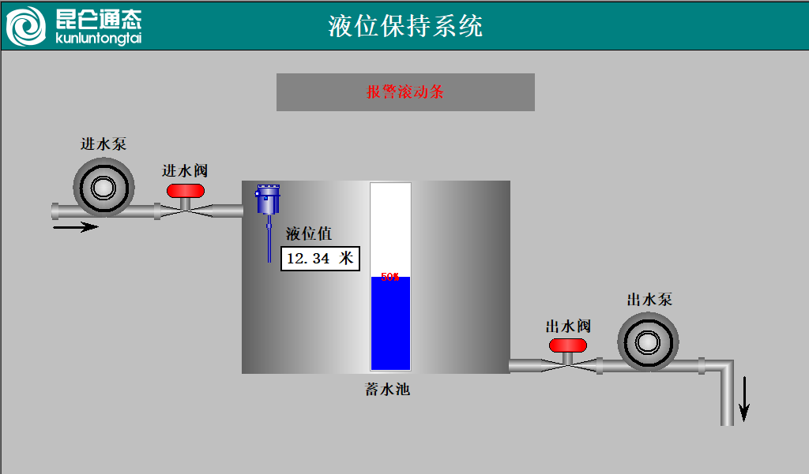

图3.3-1 工程画面规划

## 3.4 PLC工程组态

为了进行TPC与PLC之间的通讯，我们需要对PLC的通讯参数进行设置。

在本工程中，我们使用STEP 7 MicroWIN SMART软件对Smart200的通讯参数进行设置。打开软件后，首先新建工程，选择合适的PLC后，点击项目列表中“通信”弹出通信窗口，点击“查找CPU”按钮，找到CPU后，点击“确定”。如图：

>   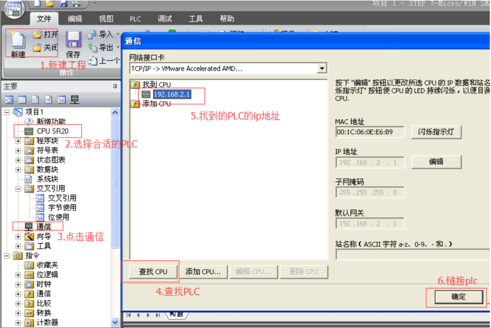

图3.4-1 在STEP 7 MicroWIN SMART软件中添加PLC

点击项目列表下“通信”，在通信窗口点击“设置”按钮设置IP地址等。如图：

>   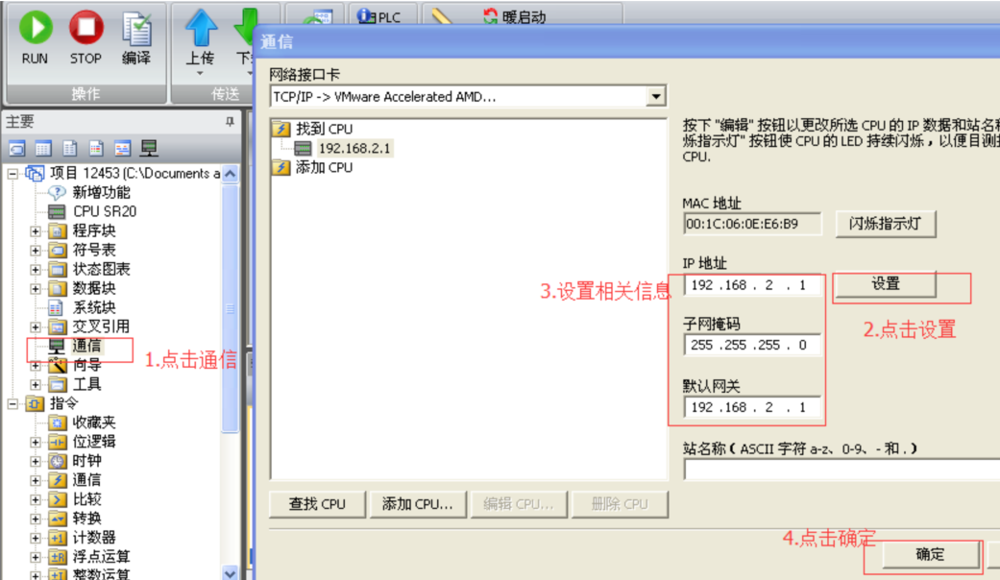

图3.4-2 设置PLC的IP地址

注意：本节教程只介绍PLC端通讯参数设置方法，需要客户自行组态PLC程序。

## 3.5 McgsPro工程组态

### 3.5.1 创建工程

-   启动McgsPro组态软件

>   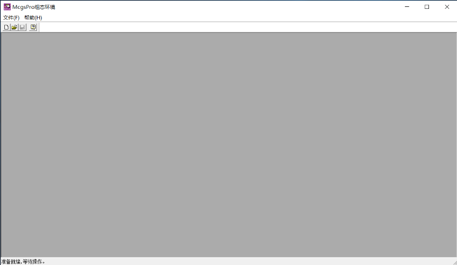

图3.5-1 工程开始界面

-   创建新工程
1.  单击工具栏的图标，新建工程
2.  选择TPC型号
3.  进行组态配置，本样例采用默认设置

新建的工程会出现在安装目录下Work文件夹中，以“新建工程N”命名。

>   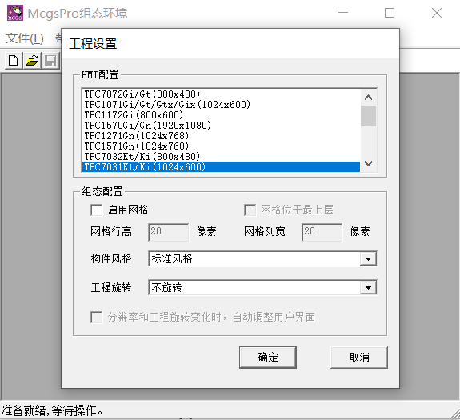

图3.5-2 新建工程设置界面

### 3.5.2 设备窗口组态

-   打开设备窗口
1.  选择【工作台】的【设备窗口】页面
2.  双击下方【设备窗口】图标，进入设备窗口设置界面

>   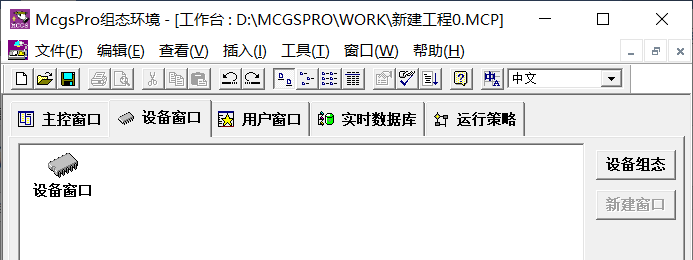

图3.5-3 工作台界面

-   添加Smart200驱动
1.  工具栏中的图标，打开【设备工具箱】
2.  双击【设备工具箱】中的【通用TCP/IP父设备】，在设备窗口设置界面添加Smart200驱动的父设备
3.  双击【设备工具箱】中的【西门子_Smart200】添加子设备
4.  弹出提示窗口，询问“是否使用‘西门子_Smart200’驱动的默认通讯参数设置TCP/IP父设备参数？”，选择“是”，在【通用TCP/IP父设备】下添加Smart200驱动

>   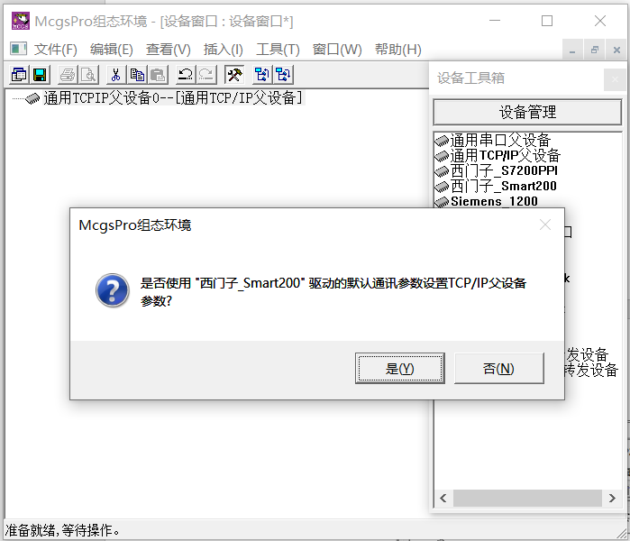

图3.5-4 添加Smart200驱动

-   增加设备通道
1.  双击添加好的Smart200驱动，弹出【设备编辑窗口】界面
2.  点击右侧的【删除全部通道】按钮，删除默认通道

>   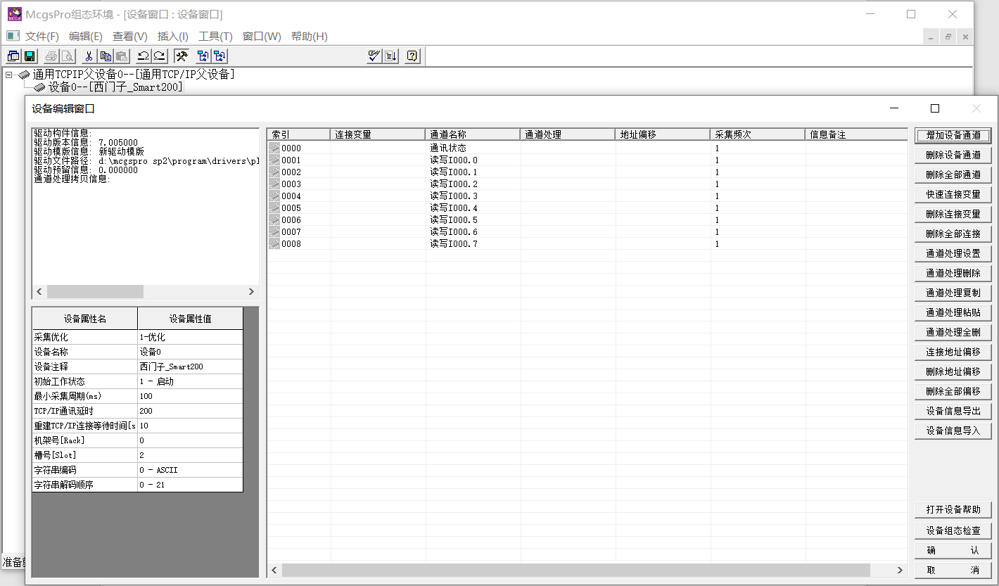

图3.5-5 设备编辑窗口界面

1.  点击【添加设备通道】按钮，弹出添加设备通道界面
2.  选择【通道类型】为【I输入继电器】
3.  设置【数值类型】为【通道的第00位】
4.  设置【通道地址】为【0】(即通道开始的地址)
5.  设置【通道个数】为【4】
6.  设置【读写方式】为【只读】，点击【确认】创建通道

>   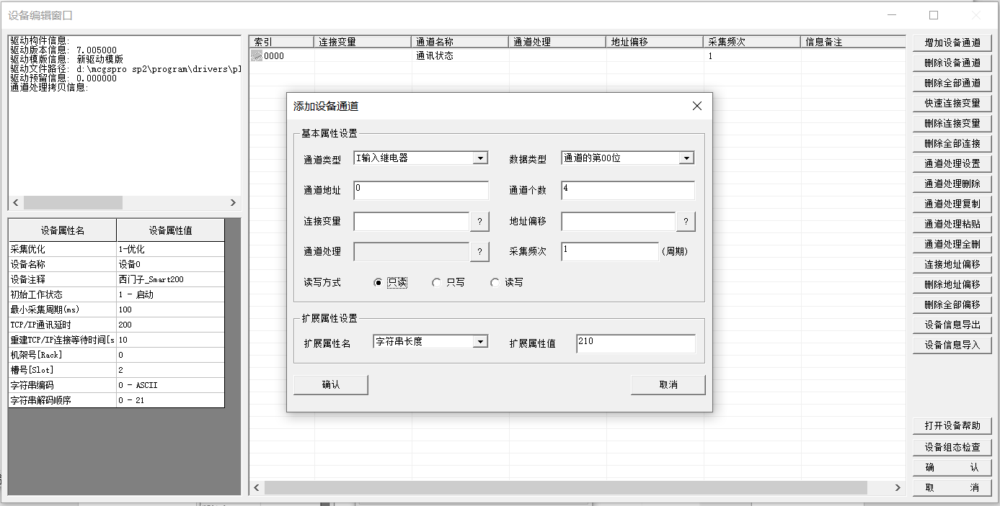

图3.5-6 添加设备通道之一

1.  用同样的方式建立4个【通道类型】为【Q输出继电器】，【数值类型】为【通道的第00位】，【通道地址】为【0】，【通道个数】为【4】，设置【读写方式】为【只写】的通道

>   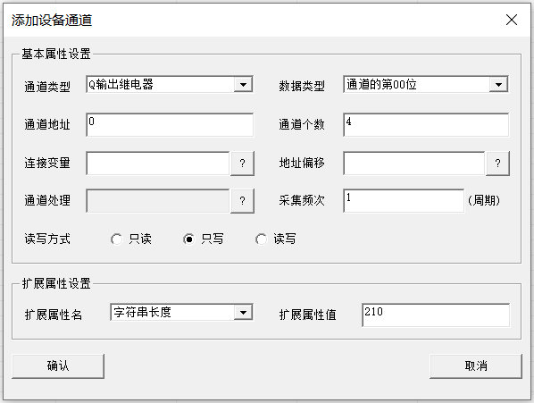

图3.5-7 添加设备通道之二

1.  再建立1个【通道类型】为【V数据寄存器】，【数值类型】为【32位 浮点数】，【通道地址】为【0】，【通道个数】为【1】的通道

>   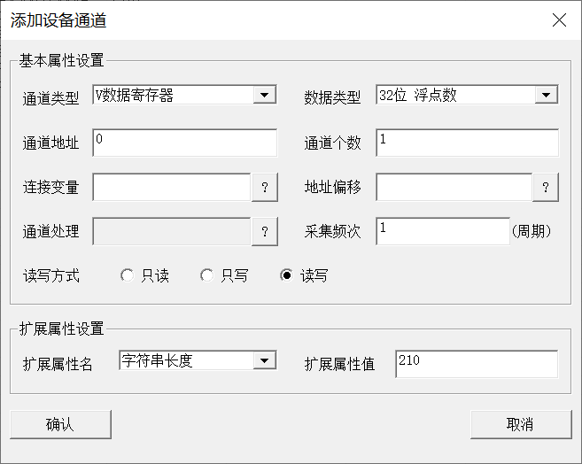

图3.5-8 添加设备通道之三

1.  创建好通道后，【设备编辑窗口】如图3.5-9所示。点击【确认】保存及关闭窗口。

>   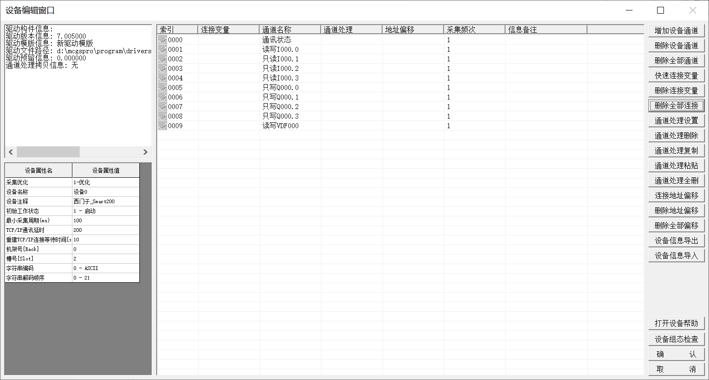

图3.5-9 通道添加完成

-   设置父设备通讯参数
1.  双击【通用TCPIP父设备0—[通用TCP/IP父设备]】，弹出【通用TCP/IP设备属性编辑】界面。
2.  在【基本属性】功能页中，设置TCP与PLC的通讯参数。

>   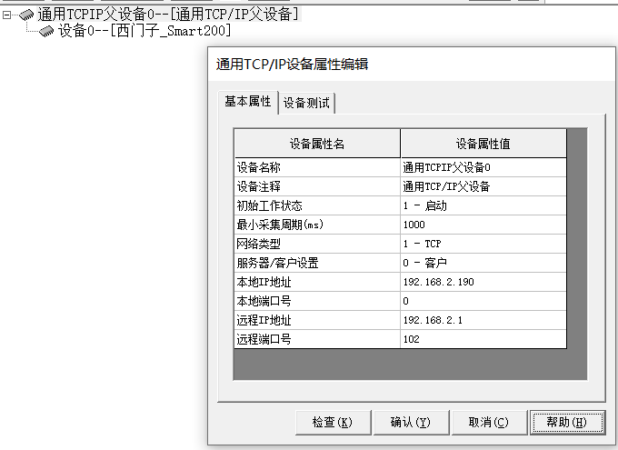

图3.5-10 通用父设备设置界面

### 3.5.3 实时数据库组态

-   在实时数据库中新增9个整数变量：
1.  选择【工作台】里的【实时数据库】
2.  点击右侧的【新增对象】，此时会在左侧系统默认自带的四个变量下方，新增一个变量【Data1】
3.  双击【Data1】，弹出【数据对象属性设置】界面
4.  在其【基本属性】功能页中，修改【对象名称】为【进水泵启停状态】
5.  选择【对象类型】为【整数】

>   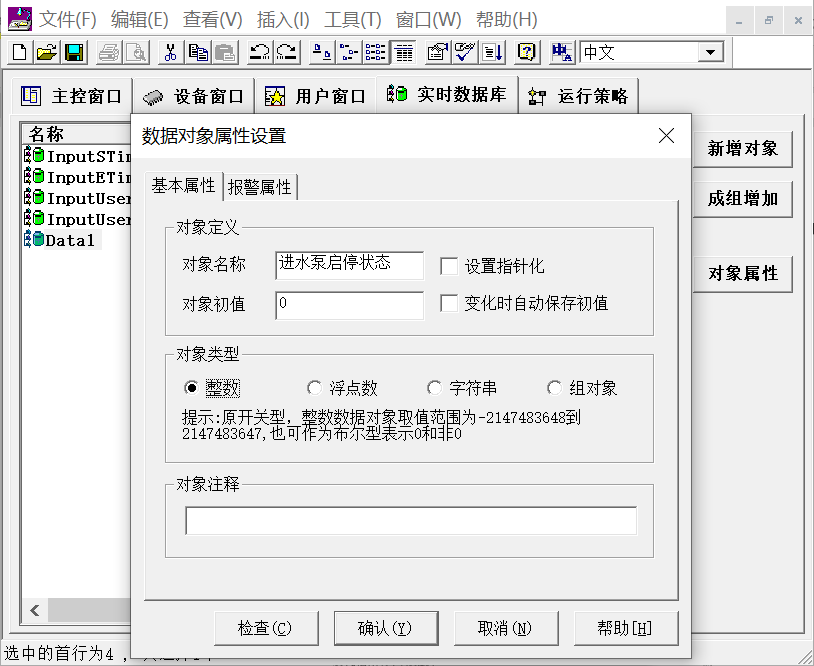

图3.5-11 变量属性设置界面

用同样的方法新建剩下的8个变量，变量名依次为【出水泵启停状态】【进水阀开闭状态】【出水阀开闭状态】【启停进水泵】【启停出水泵】【开关进水阀】【开关出水阀】【液位值】，【对象类型】均为【整数】。

-   设置变量【液位值】的报警属性：
1.  双击变量【液位值】，弹出【数据对象属性设置】界面
2.  选择【报警属性】功能页
3.  在下方的空白处右击鼠标
4.  在弹出的快捷菜单中选择【追加】，弹出【新增报警属性设置】功能页

>   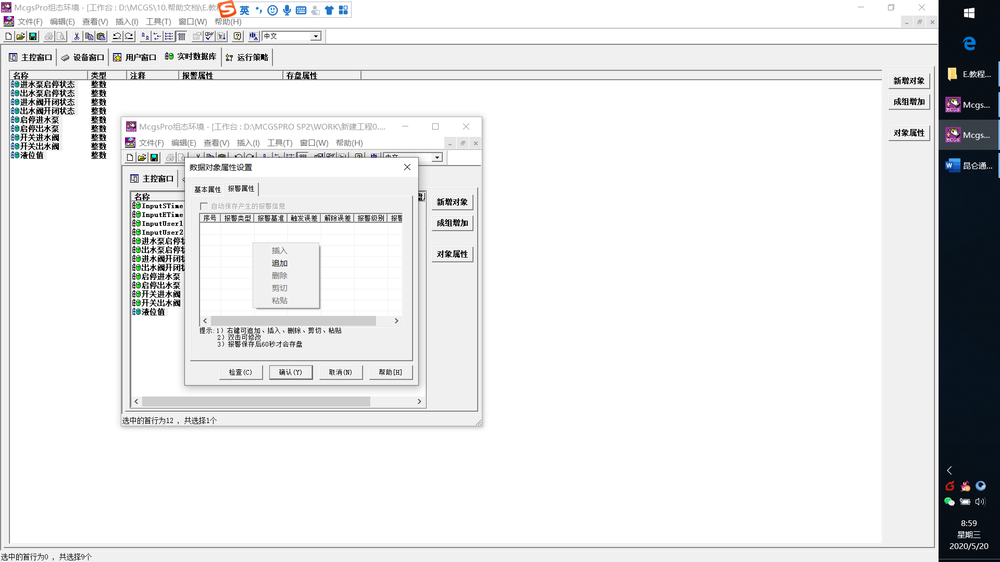

图3.5-12报警属性功能页

1.  选择【报警类型】为【值\>】
2.  设置【基准值】为【9】
3.  编辑【报警描述】为【水位高！】

>   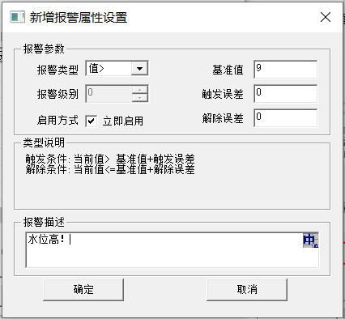

图3.5-13 新增报警属性设置界面

1.  用同样的方法，为变量【液位值】追加一条【报警类型】为【值\<】，【基准值】为【1】，【报警描述】为【水位低！】的报警。

>   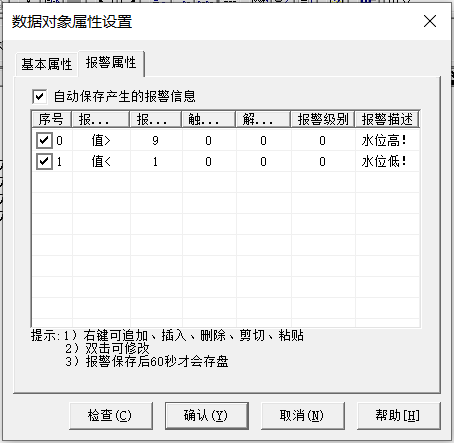

图3.5-14 追加第二条报警属性

### 3.5.4 将变量和通道相连接

1.  回到设备设备窗口，双击Smart200驱动，弹出【设备编辑窗口】界面
2.  在通道【读写I000.0】的左侧连接变量列右击鼠标，弹出【变量选择】界面
3.  在界面下方的列表中选择【进水泵启停状态】
4.  点击【确认】关闭界面

>   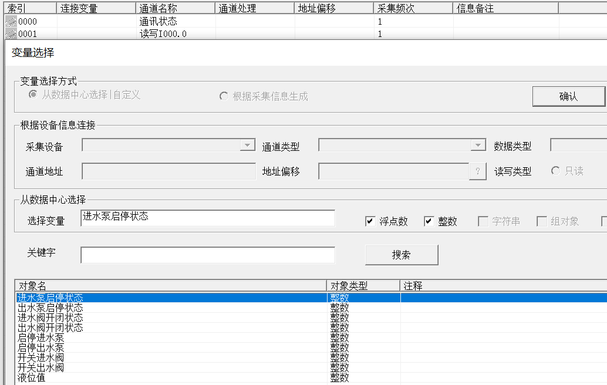

图3.5-15 将变量和通道相连接一

1.  用同样的办法将剩下的通道和变量一一连接，连接完成后如图3.5-16所示。

>   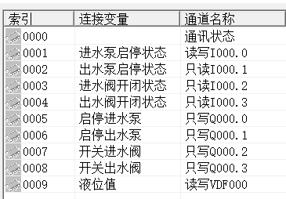

图3.5-16 将变量和通道相连接二

### 3.5.5 用户窗口组态

-   进入【动画组态窗口】开始组态画面
1.  点击菜单栏的【窗口】按钮
2.  在弹出的下拉菜单中选择【工作台：XXX】，进入工作台界面
3.  选择【用户窗口】界面
4.  双击【窗口0】，进入【动画组态窗口】界面

>   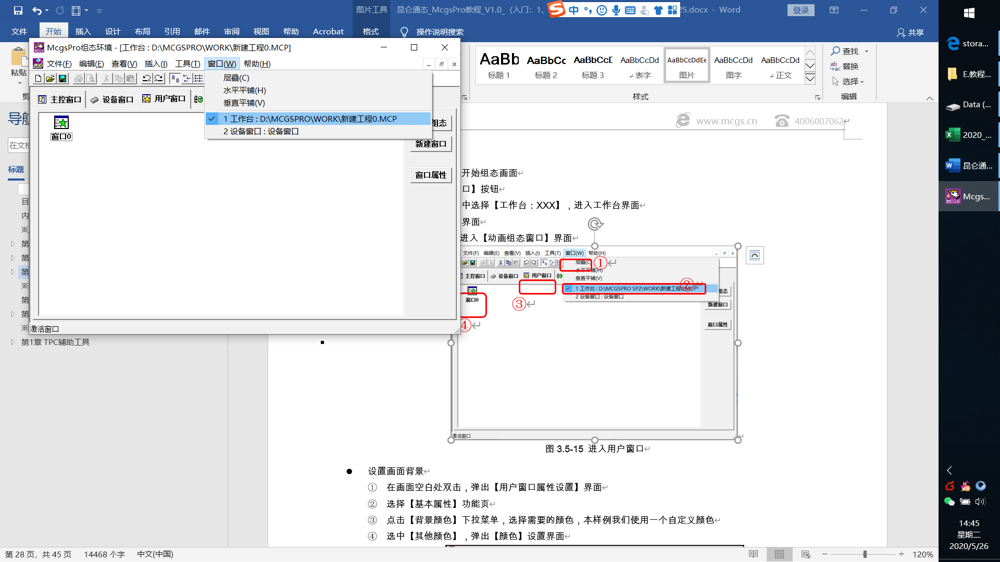

图3.5-17 进入用户窗口

-   设置窗口画面标题
1.  点击【工具箱】中的图标，将鼠标在画面上拖拽出标签构件到合适的位置和大小。【工具箱】可以通过工具栏中的图标进行打开或者关闭

>   

图3.5-18 设置窗口画面标题

1.  双击标签构件，弹出【标签动画组态属性设置】界面
2.  点击【填充颜色】下拉菜单，选择需要的颜色，本样例使用【青色】

>   

图3.5-19 设置标签填充颜色

1.  设置【字符颜色】为【白色】
2.  设置字体为【宋体】【粗体】【小一】

>   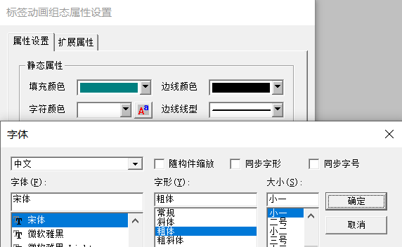

图3.5-20 设置标签字体

1.  设置线型为最细

>   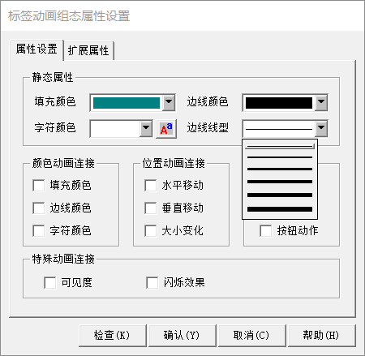

图3.5-21 设置标签边线线型

1.  选择【扩展属性】功能页
2.  在【文本内容输入框】中输入“液位保持系统”

>   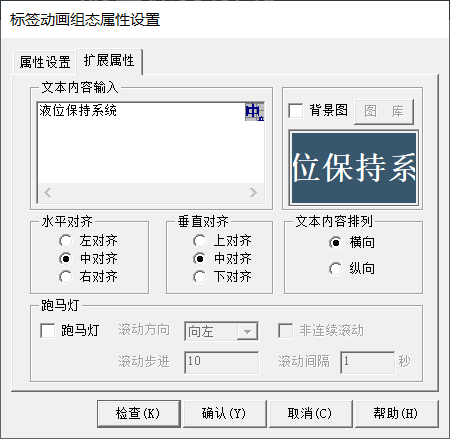

图3.5-22 设置标签文本显示内容

-   绘制蓄水池和水管
1.  点击【工具箱】中的图标，打开【常用符号】工具箱
2.  选择【常用符号】工具箱中的和图标，拖拽到合适的位置和大小

>   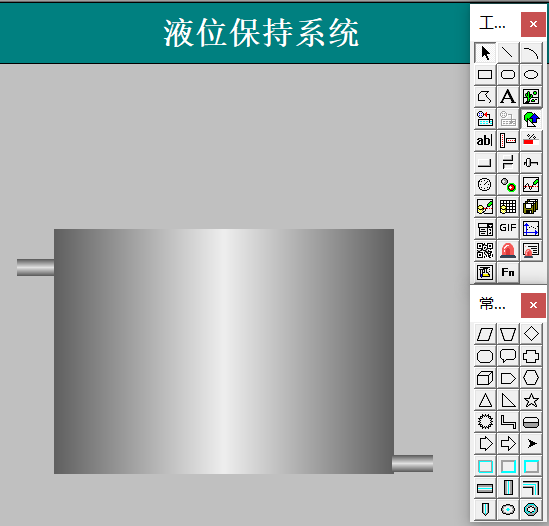

图3.5-23 绘制蓄水罐和水管

-   从图库中添加【电动阀】
1.  点击【工具箱】中的【插入元件】，弹出【元件图库管理】界面
2.  在【类型】中选择【公共图库】
3.  在下方的树形表中，选中【阀】
4.  选择需要的阀门，本样例选择【阀52】，点击确定
5.  【阀】出现在画面左上角，拖拽到合适的位置

>   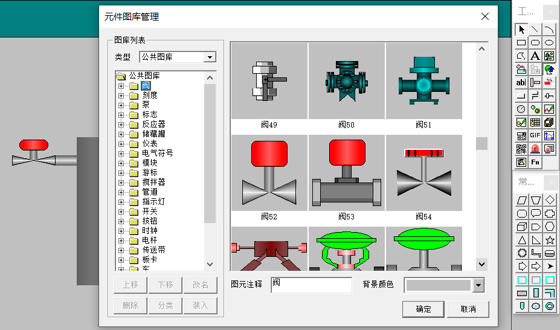

图3.5-24 从图库中添加阀门

-   用同样的方法从图库中再添加一个【电动阀】以及其他元件【公司LOGO】【水泵】和【液位计】

>   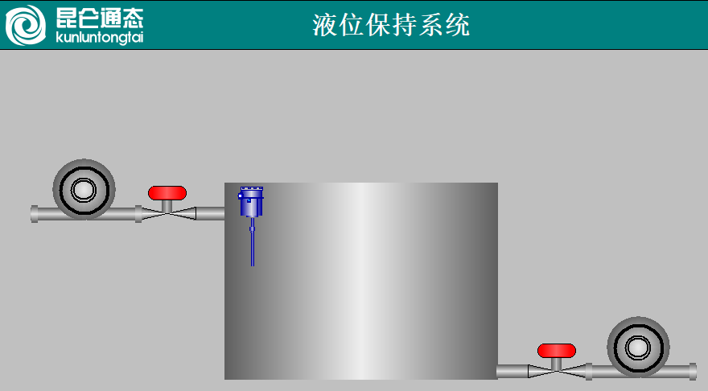

图3.5-25从图库中添加其他元件

-   【报警条】【箭头】【百分比填充】和【弯管】构件的绘制方法同绘制蓄水池和水管，其中【箭头】是由【直线】和【三角箭头】组合而成

>   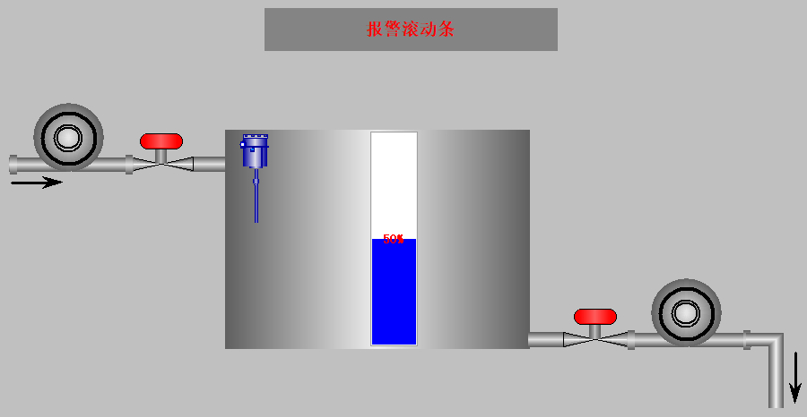

图3.5-26 添加其他构件完善画面

-   关联【百分比填充】构件的【操作属性】表达式为【液位值】，设置其0%对应的值为【0】，100%对应的值为【10】

>   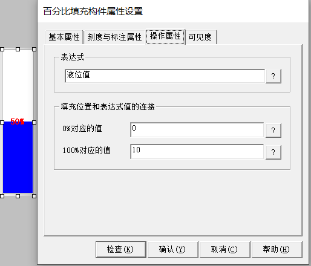

图3.5-27 设置百分比填充构件操作属性

-   设置【报警条】构件属性
1.  双击【报警条】构件，弹出【报警条属性设置】界面
2.  不对【基本属性】功能页做修改，当报警条不关联【报警对象】时，表示报警条显示所有的报警信息

>   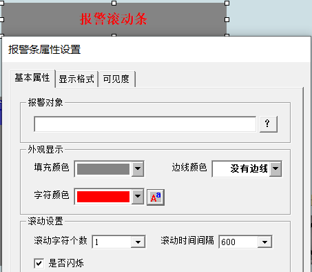

图3.5-28 报警条基本属性功能页

1.  选择【显示格式】功能页
2.  勾选【显示内容】中所有的显示
3.  设置【日期时间】格式

>   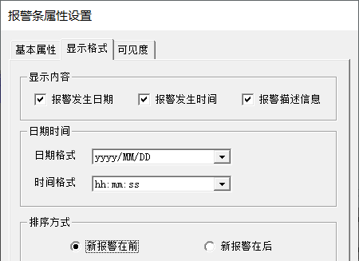

图3.5-29 设置报警条显示格式功能页

-   使用【标签】构件给图中的构件和元件标注名称。【标签】构件的绘制方法同设置窗口画面标题，选择不同的【填充颜色】和【边线颜色】绘制不同的效果

>   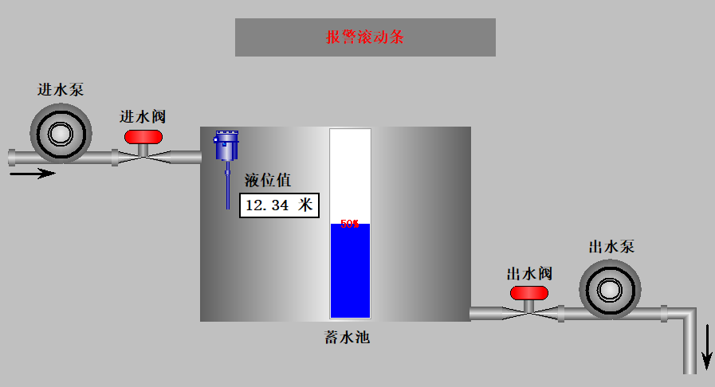

图3.5-30 添加标签构件

其中,标签构件A，需要设置显示输出表达式，使其能实时显示储水罐的液位值。

1.  双击上图中的标签构件A，弹出【标签动画组态属性设置】界面
2.  勾选【属性设置】功能页中，【输入输出连接】下【显示输出】前的复选框，出现【显示输出】功能页
3.  选择【显示输出】功能页
4.  关联表达式为【液位值】
5.  设置【单位】为【米】
6.  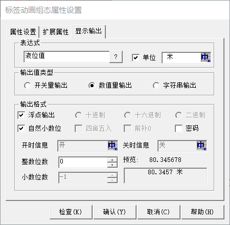选择【输出值类型】为【数值量输出】，确认退出

>   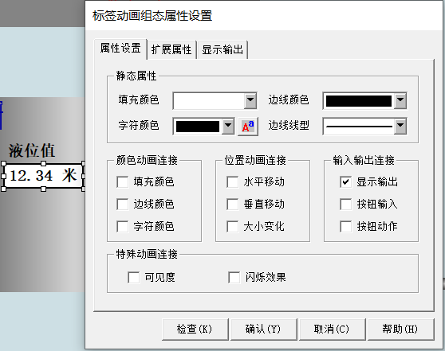

图3.5-31 设置标签A显示输出

-   将【进水阀】与变量关联
1.  双击【进水阀】元件，弹出【单元属性设置】界面
2.  在【变量列表】属性功能页中，选中【数据操作对象】，点击右侧出现的，弹出【变量选择】界面
3.  双击变量【开关进水阀】进行选择
4.  用同样的方法设置【表达式】为【进水阀开闭状态】
5.  也可以在【变量关联】处双击进入编辑状态，然后直接输入想要关联的变量的名称。

>   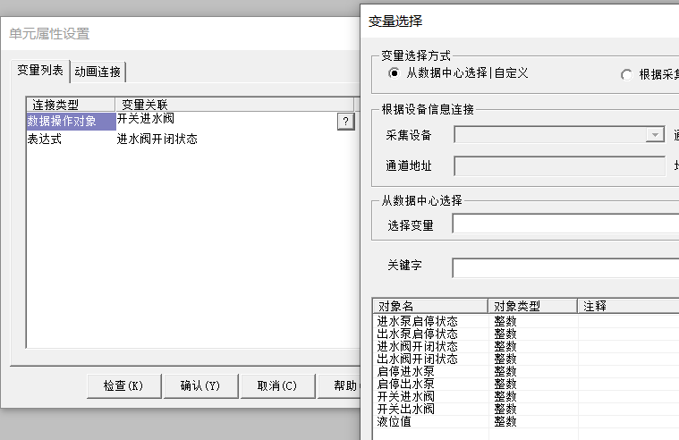

图3.5-32 设置进水阀关联变量

-   用同样的方法将【出水阀】与变量关联
1.  出水阀的【数据操作对象】关联变量【开关出水阀】
2.  出水阀的【表达式】关联变量【出水阀开闭状态】
-   将【进水泵】与变量关联
1.  双击【进水泵】，弹出【动画组态属性设置】界面
2.  勾选【基本属性】功能页中【颜色动画连接】中的【填充颜色】前的复选框，出现【填充颜色】功能页
3.  选中【填充颜色】功能页，设置表达式为【进水泵启停状态】，【填充颜色连接】中，【分段点0】的颜色设置为【红色】，【分段点1】的颜色设置为【绿色】
4.  勾选【基本属性】功能页中【输入输出连接】中的【按钮动作】前的复选框，出现【按钮动作】功能页
5.  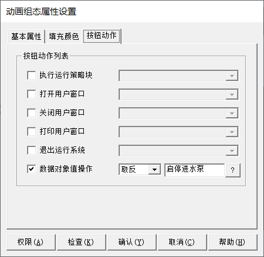选【按钮动作】功能页，勾选【数据对象值操作】前的复选框，在第一个下拉菜单中选择【取反】，在第二个输入框中关联变量【启停进水泵】，点击确认关闭界面

>   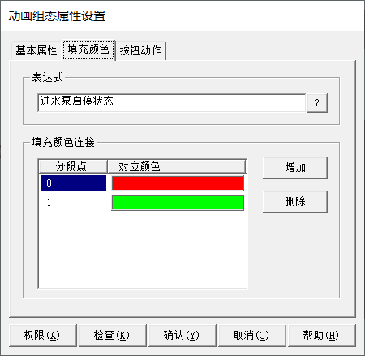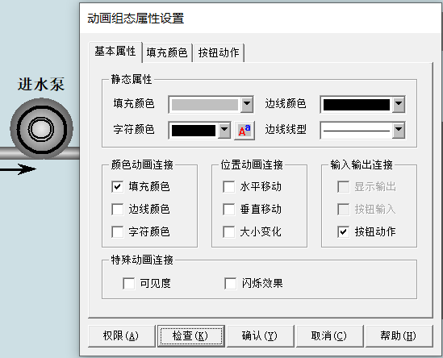

图3.5-33 设置进水阀填充颜色和按钮动作

-   用同样的方法设置元件【出水泵】中，【填充颜色】关联的表达式为【出水泵启停状态】，【按钮动作】中【数据对象值操作】为【取反】【启停出水泵】

### 3.5.6 模拟运行

在调试阶段，我们可以通过电脑和PLC直接连接，实现模拟运行在线调试。如果是串口通讯，在父设备中设置串口号即为电脑对应的串口号。本样例是网口通讯，电脑的IP地址设置为【设备窗口】中父设备的本地IP。

模拟运行前需要先保存工程。

1.  首先用网线将电脑与PLC连接，然后点击工具栏中的图标，弹出【下载配置】界面
2.  选择【运行方式】为【模拟】
3.  点击【工程下载】按钮
4.  下载成功后，点击【启动运行】按钮，弹出模拟运行窗口

>   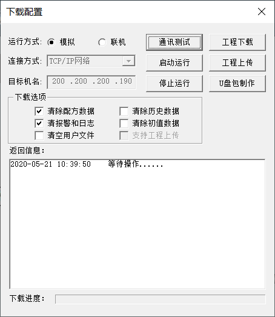

图3.5-34 模拟运行下载设置界面

模拟运行窗口如图3.5-35所示：

>   

图3.5-35 模拟运行窗口

### 3.5.7 下载工程到TPC

工程组态完成后，我们将工程下载到TPC中。并通过网线连接TPC和PLC，使TPC和PLC进行通讯，从而使TPC能显示和控制PLC中的数据。本样例我们使用TCP/IP下载的方式对工程进行下载。

1.  将电脑与TPC用网线连接，然后点击工具栏中的图标，弹出【下载配置】界面
2.  选择【运行方式】为【联机】
3.  选择【连接方式】为【TCP/IP】
4.  设置【目标机名】，该IP地址必须与TPC的IP地址一致，电脑的IP地址需与TPC在同一个网段。TPC的IP地址设置方式将在后续章节：硬件篇_2.1 TPC系统功能讲解。
5.  按照实际需求对【下载选项】进行勾选
6.  点击【工程下载】按钮
7.  下载成功后，用网线将TPC与PLC相连。点击【启动运行】按钮，TPC中下载好的工程开始运行

>   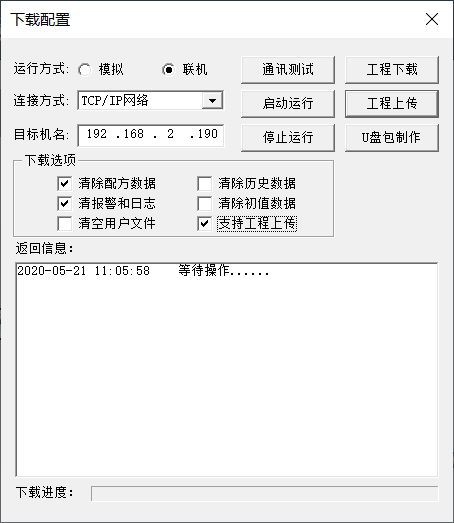

图3.5-36 联机运行下载设置界面

# ※进阶篇※

# 第1章 McgsPro软件功能

本章简要介绍McgsPro的组态结构。

## 1.1 界面布局

打开McgsPro工程后，启动界面如图1.1-1所示：

>   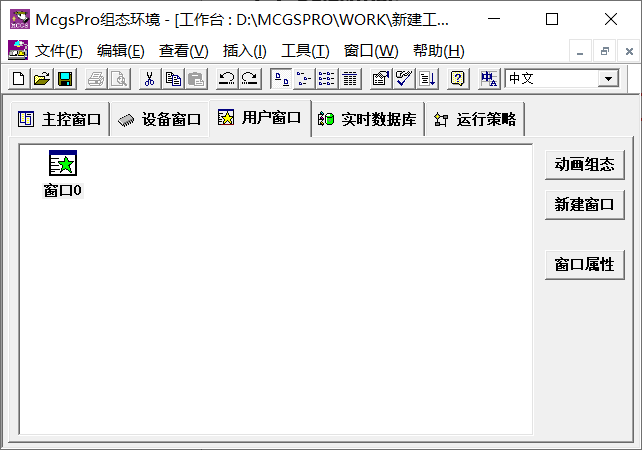

图1.1-1 McgsPro组态软件界面

a.菜单栏；b.工具栏；c.工作台（工作区）

其中，菜单栏和工具栏的选项内容，会根据所处窗口的不同有细微的差别。

## 1.2 菜单栏

### 1.2.1 文件菜单

>   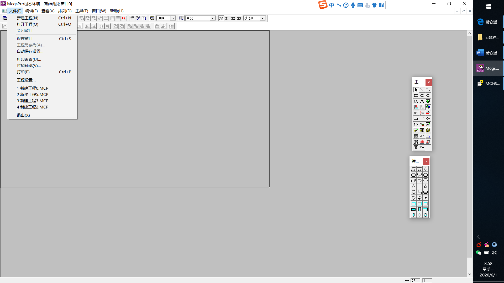

图1.2-1 文件菜单界面

-   【自动保存设置】：设置是否启用自动保存功能，默认打开。保存时间间隔默认3分钟，时间可设置，范围为3\~120分钟。
-   【打印预览】：预览画面打印效果，只在动画组态窗口有效。
-   【打印】：设置打印机名称和属性、打印范围、打印份数。只在动画组态窗口有效。
-   【工程设置】：修改HMI配置（即TPC型号）和组态配置（包括网格相关设置、构件风格、工程选择、用户界面是否随分辨率和工程选择变化）。
-   最近打开的四个工程，选择工程名可退出当前工程并打开该工程。
-   【退出】：退出软件。

### 1.2.2 编辑菜单

>   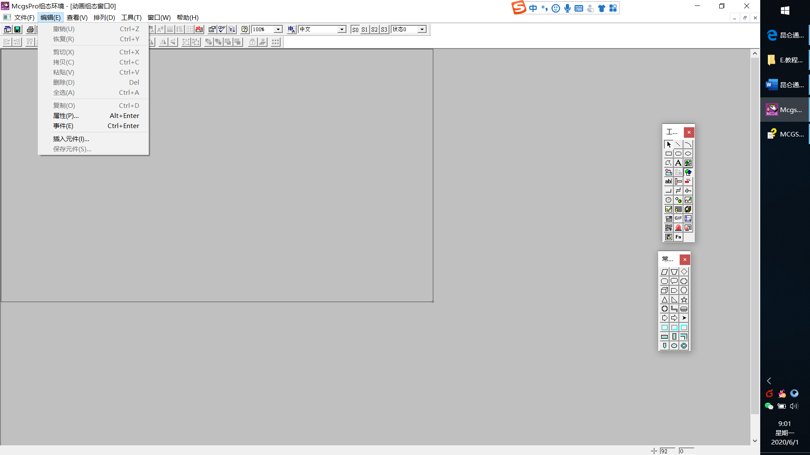

图1.2-2 编辑菜单界面

-   【属性】：打开当前选中项的属性设置界面。在动画组态窗口中，鼠标未选中任何项时，会打开当前窗口属性设置界面。
-   【事件】：打开当前选中项的事件组态界面。在动画组态窗口中，鼠标未选中任何项时，会打开当前窗口事件组态界面。
-   【插入元件】：从对象元件库中读取存盘的图形对象。
-   【保存元件】：把当前用户窗口中选中的图形对象存入对象元件库中。

### 1.2.3 查看菜单

>   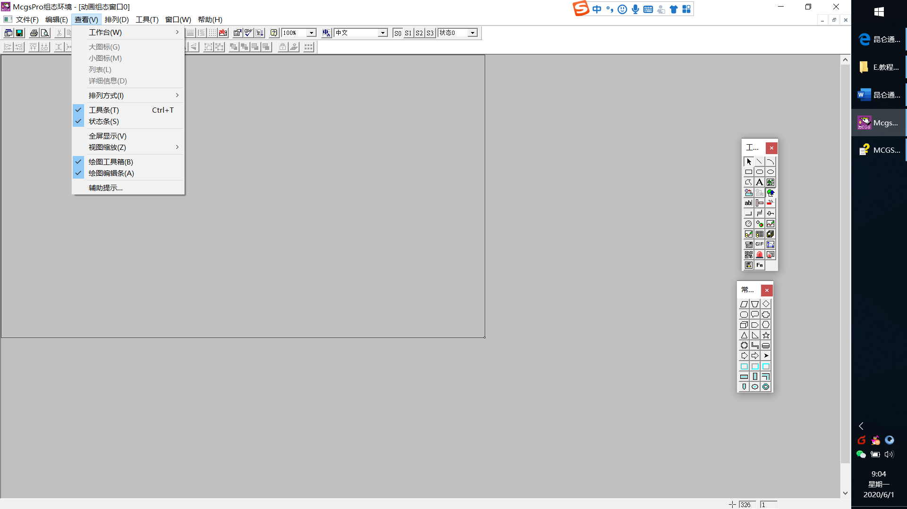

图1.2-3 查看菜单界面

-   【工作台】：进入工作台的其他界面。
-   【工具条】：打开或关闭工具条。
-   【状态条】：打开或关闭状态条。
-   【全屏显示】：进入全屏显示，按“ESC”键退出。
-   【视图缩放】：设置动画组态窗口的缩放比例为50%\~400%。
-   【绘图工具条】：打开或关闭绘图工具条。
-   【绘图编辑条】：打开或关闭绘图编辑条。
-   【辅助提示】：设置是否在构件左上方显示“构件名称”和“构件引用变量”。

### 1.2.4 排列菜单

>   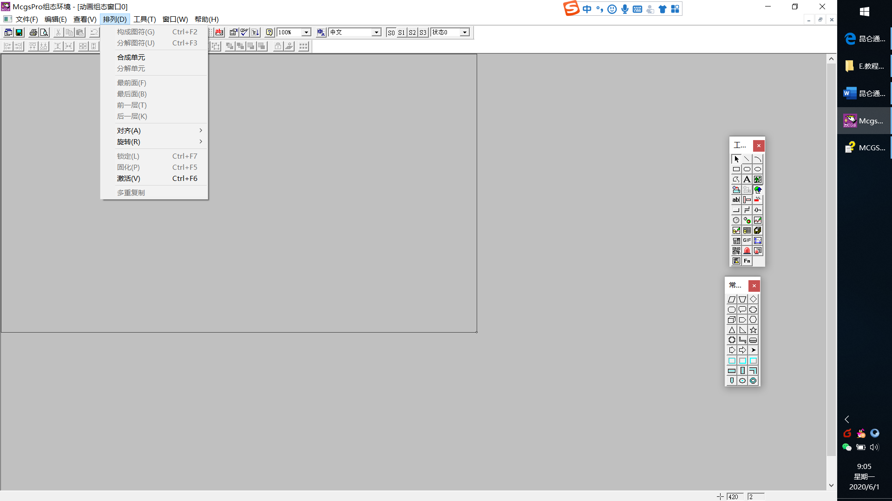

图1.2-4 排列菜单界面

【排列】菜单仅在动画组态窗口使用，在其他窗口中处于隐藏状态。

-   【构成图符】：将多个图元对象组合在一起，可以构成一个图符对象。图元和图符对象也可以构成图符。构成的图符可以看作是一个整体而存在的，可以等比例缩放，可以设置事件。
-   【分解图符】：将合成的图符分解开。
-   【合成单元】：将图元、图符、构件合成单元，合成单元可以等比例缩放，不能设置事件。
-   【分解单元】：将合成的单元分解开。
-   【最前面】：把被选中的图形对象放在所有对象前。
-   【最后面】：把被选中的图形对象放在所有对象后。
-   【前一层】：把被选中的图形对象向前移一层。
-   【后一层】：把被选中的图形对象向后移一层。
-   【对齐】：当选中多个图形对象时，可以把当前对象（最后选中的对象）作为基准，对被选中的多个图形对象进行相对位置和大小关系调整：

    【左对齐】：以当前对象为基准，左边界对齐；

    【右对齐】：以当前对象为基准，右边界对齐；

    【上对齐】：以当前对象为基准，上边界对齐；

    【下对齐】：以当前对象为基准，下边界对齐；

    【纵向等间距】：被选中的多个图形对象沿Y方向等距离分布；

    【横向等间距】：被选中的多个图形对象沿X方向等距离分布；

    【图元等高宽】：所有选中对象的高度和宽度相等；

    【图元等高】：所有选中对象的高度相等；

    【图元等宽】：所有选中对象的宽度相等；

    【中心对中】：所有选中对象的中心点重合；

    【纵向对中】：所有选中对象的中心点X坐标相等；

    【横向对中】：所有选中对象的中心点Y坐标相等。

-   【旋转】：

    【左旋90度】：把被选中的图形对象左旋90度；

    【右旋90度】：把被选中的图形对象右旋90度；

    【左右镜像】：把被选中的图形对象沿X方向翻转；

    【上下镜像】：把被选中的图形对象沿Y方向翻转。

-   【锁定】：固定对象的位置和大小，使用户不能对其进行移动和修改，避免编辑时，因误操作而破坏组态完好的图形。
-   【固化】：图形对象被固化后，用户就不能选中它，从而也不能对其进行各种编辑工作。在组态过程中，一般把作为背景用途的图形对象加以固化，以免影响其它图形对象的编辑工作。
-   【激活】：将固化的图形对象激活。
-   【多重复制】：快速创建一批同质不同地址(变量)的动画构件。具体设置方法将在后续章节：进阶篇-第6章 多重复制应用实例中讲解。

### 1.2.5 工具菜单

>   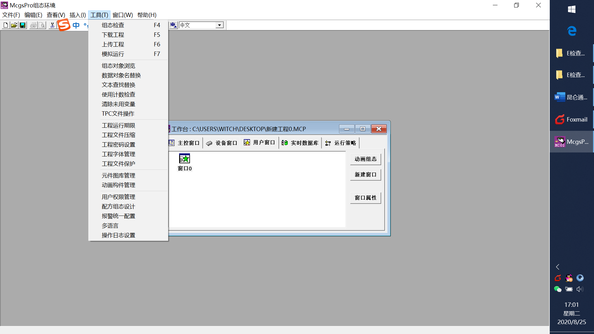

图1.2-5 工具菜单界面

-   【组态检查】：进行工程正确性检查。
-   【下载工程】：进入下载配置界面，可以设置运行方式、连接方式、目标机名，进行通讯测试、工程下载、启动运行等操作。
-   【上传工程】：进入上传工程界面，可以设置连接方式、目标地址，进行通信测试、开始上传、退出上传等操作。
-   【模拟运行】：将组态好的工程在PC上进行模拟运行，用户可根据模拟运行效果增减其中内容。它帮助用户测试组态工程的设计和构造。
-   【组态对象浏览】：展示工程中设备窗口、用户窗口、变量、用户策略、配方以及引用和被引用的拓扑关系。在此基础上帮助用户快速查找包含某关键字的对象，并在对象树上快速跳转，且可以定位指定对象所在的具体位置。
-   【数据对象名替换】：替换所有出现该对象名称的关联对象、表达式、实时数据库变量、脚本等处的该对象名为另一个对象名。替换和被替换的变量名都不能为空，若被替换的变量不存在，则会提示“指定的变量名不存在”。
-   【文本查找替换】：定位用户窗口、构件、策略中的表达式或脚本中指定文本所在位置，同时附带文本替换的功能。如快速定位“!OpenSubWnd”函数在哪些地方使用过。
-   【使用计数检查】：统计当前工程实时数据库中的变量。

>   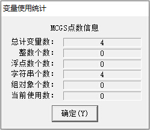

图1.2-6 变量使用统计界面

-   【清除未用变量】：删除“实时数据库”中未使用的变量，减小工程体积，使工程更整洁。
-   【TPC文件操作】：提供本地文件与用户文件区文件的直接操作。界面主要展示网络连接状态、本地目录文件及文件夹列表、用户文件区文件及文件夹列表、传输过程进度及日志信息等。

>   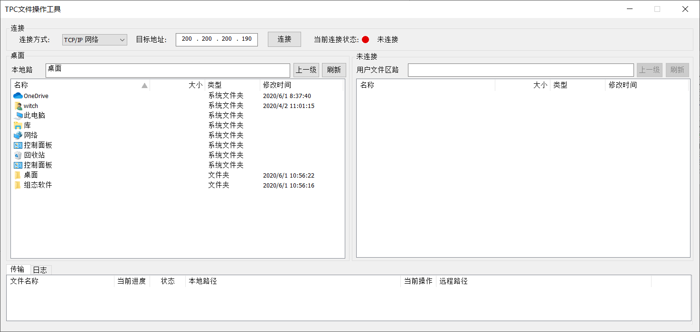

图1.2-7 TPC文件操作工具界面

-   【工程运行期限】：启用了分期功能，当工程用户无法一次结清工程款时，启用此功能，可协助客户收取工程尾款，防止业主赖账，保护客户权益。
-   【工程文件压缩】：如果工程中使用了大量bmp格式图片，使得工程体积很大，可使用本功能减小工程体积。它有两种压缩方式，均不会影响实际显示效果：

    ①将工程中所有位图裁剪为实际显示大小，当图片实际大小大于显示大小时，该操作可以减少运行环境的内存占用和磁盘占用；②将工程中所有BMP图片转换为JPG格式，该操作会减少运行时的磁盘占用。

-   【工程密码设置】：当使用McgsPro组态软件来打开设置了工程密码的工程时，首先弹出输入框要求输入工程的密码，如果密码不正确则不能打开该工程，从而起到保护劳动成果的作用。
-   【工程字体管理】：查看工程中使用的字体并可以对使用的字体进行更改。
-   【工程文件保护】：将工程限制在指定的触摸屏上使用。
-   【元件图库管理】：管理McgsPro组态软件内的构件风格、构件模版、用户元件、标准图片。所有可组态背景图的构件，均支持将图库中的构成图符和标准图片作为背景显示。构件模版是构件从工具箱拖出来的默认样式。用户元件是用户保存的图库资源。标准图片是bmp、jpg、png、ico、svg格式图片。
-   【动画构件管理】：增加和删除动画工具箱中的动画构件。
-   【用户权限管理】：编辑用户和用户组。在用户权限设置窗口中，把对应的用户或用户组选中，则只有该用户或该用户组成员能对该项工作进行操作。
-   【配方组态设计】：进行配方组以及配方的新建、编辑、删除等操作。对话框左侧是所有配方组列表，右侧可以编辑配方组相关属性，主要编辑配方组各个元素关联的变量以及变量对应的标题。

>   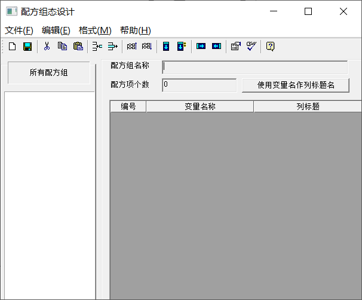

图1.2-8 配方组态设计界面

-   【报警统一配置】：统一对报警属性进行配置。如果已在实时数据库中设置过数据对象报警属性，则【报警统一配置】界面的表格中将会显示已经设置过的所有报警信息，否则表格中没有报警信息。在变量名下方的行双击，可添加一行报警，然后在该行进行关联变量，修改变量类型、报警类型、基准值、报警描述等设置。

>   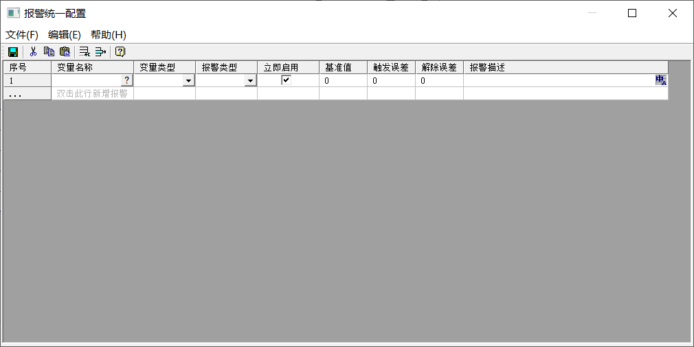

图1.2-9 报警统一配置界面

-   【多语言】：当同个工程在多个国家使用时，项目就需要使用多种语言来创建。通过多语言配置，可将工程中显示的文字在数个语言间切换。
-   【操作日志设置】：在这里开启或关闭操作日志记录功能。在启用该功能后，可以在下方启停指定构件的日志、对日志描述文本进行编辑，日志描述文本支持多语言。

### 1.2.6 窗口菜单

>   

图1.2-10 窗口菜单界面

-   设置各个窗口的位置关系为【层叠】【水平平铺】【垂直平铺】。
-   对已打开的窗口进行选择

### 1.2.7 帮助菜单

>   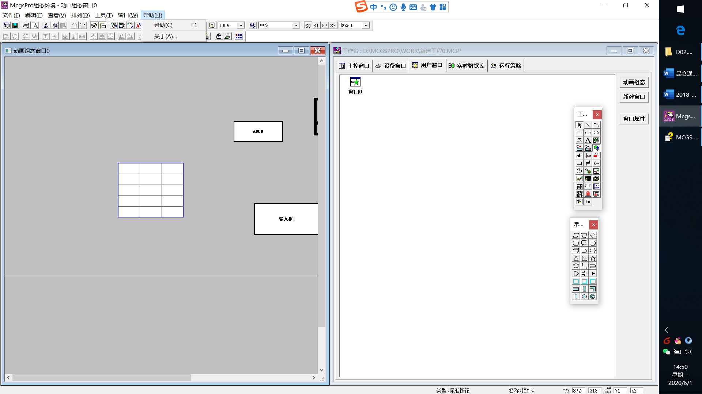

图1.2-11 帮助菜单界面

-   【帮助】：进入McgsPro帮助系统。
-   【关于】：提示McgsPro版本编号，版权所属方及联系方式。

## 1.3 工具栏

工具栏中是常用功能的快捷图标。将鼠标悬停在某个快捷图标上，可出现文字提示，点击该快捷图标，实现提示对应功能。工具条在不同窗口会有个性化差异。

### 1.3.1 工作台窗口工具条

>   

图1.3-1 工作台窗口工具条

a.新建/打开/保存

b.打印/打印预览

c.剪切/拷贝/粘贴/撤销/恢复

d.大图标/小图标/列表/详细信息

e.显示属性/组态检查/下载运行/帮助

f.多语言/当前语言

1.3.2 设备窗口工具条

>   

图1.3-2 工作台窗口工具条

a.（设备）工具箱/向上移动/向下移动

### 1.3.3 动画组态窗口工具条

>   

图1.3-3 动画组态窗口工具条

a.工具箱/编辑条

b.填充颜色/边线颜色/字符颜色/字体/线型/对齐方式

c.背景网格/辅助提示

d.分段点选择/当前状态

### 1.3.4 动画组态窗口绘图编辑条

>   

图1.3-4 动画组态窗口绘图编辑条

a.左边界对齐/右边界对齐/顶边界对齐/底边界对齐

b.纵向等间距/横向等间距

c.等高宽/等高/等宽/中心对齐/纵向对中/横向对中

d.左旋90度/右旋90度/Y反转/X反转

e.构成图符/分解图符

f.置于最前面/置于最后面/向前一层/向后一层

g.锁定or解锁/固化/多重复制

### 1.3.5 脚本程序窗口工具条

>   

图1.3-5 脚本程序窗口工具条

a.查找/替换

b.缩进/退格

c.注释

d.声明局部变量/声明数据对象/语句块IF\~THEN/语句块IF\~ELSE/语句块WHILE/语句块EXIT

## 1.4 工作台

工作台是我们进入工程之后看到的第一个窗口，它包含5个窗口页：主控窗口、设备窗口、用户窗口、实时数据库、运行策略。工作台相当于一个大的容器，可以放置一个主控窗口、一个设备窗口和多个用户窗口，负责这些窗口的管理和调度，并调度用户策略的运行。

>   

图1.4-1 McgsPro组态软件界面

**a.主控窗口：构造了应用系统的主框架。**用于对整个工程相关的参数进行配置，可设置封面窗口、运行工程的权限、启动画面、内存画面、磁盘预留空间等。

**b.设备窗口：是应用系统与外部设备联系的媒介。**专门用来放置不同类型和功能的设备构件，实现对外部设备的操作和控制。设备窗口通过设备构件把外部设备的数据采集进来，送入实时数据库，或把实时数据库中的数据输出到外部设备。

**c.用户窗口：实现了应用系统数据和流程的“可视化”。**工程里所有可视化的界面都是在用户窗口里面构建的。用户窗口中可以放置三种不同类型的图形对象：图元、图符和动画构件。通过在用户窗口内放置不同的图形对象，用户可以构造各种复杂的图形界面，用不同的方式实现数据和流程的“可视化”。

**d.实时数据库：是应用系统的核心。**实时数据库相当于一个数据处理中心，同时也起到公共数据交换区的作用。

**e.运行策略：是对应用系统运行流程实现有效控制的手段。**运行策略本身是系统提供的一个框架，其里面放置由策略条件构件和策略构件组成的“策略行”，通过对运行策略的定义，使系统能够按照设定的顺序和条件操作任务，实现对外部设备工作过程的精确控制。

其中，【实时数据库】是整个软件的核心，从外部硬件采集的数据送到实时数据库，再通过【用户窗口】更改数据库的值，最后由【设备窗口】输出到外部硬件。

用户窗口中的动画构件关联实时数据库中的数据对象，动画构件按照数据对象的值进行相应的变化，从而达到“动”起来的效果。

>   

图1.4-2 McgsPro组态软件原理图

### 1.4.1 主控窗口介绍

-   打开【主控窗口】设置界面：

    ①选择工作台的主控窗口页；

    ②双击下方的【主控窗口】图标，弹出【主控窗口】设置界面。

>   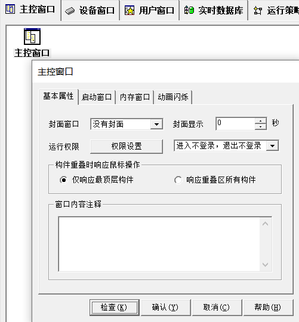

图1.4-3 打开主控窗口

-   选择【基本属性】标签按钮，即进入【基本属性】设置窗口页。主控窗口的基本属性决定了工程在启动时的总体概貌及外观。

>   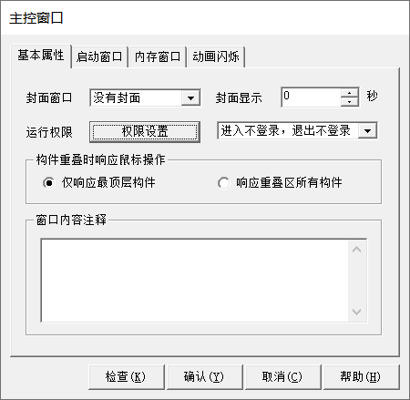

图1.4-4 主控窗口-基本属性功能页

a.【封面窗口】：在下拉菜单中选择相应的窗口作为封面窗口。

b.【封面显示】：设置封面持续显示的时间，以秒为单位。运行时，鼠标点击窗口任何位置，封面自动消失。当封面时间设置为0时，封面将一直显示，直到鼠标单击窗口任何位置时，封面方可消失。

c.【运行权限】：点击“权限设置”按钮后弹出【用户权限设置】界面。在该界面可将进入或退出工程的权限赋予某个用户组。无此权限的用户组中的用户，不能进入或退出该工程。当选择“所有用户”时，相当于无限制。此项措施对防止无关人员的误操作，提高系统的安全性起到重要的作用。

d.选择c项设置的权限的具体内容。选项包括：

进入不登录，退出登录。即当用户启动运行环境时，不必登录，退出运行环境时，需登录。

进入登录，退出不登录。即当用户启动运行环境时，需登录，退出时不必登录。

进入不登录，退出不登录。即进入或退出运行环境时，都不必登录。

进入登录，退出登录。即进入或退出运行环境时，都需要登录。

如：在c项中设置了拥有权限的用户组为“管理员组”，d项设置“进入登录，退出不登录”，那么，进入工程时，必须在弹出的对话框中输入正确的“管理员组”的用户名和密码，才能进入工程，否则，不能进入工程。而退出时不做此要求。

e.【构件重叠时响应鼠标操作】：当多个动画构件存在重叠区域时，鼠标点击重叠区域的表现由该设置项决定。可设置为【仅响应最顶层构件】或者【响应重叠区所有构件】，该设置项对整个组态工程的所有用户窗口生效。

f.【窗口内容注释】：起到说明和备忘的作用，对应用工程运行时的外观不产生任何影响。

-   选择【启动窗口】标签按钮，进入【启动窗口】设置窗口页。

>   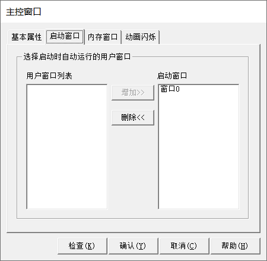

图1.4-5 主控窗口-启动窗口功能页

图中左侧为【用户窗口列表】，列出了所有定义的用户窗口名称。右侧为【启动窗口】列表，它是启动时自动打开的用户窗口的列表。

点击“增加”按钮或用鼠标双击左侧列表内指定的用户窗口，可以把该窗口移动到右侧。

点击“删除”按钮或用鼠标双击右侧列表内指定的用户窗口，可以将该窗口移动到左侧。

注意：只能设置一个用户窗口为启动窗口。

-   选择【内存窗口】标签按钮，进入【内存窗口】设置窗口页。

>   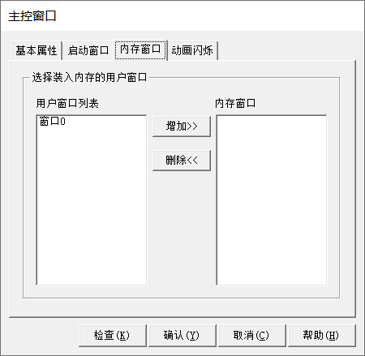

图1.4-6 主控窗口-内存窗口功能页

工程运行过程中，打开一个用户窗口时，系统首先把窗口的数据从磁盘调入内存，然后再执行窗口打开指令，这样一个打开窗口的过程可能比较缓慢，满足不了某些工程的需要。为了加快用户窗口的打开速度，运行环境提供了一种直接从内存中打开窗口的机制，即把用户窗口数据预先装入内存，每次打开该窗口时直接从内存中打开，节省了打开窗口的时间。这些被预装到内存中的窗口，被称为【内存窗口】。注意：组态时内存窗口不宜设置过多，否则会降低TPC运行性能。

图1.4-6左侧为所有定义的【用户窗口列表】，右侧为【内存窗口】列表，及启动时装入内存中的用户窗口列表。

点击“增加”按钮或用鼠标双击左侧列表内指定的用户窗口，可以把该窗口移动到右侧，成为始终位于内存中的用户窗口。

点击“删除”按钮或用鼠标双击右侧列表内指定的用户窗口，可以将该窗口移动到左侧。

-   选择【动画闪烁】标签按钮，进入【动画闪烁】设置窗口页。该页面主要设置与动画闪烁周期有关的时间参数。

>   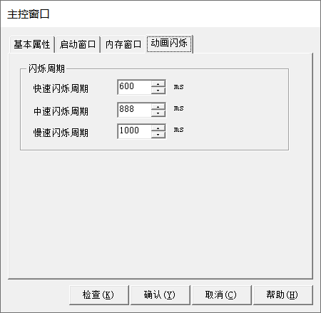

图1.4-7 主控窗口-动画闪烁功能页

快速闪烁周期：其值在100\~1000ms（毫秒）之间；

中速闪烁周期：其值在200\~2000ms（毫秒）之间；

慢速闪烁周期：其值在150\~2000ms（毫秒）之间。

小于周期范围的值会被系统强制转换为周期最小值，大于周期范围的值会被系统强制转换为周期最大值。

### 1.4.2 设备窗口介绍

设备窗口是McgsPro组态软件的重要组成部分，在设备窗口中建立系统与外部硬件设备的连接关系，使系统能够从外部设备读取数据并控制外部设备的工作状态，实现对工业过程的实时监控。

-   打开【设备窗口】设置界面：

    ①选择工作台的主控窗口页

    ②双击下方的【设备窗口】图标，弹出【设备窗口】设置界面

>   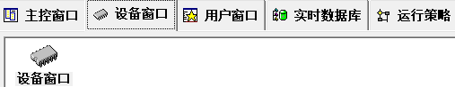

图1.4-8 打开设备窗口

-   【设备窗口】设置界面由【设备组态画面】和设备【工具箱】两部分组成。设备组态画面用于配置该工程需要通讯的设备。设备工具箱里是常用的设备。在设备工具箱里的设备名称上双击，可以把设备添加到设备组态画面。
-   要添加或删除设备工具箱中的设备驱动时，可点击设备工具箱顶部的【设备管理】按钮。打开【设备管理】窗口。在【设备管理】窗口左侧的【可选设备】区域的树形目录中找到需要的设备，双击或点击下方【增加】按钮即可添加到【选定设备】区域。选中【选定设备】区域里的设备，点击窗口左下方的【删除】按钮可删除该设备。如图1.4-9所示。【工具箱】中的设备就是【选定设备】区域中的设备。

>   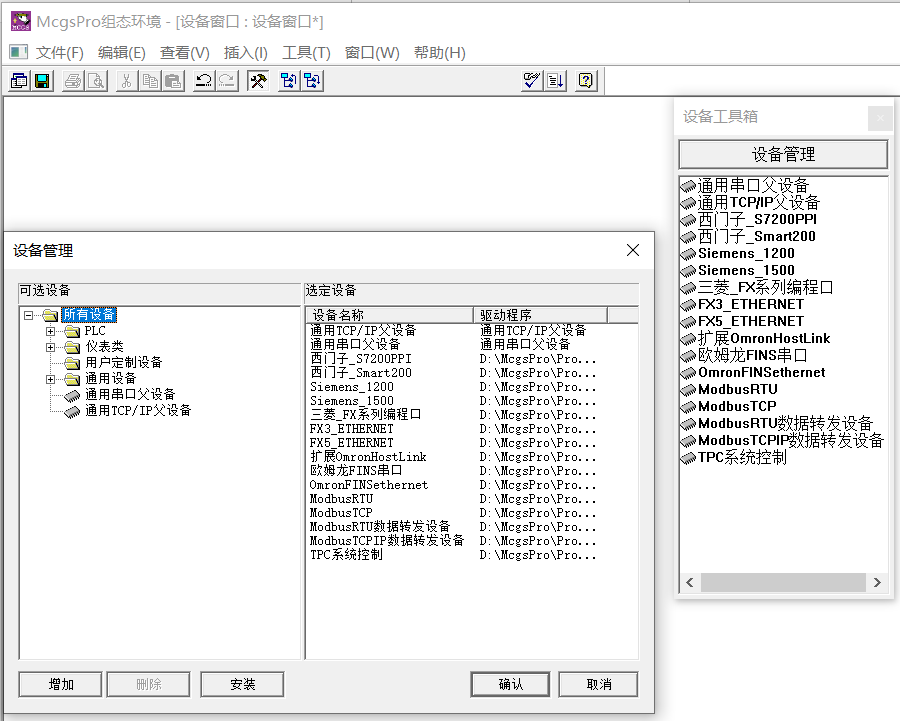

图1.4-9 在设备窗口增加设备

-   如果要使用系统目前没有的设备，单击【安装】按钮，系统弹出对话框询问是否需要安装新增的驱动程序，选择“是”，指明驱动程序所在的路径，进行安装，安装完毕，新的设备将显示在设备管理窗口左侧列表的【用户定制设备】目录下。接下来就可以进行新设备的登记工作了。
-   McgsPro组态软件中把设备分成两个层次：父设备和子设备。父设备可以看作硬件接口。子设备放在父设备下，用于与该父设备对应的接口所连接的设备进行通讯。在设备组态画面双击父设备或子设备可以设置通讯参数。如图1.4-10所示。

    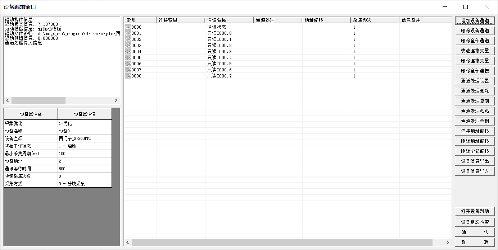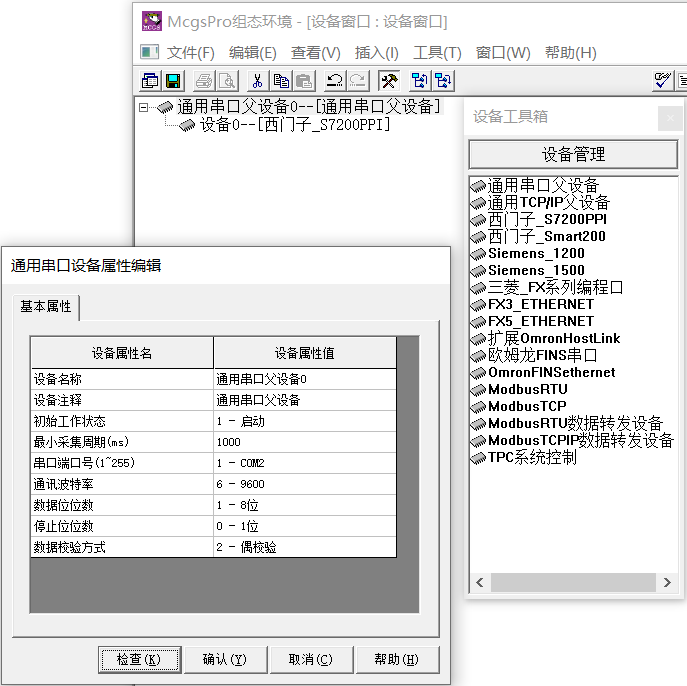

图1.4-10 打开父设备属性编辑窗口及子设备编辑窗口

-   串口父设备里可设置串口号、波特率、数据位、停止位、校验方式。TPC/IP父设备可设置本地IP地址、本地端口号、远程IP地址、远程端口号等。
-   子设备的设备编辑窗口分为三个区域：驱动信息区、设备属性区和通道连接区。驱动信息区里显示的是该设备驱动版本、路径等信息。设备属性区可设置采集周期、设备地址、通讯等待时间等通讯参数。通道连接区用于构建下位机寄存器与McgsPro组态软件变量之间的映射。

>   

图1.4-11子设备编辑窗口

（1）驱动信息

在这个信息栏中包括了驱动的版本信息，模版信息，驱动文件路径，驱动预留信息，通道处理拷贝信息。

（2）设备属性

要使McgsPro组态软件能正确操作PLC设备，必须按如下的步骤来使用和设置本构件的属性：

采集优化：设置为优化时，在进入McgsPro运行环境时，驱动设备将只采集界面、脚本、策略使用到的通道和拥有存盘、报警属性的通道，以提高采集效率；设置为不优化时，驱动设备将采集全部通道。

设备名称：可根据需要来对设备进行重新命名，但不能和设备窗口中已有的其它设备构件重名。

初始工作状态：设置为启动时，在进入McgsPro运行环境时，自动开始对设备进行操作，设置为停止时，不对设备进行操作，但可以使用设备操作函数和策略在McgsPro运行环境中启动或停止设备。

最小采集周期：指系统对设备构件的读写操作的最快时间周期，单位为毫秒。一般在静态测量时设为1000ms，在快速测量时设为200ms。

（3）通道信息

通道信息内容是通道连接区左侧的表格部分，内容包括：索引，连接变量，通道名称，通道处理，地址偏移，采集周期，信息注释。

选中某一行，在连接变量列双击左键或者单击右键：打开通道连接变量选择窗口进行变量选择，可以选择多个。

选中某一行，在通道处理列双击左键或者单击右键：打开通道处理设置窗口。

选中某一行，在地址偏移列双击左键或者单击右键：打开通道连接变量选择窗口进行变量选择，只能选择一个。

（4）功能按钮

【增加设备通道】：增加后通道后立即反映到通道信息表格中，如图1.4-12。

>   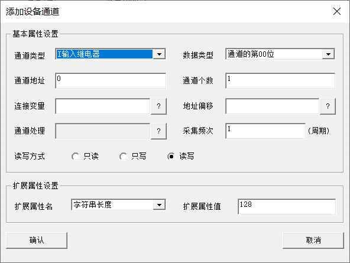

图1.4-12 添加设备通道

【删除设备通道】：删除选中通道信息表格中选中的一个或多个通道。

【删除全部通道】：删除选中通道信息表格中所有的通道内容，通讯状态除外。

【快速连接变量】：为通道信息表格的通道连接变量提供一种方便快捷的连接方式,可实现多通道连接，如图1.4-13。

>   

图1.4-13 快速连接变量

有两种连接方式：【自定义变量连接】和【默认设备变量连接】，如果所定义的变量没有在实时数据库中定义，则在点击设备组态窗口下面的确认按钮时会给出提示，自动把所有变量添加到实时数据库中。

自定义变量连接：输入变量名称，从【开始通道】处开始连接变量，根据通道个数添加相应个数通道的变量连接，如从1通道开始添加11个通道的连接，变量从Data01开始起，通道1，……11对应的连接变量依次为Data01,……Data11。

默认设备变量连接：所有通道连接的变量统一被替换成一种格式的变量，格式为“设备名+读写方式+地址”。

注意：如果通道中原来就连接有变量，则再次连接时清除原来的连接变量，重新连接新的变量。

【删除连接变量】：选中通道信息表格中一行或多行（不管有没有连接变量都可以），点击该功能按钮即可删除选中通道连接的变量。

【删除全部连接】：删除通道信息表格中的所有通道连接的变量。

【通道处理设置】：对从设备中采集到的数据或输出到设备的数据进行前处理，以得到实际需要的工程物理量。如从AD通道采集进来的数据一般都为电压mV值，需要进行量程转换或查表计算等处理才能得到所需的物理量。

【通道处理删除】：删除选中通道中的通道处理方法。

【通道处理复制】：只对选中的通道中索引号最小的通道处理进行复制，且只复制其通道处理方法，内容注释不复制。

【通道处理粘贴】：把复制的通道处理方法粘贴到选中的一个通道中，通道处理注释默认为“\#通道处理：处理方法的序号”。

【通道处理全删】：删除通道信息栏中所有通道的通道处理。

【连接地址偏移】：选中通道信息表格中一个或多个通道，点击该功能按钮为通道连接地址偏移。

【删除地址偏移】：选中通道信息表格中一个或多个通道，点击该功能按钮即可删除选中通道连接的地址偏移。

【删除全部偏移】：删除通道信息表格中的所有通道连接的地址偏移。

【设备信息导出】：该功能可以把通道信息表格的内容以.CSV格式导出到指定的位置，.CSV格式可以使用MicrosoftOffice提供的Excel和记事本打开。注意编辑文件时不可更改文件的以下内容：组态设备名称，驱动库文件路径，驱动构件名称，驱动构件版本。否则导入文件时将不成功。导出内容包括:通道号,变量名,变量类型,通道名称,读写类型,寄存器名称,数据类型,寄存器地址。

【设备信息导入】：使用该功能可以从外界导入编辑好或保存好的通道信息内容，方便使用者的组态。导入内容包括：变量名，变量类型，通道名称，读写类型，寄存器名称，数据类型，寄存器地址。

使用导入导出时应注意以下3个方面：

1.  导入文件时必须保证要导入文件的组态名称，驱动库文件路径，驱动构件名称，驱动构件版本和当前设备组态窗口的驱动信息内容保持一致，并且要导入的文件在导入时没有被使用Excel打开，否则导入不成功。
2.  变量类型为三种，Integer，Single，String。
3.  通道名称在导出文件中有，实际导入中无作用，可有可无。

【打开设备帮助】：打开对应设备的帮助内容。

【设备组态检查】：进行工程正确性检查。

【确认】：保存在设备组态窗口中进行的操作，并进行正确性检查。

【取消】：不保存设备组态窗口中进行的所有的操作。

### 1.4.3 用户窗口介绍

-   用户窗口主界面的右侧有三个按钮：每点击一次【新建窗口】按钮可以新建一个窗口，【窗口属性】用于打开已选中窗口的属性设置，可以将窗口设置为启动窗口、用户窗口和子窗口，其中启动窗口标注为绿色五角星，用户窗口为黄色五角星，子窗口为紫色五角星。双击窗口图标或者选中窗口之后点击“动画组态”按键可以进入该窗口的编界面。如图1.4-14所示。

>   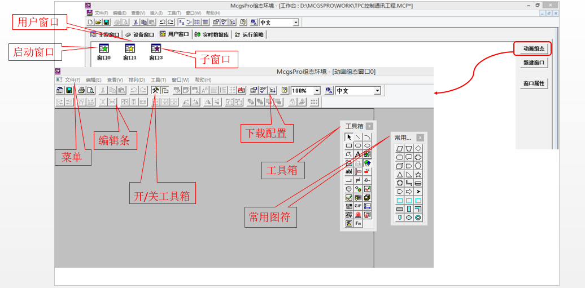

图1.4-14 动画组态窗口界面

-   窗口编辑界面的主要部分是【工具箱】和【窗口编辑区域】。工具箱有我们画面组态要使用的所有构件。窗口编辑区域用于绘制画面，运行时我们能看到的所有画面都需在这里添加。在工具箱单击所需要的构件，然后在窗口编辑区域中按住鼠标左键拖动将该构件添加到画面中。
-   工具箱中常用的构件有：标签、输入框、标准按钮和位图等。如图1.4-15所示。

>   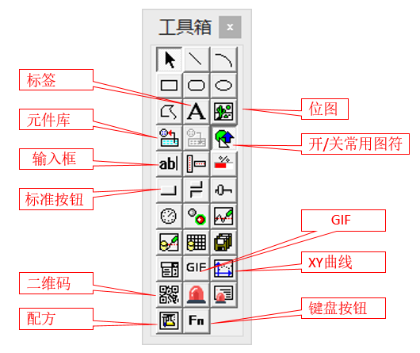

图1.4-15 工具箱

-   将构件添加到窗口编辑区域之后，双击该构件可打开该构件的属性。构件的作用不同，属性设置界面有很大的差异。可点击属性设置界面的右下角的“帮助”按钮查看构件属性设置详细说明。如图1.4-16所示。

图1.4-16 标准按钮构件属性设置界面

### 1.4.4 实时数据库介绍

实时数据库是McgsPro组态软件的核心，是应用系统的数据处理中心。系统各部分均以实时数据库作为公用区进行数据交换，实现各个部分地协调运作。

#### 1.4.4.1 数据对象类型

McgsPro中数据对象主要有整数、浮点数、字符串和组对象，每种数据类型的属性不同用途也不同。

（1）整数数据对象

整数数据对象的数值范围是：-2147483648到2147483647。整数数据对象通常用与外部设备的数字量输入输出通道连接，用来表示某一设备当前的状态或记录设备的当前整型值。整数数据对象也用于表示McgsPro中某一对象的状态，如一个图形对象的可见度状态。

整数数据对象可以设置状态报警（开关量报警、正跳变报警、负跳变报警）、位报警（位==报警、位ONOFF报警、位OFFON报警）、值报警（值==报警、值\>报警、值\>=报警、值\<报警、值\<=报警）。

（2）浮点数数据对象

浮点数数据对象的取值范围是：-1.79E+308到+1.79E+308。浮点数数据对象除了存储数值和参与数据运算外，还提供报警信息，并与外部设备的模拟量输入输出通道连接。

浮点数数据对象有限值报警属性（下下限、下限、上限、上上限、上偏差、下偏差），当对象的值超出报警限值时，产生报警；当对象的值在报警限值以内，报警结束；浮点数数据对象还可以设置值报警（值==报警、值\>报警、值\>=报警、值\<报警、值\<=报警）。

（3）字符串数据对象

字符串数据对象是存放文字信息的单元，用于描述外部对象的状态特征，由多个字符构成，如果字符串作为初值保存，最大允许长度为8KB；如果该对象作为历史数据存储，最大允许长度约32KB，其它情况无长度限制。

（4）组对象数据对象

组对象是McgsPro引入的一种特殊类型的数据对象，类似于编程语言中的数组和结构体，用于把相关的多个数据对象集合在一起，作为一个整体的定义和处理。在实际的工程中，描述一个锅炉的工作状态有温度、压力、液面高度、流量等多个物理量。为便于处理，定义一个“锅炉”组对象与实际的物理对象进行对应，其内部成员则由上述物理量对应的数据对象组成。这样，在对“锅炉”对象进行处理（如进行组态存盘、曲线显示、报警显示）时，只需指定组对象的名称“锅炉”，就包括了对其所有成员的处理。

组对象只是在组态时对某一类对象的一种整体表示，实际操作则是针对某一个成员进行的。如在报警显示动画构件中，指定要显示的报警数据对象为“锅炉”，则该构件显示组对象包含的各个数据对象在运行时产生的所有报警信息。

把一个对象定义成组对象后，还必须设置组对象包含的成员，如图1.4-17所示，在“数据对象属性设置”对话框内，专门有“组对象成员”标签页，用于设置组对象的成员。对话框的左边为数据对象成员的列表，右边为组对象成员的列表，利用属性页中的“增加”按钮，可以将左边指定的对象添加到组对象中成员中；也可以利用“删除”按钮删除指定的组对象的成员。

>   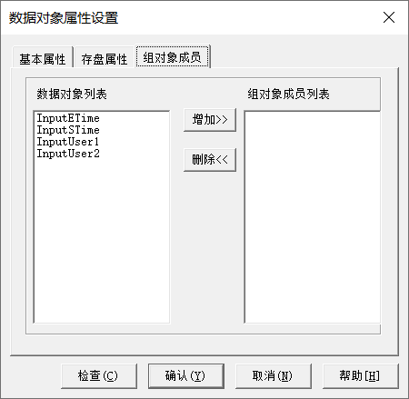

图1.4-17 组对象属性设置界面

#### 1.4.4.2 添加数据对象

定义数据对象时，在组态环境工作台窗口，选择“实时数据库”标签，进入实时数据库窗口页，显示出已定义的数据对象，分别是InputStime，InputEtime，InputUser1，InputUser2。数据对象可以使用大图标、小图标、列表和详细信息方式进行显示，可以使用名称顺序或者类型顺序来显示变量。也可以剪切、拷贝、粘贴指定的数据对象。

数据对象可有两种方式进行添加：单个数据对象添加和成组数据对象添加。

（1）单个数据对象添加：点击【新增对象】按钮，新增默认名称为【Data1】的【浮点数】对象。若先选中一个数据类型为【字符串】的数据对象【A1】，再点击【新增对象】按钮，则会智能增加一个数据类型同为【字符串】的数据对象【A2】。

>   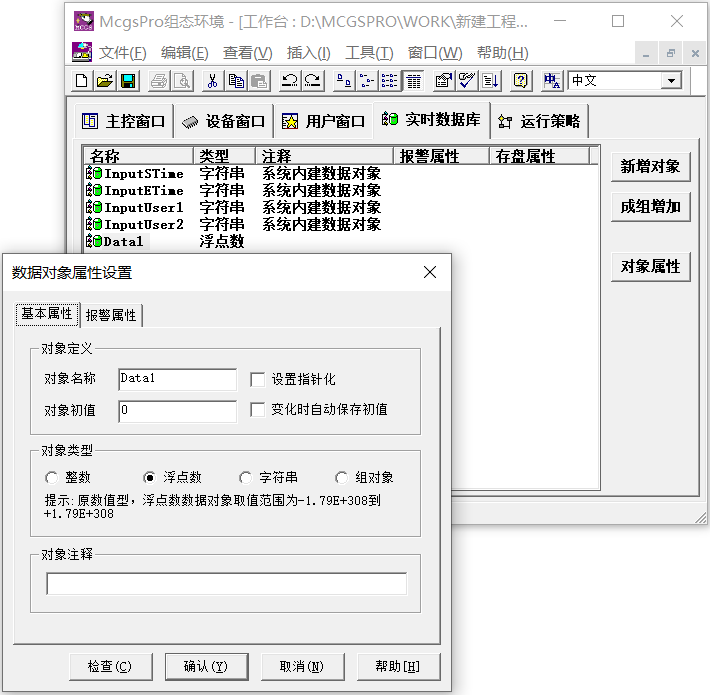

图1.4-18 新增数据对象流程

（2）成组数据对象添加：批量生成多个名称编号依次递增、数据类型相同的数据。选择“成组增加”按钮，弹出“批量添加数据对象”对话框，一次定义多个数据对象如图1.4-19所示，其中对象名称一栏，代表该组对象的主题部分，而“起始索引值”则代表第一个成员的“索引代码”，其他数据对象的主体名称相同，索引代码依次递增。批量添加的数据对象，其他特性如数据类型、工程单位都是一样的。批量修改具有相同属性的数据对象时，可选中需要修改的对象，再选择对象属性统一修改。

>   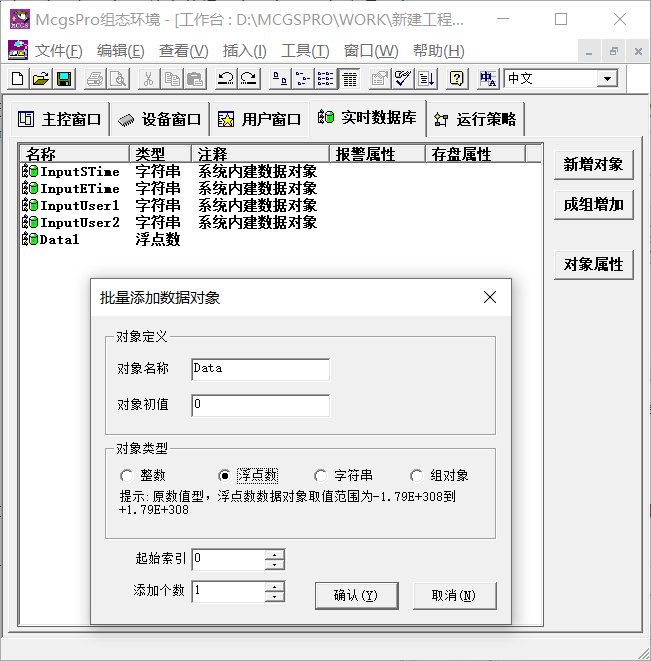

图1.4-19 成组增加数据对象流程

#### 1.4.4.3 数据对象配置

-   整数数据对象

整数数据对象有基本属性、存盘属性、报警属性，可以在【数据对象属性设置】对话框中设置对应的属性。

（1）【基本属性】页用于设置数据对象的基本属性，见图1.4-20。

>   

图1.4-20 数据对象-基本属性页

1.  对象名称：用于显示和修改数据对象的名称，指定的数据对象名称不能以“！”“\$”开头，不能使用加减乘除等运算符，不能使用大于等于小于等逻辑运算符
2.  对象初值：用于在数据对象初始化的时候，赋初值给数据对象
3.  设置指针化：可将整数和浮点数数据对象设置为指针化数据对象
4.  变化时自动保存初值：添加初值属性，初值改变后60秒才会刷盘
5.  对象注释：用于对该对象的进行注释和说明

（2）报警属性页

报警属性页用于设置数据对象的报警属性，在报警属性表格中右键进行报警属性插入、追加、删除、剪切及粘贴，双击已有报警表项可以进行修改，整数对象有状态报警、位报警和值报警，当对象的值触发相应的报警条件时，将产生报警，见图1.4-21。

>   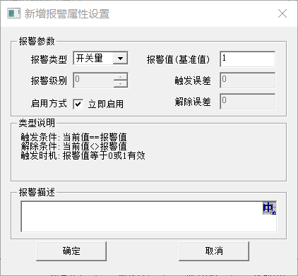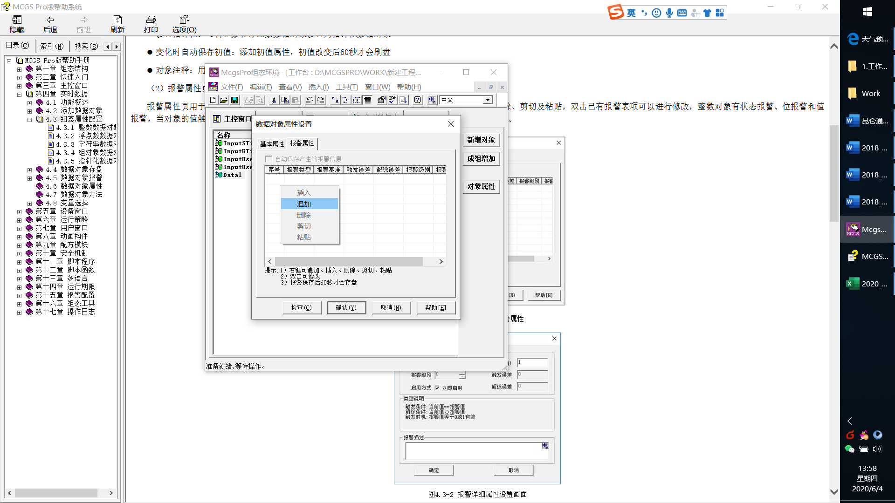

图1.4-21 整数-报警属性功能页

1.  报警类型：设置报警属性的类型，原报警类型（开关量、跳变、限值、偏差报警）不可重复，新报警类型(位值报警)可重复
2.  报警级别：设置报警优先级，当前无效（保留）
3.  启用方式：选中表示当前设置的报警会立即生效
4.  报警描述：用于描述该项报警的注释型信息，所有类型的报警都有“报警注释”
5.  报警值(基准值)：报警参数的参照值，限值与开关量报警称作报警值，位报警称作指定位
6.  触发误差：触发报警参数，部分报警类型此值无效，偏差报警称作报警值，位报警称作指定值
7.  解除误差：解除报警误差参数值，部分报警类型此值无效
-   浮点数数据对象

浮点数数据对象有基本属性和报警属性，可以在【数据对象属性设置】对话框中设置对应的属性。

（1）基本属性页

其中基本属性页与整数基本属性页相同，详细说明见整数数据对象基本属性页。

（2）报警属性页

浮点数数据对象支持限值报警和值报警，即当浮点数数据对象的值满足报警条件时，将会触发报警。浮点数数据对象的报警属性页见图1.4-22。报警详细设置方式与整数报警设置相同。

>   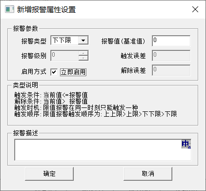

图1.4-22 浮点数-报警属性功能页

注意：浮点数数据对象限值报警触发顺序为上上限、上限、下下限和下限；偏差报警触发顺序为上偏差、下偏差。限制报警同一时刻只能触发一种限制报警，偏差报警同一时刻只能触发一种偏差报警。

-   字符串数据对象

字符串数据对象有基本属性页，不具备存盘属性和报警属性功能。其中基本属性页的设置同整数数据对象的基本属性设置，详见整数数据对象的基本属性页设置。

-   数据组数据对象

组对象拥有基本属性设置和存盘属性设置，不具备报警属性设置。其中基本属性设置与整数数据对象的基本属性设置一致，详见整数的数据对象的基本属性描述。组对象成员设置方法参考组对象说明，详细界面见图1.4-17。

（1）存盘属性页

组对象的存盘属性页主要用于设置组对象是否存盘以及存盘的周期，具体见图1.4-23所示。

>   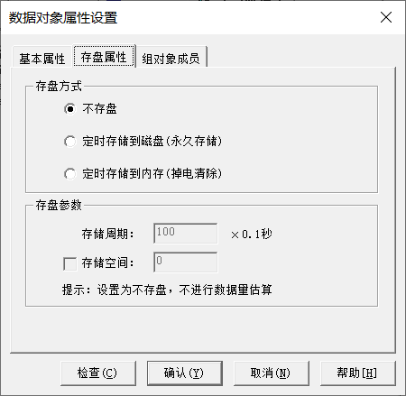

图1.4-23 组对象-存盘属性功能页

1.  不存盘：勾选则表示在运行环境中禁止存盘
2.  定时存储到磁盘：历史数据保存到磁盘上，断电后数据依然存在
3.  定时存储到内存：历史数据保存到缓存中，断电后数据丢失
4.  存储周期：=0，表示手动调用脚本存盘，可在运行环境调整；

    \>0，按设定间隔保存数据，最小值为100毫秒，可在运行环境调整

5.  存储空间：当历史数据达到指定大小或磁盘空间不足时，最早的数据将会被删除

注意：存储周期单位为0.1秒；当存储方式为存储到磁盘时，空间最大为2000MB，当存储方式为存储到缓存时，空间最大为1024KB，当存储方式为存储到缓存时，如果空间指定不为0则最小空间为256KB。

#### 1.4.4.4 数据对象存盘

数据对象存盘有三种：历史数据存盘、报警数据存盘和初值数据存盘。数据对象存盘的详细内容将在后续章节：进阶篇_5.2历史数据功能进行介绍。

#### 1.4.4.5 变量报警

-   名词解释

当前值：变量实时值

基准值：报警值计算时的标准参数值

报警值：当前值相对于基准值达到报警值时会触发报警（此值部分报警有效）

触发误差值：触发报警计算时相对于基准值的误差值

解除误差值：解除报警计算时相对于基准值的误差值

-   状态报警

| 报警类型   | 状态        | 计算方法       | 备注         |   |
|------------|-------------|----------------|--------------|---|
| 开关量报警 | 报警值为0   | 触发           | 当前值 == 0  |   |
|            |             | 解除           | 当前值非0    |   |
|            | 报警值为非0 | 触发           | 当前值非0    |   |
|            |             | 解除           | 当前值 == 0  |   |
| 正跳变报警 | 触发        | 当前值0--\>非0 | 忽略初值报警 |   |
|            | 解除        | 当前值非0--\>0 |              |   |
| 负跳变报警 | 触发        | 当前值非0--\>0 | 忽略初值报警 |   |
|            | 解除        | 当前值0--\>非0 |              |   |

-   位报警

| 报警类型        | 状态 | 计算方法         | 备注         |
|-----------------|------|------------------|--------------|
| 位报警==        | 触发 | 指定位==指定值   |              |
|                 | 解除 | 指定位\<\>指定值 |              |
| 位报警ON--\>OFF | 触发 | 指定位1 --\> 0   | 忽略初值报警 |
|                 | 解除 | 指定位0 --\> 1   |              |
| 位报警OFF--\>ON | 触发 | 指定位0 --\> 1   | 忽略初值报警 |
|                 | 解除 | 指定位1 --\> 0   |              |

-   限值报警

| 报警类型                  | 状态 | 计算方法                                    | 备注 |
|---------------------------|------|---------------------------------------------|------|
| 上上限报警                | 触发 | 当前值 \>= 报警值                           |      |
|                           | 解除 | 当前值 \<报警值                             |      |
| 上限报警 （无上上限报警） | 触发 | 当前值 \>=报警值                            |      |
|                           | 解除 | 当前值 \<报警值                             |      |
| 上限报警 （有上上限报警） | 触发 | 报警值\<= 当前值 \< 上上限报警值            |      |
|                           | 解除 | 当前值 \<报警值 或 当前值 \>= 上上限报警值  |      |
| 下下限报警                | 触发 | 当前值 \<= 报警值                           |      |
|                           | 解除 | 当前值 \> 报警值                            |      |
| 下限报警 （无下下限报警） | 触发 | 当前值 \<= 报警值                           |      |
|                           | 解除 | 当前值 \> 报警值                            |      |
| 下限报警 （有下下限报警） | 触发 | 下下限报警值 \< 当前值 \<= 报警值           |      |
|                           | 解除 | 当前值 \> 报警值 或 当前值 \<= 下下限报警值 |      |

-   偏差报警

| 报警类型                                    | 状态 | 计算方法                   | 备注 |
|---------------------------------------------|------|----------------------------|------|
| 下偏差报警                                  | 触发 | 当前值 \<= 基准值 – 报警值 |      |
|                                             | 解除 | 当前值 \> 基准值 – 报警值  |      |
| 上偏差报警 （下偏差优先级高于上偏差优先级） | 触发 | 当前值 \>= 基准值 + 报警值 |      |
|                                             | 解除 | 当前值 \< 基准值 + 报警值  |      |

-   值报警

| 报警类型   | 状态 | 计算方法                                                                                                                                    | 备注 |
|------------|------|---------------------------------------------------------------------------------------------------------------------------------------------|------|
| 值报警==   | 触发 | 基准值 - 触发误差值 \<= 当前值 且 当前值 \<= 基准值 + 触发误差值 （即报警触发区间范围:[基准值 - 触发误差值，基准值 + 触发误差值]）          |      |
|            | 解除 | 当前值 \< 基准值 - 解除误差值 或 当前值 \> 基准值 + 解除误差值 （即报警解除区间范围:（-∞，基准值 - 触发误差值）∪(基准值 + 触发误差值，+∞）) |      |
| 值报警\<\> | 触发 | 当前值 \< 基准值 - 触发误差值 或 当前值 \> 基准值 + 触发误差值 （即报触发区间范围:（-∞，基准值 - 触发误差值）∪(基准值 + 触发误差值，+∞）)   |      |
|            | 解除 | 基准值 - 解除误差值 \<= 当前值 且 当前值 \<= 基准值 + 解除误差值 （即报警触发区间范围:[基准值 - 触发误差值，基准值 + 触发误差值]）          |      |
| 值报警\<=  | 触发 | 当前值 \<= 基准值 + 触发误差值                                                                                                              |      |
|            | 解除 | 当前值 \> 基准值 + 解除误差值                                                                                                               |      |
| 值报警\<   | 触发 | 当前值 \< 基准值 + 触发误差值                                                                                                               |      |
|            | 解除 | 当前值 \>= 基准值 + 解除误差值                                                                                                              |      |
| 值报警\>=  | 触发 | 当前值 \>= 基准值 + 触发误差值                                                                                                              |      |
|            | 解除 | 当前值 \< 基准值 + 解除误差值                                                                                                               |      |
| 值报警\>   | 触发 | 当前值 \> 基准值 + 触发误差值                                                                                                               |      |
|            | 解除 | 当前值 \<= 基准值 + 解除误差值                                                                                                              |      |

#### 1.4.4.6 变量选择

在组态过程中，为了能够准确地输入数据对象的名称，经常需要从已定义的数据对象列表中查询或确认，同时也可能会根据需要添加一些数据对象。为了方便用户使用，提供两种变量选择方式：【从数据中心选择\|自定义】和【根据采集信息生成】。

在数据对象的许多属性设置窗口中，对象名称或表达式输入框的右端，都带有一个“？”号按钮（），单击该按钮，会弹出如下图1.4-24所示的对话框。

>   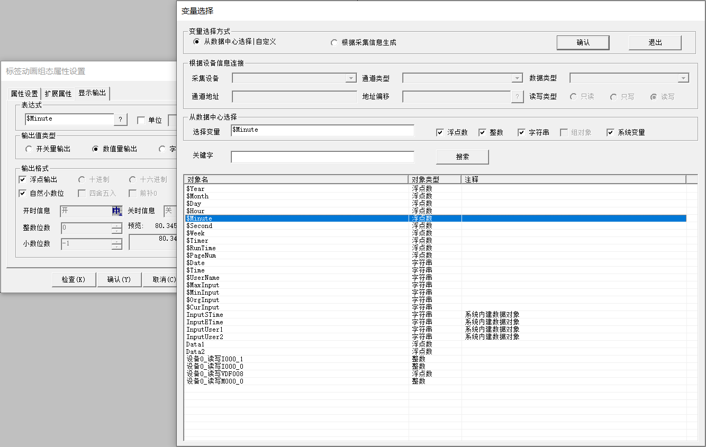

图1.4-24 变量选择对话框

-   从数据中心选择\|自定义

当数据变量选择方式使用【从数据中心选择\|自定义】时，【根据设备信息连接】部分不能使用，【从数据中心选择】以及【数据对象列表】可用，单击数据对象列表中要选择的数据对象，点击【确认】按钮后对应的数据对象名称会自动添加到“？”号按钮左边的输入框内。另外双击列表中的指定数据对象也可实现这种功能。

部分构件只能选择一个数据变量。

自定义变量是指在【选择变量】后面的输入框中输入一个实时数据库中没有的变量名称，确认后自动添加到“？”号按钮左边的输入框内，在输入框构件属性窗口点击确认时，系统会提示用户添加该数据对象到实时数据库中。

（1）从数据中心选择

【从数据中心选择】模块，【选择变量】输入框能够显示选中变量的名称，也可以直接在此处输入变量名。根据输入框右侧复选框的值筛选数据对象类型，设置变量类型后，数据对象列表内容将同步更新。如：勾选整数和字符串复选框时，数据对象列表只显示整数和字符串变量。

（2）关键字搜索

关键字搜索就是用户在使用【从数据中心选择】时，在【关键字】输入框中输入用户所要查找的信息内容后，点击【搜索】按钮，数据对象列表同步更新显示查找结果。如图1.4-25所示

>   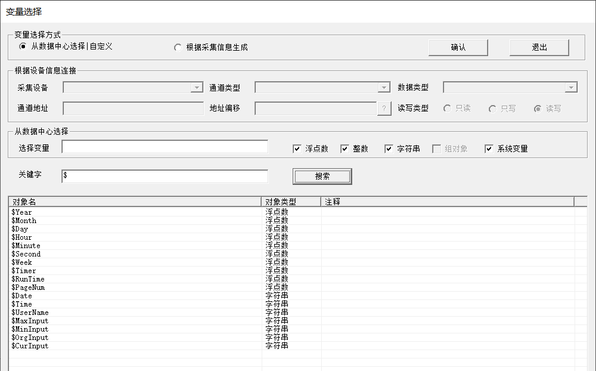

图1.4-25 关键字搜索

-   根据采集信息生成

当数据变量选择方式使用【根据采集信息生成】时，首先，要确保在设备窗口中使用了设备，否则该功能不可用；其次，设备窗口要关闭，如果没有关闭设备窗口，在选择该方式时，则会弹出对话框询问是否自动关闭，如果不关则不能使用该方式。选择此方式时【从数据中心选择】不可用。在【根据设备信息连接】中，选择采集设备，然后选择该设备的通道类型，数据类型，通道地址，地址偏移，读写类型。点击“确认”按钮后，自动按“设备名+读写方式+地址”格式生成变量添加到“？”号按钮左边的输入框内，且自动在设备编辑窗口中添加对应的通道和变量。如果添加的通道在设备窗口中添加过并且连接过变量，会给出提示以防误操作。

>   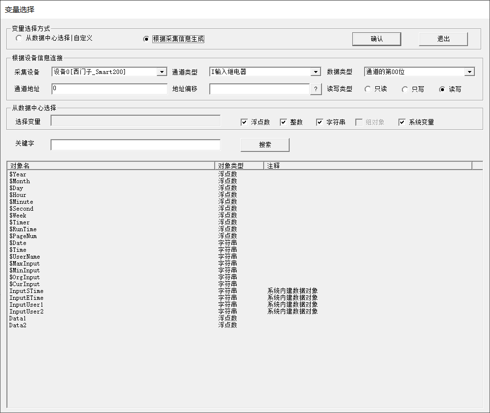

图1.4-26 根据采集信息生成数据变量

### 1.4.5 运行策略介绍

运行策略是用户为实现对系统运行流程自由控制所组态生成的一系列功能块的总称。

运行策略能够按照预设的顺序和条件操作实时数据库，控制用户窗口状态，修改设备运行数据，提高控制过程的实时性和有序性。

根据运行策略的不同作用和功能，McgsPro组态件把运行策略分为后台任务、启动策略、退出策略、循环策略、用户策略、报警策略、事件策略及热键策略八种。

每种策略都由一系列功能模块组成。McgsPro运行策略窗口中“启动策略”、“退出策略”、“后台任务”为系统固有的三个策略块，用户策略、循环策略、报警策略、事件策略、热键策略由客户根据工程需要自行定义，如图1.4-27所示。

>   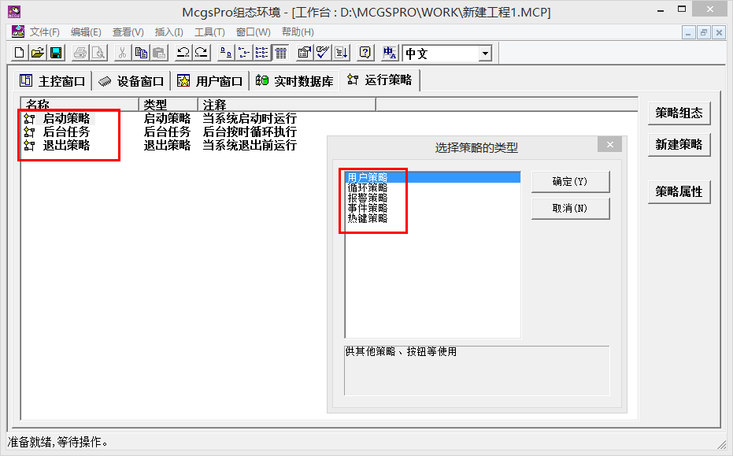

图1.4-27 策略窗口

用户根据自己的需要，建立对应的策略后，点击“新增策略行”或者通过右键操作来增加策略行，新增的策略行如图1.4-28所示。

>   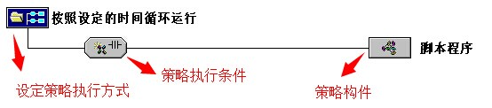

图1.4-28 策略行建立

双击【策略构件】可打开脚本编辑窗口。详细的脚本功能将在后续章节：进阶篇-第11章 脚本函数应用实例介绍。

每一个策略行中，只有当策略执行条件成立时，系统才能对策略行中的脚本程序进行操作。通过对策略条件的设定（默认情况下，执行条件部分为真），用户可以自主的控制策略在什么时候、什么条件、什么状态下执行，如图1.4-29所示。

>   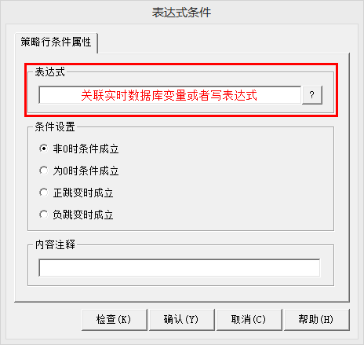 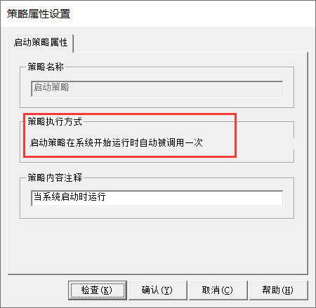

图1.4-29 策略执行条件 图1.4-30 启动策略

#### 1.4.5.1 启动策略

启动策略为系统固有策略，在系统开始运行时被自动调用一次。启动策略属性设置如图1.4-30所示，其操作如下：

 策略名称：输入启动策略的名字，由于系统必须有一个启动策略，所以此名字不能改变

 策略内容注释：用于对策略加以注释

#### 1.4.5.2 退出策略

退出策略为系统固有策略，在退出系统时自动被调用一次。退出策略属性设置如图1.4-31所示。

 策略名称：退出策略名字，由于系统必须有一个退出策略，所以此名字不能改变

 策略内容注释：用于对策略加以注释

>   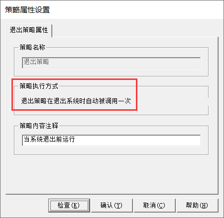 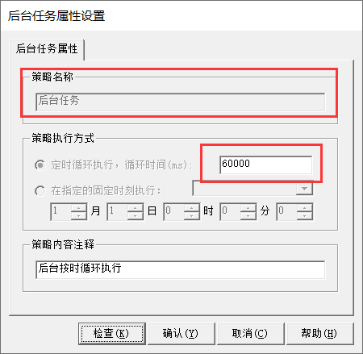

图1.4-31 退出策略 图1.4-32 后台任务

#### 1.4.5.3 后台任务

后台任务为系统固有策略，在系统运行时按照设定的时间循环运行。在一个应用系统中，只能有一个后台任务。后台任务属性设置如图1.4-32所示。

 策略名称：名称固定为后台任务，一个应用系统必须有一个后台任务策略

 策略执行方式：定时循环：按设定的时间间隔循环执行，直接用ms来设置循环时间。最小循环时间间隔为100ms，当设定值小于100ms时按100ms计算。实际运行过程中循环间隔有约20ms的误差值。

 策略内容注释：用于对策略加以注释

#### 1.4.5.4 循环策略

循环策略由用户在组态时创建，在系统运行时按照设定的时间循环运行。在一个应用系统中，用户可以定义多个循环策略。循环策略属性设置如图1.4-33所示。

-   策略名称：输入循环策略的名称
-   策略执行方式：
1.  定时循环：按设定的时间间隔循环执行，直接用ms来设置循环时间。最小循环时间间隔为100ms，当设定值小于100ms时按100ms计算。
2.  固定时刻：策略在固定的时刻执行。
-   策略内容注释：用于对策略加以注释

>   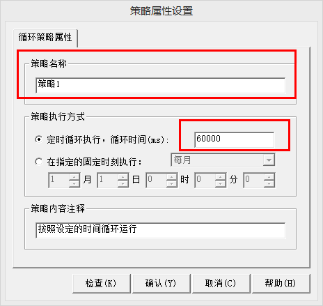 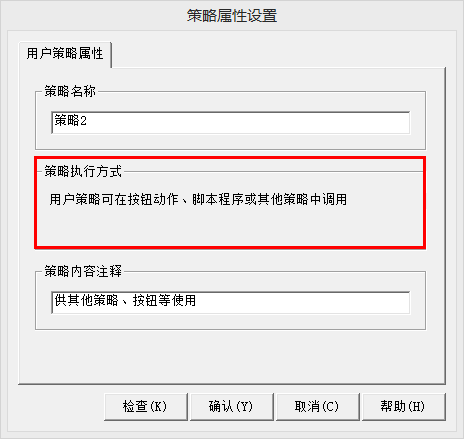

图1.4-33 循环策略 图1.4-34 用户策略

#### 1.4.5.5 用户策略

用户策略由用户在组态时创建，在系统运行时通过按钮、脚本调用。用户策略属性设置如图1.4-34所示，其操作如下：

-   策略名称：输入用户策略的名称。
-   策略内容注释：用于对策略加以注释。

#### 1.4.5.6 报警策略

报警策略由用户在组态时创建，当指定数据对象的某种报警状态发生时，报警策略被系统自动调用一次。报警策略属性设置如图1.4-35所示，其操作如下：

-   策略名称：输入报警策略的名称。
-   策略执行方式：
1.  对应数据对象：用于与实时数据库的数据对象连接。
2.  对应执行条件：报警产生时执行一次/报警结束时执行一次/报警应答时执行一次。
-   策略内容注释：用于对策略加以注释。

>   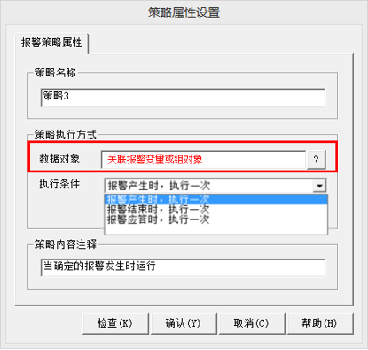 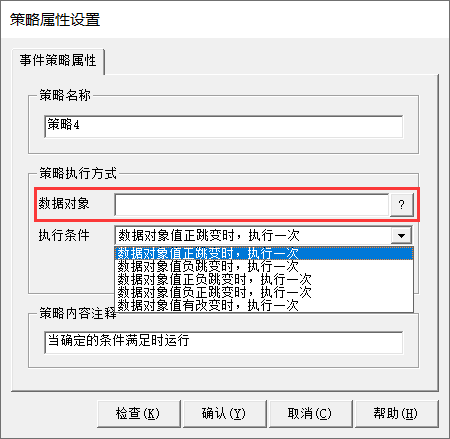

图1.4-35 报警策略 图1.4-36 事件策略

#### 1.4.5.7 事件策略

事件策略由用户在组态时创建，当对应数据对象的某种事件状态产生时，事件策略被系统自动调用一次。事件策略属性设置如图1.4-36所示。

-   策略名称：输入事件策略的名称。
-   策略执行方式：
1.  对应数据对象：用于关联事件对应的数据对象。
2.  执行条件：

    数据对象对应的事件内容有五种：

    数据对象的值正跳变(0到1)

    数据对象的值负跳变(1到0)

    数据对象的值正负跳变(0到1再到0)

    数据对象的值负正跳变(1到0再到1)。

    数据对象的值有改变时

-   策略内容注释：用于对策略加以注释。

#### 1.4.5.8 热键策略

热键策略由用户在组态时创建，当用户按下对应的热键时执行一次。

热键策略属性设置如图1.4-37所示

 策略名称：输入热键策略的名称。

 热键：输入对应的热键（可以是组合键）。

 策略内容注释：用于对策略加以注释。

>   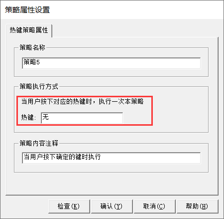

图1.4-37 热键策略

# 

# 第2章 窗口画面应用实例

人机界面的窗口显示画面承担着与工程用户直接进行交互的重任。本章通过McgsPro组态软件展示常用的几种窗口画面显示方式，让用户快速掌握常用的窗口画面功能组态方法。

如图2-1所示，用户可以通过【新建窗口】，并在窗口属性设置中设置用户窗口属性（如窗口名等）。

>   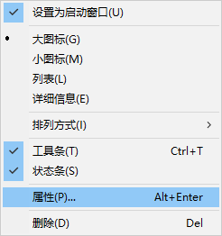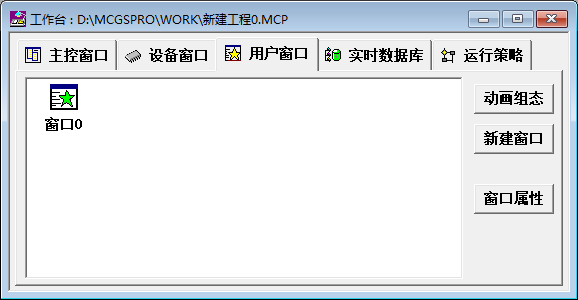

图 2-1 进入窗口属性设置界面的方法

注意：窗口属性设置进入方法1：→ 右键 → 属性；方法二：双击→ 组态画面空白处右键 → 属性。

## 2.1 工程名片

TPC工程除了必要的控制功能，还可以看作一张企业名片，为企业本身提供一定的宣传作用。对此，本节主要介绍工程封面窗口、启动窗口，以及二维码展示信息功能。

### 2.1.1 封面窗口和启动窗口设置

封面窗口和启动窗口功能：对于McgsPro工程，用户窗口画面启动顺序依次为：封面窗口 → 启动窗口。如工程未设置【封面窗口】，工程启动时将直接显示【启动窗口】。

注意：如图2.1-1所示，McgsPro禁止将在窗口属性设置中勾选了【作为子窗口使用】的用户窗口，设置成封面窗口或启动窗口。

>   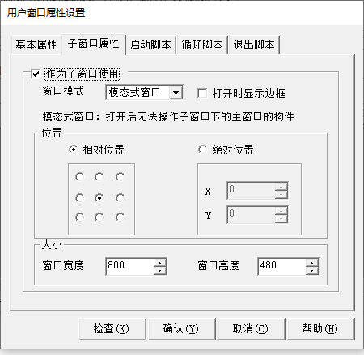

图2.1-1 子窗口属性设置

-   **封面窗口**

封面窗口作为工程第一个运行的用户窗口，其显示时间可以手动指定。封面窗口运行时，手动点击封面窗口画面，或者等待封面窗口显示时间耗尽，工程将自动打开【启动窗口】。

封面窗口设置方法如下：

1.  运行McgsPro组态软件，在工作台中的【用户窗口】中新建2个窗口画面：窗口0、窗口1。如图2.1-2所示：

>   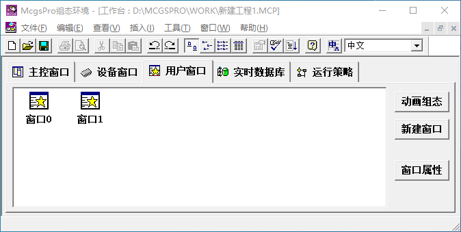

图2.1-2 新建窗口画面

1.  双击工作台中的主控窗口，进入基本属性设置，如图2.1-3所示：

>   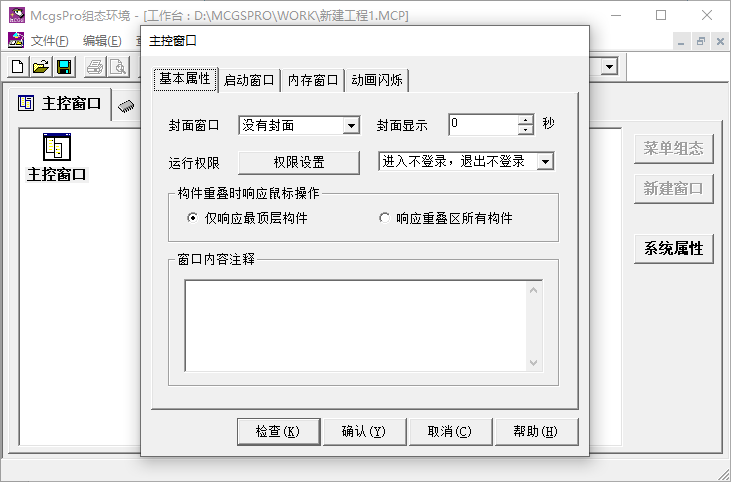

2.1-3 主控窗口基本属性设置

1.  如图2.1-4所示，在【主控窗口】\|【基本属性】功能页中，选择封面窗口，并设置封面显示时间即可（封面时间设置为0，封面将一直显示，直到单击窗口任何位置时，封面方可消失）。封面窗口：窗口0，封面显示：3秒;

>   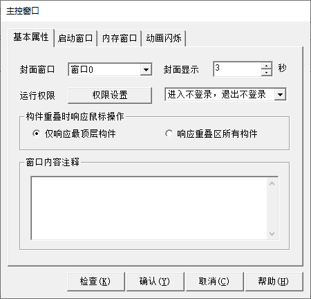

图2.1-4 设置封面窗口

注意：图2.1-4中设置的封面窗口（窗口0），其窗口显示内容需要用户自行组态。除了不能设置为子窗口外，封面窗口具备普通窗口所有功能。

-   **启动窗口**

启动窗口：作为封面窗口展示完成后启动的用户窗口，也需要用户手动进行设置。可通过以下2种方法设置启动窗口。

**方法一：**

1.  在图2.1-3中的主控窗口属性设置，选择【启动窗口】功能页；
2.  选择【用户窗口列表】→【窗口1】→【增加】，将窗口1设置成启动窗口，如图2.1-5所示：

>   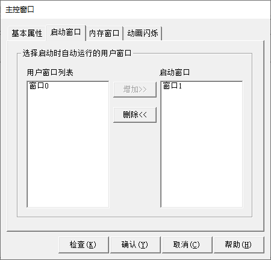

图2.1-5 方法一：设置启动窗口

**方法二：**

直接在【工作台】→【用户窗口】中，选中【窗口1】→【右键】→【设置为启动窗口】，如图2.1-6所示：

>   

图2.1-6 方法二：设置启动窗口

注意：设置的启动窗口，其窗口显示内容需要用户自行组态。除了不能设置为子窗口外，启动窗口具备普通窗口所有功能。

### 2.1.2 二维码展示信息

使用McgsPro组态软件的用户，可以通过McgsPro自带的二维码构件，将字符信息以二维码的方式进行展示。用户可以在工程运行时，使用手机中具备“扫一扫”功能的app或者直接使用二维码扫码枪，扫描并获取其展示的二维码信息。

二维码设置方法如下：

1.  双击图2.1-2中需要设置二维码功能的窗口画面，进入窗口动画组态；
2.  打开工具箱，在工具箱中选择“二维码”构件，并在窗口画面中绘制二维码构件，操作步骤如图2.1-7所示：

>   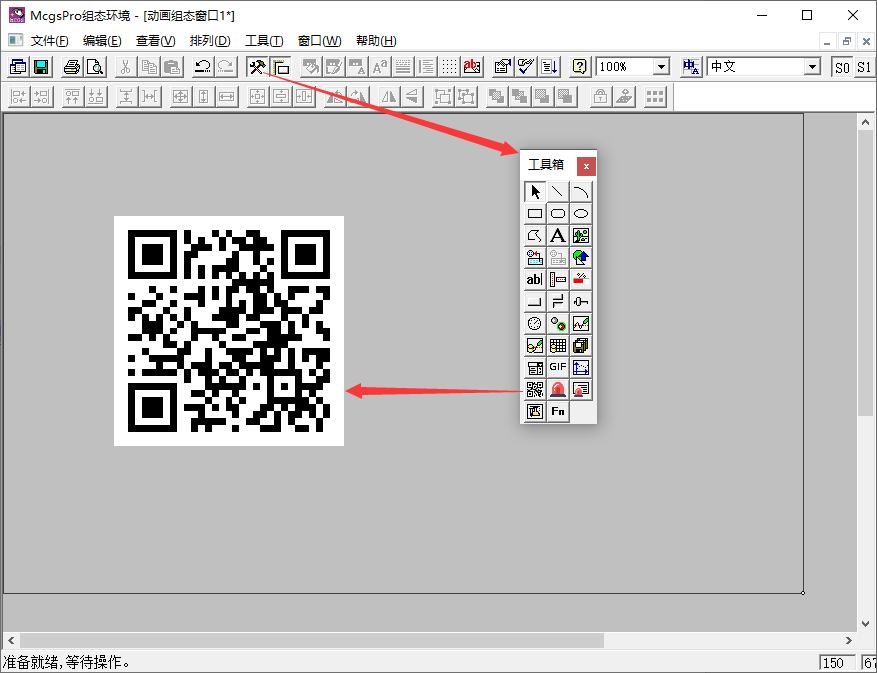

图2.1-7 绘制二维码构件

1.  鼠标双击图2.1-7中的二维码构件，进入图2.1-8所示的二维码构件属性设置界面；

>   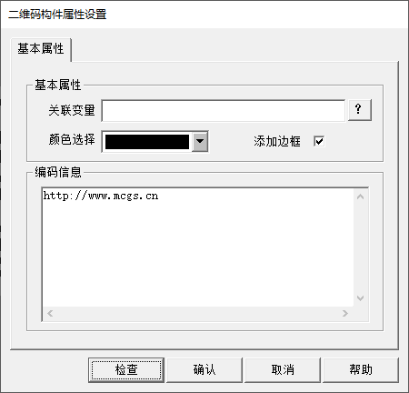

图2.1-8 二维码构件属性设置

**二维码属性配置信息**

a . 关联变量：设置二维码的显示信息，如果该位置关联了变量，工程运行时，构件将以二维码的方式显示该变量的值；

b . 颜色选择：设置二维码构件的显示颜色；

c . 添加边框：选择是否显示二维码构件的白色边框；

d . 编码信息：设置静态文本，当未在【关联变量】处关联变量，构件在工程运行时将以二维码的方式显示【编码信息】中的内容。另外，组态时构件将始终显示【编码信息】中的内容。

注意：二维码构件可以通过方法函数SetFixRate(整数1,整数2)设置纠错率。详细的构件方法函数的内容将在后续章节：3.5 构件或窗口的属性和方法进行介绍。

## 2.2 数据显示和输入

数据的显示和输入是用户进行工程组态时常用的功能，McgsPro组态软件提供了专用的标签构件和输入框构件，实现数据的显示和输入功能。

### 2.2.1 数据显示

使用图2.2-1红框所示的标签构件可以显示工程中变量的值。

>   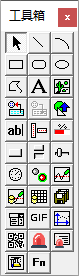

图2.2-1 工具箱：标签构件

-   **标签显示数据**
1.  首先打开用户窗口，在图2.2-1中选择点击【鼠标左键】，选择标签构件，并在用户窗口中绘制；
2.  双击绘制的标签构件，进入【属性设置】。如图2.2-2所示，勾选【输入输出连接】→【显示输出】，进入“显示输出”选项卡：

>   

图2.2-2 标签属性设置

1.  如图2.2-3所示，通过点击图中的【 ? 】，实现在表达式位置关联变量，即可实现工程运行时显示所关联变量的值。

>   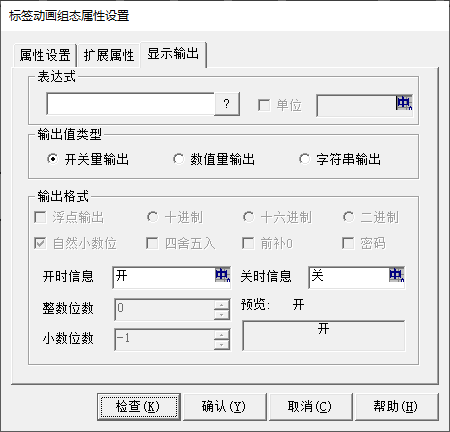

图2.2-3 标签显示输出设置

**显示输出配置信息**

a . 表达式：工程运行时，标签构件将显示表达式中关联变量的值，支持的变量类型包括：整数、浮点数、字符串，或者是它们的表达式；

b . 单位：工程运行时，显示数据单位。只有当【表达式】中关联的变量是整数或浮点数，该选项才呈可用状态；

c . 输出值类型：【表达式】关联整数或浮点数，输出值类型才可选择【开关量输出】和【数值量输出】，【表达式】关联字符串，输出值类型只能选择【字符串输出】；

d . 输出格式：以设定的格式显示【表达式】中关联的变量，数据格式包括浮点输出、十进制、十六进制、二进制、自然小数位、四舍五入、前补0、密码。

浮点输出：以浮点数方式显示【表达式】关联变量；

十进制、十六进制、二进制：以十进制、十六进制、二进制的方式显示【表达式】关联变量；

自然小数位：对显示的小数位的格式不做特殊要求，让系统自行决定小数位精度；取消勾选此项后，可手动指定“f”项中的【整数位数】和【小数位数】;

四舍五入：【表达式】关联变量的小数位数超过设定位数，选择直接舍去或进行四舍五入；

前补0：【表达式】关联变量的整数位数低于设定值，将自动进行补0；

密码：以“\*”代替显示【表达式】中关联的变量。

e . 开时信息、关时信息：标签显示配置项“c”中的输出类型选择【开关量输出】时，当【表达式】关联的变量值为非0，标签将显示“开时信息”中的文本，当【表达式】关联变量的值为0，标签将显示“关时信息”中的文本。

### 2.2.2 数据输入

McgsPro提供的“标签”和“输入框”构件都可以实现数据输入功能，下面首先利用标签构件完成数据输入。

-   **标签输入数据**
1.  如图2.2-1所示，在“工具箱”中选择标签构件，并绘制；
2.  双击绘制的标签构件进入其【属性设置】。如图2.2-4所示，勾选【输入输出连接】→【按钮输入】，点击进入“按钮输入”选项卡；

>   

图2.2-4 标签属性设置

1.  如图2.2-5所示，在标签构件的【按钮输入】→【对应数据对象的名称】中，点击“?”关联变量，工程运行时，可以通过点击标签构件，将数据输入到关联变量。

>   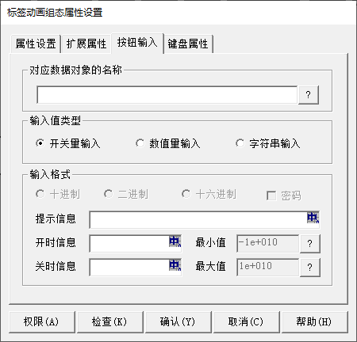

图2.2-5 标签按钮输入设置

**按钮输入配置信息**

a . 输入变量关联：支持整数、浮点数、字符串变量；

b . 输入值类型设置：选择“开关量输入”，工程运行时点击标签构件，数据将以开关量（0或非0）的方式输入到关联变量；选择“数值量输入”，数据将以数值的方式输入到关联的变量；选择“字符串输入”，数据将以字符串的方式输入到关联变量；

c . 输入格式：变量关联“整数”且输入类型为“数值量输入”，可指定输入数据进制（十进制、二进制、十六进制），变量关联字符串或自然小数格式浮点数，可指定输入数据格式为“密码”，实现以掩码“\*”的方式输入；

提示信息：进行数据输入时键盘顶部显示的提示信息；

开时信息、关时信息：开关量输入时键盘上的提示文字配置；

最小值、最大值：运行时允许输入的数据范围，仅当输入类型选择“数值量输入”时有效。

-   **输入框输入数据**
1.  如图2.2-6所示，在工具箱中选择输入框构件，并在用户窗口中绘制输入框构件；

>   

图2.2-6 工具箱：输入框构件

1.  双击绘制的输入框构件，进入图2.2-7所示的【操作属性】，用户只需要在【操作属性】→【对应数据对象名称】中，点击 按钮关联变量，并设置好输入格式，即可在工程运行时通过点击输入框，将数据输入到关联的变量。

>   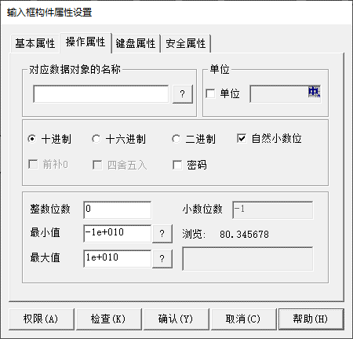

图2.2-7 输入框操作属性设置

**输入框操作属性配置信息**

a . 对应数据对象的名称：工程运行时通过点击输入框将数据输入到关联的变量，支持：整数、浮点数、字符串变量；

b . 单位：勾选并设置后，工程运行时会自动在数据后追加显示单位，仅当关联变量为整数或浮点数时有效；

c . 数据格式设置：

十进制、十六进制、二进制：以十进制、十六进制、二进制的方式显示和输入数据；

自然小数位：勾选后，系统对小数位数不做格式限制；不勾选，则需要在配置项“d”中手动指定小数位数；

前补0：工程运行时，输入的整数位数小于配置项“d”中设置值，系统将自动进行补0；

四舍五入：取消勾选自然小数位后，当输入数据小数位数超过配置项“d”中的设置值，选择是否进行四舍五入；

密码：选择是否以“\*”的方式输入和显示数据；

d . 设置数据的整数位数、小数位数、允许输入的最小值和最大值、以及显示效果预览。

## 2.3 输入键盘设置

具有输入功能的构件（如输入框、标签构件）均可设置键盘类型，McgsPro支持3种键盘输入方式：

-   外接USB键盘实现数据输入：工程运行时激活构件的输入功能，即可通过外接USB键盘进行输入，无需额外设置；
-   系统默认键盘：系统键盘，输入构件默认选择此键盘；
-   自定义键盘：用户在工程组态时自定义的输入键盘。

本节主要讲解系统默认键盘、自定义键盘的使用方法**。**

### 2.3.1 系统默认键盘

以输入框构件为例，系统默认键盘设置步骤如下：

参考进阶篇章节2.2.2，双击绘制的输入框构件，进入属性设置界面。如图2.3-1所示，在【键盘属性】功能页，勾选【系统默认键盘】，工程运行时，点击该输入框，系统将根据用户在【操作属性】中关联的变量类型，弹出对应形态的输入键盘。

>   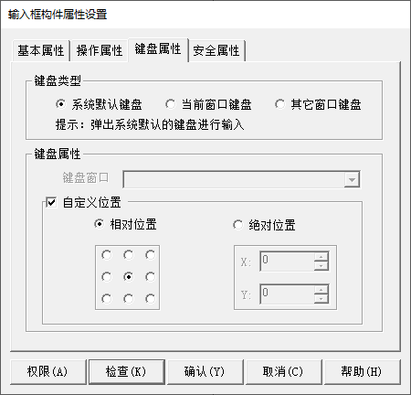

图2.3-1 系统默认键盘

**键盘属性配置信息**

a . 弹出的【键盘类型】设置：

【系统默认键盘】→ 系统键盘；

【当前窗口键盘】→ 自定义键盘，系统不弹出键盘（键盘按钮就在输入框构件所在的用户窗口）；

【其他窗口键盘】→ 自定义键盘，系统弹出【键盘窗口】中指定的用户窗口（键盘按钮就在弹出的指定窗口中）；

b .【键盘窗口】：仅键盘类型选择【其他窗口键盘】时有效。工程运行时点击该输入框构件，将弹出此处选择的用户窗口。

c . 弹出的键盘位置设置：

【相对位置】：弹出键盘相对于TPC液晶显示屏的位置；

【绝对位置】：按照用户设置的XY坐标弹出键盘；

### 2.3.2 自定义键盘

自定义键盘可以用来替代系统默认键盘，其本质上是将【键盘按钮】放置在指定窗口，然后通过输入框等构件去调用这个窗口实现自定义键盘功能。自定义键盘中的【当前窗口键盘】和【其他窗口键盘】区别详见图2.3-1所示的键盘属性配置信息。

假设用户需要使用自定义键盘对一个浮点数进行数据输入，用户理想中的键盘外观如图2.3-2所示：

>   

图2.3-2 自定义键目标外观

#### 2.3.2.1 发送指令组态

1.  如图2.3-3所示，首先新建2个用户窗口，【数值键盘】窗口作为自定义键盘窗口；【测试窗口】窗口用于绘制输入框构件，测试自定义键盘弹出功能。注意将【测试窗口】设置为启动窗口（启动窗口设置参考进阶篇章节2.1.1）；

>   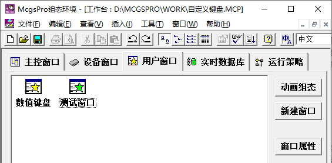

图2.3-3 新建窗口

1.  双击进入新建的【数值键盘】窗口组态界面。如图2.3-4所示，从【工具箱】中添加一个【键盘按钮】构件；

>   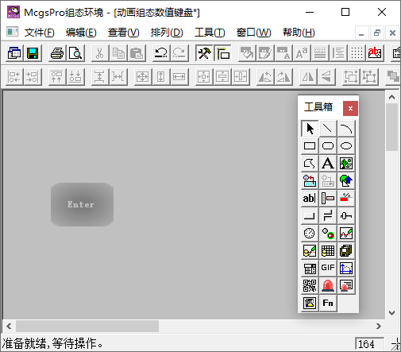

图2.3-4 添加键盘按钮

1.  先添加1个输入“0”的按钮：双击绘制的键盘按钮构件，在基本属性功能页如图2.3-5所示，设置键盘按钮外观；

>   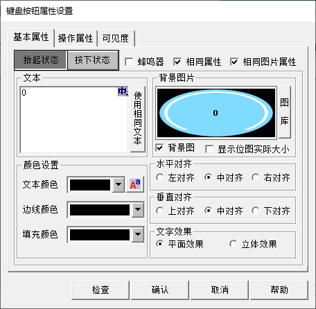

图2.3-5 键盘按钮外观设置

**基本属性配置信息**

a . 设置点击按钮是否触发蜂鸣；设置按钮【抬起状态】和【按下状态】的显示文本和背景图保持一致；

b . 设置抬起/按下状态的文本内容；

c . 设置构件背景图片属性，通过【图库】选择背景图或插入自定义背景图，本节所示图片插入方法如图2.3-5所示；

注意：通过图2.3-6中的【装入】按钮，可装载用户自定义图片，支持图片格式：bmp、jpg、png、ico、svg。

d . 设置文本颜色和字体大小，以及构件边线颜色和填充颜色；

e . 设置文本对齐方式和显示效果。

>   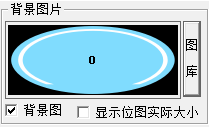 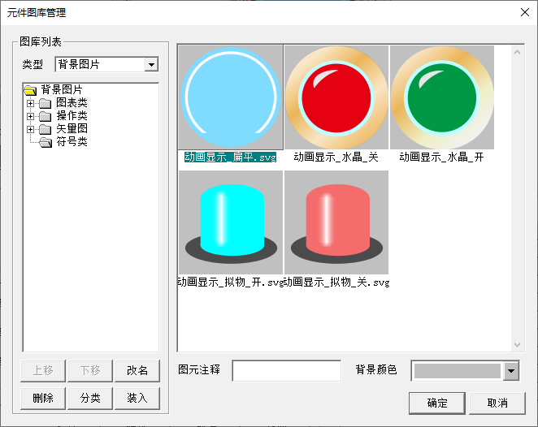

图2.3-6 插入背景图

1.  点击构件【操作属性】，进入操作属性选项卡，设置该键盘按钮构件发送的指令内容。由于我们需要添加可输入“0”的键盘按钮，可选择【字符码】→【字符】→“0”，如图2.3-7所示：

>   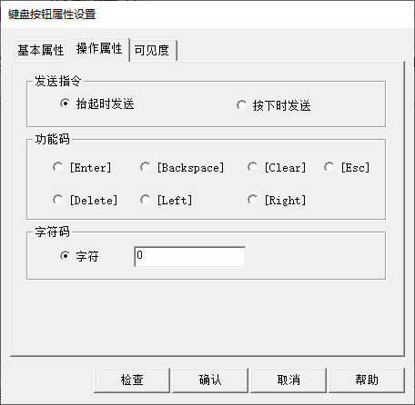

图2.3-7 键盘按钮操作属性

**操作属性配置信息**

a . 选择功能码或字符码指令的发送时机；

b . 功能码：选择按下按钮时发送的功能码，功能码与字符码互斥；（功能码是具体的某项功能，不是字符）

【Enter】：确定本次输入；

【Backspace】：向前删除1位输入内容；

【Clear】：清空已输入内容；

【Esc】：取消本次输入；

【Delete】：向后删除1位输入内容；

【Left】：光标向左移动1个位置；

【Right】：光标向右移动1个位置。

c . 字符码：选择按下按钮时发送的字符，字符码与功能码互斥，本次我们的字符码选择阿拉伯数字“0”；

1.  完成步骤4，点击【确认】，按照需要调整构件大小，效果如图2.3-8所示：

>   

图2.3-8 键盘按钮：0

1.  重复步骤2～步骤5，依次添加字符码：“1”、“2”、“3”、“4”、“5”、“6”、“7”、“8”、“9”、“-”、“.”，以及添加功能码：“Backspace”、“Clear”、“Esc”、“Enter”。调整构件位置和大小，如图2.3-9所示：

>   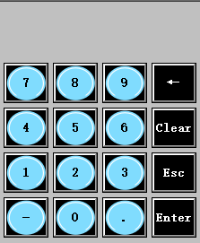

图2.3-9 添加字符码和功能码

#### 2.3.2.2 激活的输入键盘属性显示

完成上一节的发送指令组态操作后，该自定义键盘已经可以实现数值输入功能。同时用户还可以通过McgsPro提供的系统变量显示数据输入的过程值，以及键盘输入允许输入的最小值和最大值，设置方法如下：

1.  在【数值键盘】窗口中添加1个标签构件，勾选【显示输出】，如图2.3-10所示：

>   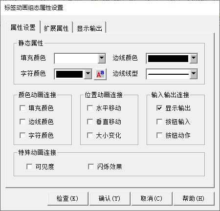

图2.3-10 标签：显示输出

1.  如图2.3-11所示,在【显示输出】→【表达式】，输入系统变量“\$CurInput”，【输出值类型】选择字符串，设置完成后点击【确认】。此时运行工程，通过输入构件激活【数值键盘】窗口，该标签构件将显示：激活的输入键盘输入的当前值。

    注意：标签显示输出配置信息可参考进阶篇章节2.2.1。

>   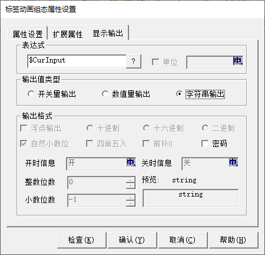

图2.3-11 系统变量关联

1.  按照同样的方式，再添加2个标签构件，重复步骤①～步骤②，分别在其【显示输出】→【表达式】，输入以下字符串："Min:"+\$MinInput；"Max:"+\$MaxInput。并调整标签构件大小、填充色等外观，效果如图2.3-12所示：

>   

图2.3-12 完成自定义键盘

#### 2.3.2.3 自定义键盘弹出方式

自定义键盘的弹出方式可以自行定义，大多数用户一般是选择将其单独作为一个子窗口弹出，设置方法如下：

1.  在自定义键盘所在的窗口【数值键盘】空白处双击，进入用户窗口属性设置；
2.  如图2.3-13所示，勾选【作为子窗口使用】，根据需要设置窗口模式【模态式窗口】，并设置子窗口打开的大小（子窗口打开范围应包含所有构件）；

>   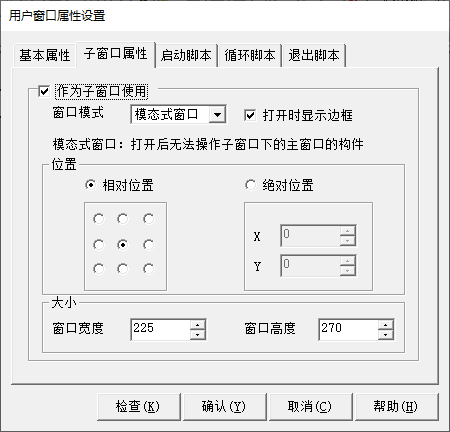

图2.3-13 窗口打开方式

1.  设置完成，窗口【数值键盘】如图2.3-14所示：

>   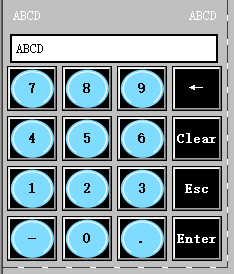

图2.3-14 子窗口模式打开自定义键盘

#### 2.3.2.4 测试自定义键盘

1.  在工程的【实时数据库】新建一个浮点数变量，变量名：“测试”；
2.  双击图2.3-2所示的【测试窗口】，进入其组态画面。在该窗口中添加一个输入框构件，在其操作属性关联变量“测试”；设置【最小值】：-500；最大值：500；进入【键盘属性】选项卡，选择键盘窗口为【数值键盘】。如图2.3-15所示：

>   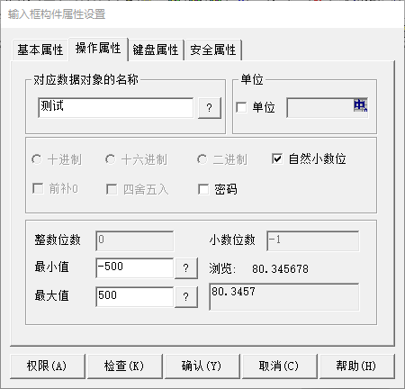 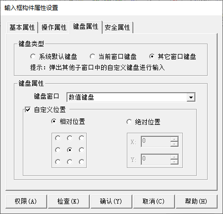

图2.3-15 输入框键盘设置

1.  设置完成后，保存并模拟运行工程，点击图2.3-16设置的输入框构件，将弹出2.3-15所示的自定义键盘窗口：

>   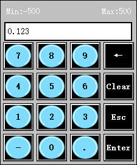

图2.3-16 自定义键盘窗口

注意：用户可通过自定义键盘进行字符串输入方式与之类似，只需要将图2.3-6中的字符码修改为对应的字符即可，字符可以是汉字、字母（区分大小写）、标点、特殊符号。

## 2.4 公共窗口功能

“公共窗口”可以看作被其他窗口引用的模板窗口。与公共窗口概念相对应的是“宿主窗口”，即引用公共窗口的用户窗口。同一个工程，任何一个用户窗口都可以被指定为另一个用户窗口的公共窗口，公共窗口中所有的构件均可被宿主窗口继承，并显示在宿主窗口的最底层。

比如，用户需要在每个用户窗口的右上角显示系统时间，用户可以选择手动在每个窗口的右上角添加时间显示构件；也可选择新建一个窗口，将时间构件放在新建窗口右上角，其他窗口直接指定新建窗口为公共窗口即可。操作步骤如下：

1.  运行McgsPro，新建工程，再新建2个用户窗口，如图2.4-1所示：

>   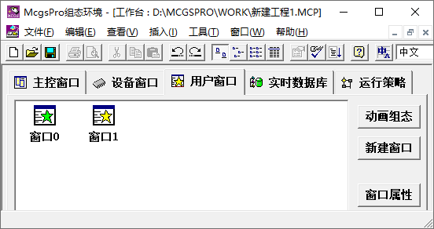

图2.4-1 新建用户窗口

1.  本节教程选择“窗口0”作为宿主窗口，“窗口1”作为公共窗口。双击窗口1，进入窗口1组态画面；
2.  按照图2.4-2所示步骤，在“窗口1”画面右上角添加一个时钟，添加完成后保存工程；

>   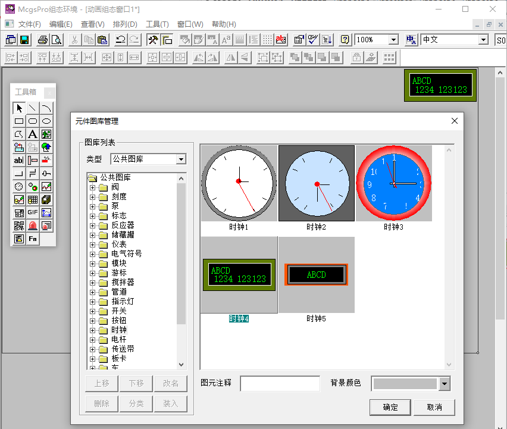

图2.4-2 添加时钟

1.  如图2.4-3所示，在窗口属性设置界面依次执行操作：【基本属性】→【公共窗口】→ 选择“窗口1”→ 【确认】。将“窗口1”设置成“窗口0”的公共窗口模板。

>   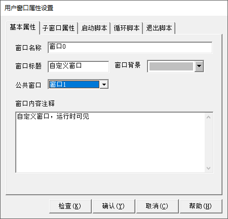

图2.4-3

1.  完成图2.4-3所示操作后，“窗口0”显示如图2.4-4所示。可以看到在宿主窗口“窗口0”的右上角，显示了指定的公共窗口“窗口1”中组态的时钟显示构件。

>   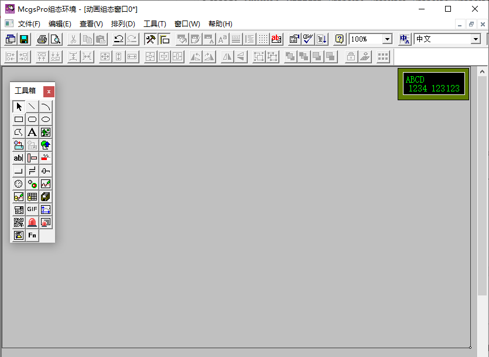

图2.4-4 窗口0画面展示

公共窗口设置注意事项：

-   公共窗口中的构件、窗口脚本，可在宿主窗口中正常显示或执行；
-   公共窗口中的构件显示在宿主窗口的底层，且只能在公共窗口中编辑；
-   公共窗口的背景色不会在宿主窗口中显示；
-   1个公共窗口可被多个宿主窗口引用，但1个宿主窗口只能引用1个公共窗口。

## 2.5 条件满足自动弹窗

现场经常会有客户要求在异常情况下，触摸屏可自动弹出提示窗口或者执行某些指令。其本质是在工程运行时监视指定的对象（变量或组对象），当监视对象产生报警、数据跳变、数据变化或者满足其他指定的条件时，触发预置动作。动作内容用户可自行定义，如打开某个窗口，或执行某条指令。

### 2.5.1 条件满足弹窗功能组态

McgsPro提供运行策略模块供用户使用，不同的运行策略对应不同的触发方式，本节教程采用事件策略。当现场“阀门开关状态”发生正跳变时（即阀门由关闭变为打开状态：0 → 非0），触摸屏以子窗口的方式弹出提示。

1.  新建工程，如图2.5-1所示，在工程的实时数据库中新建整数变量“阀门开关状态”；

>   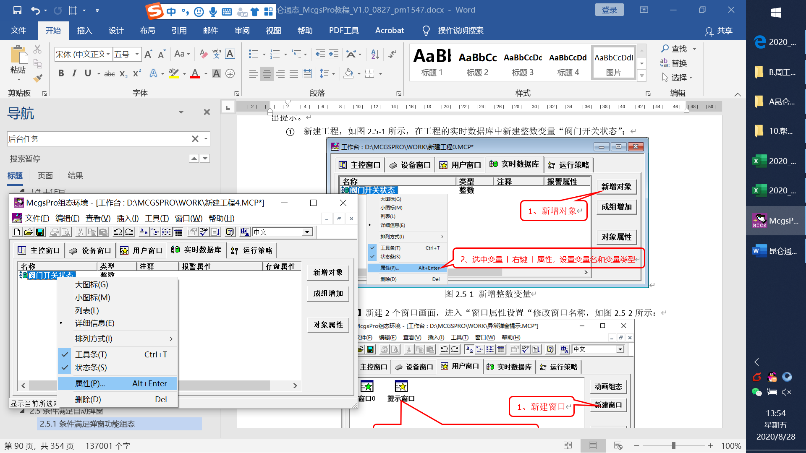

图2.5-1 新增整数变量

1.  在【用户窗口】新建2个窗口画面，进入“窗口属性设置“修改窗口名称，如图2.5-2所示：

>   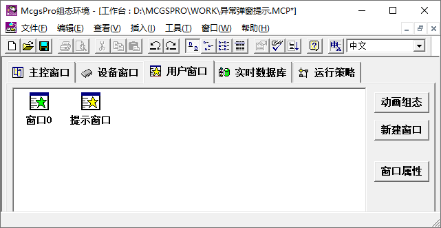

图2.5-2 新建用户窗口

1.  进入运行策略模块，新建一个事件策略，如图2.5-3所示：

>   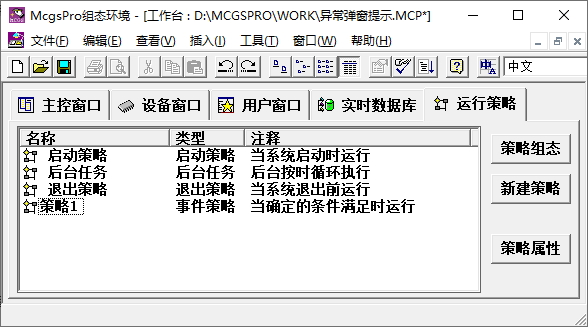

图2.5-3 新建事件策略

1.  双击图2.5-3新建的【策略1】，进入策略1的“策略组态”界面；
2.  在策略组态界面双击  ，进入“属性设置”。如图2.5-4所示，通过【策略执行方式】→【数据对象】→【?】，关联需要监视的变量“阀门开关状态”；【执行条件】选择“正跳变时，执行一次”（变量值由0 → 非0）；设置完成点击“确认”。

>   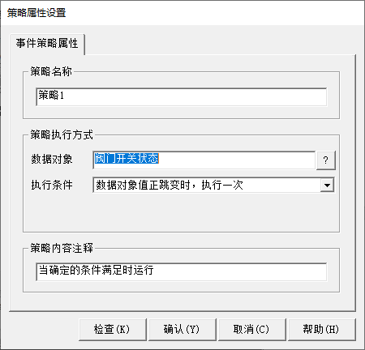

图2.5-4 设置策略执行方式

**事件策略配置信息**

a . 策略名设置

b . 关联被监视的数据对象，可以是变量或表达式

c . 设置策略的执行条件，当监视的“数据对象”变化情况满足“执行条件”，就执行一次该策略中的“策略行”

正跳变：0 → 非0

负跳变：非0 → 0

正负跳变、负正跳变：McgsPro不支持正负跳变和负正跳变，考虑版本兼容性故保留该选项

有改变：数据对象值发生变化

d . 设置策略内容注释

1.  如图2.5-5，在策略组态界面空白处点击【右键】→【新增策略行】。“策略1”满足触发条件，将执行策略行中的脚本程序。

>   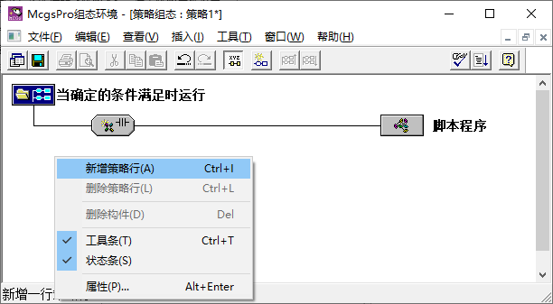

图2.5-5 新增策略行

1.  双击新增策略行中的脚本程序图标  ，如图2.5-6，在脚本程序编辑页面右侧对象树，依次展开【用户窗口】→【提示窗口】(图2.5-2新建的用户窗口）→【方法】，双击“open”，将其添加到脚本编辑框。设置完成点击检查脚本，通过后点击保存，并关闭脚本程序编辑页面。

>   

图2.5-6 添加打开窗口脚本

注意：此时执行该策略行，将打开用户窗口：【提示窗口】

1.  回到工作台用户窗口模块，双击  进入其组态画面。进行以下操作：

    A、按照需要添加提示内容，用于提示窗口弹出后显示；

    B、按照需要添加一个标准按钮构件，按照需要修改构件显示文本。双击标准按钮构件 → 【脚本程序】→【抬起脚本】，添加关闭【提示窗口】脚本“用户窗口.提示窗口.Close( )”，添加方法参考图2.5-6；

    C、在【提示窗口】画面空白处双击 →【用户窗口属性设置】→【子窗口属性】，将其设置为子窗口，子窗口大小自行定义；（子窗口设置方法详见进阶篇章节2.3.2.4）

    完成步骤A、B、C后，提示窗口画面效果如图2.5-7所示：

>   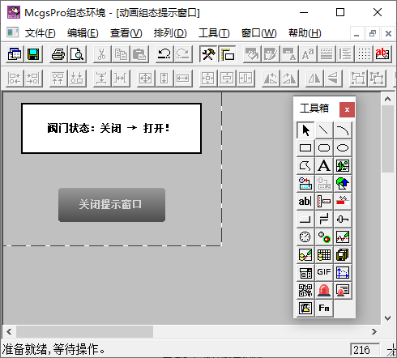

图2.5-7 提示窗口组态

1.  最后在工作台双击启动窗口  ，并在【窗口0】添加输入框，关联变量【阀门开关状态】(用于工程运行时演示提示窗口弹出效果），输入框变量关联方法参考进阶篇章节2.2.2。
2.  完成以上步骤，运行工程，通过【窗口0】中的输入框将变量“阀门开关状态”先赋值“0”，再赋值为非0，可触发事件策略“策略1”中组态的脚本“用户窗口.提示窗口.Open( )”，打开【提示窗口】，如图2.5-8所示：

>   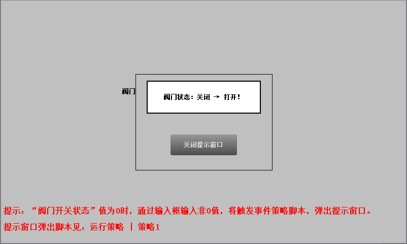

图2.5-8 提示窗口弹出

注意：

-   用户如果希望满足条件后，TPC可执行特定的脚本程序，都可以通过类似的方法实现。只需要用户选择满足自身要求的策略，并在该策略的【策略行】→【脚本程序】，添加待执行的脚本即可，策略行添加方法参考本节教程步骤⑤；
-   不同的策略具备不同的触发条件，McgsPro提供八种策略供用户使用，详细内容请参考章节：进阶篇_1.4.5运行策略介绍。

# 

# 第3章 动画功能应用实例

本章主要介绍几个简单常用构件的使用方法和应用实例，以及构件或窗口的属性和方法功能、事件功能。

## 3.1 模拟仪表显示

旋转仪表构件是模拟旋转式指针仪表的一种动画图形，用其显示所连接的整数和浮点数变量的值。旋转仪表构件的指针随变量值的变化而不断改变位置，指针所指向的刻度值即为所连接的变量的当前值。

本节将使用软件自带的功能，组态一个美观大方、富有科技感的旋转仪表用于设备压力值的显示。

1.  将一个旋转仪表构件拖拽到画面合适的位置和合适的大小（注意：图中的旋转仪表不是默认样式，是为了更好的区分仪表的不同区域，特地做了设置）。标准的旋转仪表构件本身由A.圆边，B.标注，C.次划线，D.主划线，E.警示色环，F.指针，G.轴心，H.背景图，I.扇形等9部分组成，如图3.1-1所示。
2.  双击旋转仪表构件，弹出【旋转仪表属性设置】界面，打开【基本属性】功能页，如图3.1-1所示。

>   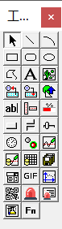 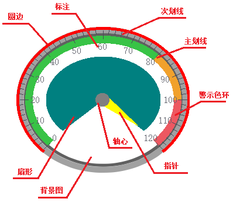 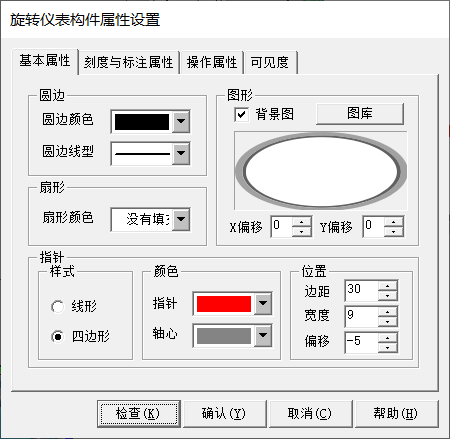

图3.1-1 旋转仪表组成及基本属性

**基本属性配置信息**

基本属性功能页界面如图3.1-1所示。

1.  圆边颜色：配置圆边的颜色
2.  圆边线型：配置圆边的线型
3.  扇形颜色：配置扇形的颜色
4.  指针样式：可选择线型和四边形两种
5.  指针颜色：可分别配置指针和轴心的填充颜色
6.  指针位置：可通过配置指针的边距，宽度，以及偏移长度来确定指针的位置，边距是指针到矩形绘制区域的内切椭圆的距离，偏移长度是指偏移轴心的距离，可根据实际情况调整这三个参数来确定指针的位置和合适的大小
7.  背景图：选择之后可以添加背景图片，支持bmp，jpg，png，svg，ico五种格式
8.  X(Y)偏移：位图中心坐标的X(Y)坐标减去旋转仪表中心坐标的X(Y)坐标的值
9.  点击【图库】按钮打开【元件图库管理】。在【图库类型】处选择【水晶风格】。在下方的目录树中选择【仪表】。选择【PNG_表盘2】。点击确定，关闭界面。

>   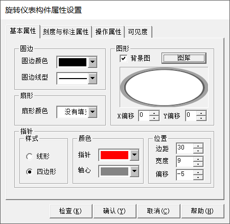 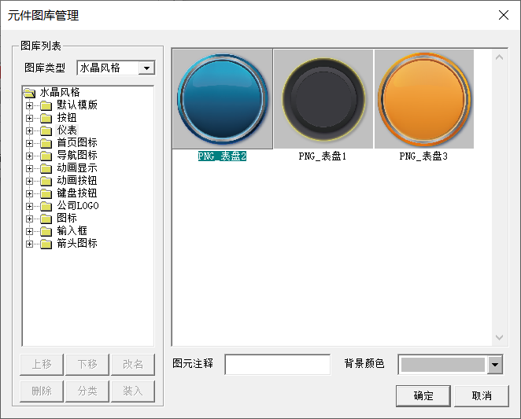

图3.1-2 从图库中选择仪表背景

1.  将【主划线】数目设置为【10】，【标注颜色】设置为【白色】以突出字体显示。

>   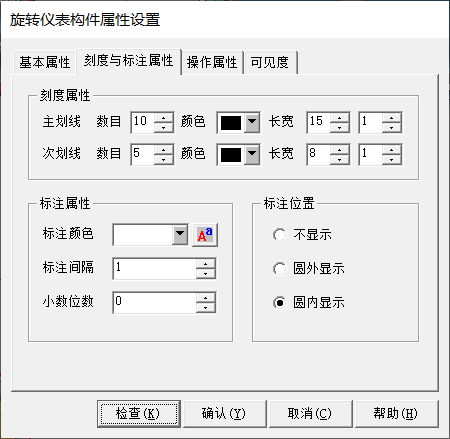

图3.1-3 刻度与标注属性界面

**刻度与标注属性配置信息**

1.  主划线：配置主划线的数目，颜色，长，宽
2.  次划线：配置次划线的数目，颜色，长，宽
3.  标注颜色：配置标注文字的颜色
4.  标注字体：配置标注的字体，字形，大小
5.  标注间隔：配置标注的间隔
6.  小数位数：配置标注显示浮点数时，小数显示的位数
7.  标注位置：可以选择标注显示在圆内，圆外，不显示
8.  在实时数据库中新建浮点型变量【压力值】。然后在【操作属性】功能页中，将【表达式】设置为变量【压力值】。
9.  将【偏移范围】中的【对应值】设置为1000，它表示表盘的最大显示值为1000。
10. 把色环的大小调到合适的数值，本样例设置色环【宽度】为6，【边距】为0。
11. 根据工程需要设置【提示值】和【警告值】，本样例将其设置为700和900.
12. 根据工程需要设置色环【颜色】，本样例设置如图3.1-4所示。

>   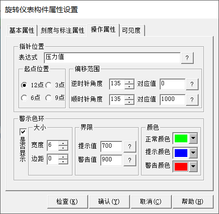

图3.1-4 操作属性界面

**操作属性配置信息**

1.  表达式：旋转仪表构件所对应的浮点数变量，变量的值和指针的位置成一一对应的关系
2.  起点位置：指针偏转角度范围的确定，可基于起点位置逆时针和顺时针角度设置来确定，即最大角度=逆时针角度+顺时针角度，可选择12点，3点，6点，9点，分别对应90度，0度，270度，180度，可根据实际情况选择不同的起点位置
3.  偏移范围：偏移范围是基于起点位置设置指针的偏转角度范围，同时可以设置逆时针角度和顺时针角度的数据值，即边界值
4.  是否显示（警示色环）：选择后，才可以正常绘制警示色环
5.  （警示色环）大小：可设置警示色环的宽度和边距
6.  （警示色环）界限：这里的目的是将色环分为三个级别，分别表示正常、提示和警告。一般而言，[最小值，提示值]区间为正常色环，[提示值，警告值]区间为提示色环，[警告值，最大值]为警告色环
7.  （警示色环）颜色：可以分别设置三个级别的颜色
8.  点击确认保存设置并关闭设置界面。
9.  把一个标签构件拖拽到指针的上方，将它的【文本内容输入】设置为【Pa】，【填充颜色】设置为【没有填充】，【边线颜色】设置为【没有边线】，字体大小设置为【四号】。
10. 为了为大家演示旋转仪表的运行效果，我们在旋转仪表的下方放置一个【输入框】构件，并将其【操作属性】功能页中的【对应数据对象的名称】关联为变量【压力值】。

设置好的旋转仪表如图3.1-5所示：

>   

图3.1-5 旋转仪表组态效果图

1.  保存工程后，下载工程，然后启动运行。在输入框中输入一个0-1000的值，可以看到指针会随之指到相应的位置。

>   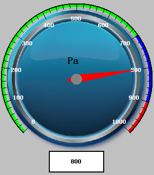

图3.1-6 旋转仪表运行效果图

## 3.2 动画功能组态

### 3.2.1 GIF

当用户需要使用一个现有的动画效果时，可以使用GIF构件加载GIF动画，运行时可以多次显示或者循环显示。下面以加载一个风扇动画为例为大家进行讲解。

>   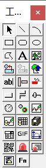  

图 3.2-1 GIF构件属性设置界面

1.  将GIF构件拖拽到画面中合适的位置和合适的大小，双击该构件，打开【GIF构件属性设置】界面。如图3.2-1所示。
2.  点击【添加GIF图片】按钮。如图3.2-1所示。
3.  在弹出的对话框中，选择自定义GIF动画，完成后点击【打开】按钮，添加成功。如图3.2-2所示。
4.  添加GIF动画后，属性设置界面上会出现图片预览，供用户查看效果。

>   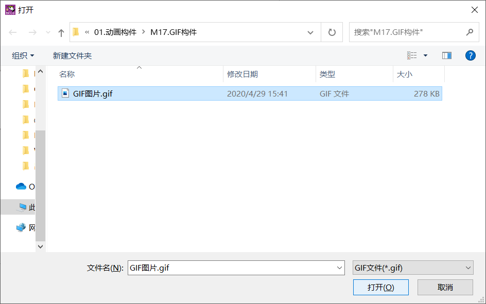 

图 3.2-2 从文件中选择GIF动画及预览效果

1.  在【播放次数】处，可以选择是【默认循环播放】还是【设置播放次数】，设置播放次数的范围是：1\~999999999。本次我们选择默认设置。
2.  点击属性设置界面下方的【确认】按钮后，GIF动画添加成功，效果如图3.2-3所示。

>   

图 3.2-3 GIF动画运行效果

### 3.2.2 闪烁

假设有一个水池的液位高度为10米，当它的液位超过9米时，画面中会弹出一个显示文字【液位高！！】的提示框。并且提示框的背景颜色不断闪烁，而文字也会由右向左移动。下面将为大家进行组态讲解。本节3.2.2至3.2.4使用的是同一个工程。

-   用一个标签构件关联变量【液位值】，当【液位值】≥9时，标签闪烁，当【液位值】\<9时，标签停止闪烁。
1.  首先在实时数据库中新建一个浮点型变量【液位值】，然后拖拽一个【标签】构件到画面中。双击该构件打开【标签动画组态属性设置】界面。
2.  勾选【闪烁效果】前的复选框，点选出现的【闪烁效果】功能页。设置表达式为【液位值\>=9】，选择【闪烁实现方式】为【用图元属性的变化实现闪烁】，将【填充颜色】设置为【黄色】。点击确认保存设置并关闭界面。

>   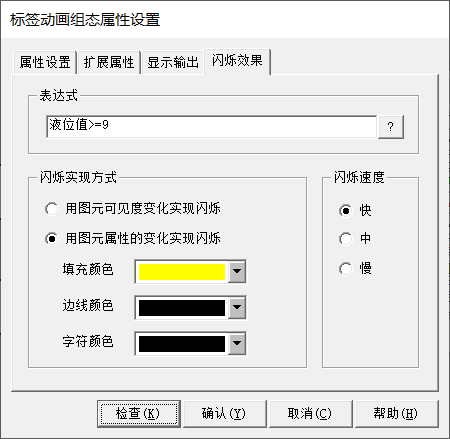 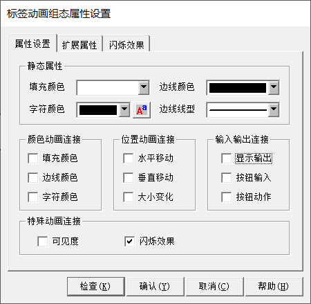

3.2-4 闪烁功能设置流程图

-   设置完标签构件的闪烁效果后，我们还需要设置一个输入框，用它来模拟设置变量【液位值】的值。
1.  将一个【输入框】构件拖拽到画面中合适的位置，双击【输入框】构件，弹出【输入框构件属性设置】界面。
2.  在【操作属性】功能页中关联【对应数据对象的名称】为【液位值】。点击确认关闭界面。

>    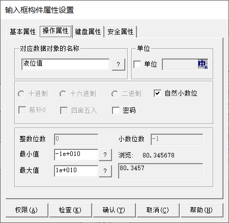

3.2-5 输入框关联变量流程图

-   运行展示

保存工程后，下载工程，然后启动运行。将输入框中的值设置为10，则标签构件的填充颜色在黄色和白色之间来回切换，实现闪烁效果。

>    

3.2-6 闪烁功能运行效果

### 3.2.3 可见度

-   用标签构件显示文字【液位高！！】，当【液位值】\>=9时，标签出现，当【液位值】\<9时，标签消失。
1.  双击3.2.2中的标签构件，弹出【标签动画组态属性设置】界面。
2.  选择【扩展属性】功能页，在【文本内容输入框】中输入文字【液位高！！】
3.  勾选【可见度】前的复选框，点选出现的【可见度】功能页。设置表达式为【液位值】\>=9，选择【当表达式非零时】【构件可见】。

>   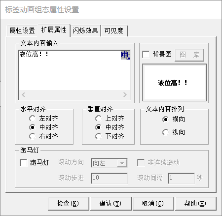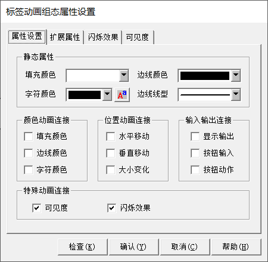 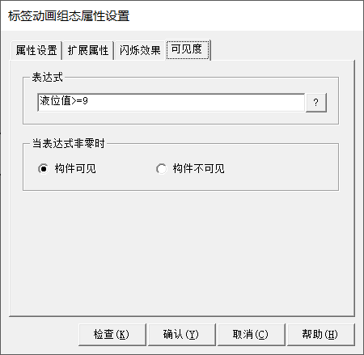

3.2-7 可见度功能设置流程图

-   运行展示

    保存工程后，下载工程，然后启动运行。因为【液位值】的默认初始值是0，所以画面刚开始运行时画面中没有标签构件。将3.2.2中输入框的值设置为10，则标签构件在画面中出现并闪烁。

>     

3.2-8 可见度功能运行效果

### 3.2.4 跑马灯

-   为了使提示内容更醒目，可以给文字设置跑马灯效果，使提示文字滚动显示。

    双击3.2.3中的标签构件，弹出【标签动画组态属性设置】界面。勾选【扩展属性】功能页中【跑马灯】前的复选框，设置【滚动方向】为【向左】，【滚动步进】为【10】。点击确认保存设置并关闭设置界面。

>   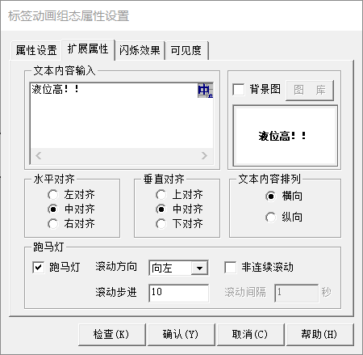

3.2-9 跑马灯功能设置流程图

-   运行展示

    保存工程后，下载工程，然后启动运行。因为【液位值】的默认初始值是0，所以画面刚开始运行时画面中没有标签构件。将3.2.2中输入框的值设置为10，则标签构件在画面中出现并闪烁，且标签构件中的文字【液位高！！】由右向左移动。

>     

3.2-10 跑马灯功能运行效果

## 3.3 多状态显示

### 3.3.1 动画显示

下面以指示灯为例，讲解多状态显示，使用到的构件是【动画显示】构件。

1.  将动画显示构件拖拽到画面合适的位置和合适的大小。双击该构件，打开【动画显示构件属性设置】界面。【基本属性】功能页主要用于增删分段点，并设置各分段点的外形显示和文字属性。

>     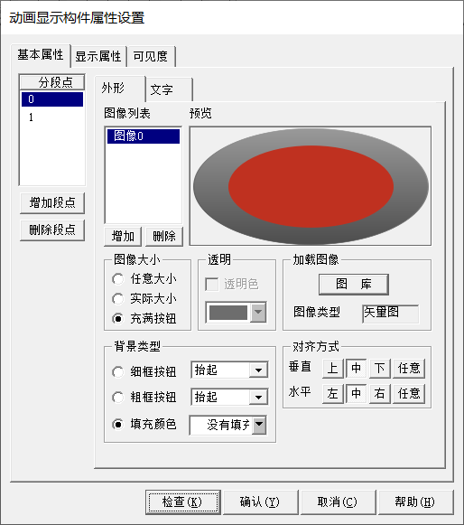 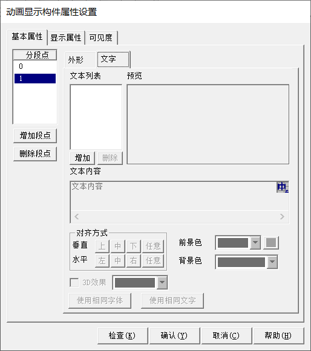

3.3-1 动画显示构件基本属性功能页

**基本属性的配置信息：**

动画显示构件主要用于构件【外形】和【文字】的多状态显示。如图3.3-1所示。构件可根据关联变量的值显示对应分段点的外形和文字；或在条件满足时，按照指定的频率自动切换并显示各分段点的外形和文字，多幅图像和文字的动态切换显示就实现了特定动画效果。

1.  选择【基本属性】功能页中的【分段点0】，在【图像列表】中选中【图像0】，点击右侧的【图库】按钮，弹出【元件图库管理】窗口。

>   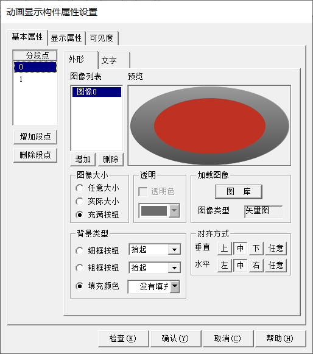 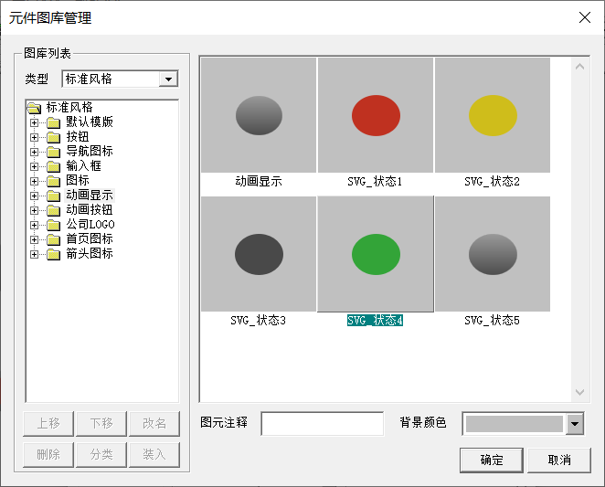

3.3-2 从图库中添加图像

1.  将图库类型选择为【标准风格】，然后选中下方目录中的【动画显示】，再选择右侧绿色圆形图片，最后点击确定关闭窗口。设置完成后【基本属性】功能页如图3.3-3所示。

>   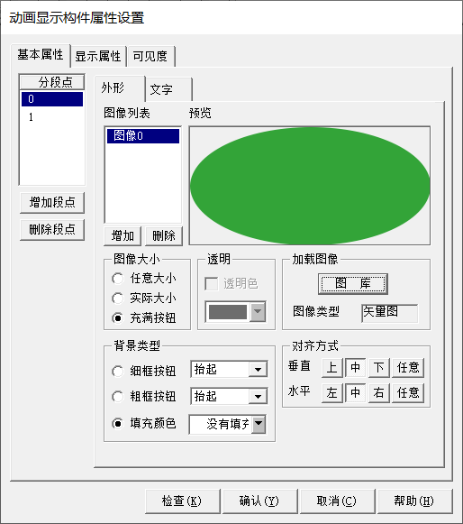 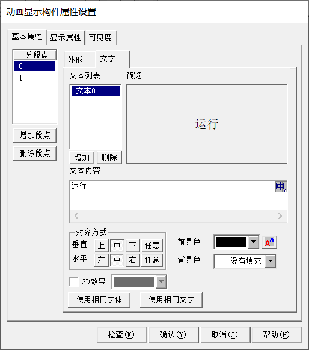

3.3-3 分段点0图像设置界面 3.3-4 分段点0文字设置界面

1.  然后选择【文字】功能页。点击【文本列表】下方的【增加】，【文本列表】中出现一行【文本0】。在下方的【文本内容】输入框中输入【运行】。如图3.3-4所示.
2.  用同样的方法设置【分段点1】的图像为【图库】 → 【标准风格】 → 【动画显示】 → 红色圆形图片，文字为【故障】。
3.  再点击【增加段点】按钮增加一个【分段点2】，设置其图像为【图库】 → 【标准风格】 → 【动画显示】 → 灰色圆形图片，文字为【停止】。注意，新增加的分段点需要额外设置其【图像大小】为【充满按钮】，【填充颜色】为【没有填充】，其效果才会和前两个分段点一致。
4.  设置完成后，在组态状态下，通过工具栏上的【分段点选择】图标可以预览每个分段点的状态。

>     

3.3-5 分段点组态预览效果

1.  在实时数据库中添加整数型变量【设备显示】。
2.  关联【动画显示】构件 → 【显示属性】 → 【显示变量】为变量【设备显示】，类型为【数值显示】。

    **显示属性的配置信息**

    显示属性用于控制动画显示的切换，显示属性页见图3.3-6。

>   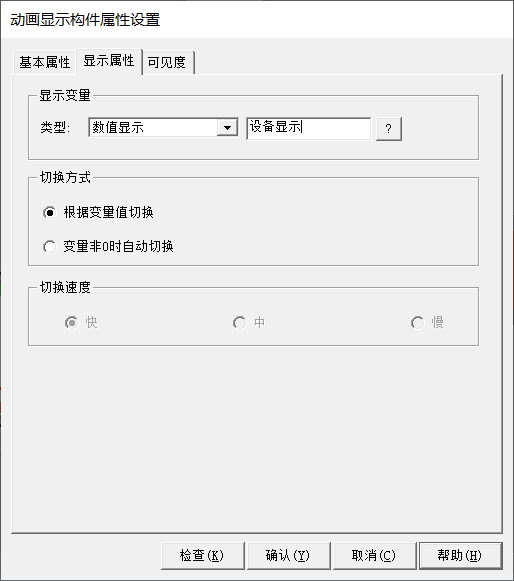

图3.3-6 动画显示显示属性界面

1.  显示变量：动画显示构件通过关联显示变量实现图像的切换显示。显示变量的类型包括：浮点数、整数、整数的位。当显示变量为整数的位时，位的范围只能为0-31，每个位对应的分段点只能为两个。
2.  切换方式：可用两种不同的方法来实现动画显示效果。一种是根据变量值切换，当表达式的值发生变化时，构件用表达式的值来找寻找对应的分段点，如找不到对应的分段点，则构件分段点不会变化。另一种是构件根据变量是否非0，按设定的频率，自动循环显示各分段点的图像和文字。当变量的值为非0时，开始切换显示。当变量的值为0时，停止切换显示。
3.  自动切换显示的速度：当设置切换方式为【变量非0时自动切换】时，在此处设定切换图像的频率。
4.  设置完动画显示构件后，我们还需要组态一个输入框，用它来模拟设置变量【设备显示】的值。
5.  在画面中插入一个输入框构件，关联它的【操作属性】 → 【对应数据对象名称】为变量【设备显示】。
6.  保存工程后，下载工程，然后启动运行。在【输入框】构件中，依次输入0、1、2。可以看到，【动画显示】构件的状态发生相应变化。如图3.3-7所示。

>     

图 3.3-7 动画显示运行效果

### 3.3.2 动画按钮

设备启停控制在实际应用中非常常见，当我们点击按钮后，希望按钮的状态也发生对应的变化。下面就以电机的启停控制为例为大家讲解按钮的多状态控制及显示，使用到的构件是【动画按钮】。

1.  在实时数据库中新建一个整数型变量【设备开关】
2.  【动画按钮】构件的基本属性设置方式同3.3.1【动画显示】构件的基本属性设置方式。本节样例使用默认设置。如图3.3-8至图3.3-9所示。

    **基本属性配置信息**

    动画按钮的【基本属性】主要用于增减分段点的数量和设置每个分段点对应的外观特征，基本属性页中【分段点0】的【外形】及【文字】如图3.3-8所示。

>     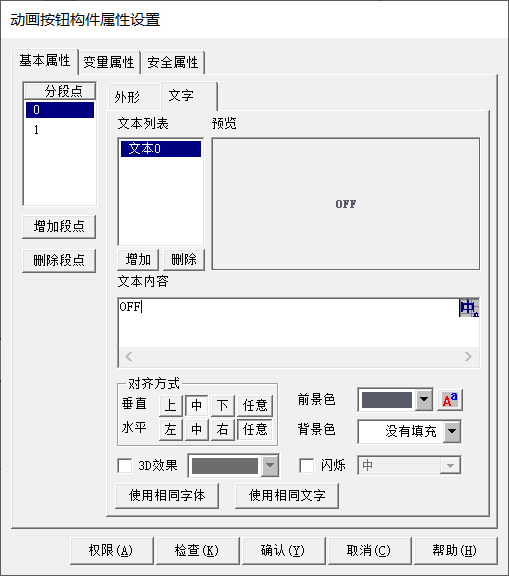

图 3.3-8 分段点0的外形及文字设置

基本属性页【分段点1】的【外形】及【文字】如图3.3-9所示。

>   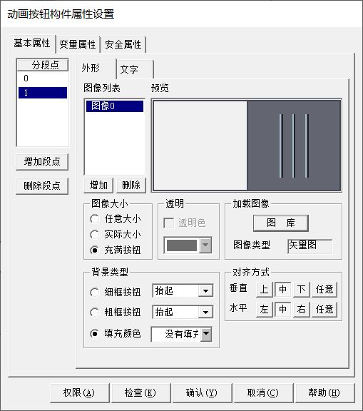 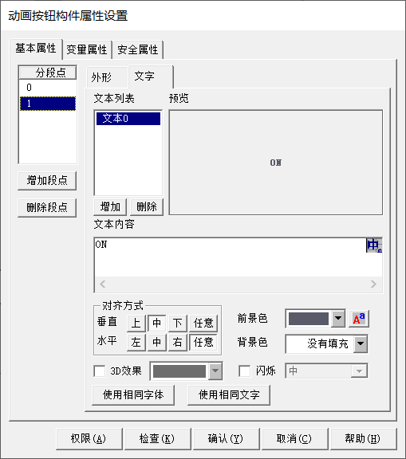

图 3.3-9 分段点1的外形及文字设置

1.  在【变量属性】功能页中勾选【与设置变量使用同一变量】前的复选框
2.  选择【设置变量】的【类型】为【数值操作】
3.  关联【设置变量】为变量【设备开关】
4.  选择【执行操作】为【切换分段点】

>   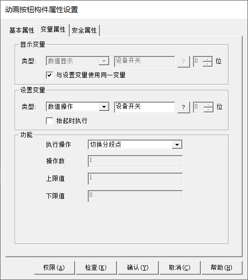

图 3.3-10 动画按钮变量属性界面

**变量属性配置信息**

动画按钮构件可以关联两个变量：【显示变量】和【设置变量】。显示变量和设置变量间没有必然的联系。如果只有显示变量，构件没有按钮动作；如果只有设置变量，构件只有按钮动作，没有变量显示的功能；如果设置变量和显示变量关联同一个变量，构件执行按钮动作的同时改变自身的显示状态。变量属性页如图3.3-11所示。

>   

图3.3-11 动画按钮变量属性界面

1.  显示变量：用于显示构件的段点状态，通过显示变量值的变化使构件可以在多个段点之间进行切换，显示变量类型为：整数、浮点数、整数的位。当显示整数的位时，位的范围为0-31，每一位的分段点只能为两个。
2.  与设置变量使用同一变量：默认设置变量与显示变量为同一个变量，如果需要关联不同变量，需要取消此设置。
3.  设置变量：用于构件执行按钮动作。每按一次动画按钮构件就执行一次操作，设置变量的操作类型为整数、浮点数、整数的位。选择布尔操作和数值操作时，变量类型为整数、浮点数。选择位操作时，变量只能是整数，位的范围为0-31。
4.  抬起时执行：选中后，表示按钮在鼠标抬起时触发变量事件，默认不勾选，表示变量事件在按钮按下时执行，按1松0、按0松1、递加、递减、循环加、循环减、周期加、周期减操作无此选项。
5.  布尔操作的功能：布尔操作包括置1、置0、取反、按1松0、按0松1，执行布尔操作后变量值只能是1或者是0，其中按1松0和按0松1不支持弹框确认安全控制。
6.  位操作的功能：包括置1、置0、取反、按1松0和按0松1。此操作只针对整数数据的位操作，其中按1松0和按0松1不支持弹框确认安全控制。如图3.3-12。

>   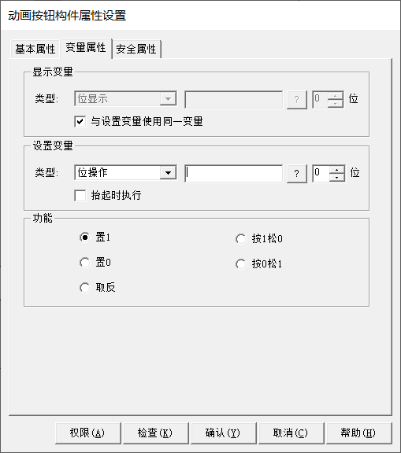

图3.3-12 动画按钮位操作属性

1.  数值操作的功能：数值操作包括切换分段点、设置常量、加、减、递加、递减、循环加、循环减、周期加、周期减功能，其中递加、递减、循环加、循环减、周期加、周期减支持长按操作，但不支持弹窗确认操作。如图3.3-13。

>   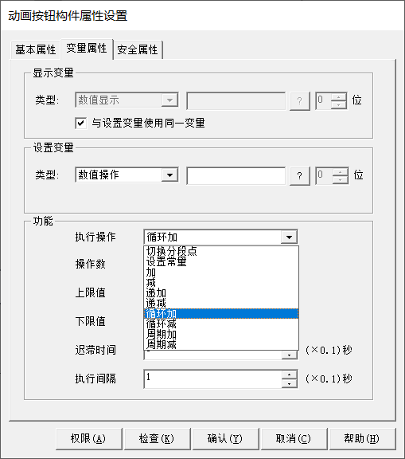

图3.3-13 动画按钮数值操作属性

若在【安全属性】功能页中设置了长按安全确认或弹框确认后，以下几个操作需要在长按安全确认或弹框确认成功后，才执行。

切换分段点：动画按钮执行切换到下一个分段点状态。

设置常量：将设置变量的值变为操作数的值。

加：将设置变量的值加上一个操作数，当结果大于等于上限值时，变量值变为上限值。

减：将设置变量的值减去一个操作数，当结果小于等于下限值时，变量值变为下限值。

迟滞时间：仅当操作为递加、递减、循环加、循环减、周期加、周期减时可用，按钮经过长按安全确认后，再经过此时间才被认为是长按操作。

执行间隔**：**长按操作时，每次操作进行的间隔时间。

递加：经过迟滞时间后长按，每隔一个执行间隔，设置变量会加上一个操作数，当结果大于等于上限值时，变量值变为上限值。

递减：经过迟滞时间后长按，每隔一个执行间隔，设置变量会减去一个操作数，当结果小于等于下限值时，变量值变为下限值。

循环加：经过迟滞时间后长按，每隔一个执行间隔，设置变量会加上一个操作数，当结果大于上限值时，变量值变为上限值，下一次操作变成下限值，再下一次操作继续加上操作数。

循环减：经过迟滞时间后长按，每隔一个执行间隔，设置变量会减去一个操作数，当结果小于下限值时，变量值变为下限值，下一次操作变成上限值，再下一次操作继续减去操作数。

周期加：经过迟滞时间后长按，每隔一个执行间隔，设置变量加上一个操作数，当结果大于上限值时，重置变量为上限值，之后操作变为减去操作数，当结果小于下限值时，重置变量为下限值，之后操作变为加上操作数。

周期减：经过迟滞时间后长按，每隔一个执行间隔，设置变量减去一个操作数，当结果小于下限值时，重置变量为下限值，之后操作变为加上操作数，当结果大于上限值时，重置变量为上限值，之后操作变为减去操作数。

1.  保存工程，下载工程后，点击启动运行。用鼠标单击动画按钮构件，构件会如图3.3-14所示，随动作在两个状态下来回切换。

>    

图3.3-14 动画按钮运行效果

## 3.4 下拉式菜单选择功能

组合框构件可以实现以下拉列表的方式进行数据选择，避免重复性输入。McgsPro的组合框构件包括了2种类型，本节以第二种为例进行讲解：

1.  下拉输入框：既可以选择下拉列表中的项，又可以直接输入列表项；
2.  下拉列表框：只能选择下拉列表中的项。

本节以传送带高中低速调节为例，介绍下拉式菜单选择功能，用到的构件是【组合框】。

1.  在实时数据库中新建一个字符串型变量【速度内容】，一个整型变量【速度序号】。
2.  从【工具箱】中拖拽【组合框】构件到画面中合适的位置和合适的大小。双击该构件，弹出【组合框属性编辑】界面。

>     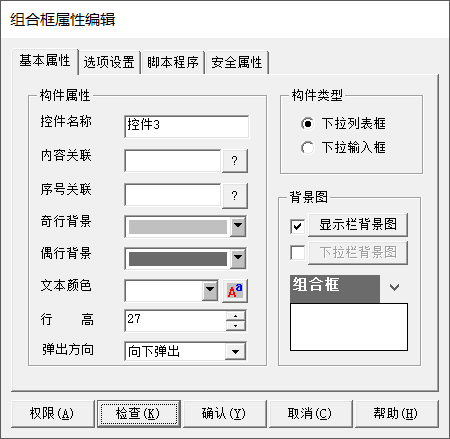

3.4-1 组合框基本属性页面

**基本属性配置信息**

1.  控件名称：设置组合框构件的名称；
2.  内容关联：设置输出到实时数据库变量的名称，可设置整数、浮点数、字符串变量；
3.  序号关联：设置选项ID号关联的实时数据库变量。选择不同下拉选项后，关联变量值相应改变；或者关联变量值改变后，选项随之改变；
4.  奇行背景：设置组合框构件编辑显示部分背景颜色及下拉列表奇行颜色；
5.  偶行背景：设置组合框下拉列表偶行背景颜色；
6.  文本颜色：设置组合框构件编辑显示部分文字颜色；
7.  文本字体：设置组合框构件编辑显示部分和下拉菜单部分文字字体；
8.  行高：设置显示栏和下拉列表行高；
9.  弹出方向：指定运行时下拉列表弹出方向。
10. 构件类型：McgsPro系列产品仅支持下拉列表框和下拉输入框类型。下拉输入框的编辑显示区域可以点击输入，下拉列表框则不能输入，只能通过下拉选项选择。
11. 背景图：显示栏和下拉栏可关联背景图。
12. 在基本属性功能页中的内容关联处关联变量【速度内容】，序号关联处关联变量【速度序号】。如图3.4-2所示。
13. 然后在选项设置功能页选择【静态选项】，删除表中多余的项目行。将序号【00】的项目内容设置为【低速】，序号【01】的项目内容设置为【中速】，序号【02】的项目内容设置为【高速】。如图3.4-3所示。点击确定保存设置并关闭界面。

>   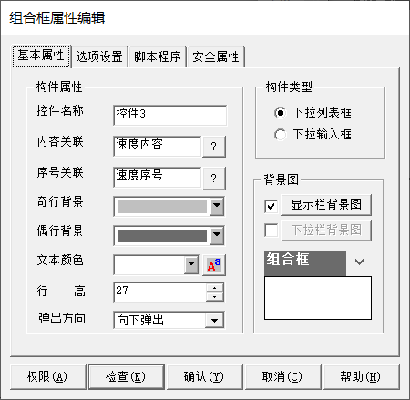 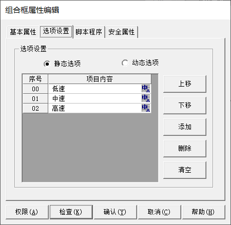

图3.4-2 组合框基本属性界面 图3.4-3 组合框选项设置界面

**选项设置配置信息**

在选项设置栏中每一行配置一个下拉选项，并对应一个序号。选项设置支持多语言，下拉项最多配置8000项。

1.  静态选项：设置下拉列表选项为固定内容；
2.  动态选项：设置下拉列表选项从关联的字符串变量中读取，按“,”“、”“\\r”“\\n”或“\\r\\n”进行分割。

    **脚本程序配置信息**

    脚本程序可以设置组合框构件选项发生变化后，执行组态的脚本程序，如图3.4-4所示。

>   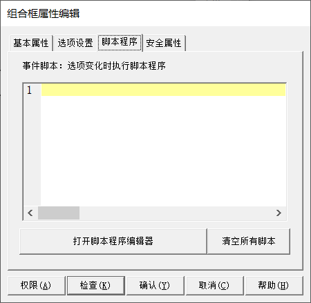

图3.4-4 组合框脚本程序界面

1.  拖拽两个输入框构件到窗口中，其中一个的【操作属性】功能页中的【对应数据对象的名称】关联变量【速度内容】，另一个输入框关联变量【速度序号】。
2.  保存工程后，下载工程，然后启动运行。
3.  点击【组合框】，在下拉菜单中选择【中速】。可以看到，【组合框】的内容由【低速】变成了【中速】，而右侧【输入框】中的内容也发生了对应的变化。直接在【输入框】中输入对应的内容，【组合框】中的内容也会发生对应变化。如图3.4-5所示。

>    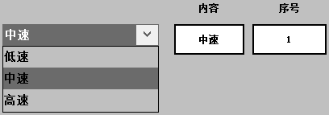

图3.4-5 组合框运行效果

## 3.5 构件或窗口的属性和方法

### 3.5.1 功能概述

构件或用户窗口的属性和方法功能，可以在工程的运行过程中方便灵活的改变构件或用户窗口的属性和状态。如图3.5-1所示，在脚本程序中，使用操作符“.”，可以在脚本程序或使用表达式的地方，调用构件对象相应的属性。例如：窗口0.控件10.Left可以获得构件10的X坐标。

>   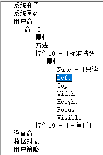

图3.5-1 用户构件属性

### 3.5.2 构件属性

每一个动画构件都有以下基本属性，通过这些基本属性，可以对构件有一个基本的描述和设置。

-   Name：构件名字
-   Left：构件的X坐标
-   Top：构件的Y坐标
-   Width：构件的宽度
-   Height：构件的高度
-   Focus：构件获得焦点
-   Visible：构件的可见度
-   有的构件除了具有公共属性外，还具有自己特有的属性。

如【滑动输入块】构件还具有Value属性。

Value：滑动输入器当前值

### 3.5.3 窗口属性

-   Name：窗口的名字

实 例： ret = 用户窗口.窗口1.Name ，ret = “窗口1”的名字

-   Left：此函数在McgsPro中无效，考虑兼容性问题，故保留
-   Top：此函数在McgsPro中无效，考虑兼容性问题，故保留
-   Width：此函数在McgsPro中无效，考虑兼容性问题，故保留
-   Height：此函数在McgsPro中无效，考虑兼容性问题，故保留
-   Visible：窗口的可见度

实 例： 用户窗口.窗口1.Visible = 1 ，设置“窗口1”的Visible属性值为1，即为可见

ret = 用户窗口.窗口1.Visible，ret = “窗口1”的Visible属性值

注意事项： 在子窗口中无效

-   Caption：此函数在McgsPro中无效，考虑兼容性问题，故保留

### 3.5.4 构件方法

构件方法相当于针对构件的脚本操作函数。构件不具有公共方法，本节以【GIF】构件为例，讲解构件方法的使用。

【GIF】构件具有以下两个方法：

Start( )：开始播放

Stop( )：停止播放

我们使用3.2.1中用GIF加载风扇的样例工程。

1.  组态风扇开始转动按钮：拖拽一个【标准按钮】构件到画面中合适的位置和合适的大小。双击该构件，弹出【标准按钮构件属性设置】界面。将它【基本属性】中的【文本】输入框中的内容修改为【风扇启动】。然后点选【脚本程序】功能页，点击下方的【打开脚本程序编辑器】按钮，弹出【脚本程序】编辑窗口。依次打开右侧对象树中的【用户窗口】 → 【窗口0】 → 【控件0-[GIF[3.31]】-【方法】，双击子目录中的【Start】，则左侧的脚本编辑框中出现一行脚本【窗口0.控件0.Start】。保存脚本后关闭【脚本程序】编辑窗口，点击确认保存修改。

>   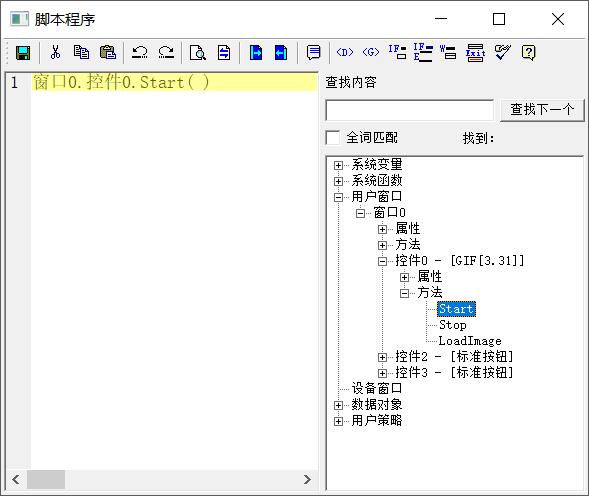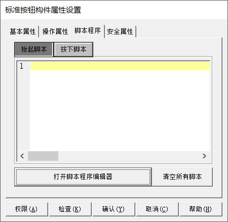

图3.5-2 构件方法设置流程图

1.  组态风扇停止转动按钮：用同样的方法组态一个【标准按钮】构件，使它的显示文本为【风扇停止】，抬起脚本为【窗口0.控件0.Stop( )】。
2.  保存工程后，下载工程，然后启动运行。可以看到，由于风扇的GIF动画选择了【默认循环播放】，画面初始运行时，风扇处于转动状态。而点击【风扇停止】按钮，则风扇停止转动；点击【风扇启动】按钮，风扇又开始转动。

>       

图3.5-3 构件方法功能运行效果图

### 3.5.5 窗口方法

窗口方法的设置与构件方法相同。使用窗口方法时需注意：有的方法函数需要设置参数。

-   Open( )：打开窗口

实 例： 用户窗口.窗口1.Open()，打开窗口名为“窗口1”的窗口

-   Close( )：关闭窗口
-   Hide( )：隐藏窗口
-   Print( )：打印当前窗口

注意事项： 此函数功能暂未实现

-   Refresh( )：刷新当前窗口
-   BringToTop( )：此函数在McgsPro系列产品中无效，考虑兼容性问题，故保留
-   OpenSubWnd(参数1, 参数2, 参数3, 参数4, 参数5, 参数6)：显示子窗口

参 数 值：

参数1，用户窗口名

参数2，整数，打开子窗口相对于本窗口的X坐标iLeft

参数3，整数，打开子窗口相对于本窗口的Y坐标iTop

参数4，整数，打开子窗口的宽度iWidth

参数5，整数，打开子窗口的高度iHeight

参数6，整数，打开子窗口的类型

0位：是否模态模式打开，使用此功能，须通过调用CloseSubWnd或CloseAllSubWnd来关闭此子窗口，子窗口外的构件对鼠标操作不响应

1位：是否菜单模式打开，使用此功能，一旦在子窗口之外鼠标按下，则子窗口关闭

2位：是否显示水平滚动条，使用此功能，可以显示水平滚动条（不支持）

3位：是否垂直显示滚动条，使用此功能，可以显示垂直滚动条（不支持）

4位：是否显示边框，选择此功能，在子窗口周围显示细黑线边框

5位：是否自动跟踪显示子窗口，选择此功能，在当前鼠标位置上显示子窗口。选用此功能则忽略iLeft,iTop的值。如果鼠标在系统窗口内部且当前鼠标位置下无法完整的显示子窗口，则子窗口会自动调整位置使其显示完整。同理当鼠标在系统窗口外部时，子窗口也会自动调整位置显示在窗口内部并显示完整。

6位：是否自动调整子窗口的宽度和高度为缺省值，使用此功能则忽略iWidth和iHeight的值

实例：

（1）!OpenSubWnd(窗口1,0,0,400,240,1)在位置（0,0）打开大小为400\*240，子窗口名为“窗口1”的模态子窗口

（2）!OpenSubWnd(窗口1,0,0,400,240,2)在位置（0,0）打开大小为400\*240，子窗口名为“窗口1”的菜单子窗口

（3）!OpenSubWnd(窗口1,0,0,400,240,34)在位置（0,0）打开大小为400\*240，子窗口名为“窗口1”的菜单子窗口，并自动跟随鼠标显示

-   CloseSubWnd(参数1)：关闭子窗口

参 数 值： 参数1，子窗口的名字

实 例： 用户窗口.窗口1.CloseSubWnd(窗口2),关闭窗口名为“窗口2”的子窗口

-   CloseAllSubWnd( )：关闭当前标准窗口中的所有子窗口

实 例： 用户窗口.窗口1.CloseAllSubWnd( )，关闭当前标准窗口的所有子窗口

## 3.6 构件或窗口的事件

### 3.6.1 功能概述

事件就是当用户在对构件或在窗口中进行某些操作时，该构件或用户窗口会根据用户不同的操作进行相应的处理。例如当用户在窗口中用鼠标单击窗口时，就会触发用户窗口的Click事件，同时执行在Click事件中定义的一系列操作。

事件是所有构件都具备的公共特性。

### 3.6.2 构件事件

在对动画构件进行右键操作时，在弹出的右键菜单中点击【事件】选项，打开事件组态窗口，如图3.6-1所示。

>   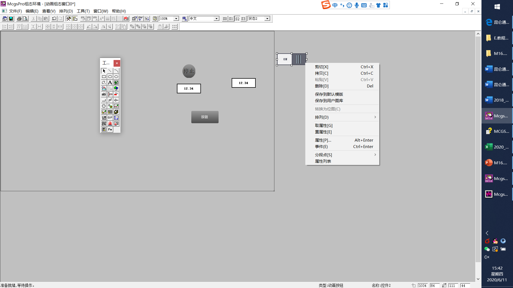 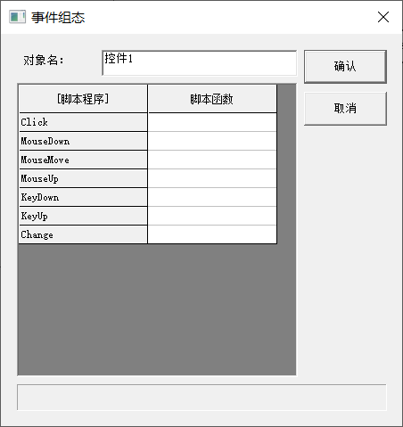

图3.6-1 事件组态界面

双击某一个事件，即可进入相应的组态画面，对该事件进行设置。

-   Click-鼠标单击，见图3.6-2，点击【事件连接脚本】按钮，将出现【脚本程序】编辑器，可以编辑鼠标单击所要连接的脚本。

>   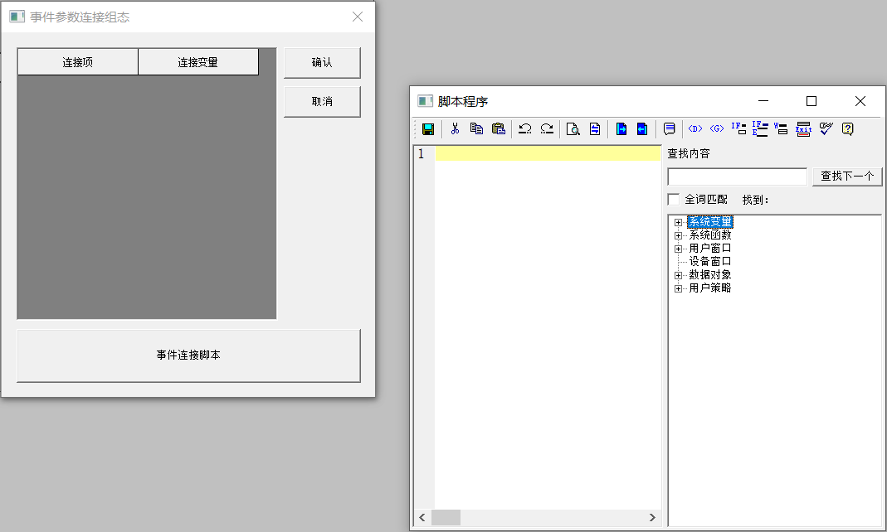

图3.6-2 Click事件参数连接组态对话框

-   MouseDown-鼠标按下，见图3.6-3。鼠标按下事件具有四个参数：

参 数1： 鼠标按下时的鼠标按键信息

= 1时，表示左键按下

= 2时，表示右键按下

= 4时，表示中键按下

参 数2：鼠标按下时的键盘信息

= 1时，表示Shift键按下

= 2时，表示Ctrl键按下

= 4时，表示Alt键按下

参 数3： 鼠标按下时的X坐标

参 数4： 鼠标按下时的Y坐标

>   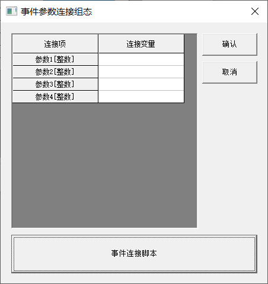 

图3.6-3 MouseDown事件参数连接组态对话框图 3.6-4 MouseMove事件参数连接组态对话框

-   MouseMove-鼠标移动，见图3.6-4。鼠标移动事件具有四个参数：

参 数1： 鼠标按下时的鼠标按键信息

= 1时，表示左键按下

= 2时，表示右键按下

= 4时，表示中键按下

参 数2： 鼠标按下时的键盘信息

= 1时，表示Shift键按下

= 2时，表示Ctrl键按下

= 4时,表示Alt键按下

参 数3： 鼠标的X坐标

参 数4： 鼠标的Y坐标

-   MouseUp-鼠标抬起，见图3.6-5。鼠标抬起事件具有四个参数：

参 数1： 鼠标按下时的鼠标按键信息

= 1时，表示左键按下

= 2时，表示右键按下

= 4时，表示中键按下

参 数2： 鼠标按下时的键盘信息

= 1时,表示Shift键按下

= 2时,表示Ctrl键按下

= 4时,表示Alt键按下

参 数3： 鼠标抬起时的X坐标

参 数4： 鼠标抬起时的Y坐标

>    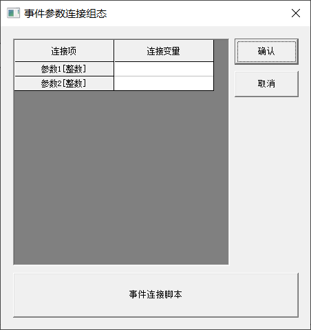

图3.6-5 MouseUp事件参数连接组态对话框图 3.6-6 KeyDown事件参数连接组态对话框

-   KeyDown-按下按键，见图3.6-6。按键按下事件具有两个参数：

参 数1：整数，按下按键的AscII码

参 数2：整数，0\~7位是按键的扫描码，目前按键的扫描码恒为0。

-   KeyUp-按键抬起，见图3.6-7。按键抬起事件具有两个参数：

参 数1： 整数，按下按键的AscII码

参 数2： 整数，0\~7位是按键的扫描码，目前按键的扫描码恒为0。

>    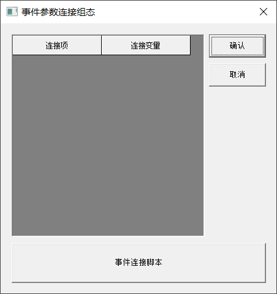

图3.6-7 KeyUp事件参数连接组态对话框 图3.6-8 Change事件参数连接组态对话框

-   有的构件除了具有公共事件外，还具有自己特有的事件。

如【输入框】构件还具有【Change】事件。见图3.6-8。

Change

事件意义： 当输入框内容改变时触发。

注意事项： 只有通过键盘输入操作改变输入框内容才会触发

### 3.6.3 窗口事件

除了构件，McgsPro的用户窗口也包括事件：

>   

图3.6-9 窗口事件对话框

窗口事件中的【Click】【MouseDown】【MouseMove】【MouseUp】【KeyDown】【KeyUp】事件请参考3.6.2 构件事件。

下面，进行窗口特有事件的介绍。

-   Load：窗口装载时触发。
-   Unload：窗口关闭时触发。
-   Resize：无实际意义，预留功能。

### 3.6.4 样例演示

组态工程实现：当鼠标移动到主界面按钮上时，按钮左侧的箭头高亮显示；当鼠标从主界面按钮上移开后，按钮左侧的箭头变暗。

1.  在实时数据库中新建一个整数型变量【主界面高亮】
2.  在画面中用【常用符号】中的【等腰三角形】画一个细长的等腰三角形当作箭头。然后选中该等腰三角形，点击工具栏中的【右旋90度】按钮将它顺时针旋转90，如图3.6-10所示。

>   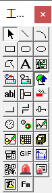 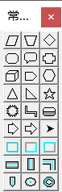  

图3.6-10 三角形组态流程图

1.  拖拽一个【标准按钮】构件到箭头的右侧，将按钮【基本属性】中的文本修改为【主界面】。然后用鼠标同时选中按钮和三角形，点击工具栏上的【纵向对中】按钮使它们对齐。

>    

图3.6-11 对齐按钮和三角形

1.  双击三角形，弹出【动画组态属性设置】界面，勾选【填充颜色】前的复选框，点击出现的【填充颜色】功能页。将【表达式】关联变量【主界面高亮】，将下方【分段点0】的对应颜色设置为【灰色】，【分段点1】的对应颜色设置为【黄色】。点击确认关闭组态界面。

>   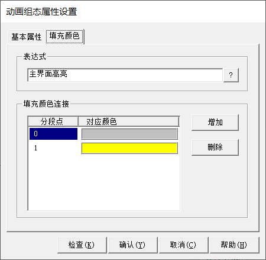

图3.6-12 组态三角形填充颜色

1.  组态【按钮】构件【事件】脚本：右击按钮，在弹出的菜单中选择【事件】，弹出【事件组态】窗口。双击【MouseMove】行，弹出【事件参数连接组态】窗口。点击下方的【事件连接脚本】按钮，弹出【脚本程序】编辑窗口。在右侧的对象树中，点击【数据对象】，在子目录中双击出现的【主界面高亮】，则变量【主界面高亮】出现在左侧的脚本编辑框中。在第一行脚本中的变量【主界面高亮】后，紧跟着输入脚本“=1”。输入完成后，点击保存，并关闭【脚本程序】编辑窗口，然后连着点击两次确认按钮，关闭并保存刚才所做的修改。

>   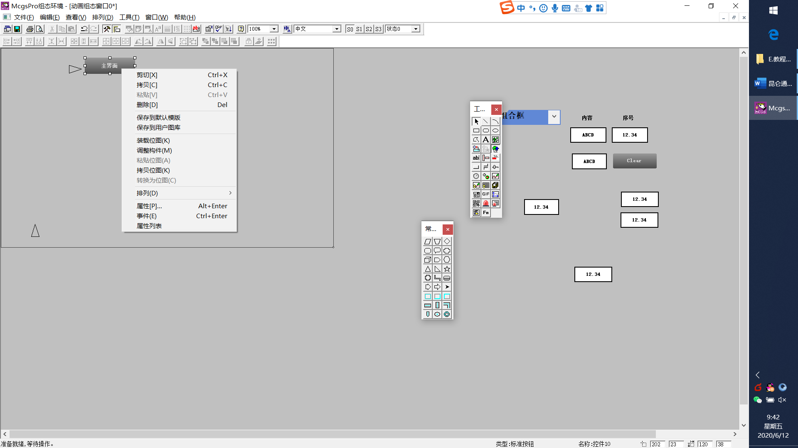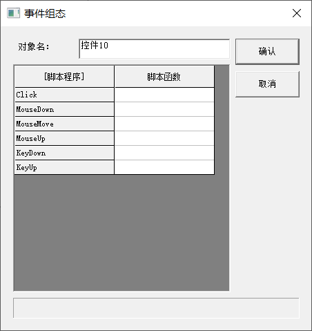 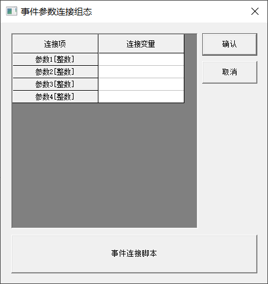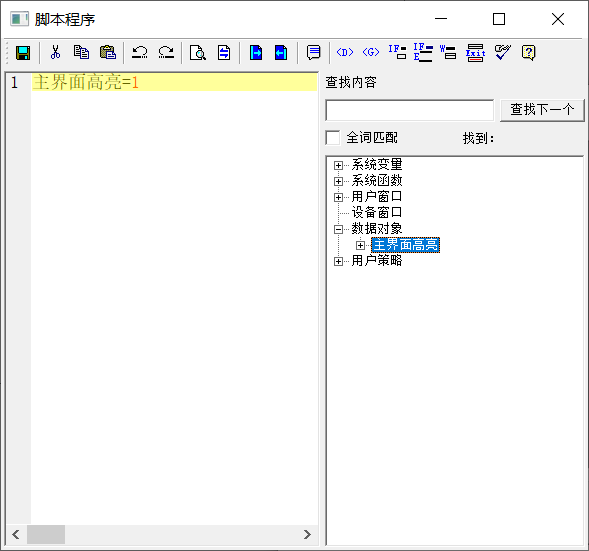

图3.6-13 组态按钮构件事件脚本流程图

1.  组态【窗口事件】脚本：在窗口的空白处右击，在弹出的菜单中选择【事件】。用组态【按钮】构件【事件】脚本同样的方法组态【窗口事件】脚本，将脚本写为“主界面高亮=0”。

>   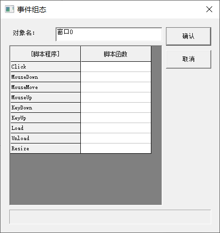 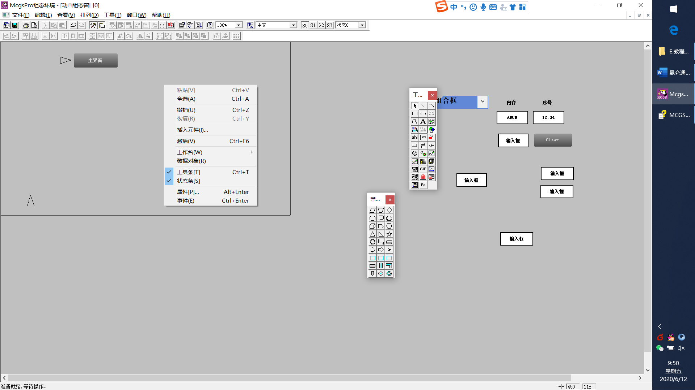 

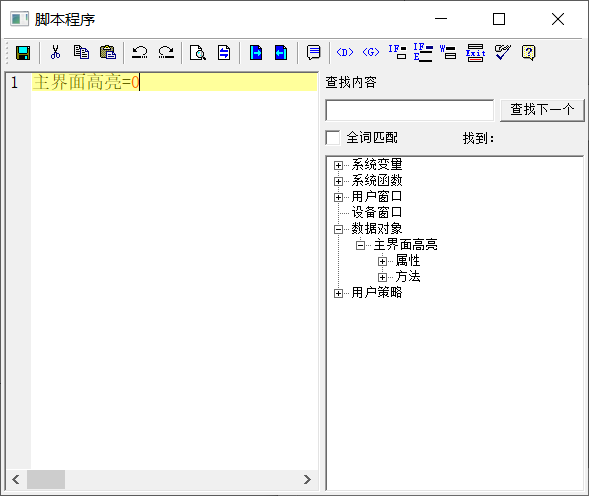

图3.6-14 组态窗口事件脚本流程图

### 3.6.5 运行展示

保存工程后，下载工程，然后启动运行。

可以看到，当我们将鼠标移动到窗口空白处时，三角形箭头呈灰色；当我们将鼠标移动到按钮上时，三角形箭头呈黄色；从按钮上上移开鼠标后，三角形又变成了灰色。

>     

图3.6-15 事件功能运行效果图

# 

# 第4章 报警功能应用实例

McgsPro组态软件提供实时报警和历史报警功能，通过组态报警功能，用户可以更好地掌握现场设备运行情况，保证产品生产安全。

## 4.1 报警功能介绍

首先介绍McgsPro组态软件报警实现流程：从PLC等外部设备读取的数据传送给实时数据库中对应的数据对象，在用户窗口显示对应数据对象（即变量）的值，也就是显示了当前PLC中的值；用户只需要判断实时数据库中数据对象的值是否满足报警的条件，如果满足即产生报警；报警流程如图4.1-1所示：

>   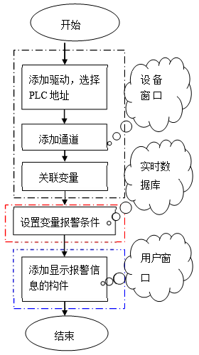 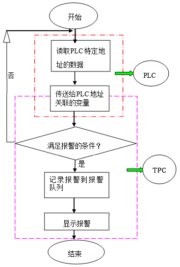

报警组态配置 工程运行时数据流程

图4.1-1 报警流程

图4.1-1是实现报警功能的组态流程，首先要确定所用的硬件设备，例如PLC型号，在McgsPro组态软件的设备窗口添加正确的驱动构件，添加PLC通道地址，并且在通道中关联变量 → 进入实时数据库中设置报警属性 → 在用户窗口用报警构件显示报警信息。如图4.1-2所示，McgsPro组态软件提供了报警条构件（只支持实时报警），报警浏览构件（支持实时和历史报警），显示报警信息。

>   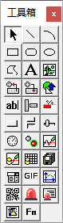

图4.1-2 支持报警显示的构件

## 4.2 实时报警组态

重启TPC后，实时报警信息会被清空，实时报警组态流程如下：

现场用户可能需要实时对下位机数据进行监控，并显示其报警信息，我们通过一个样例来学习报警的各种表现形式。以S7-200PLC为例，图4.1-3是该样例的运行效果。

>   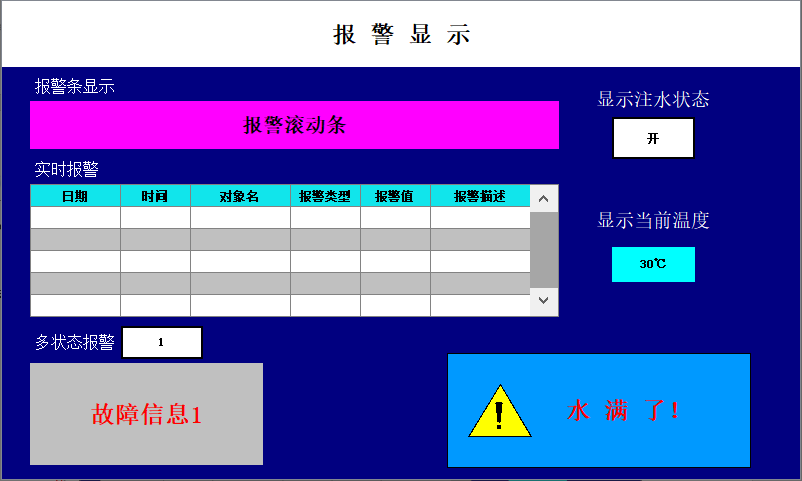

图4.1-3 报警运行效果图

**图4.1-3显示了常用的四种基本报警形式：**

a . 位报警：当 PLC的地址M12.3状态为 1 时提示水满了，此报警信息通过“报警条构件”在屏幕上滚动显示。

b . 上下限报警：当PLC“V 寄存器”的字地址49的值超过10\~30的范围，提示温度太高或太低，通过“报警浏览构件”以列表显示。

c . 多状态报警：当 PLC“V 寄存器”的字地址200值非0时表示不同的故障，在画面上显示异常报警信息.

各种故障信息如下:

V200的值 含义

0 正常

1 故障信息1

2 故障信息2

3 故障信息3

4 故障信息4

d . 报警弹窗：当“M 寄存器”的地址12.3发生报警后立即弹出一个子窗口，显示当前报警信息。

### 4.2.1 位报警组态

图4.1-3报警形式“a”：PLC地址 M12.3 的值为“1”时提示“水满了”，并且滚动显示。

方案：地址M12.3报警内容固定，直接设置对应变量的报警属性，然后在用户窗口用报警条构件（走马灯）显示。

1.  添加位通道：在设备窗口，双击“西门子_S7200PPI”驱动进入“设备编辑窗口”。如图4.2-1所示，先通过 “删除设备通道”按钮，删除默认的通道；再点击“增加设备通道”按钮，弹出“添加设备通道”对话框，选择通道类型“M 寄存器”，数据类型“通道的第03位”，通道地址为“12”，通道个数为“1”，读写方式选择“读写”。设置完成点击“确认”。可以看到设备编辑窗口增加通道成功。

>   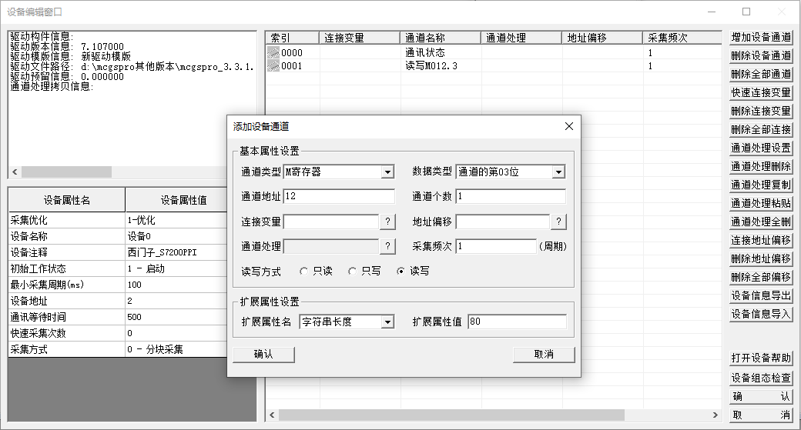

图4.2-1 增加设备通道M012.3

1.  通道关联变量：如图4.2-2所示，点击“快速连接变量”→“默认设备变量连接” →“确认”。自动生成变量名“设备0_读写 M012_3”。在设备编辑窗口点击“确认”，最后在系统弹出“添加数据对象”的提示框，选择“全部添加”，McgsPro自动在“实时数据库”添加整数变量“设备0_读写 M012_3”。

>   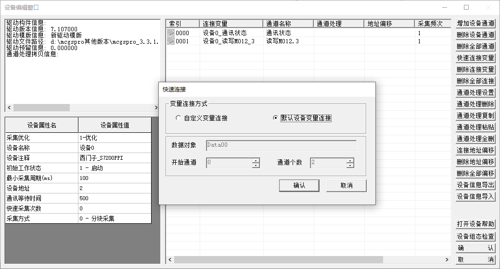

图4.2-2 连接变量

1.  进入实时数据库，如图4.2-3所示，双击整数变量“设备0_读写M012_3”→“报警属性”→ 表格空白处右键 → 追加，在修改报警属性设置对话框中，报警类型选择“开关量”，报警值“1”，报警描述为“水满了”，设置完成点击“确认”。

>   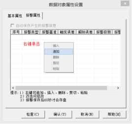 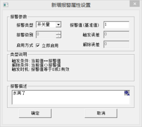

进入报警属性设置 设置开关量报警

图4.2-3 设置开关量报警

**注意：只有变量类型为“整数”，才支持选择“开光量”报警类型。**

1.  设置报警条构件：在用户窗口中新建“窗口0”，双击进入“窗口0”组态界面，点击工具箱中的  ，绘制报警条构件，双击绘制的报警条构件 →“报警条属性设置”，“报警对象”不关联对象（**“报警对象”位置不关联任何数据对象时，该报警条将显示实时数据库中所有变量产生的实时报警信息**），按照需要设置其外观显示、滚动设置如图 4.2-4 所示：（“显示格式”可设置报警信息的显示内容）

>   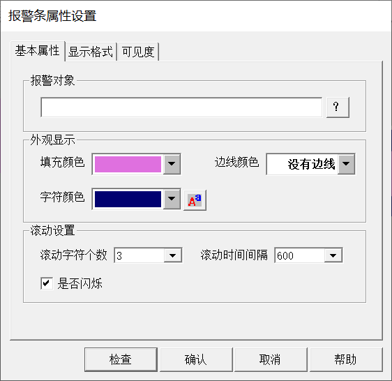

图4.2-4 报警条设置

1.  显示数据：在工具箱点击  添加一个“标签”，双击标签勾选显示输出。在显示输出属性页，点击  选择变量“设备0_读写 M012_3”，以开关量输出。另外添加一个“标签”，输入“显示注水状态”。参照图4.2-5中效果设置标签颜色和字体颜色。
2.  查看效果：组态完成后，连接PLC，下载工程运行查看效果：当PLC有报警产生时（变量“设备0_读写 M012_3”的值等于图4.2-3设置的报警值)，报警信息显示如图4.2-5所示：

>   

图4.2-5 报警条显示报警信息

### 4.2.2 上下限报警

图4.1-3报警形式“b”：PLC中“V寄存器”地址49的值超出10\~30的范围时，以列表形式报警显示温度太高或太低。

方案：设置“V 寄存器”地址49对应变量的报警属性，在用户窗口用报警浏览构件显示。

1.  添加字通道：在设备窗口，双击“西门子_S7200PPI”驱动进入“设备编辑”窗口。如图4.2-6所示，单击“增加设备通道”按钮，进入“添加设备通道”对话框，选择通道类型为“V寄存器”，数据类型为“16位无符号二进制”，通道地址为“49”，通道个数为“1”，读写方式为“读写”。设置完成后点击“确认”按钮。

>   

图4.2-6 增加设备通道：VWUB049

1.  通道关联变量：如图4.2-7所示，点击“快速连接变量”→“默认设备变量连接”→“确认”。自动生成变量名“设备0_读写VWUB049”。在设备编辑窗口点击“确认”，最后在系统弹出“添加数据对象”的提示框，选择“全部添加”，McgsPro自动在“实时数据库”添加浮点数变量“设备0_读写VWUB049”。

>   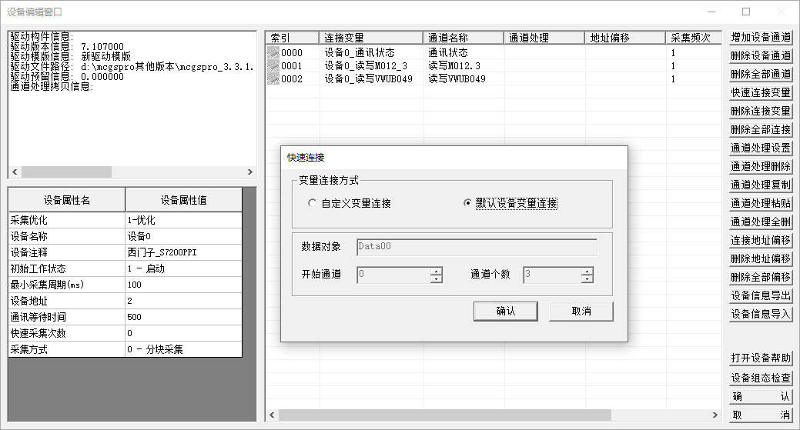

图4.2-7 连接变量

1.  进入实时数据库，双击浮点数变量“设备0_读写VWUB049”→“报警属性”→ 表格空白处右键 → 追加，在修改报警属性设置对话框中，报警类型选择“上限”，设置报警值为“30”，报警描述为“温度太高了”，设置完成点击“确认”；按照同样的方式，追加“下限”报警，并设置报警值和报警描述，如图4.2-8所示**：**

>   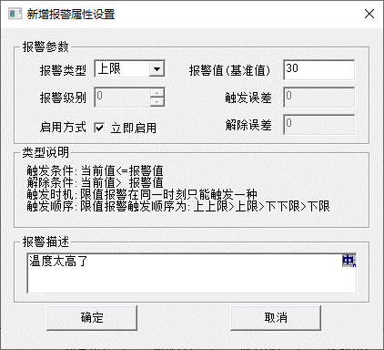 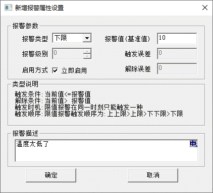

设置上限报警 设置下限报警

图4.2-8设置上下限报警

**注意：只有变量类型为“浮点数”，才支持选择“上限”和“下限”报警类型。**

1.  设置报警浏览构件：进入“窗口0”组态画面，点击工具箱中的图标 ，在“窗口0”中绘制报警浏览构件，再双击绘制的报警浏览构件，进入“报警浏览构件属性设置”对话框。
2.  如图4.2-9所示：在数据来源页，数据类型选择“实时报警数据”，报警对象留空（ **“报警对象”不关联任何对象时，该报警浏览构件将显示实时数据库中所有变量产生的报警信息**）。
3.  如图4.2-10所示：在显示属性页，按照需要勾选显示内容：“日期”、“时间”、“对象名”、“报警类型”、“报警值”、“报警描述”，并设置合适的列宽；其他功能页用户根据自己的需要进行设置。设置完成点击“确认”。

>   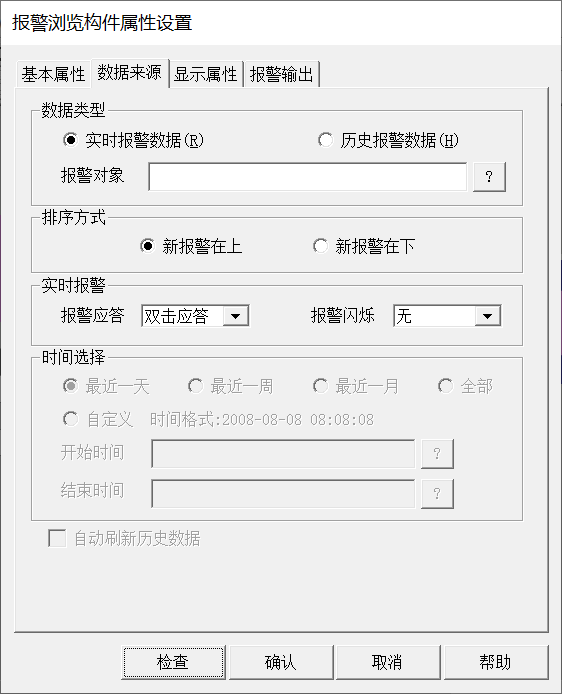 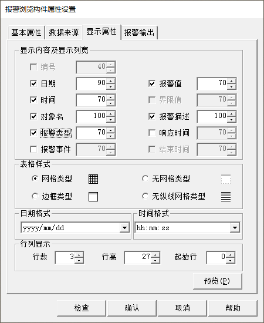

图4.2-9 数据来源设置 图4.2-10 显示属性设置

1.  显示数据：在工具箱点击  添加一个“标签”，双击标签勾选显示输出。在显示输出属性页，点击  选择变量“设备0_读写 VWUB049”，以数值量输出。另外添加一个“标签”，输入“显示当前温度”。参照图4.2-11效果设置标签颜色和字体颜色。
2.  查看效果：组态完成后，连接PLC，下载工程运行查看效果：当PLC有报警产生时（变量“设备0_读写 VWUB049”的值超出图4.2-8设置的范围)，报警信息显示如图4.2-11所示：

>   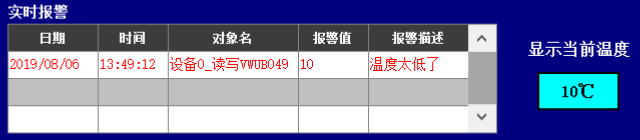

图4.2-11 报警浏览显示报警信息

### 4.2.3 多状态报警

图4.1-3报警形式“c”：PLC中“V寄存器”地址200输出的值不同时，提示不同的故障信息。

方案：采用数值报警，用“值==”的报警类型实现当“V寄存器”地址200输出的值不同时，提示对应的故障信息。

1.  添加字通道：在设备窗口，双击“西门子_S7200PPI”驱动进入“设备编辑”窗口。如图4.2-12所示，单击“增加设备通道”按钮，进入“添加设备通道”对话框，选择通道类型为“V寄存器”，数据类型为“16位无符号二进制”，通道地址为“200”，通道个数为“1”，读写方式为“读写”。设置完成后点击“确认”按钮。

>   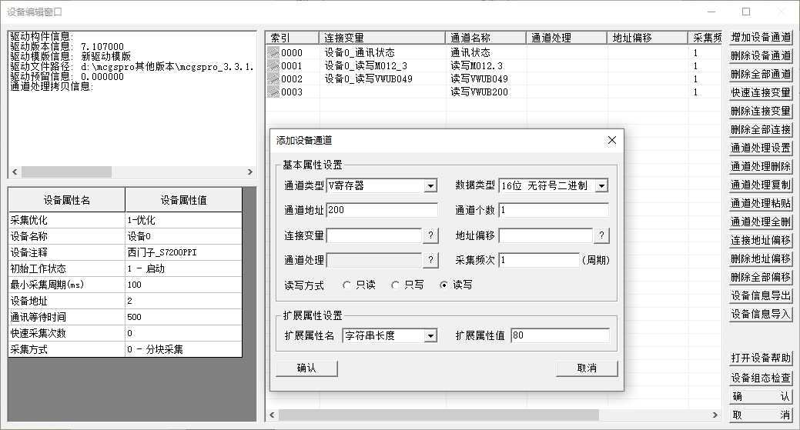

图4.2-12 增加设备通道：VWUB200

1.  通道关联变量：如图4.2-13所示，点击“快速连接变量”→“默认设备变量连接”→“确认”。自动生成变量名“ 设备0_读写VWUB200”。在设备编辑窗口点击“确认”，最后在系统弹出“添加数据对象”的提示框，选择“全部添加”，McgsPro自动在“实时数据库”添加浮点数变量“设备0_读写VWUB200”。

>   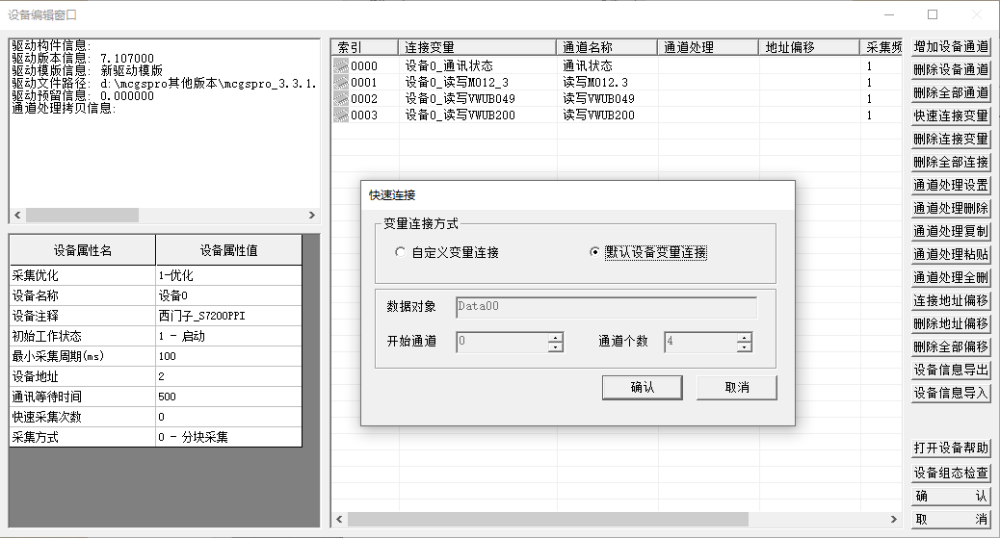

图4.2-13 连接变量

1.  进入实时数据库，如图4.2-14所示，双击浮点数变量“设备0_读写VWUB200”→“报警属性”→ 表格空白处右键 → 追加，报警类型选择“值==”。按照进阶篇章节4.2.2的方式追加报警，效果如图4.2-15所示：

>    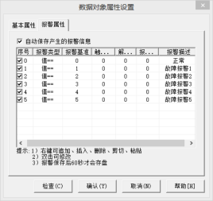

图4.2-14 追加报警 图4.2-15 效果展示

1.  设置报警浏览构件和显示数据：参见进阶篇章节4.2.2的方式设置报警浏览构件和显示数据，组态完成后，连接PLC，下载运行查看效果，当PLC有报警产生时，报警信息显示如图4.2-16所示：

>   

图4.2-16多状态报警信息显示

### 4.2.4 报警弹窗

图4.1-3报警形式“d”：当“M 寄存器”的地址12.3发生报警后立即弹出一个子窗口，显示当前报警信息。

方案：用子窗口弹出来实现，运用报警策略来及时判断报警是否发生，并设置子窗口显示的大小和坐标。

1.  添加子窗口：在工作台界面切换到用户窗口，新建“窗口1”。
2.  设置显示信息：双击进入“窗口1”组态画面，如图4.2-17所示，通过“插入元件”，在对象元件库插入“标志24”。

>    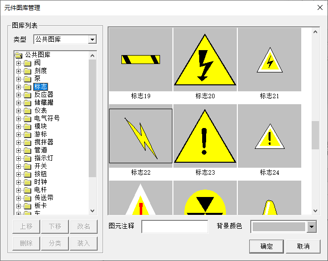

图4.2-17 插入警示标志

1.  再添加一个“标签”，设置文本内容为“水满了！”，调整标签构件的背景颜色，然后把这两个构件放到“窗口1”左上角合适的位置，效果如图4.2-18所示：

>   

图4.2-18 报警窗口信息

1.  设置窗口1弹出方式：如图4.2-19所示,在“窗口1”组态画面空白处双击，进入“子窗口属性”，勾选“作为子窗口”使用，并设置子窗口弹出位置和大小，设置完成后点击“确认”.

>   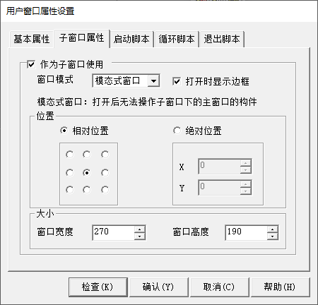

图4.2-19 子窗口弹出设置

1.  组态窗口弹出功能：在工作台界面切换到“运行策略”，点击“新建策略”按钮，在“选择策略的类型”对话框中选择“报警策略”，确定后回到运行策略窗口，双击新建的报警策略进入策略组态窗口，在策略组态窗口空白处点击鼠标右键 →“新增策略行”，如图4-2-20所示

>   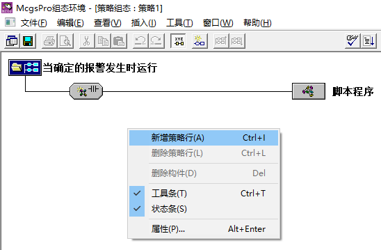

图4.2-20 新增策略行

1.  设置策略执行方式：双击上图中的进入“策略属性设置”对话框，数据对象关联“设备0_读写M012_3”，执行条件选择“报警产生时，执行一次”，如图4.2-21所示:

>   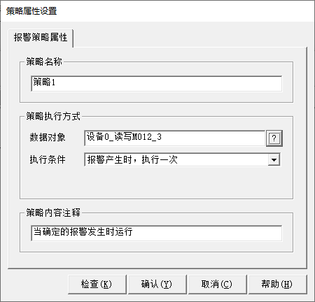

图4.2-21 策略执行方式

1.  添加窗口1打开脚本：如图4.2-22所示，进入“脚本程序”编辑框 → 右侧对象树 → 用户窗口 → 窗口1 → 方法 → 双击“open”，将窗口1打开脚本添加到左侧的脚本程序编辑框，添加完成后检查并保存。

>   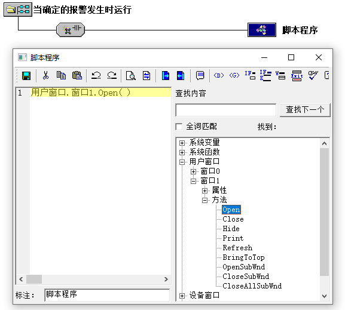

图4.2-22 添加窗口1打开脚本

1.  采用同样的方式再次新建一个报警策略，数据对象关联“设备0_读写M012_3”，执行条件选择“报警结束时，执行一次”，脚本程序为“用户窗口.窗口1.Close()”。
2.  效果演示：组态完成后，连接PLC，当“M寄存器”的地址12.3发生报警时，在就会在当前的用户窗口中，以子窗口打开“窗口1”；报警结束则会自动关闭“窗口1”。

## 4.3 历史报警功能

### 4.3.1 历史报警组态

现场用户如需要保存报警记录，要求即使重启TPC，仍然可以进行查看。对于该情况，工程组态人员可以在组态时保存产生的报警信息，并通过报警浏览构件显示历史报警。

**保存历史报警信息操作方法如下：**

1.  在“实时数据库”双击需要保持历史报警记录的变量，进入“报警属性”设置界面（参考进阶篇章节4.2.1）。如图4.3-1所示，在“追加”报警内容后，勾选“自动保存产生的报警信息”。

>   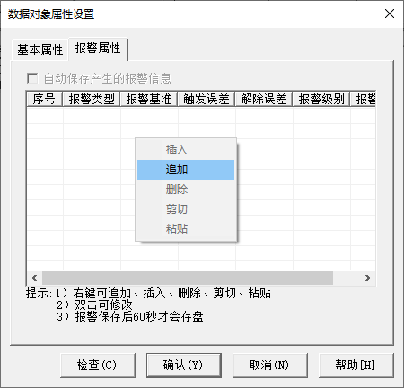 

图 4.3-1 报警属性设置界面 图4.3-2 报警浏览构件

1.  双击进入“窗口0”组态画面，如图4.3-2所示，在工具箱中选择“报警浏览”构件，并绘制。
2.  双击绘制的“报警浏览构件”， 如图4.3-3所示：在数据来源页，数据类型选择“历史报警数据”，报警对象留空（“**报警对象”不关联任何对象时，该报警浏览构件将显示实时数据库中，所有勾选了“自动保存产生的报警信息”变量的历史报警数据）。**
3.  如图4.3-4所示：在显示属性页，按照需要勾选显示内容：“编号”、“日期”、“时间”、“对象名”、 “报警值”、“报警描述”，并设置合适的列宽；其他功能页用户根据自己的需要进行设置。设置完成点击“确认”。

>   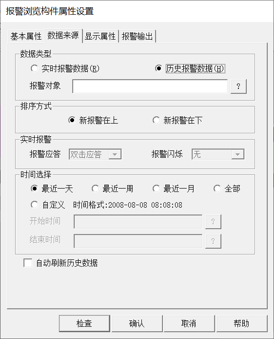 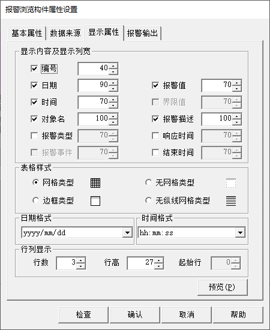

图4.3-3 数据来源设置 4.3-4 显示属性设置

1.  完成上述步骤后，即可运行工程，当变量“设备0_读写M012_3”产生报警后，TPC将在步骤3添加到报警浏览构件中显示自动保存产生的报警信息。

### 4.3.2 历史报警删除

McgsPro提供三种方法删除历史报警数据：

-   方法1：下载工程时，在下载配置界面删除历史报警数据，如图4.3-5。

>   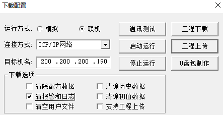

图4.3-5 下载工程删除历史报警

-   方法2：工程运行时，历史报警数据存储达到1M时，自动删除最老的20%数据。
-   方法3：工程运行时，通过执行事先组态的函数“!ClearHistoryAlarmData()”，清空所有历史报警数据。

    !ClearHistoryAlarmData()：删除所有的历史报警数据

### 4.3.3 历史报警导出

用户可在工程运行时，执行事先组态的函数“ExportHisDataToCSV”，将触摸屏中记录的历史报警数据以CSV格式导出到触摸屏的用户文件区或者U盘中，用户可在电脑端使用EXCEL打开导出的历史报警数据。

使用函数“ExportHisDataToCSV”导出触摸屏中的历史报警数据方法，可参考进阶篇章节5.2.4。

注意：使用函数“ExportHisDataToCSV”导出历史报警数据，组对象名称必须填写“**Mcgs_HistoryAlarm**”

## 4.4 报警信息显示和操作

### 4.4.1 报警信息翻页

McgsPro中的“报警浏览构件”除了显示报警信息外，用户还可以使用报警浏览构件的方法函数，实现刷新报警数据和翻页等功能。操作步骤如下：

1.  首先进行报警功能组态，并使用图4.4-1中的“报警浏览”构件显示报警信息，详细组态过程请参考进阶篇章节4.3。

>   

图4.4-1 报警浏览构件

1.  打开“报警浏览”构件所在的用户窗口，并在该窗口中添加1个图4.4-1所示的标准按钮构件。
2.  点击鼠标左键选中“报警浏览”构件，记住该构件的名称以及所在窗口。如图4.4-2所示的报警浏览构件位于“窗口0”，名称为“控件0”。

>   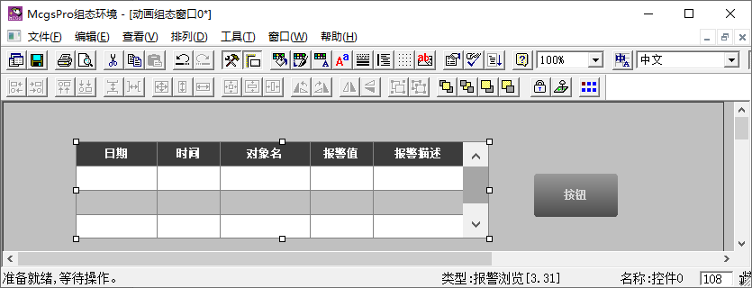

图4.4-2构件基础信息

1.  双击图4.4-2中的标准按钮构件，如图4.4-3所示，在其“基本属性”页修改显示文本，如修改为“下一页”。

>   

图4.4-3 显示文本设置

1.  点击图4.4-3中的“脚本程序”，进入脚本程序功能页 → 点击“打开脚本程序编辑器”。按照步骤3展示的构件名称和所在窗口名称，在图4.4-4右侧对象树依次展开“窗口0”→“控件0”→“方法”，双击方法函数“PageDown”，将其添加到左侧的脚本程序编辑框。

>   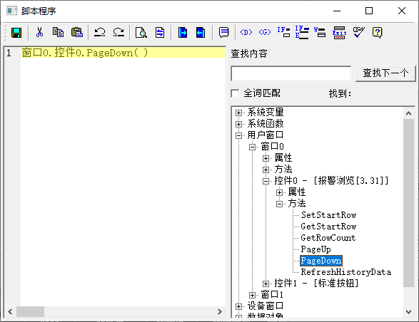

图4.4-4 报警浏览构件方法函数

报警浏览构件方法函数解释：

-   SetStartRow：设置报警浏览构件显示起始行；
-   GetStartRow：获取报警浏览构件当前起始行；
-   GetRowCount：获取报警浏览构件报警信息总条数；
-   PageUp：向上翻页；
-   PageDown：向下翻页；
-   RefreshHistoryData：刷新历史报警信息。

注意：不同构件的方法函数存在差异，不能直接套用。

1.  完成步骤5，检查并保存脚本，点击“确认”。将工程下载到TPC并运行，当报警信息条数超过报警浏览构件当前显示页，就可以通过点击“下一页”标准按钮，实现对窗口0中的报警浏览构件进行翻页操作。

### 4.4.2 报警值修改

用户可以通过以下方法修改报警值：

方法1：工程组态时直接在“实时数据库”中找到对应的变量，双击变量进入其“报警属性”设置页面设置报警值，再将工程重新下载到TPC。参考进阶篇章节4.2设置变量报警功能部分。此方法适合工程组态人员使用。

方法2：在工程运行时，通过事先组态的函数(SetAlmValue)修改变量报警值。采用此方法，即使不懂组态的人员也可以很方便地修改变量报警值。

本节我们以“方法2”为例进行讲解。操作步骤如下：

目标：以进阶篇章节4.2.2为例，在工程运行时，将变量“新报警值”的值赋给变量“设备0_读写VWUB049”的上限报警值，并且要求修改的报警值在重启TPC后仍然有效。

-   查看报警序号：首先按照进阶篇章节4.2.2进行变量上下限报警组态，组态完成后，变量“设备0_读写VWUB049”报警属性显示如图4.4-5所示，可以看到该变量上限报警序号为“0”，下限报警序号为“1”。

>   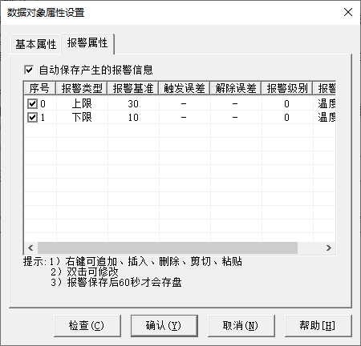

图4.4-5 报警属性

-   添加输入框：在实时数据库新增浮点数变量“新报警值”，并在用户窗口“窗口0”中添加一个输入框。
-   输入框关联变量：如图4.4-6所示，双击添加的输入框，在其“操作属性”页面关联浮点数变量“新报警值”。

>   

图4.4-6 关联变量“新报警值”

-   注意步骤1的操作，变量“设备0_读写VWUB049”上限报警序号为“0”。
-   添加报警设置脚本和初值保存脚本：在“窗口0”添加一个标准按钮构件，按照需要修改按钮的文本内容，并在构件的“脚本程序”页面添加以下脚本

    *!SetAlmValue(设备0_读写VWUB049,0,新报警值,12)*  '将变量“新报警值”设置为变量“设备0_读写VWUB049”的上限报警

    *!SaveSingleDataInit(新报警值)* '对变量“新报警值”保存初值

    *!FlushDataInitValueToDisk()*  '将初值数据刷盘保存

>    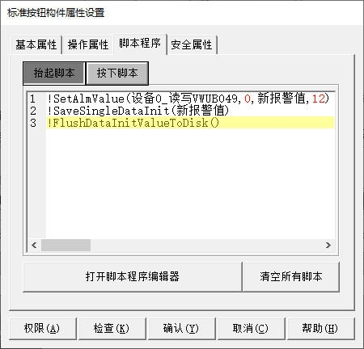

图4.4-7 添加脚本

**报警值设置函数意义：**

!SetAlmValue(DataName,AlarmIndex,Value,Flag)

DataName，数据对象名，只支持整数变量和浮点数变量

AlarmIndex，整数，指定报警序号

Value，浮点数，新的报警值

Flag，浮点数，标志要读取何种报警属性值，具体意义如下：

= 9，报警使能值

= 10，报警存储状态值

= 11，报警打印值（目前备用状态）

= 12，报警基准值（开关量与限值报警的报警值，位报警不能修改）

= 13，报警触发误差值（位报警的指定值，偏差报警的报警值）

= 14，报警解除误差值（部分报警类型此值无意义）

= 15，报警优先级值（目前备用状态）

= 16，报警状态值（不可修改）

= 17，报警类型值（不可修改）

-   启动策略设置：由于TPC重启后，变量报警值会恢复成组态时的设置值，所以需要通过步骤5对变量“新报警值”进行初值保存，并在启动策略中使用再次对变量进行报警值修改操作，保证重启TPC后，变量“设备0_读写VWUB049”的报警值与设置值一致。如图4.4-8所示，启动策略中新增一个策略行，并添加以下脚本

    *!SetAlmValue(设备0_读写VWUB049,0,新报警值,12)*  '将变量“新报警值”设置为变量“设备0_读写VWUB049”的上限报警

>   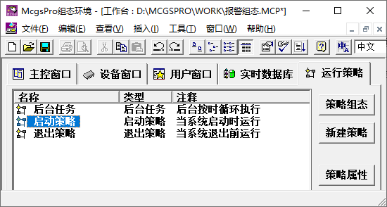

>   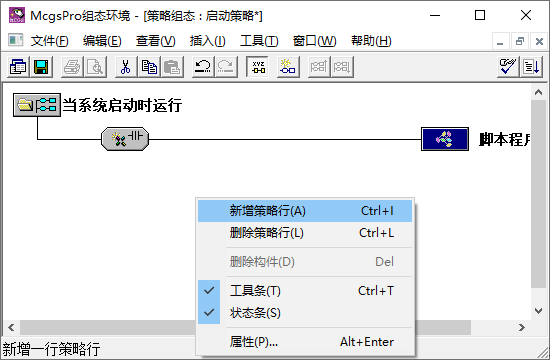 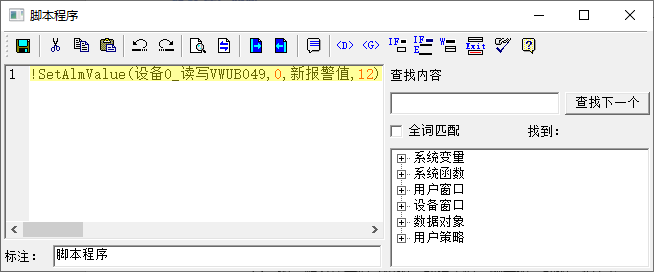

图4.4-8 启动策略添加报警设置脚本

-   将工程下载到TPC正常运行，可以通过输入框向变量“新报警值”赋值，再通过图4.4-7中组态的“设置上限报警”按钮，将变量“新报警值”的当前值设置为变量“设备0_读写VWUB049”的上限报警值。
-   修改报警值后，重启TPC，在工程启动过程会首先触发“启动策略”，将变量“新报警值“的当前值设置为变量“设备0_读写VWUB049”的上限报警值。（注意：工程下载到TPC后首次启动，也会触发“启动策略“，并执行启动策略中的报警值修改脚本）

## 4.5 报警信息配置

McgsPro提供2种方法供用户对变量进行报警信息组态配置。

方法1：直接在“实时数据库”中双击对应变量，进入变量的“报警属性”功能页，配置报警信息，进阶篇章节4.2就是采用的该方法。

方法2：通过McgsPro提供的“报警统一配置”功能，批量进行变量报警信息配置。

本节教程以方法2为例，讲解“报警统一配置”使用方法。

### 4.5.1 进入报警统一配置

如图4.5-1，通过McgsPro组态软件菜单栏 → “工具”→“报警统一配置”，进入报警统一配置界面

>   

图4.5-1 打开报警统一配置

报警统一配置界面打开后，将显示当前工程中已有的报警信息，如图4.5-2所示：

>   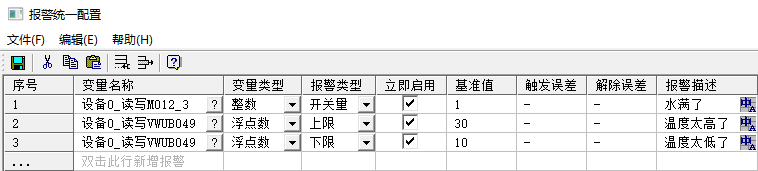

图4.5-2 报警信息统一配置

### 4.5.2 设置统一报警配置

-   **新增报警**

可通过以下三种方式新增报警行：

1.  通过图4.5-3中的“编辑”→ “添加一行”，实现新增报警行。

>   

图4.5-3 菜单栏新增报警行

1.  通过图4.5-4中的工具栏图标 ，实现新增报警行。

>   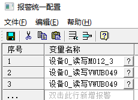

图4.5-4 工具栏新增报警

1.  通过图4.5-5中的“双击此行新增报警”，实现新增报警行。

>   

图4.5-5 双击新增报警行

-   **编辑报警信息**

如图4.5-6，通过“报警统一配置”页面，设置变量名称、变量类型、报警类型、是否立即启用、基准值、触发误差、解除误差、报警描述。

>   

图4.5-6 编辑报警信息

### 4.5.3 报警信息导出和导入

利用McgsPro的“报警统一配置”功能，可以将报警信息以xml格式导出，支持在电脑上使用EXCEL打开并进行编辑后，再重新导入工程，减少用户重复工作量。

-   **导出报警信息**

如图4.5-7，通过报警统一配置界面的菜单栏 →“文件”→“导出”，可以弹出文件保存选择对话框，用户手动指定导出的文件路径和文件名后，即可导出报警信息。

>   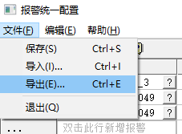 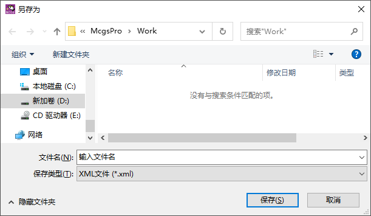

图4.5-7 导出报警信息

-   **导出文件编辑**

如图4.5-8所示，使用Excel将导出的xml文件打后进行编辑。注意：完成编辑后仍然需要保存为XML格式。

>   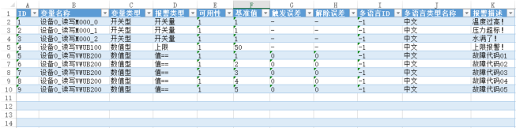

图4.5-8 编辑报警信息文件

-   **导入报警**

如图4.5-9，通过报警统一配置界面的菜单栏 →“文件”→“导入”，弹出“旧报警”操作对话框，选择“是”，导入前会清空“报警统一配置”中已有的报警信息；选择“否”，不清空“报警统一配置”中的报警信息，选择“取消”，则放弃导入操作。

>   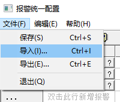 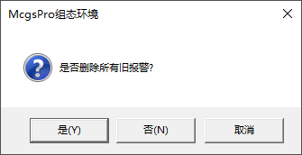

图4.5-9 导入报警信息

# 第5章 趋势曲线和数据处理

TPC的一个重要应用就是显示实时趋势和历史趋势曲线，以及对接收到PLC数据进行处理。本章教程主要讲解McgsPro的趋势曲线显示和数据处理功能。

## 5.1 实时趋势曲线

通过McgsPro提供的实时曲线构件，可以实现工程运行时显示指定变量的实时趋势，实时曲线构件通过McgsPro组态软件工具箱进行添加，如图5.1-1：

>   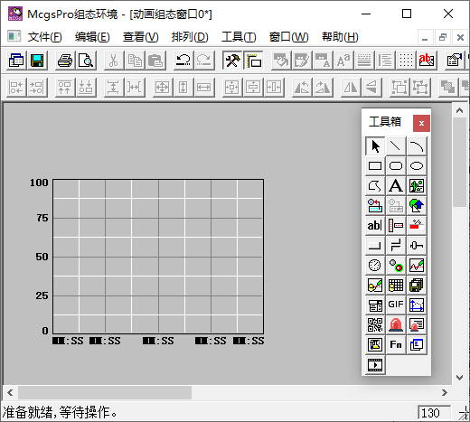

图5.1-1 添加实时曲线构件

实时趋势曲线组态流程如图5.1-2所示：

>   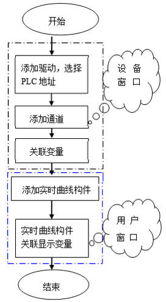

图5.1-2 实时趋势曲线组态

本节教程将讲解实时曲线构件支持的2种趋势曲线类型：

**绝对时钟趋势曲线**：Y轴为目标变量的值，X轴为系统时间，显示变量相对时间的变化曲线，是最常用的实时曲线类型。

**相对时钟趋势曲线**：Y轴为目标变量的值，X轴为其他变量，显示一个变量相对于另一个变量的变化曲线。

### 5.1.1 绝对时钟趋势曲线

以“模拟设备”为例，通过实时曲线构件显示模拟设备通道地址变量“温度”的趋势曲线，要求曲线的Y轴为“温度”值，X轴为系统时间，并可通过按钮清除实时曲线构件中的曲线。我们通过组态一个样例来学习实时趋势曲线，图5.1-3是该样例的运行效果。

>   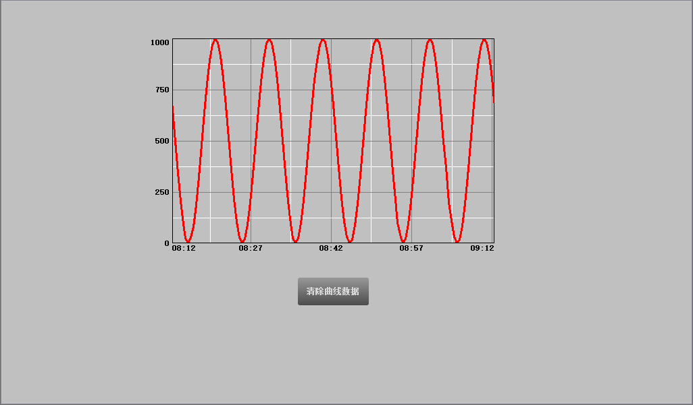

图5.1-3 实时趋势曲线运行效果

方案：在设备窗口中添加驱动“模拟设备”，在“模拟设备通道1”关联“温度01”变量，然后进入用户窗口添加实时曲线构件，并在构件的画笔属性页关联变量“温度01”，工程运行时即可显示“模拟设备通道1”的实时曲线。

**实时趋势曲线组态**：

1.  添加模拟设备：如图5.1-4，新建工程，进入工程的“设备窗口”，将“设备管理”→“通用设备”→“模拟数据设备”→“模拟设备”，添加到设备工具箱，再将“模拟设备”添加到设备窗口。

>   

图5.1-4 添加模拟设备

1.  通道连接变量：双击上图“设备0--[模拟设备]”，进入图5.1-5所示的设备编辑窗口，点击“快速连接变量”，数据对象为“温度01”，开始通道“1”，通道个数“1”，设置完成，点击“确认”，完成连接变量操作。

>   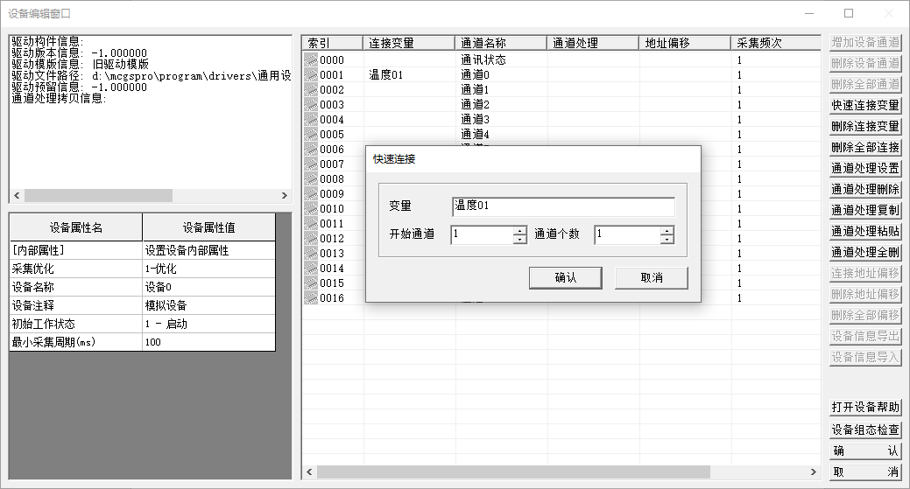

图5.1-5 连接变量

1.  添加变量：点击图5.1-5右下方的确认按钮，在弹出的“添加变量”对话框中，选择“全部添加”，变量“温度01”将自动添加到实时数据库。
2.  绘制实时曲线构件：在工程的用户窗口中新建“窗口0”，双击进入“窗口0”组态界面，按照图5.1-6所示步骤，在窗口0中绘制“实时曲线构件”。

>   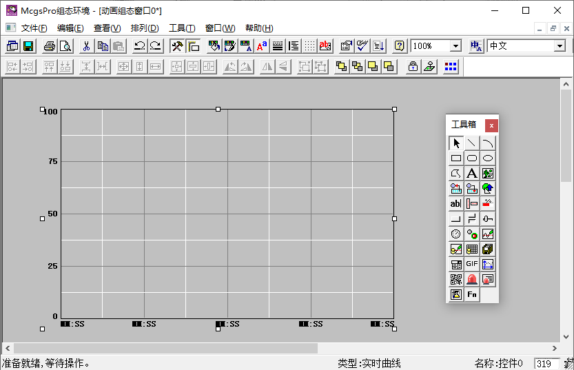

图5.1-6 绘制实时曲线构件

1.  设置曲线类型：双击绘制的实时曲线构件，如图5.1-7，在“基本属性”页设置构件显示外观，曲线类型选择：绝对时钟趋势曲线（X轴为系统时间）

>   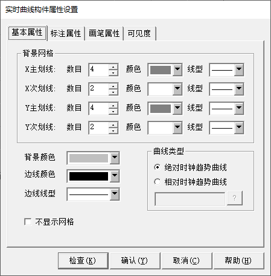

图5.1-7 设置曲线类型

1.  设置曲线标注：在“标注属性”页，按照需要设置X轴和Y轴的标注属性。本次我们将X轴时间单位设置为“秒钟”，X轴长度设置为“60”，Y轴最大值设置为：1000.0。

>   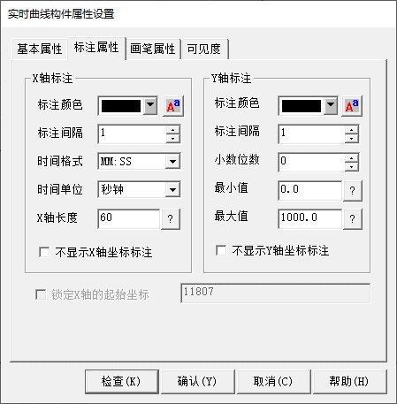

图5.1-8 设置标准属性

注意：“锁定X轴的起始坐标”功能，只有当曲线类型选择“绝对时钟趋势曲线”，且X轴标注中的“时间单位”选择“小时”，此功能才可用。

1.  设置画笔属性：“画笔属性”是实时曲线构件的核心功能设置，如图5.1-9，用户通过点击“画笔属性”中的  关联需要显示的曲线变量，还可设置曲线颜色和现行。我们在“曲线1”关联变量“温度01”，并设置曲线颜色和线型，完成设置后点击“确认”保存。

>   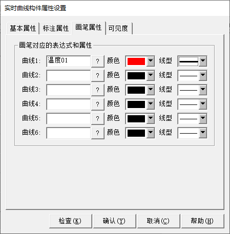

图5.1-9 设置画笔属性

1.  曲线清除功能说明：McgsPro提供构件方法函数，我们可以采用实时曲线构件的方法函数实现曲线清楚功能。
2.  添加曲线清除功能：从图5.1-6可以看到，绘制的实时曲线构件位于“窗口0”，构件名为“控件0”。接下来在“窗口0”中绘制一个标准按钮构件，双击标准按钮构件修改其显示文本为“清除曲线数据”，再进入按钮“脚本程序”→“打开脚本程序编辑器”→“用户窗口”→“窗口0” →“控件0”→“方法”→“ClearData”，将清除曲线数据函数“ClearData”添加到脚本编辑框，效果如图5.1-10所示。

>   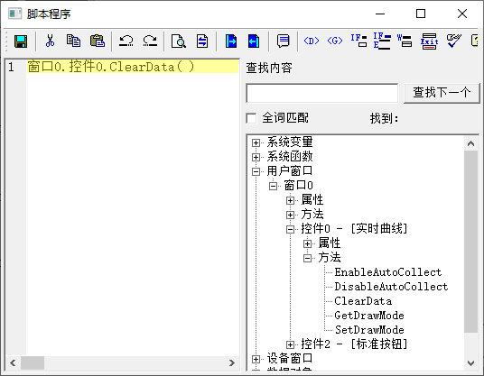

图5.1-10 添加方法函数“ClearData”

1.  点击保存步骤9添加到方法函数。将工程下载到TPC或者直接模拟运行，“模拟设备”将对通道1关联的变量“温度01”，以正弦波的方式赋值0～1000，实时曲线构件记录的“温度01”数值曲线如图5.1-11所示：

>   

图5.1-11 实时曲线构件运行效果

**注意：**

-   **每个实时曲线构件最多可显示6条曲线；**
-   **每条曲线最多支持300个数据点；**
-   **重启TPC，实时曲线构件记录的曲线内容会清空。**

### 5.1.2 相对时钟趋势曲线

McgsPro中实时曲线构件的相对时钟趋势曲线功能已经由XY曲线构件代替，在设置界面中保留该功能只是为了保持对低版本软件的兼容性，建议在McgsPro中使用XY曲线构件代替实时曲线构件的相对时钟趋势曲线功能。

## 5.2 历史数据功能

本节教程主要介绍历史数据存盘、显示，以及历史数据操作。

### 5.2.1 历史数据存盘

McgsPro中的历史数据以组对象为单位进行存盘，用户只需要在“实时数据库”中将需要存盘的变量（变量可以是整数、浮点数、字符串）添加到组对象，再对组对象进行存盘设置即可。下位机（如PLC）传入触摸屏的数据存盘流程如图5.2-1所示：

>   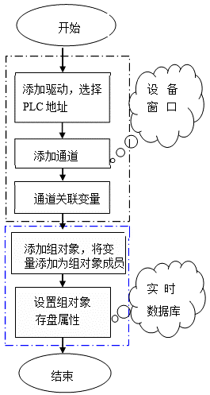

图5.2-1 设置历史数据存盘

本节以“模拟设备”为例，演示下位机历史数据存盘设置方法。假设用户需要保存下位机数据“温度01”和“压力01”，要求每隔3秒保存一次数据，且数据重启后不会丢失，可进入如下操作：

方案：在设备窗口中添加“模拟设备”驱动，关联变量“温度01”和“压力01”，在实时数据库新建组对象“储水罐数据”，设置组对象存盘周期为3秒，并将数据存储到磁盘，随后将“温度01”和“压力01”添加为组对象“储水罐数据”成员。

**历史数据存盘组态：**

1.  添加模拟设备驱动：新建工程，在设备窗口中添加驱动“模拟设备”，

>   

图5.2-2 添加模拟设备

1.  通道连接变量：双击图5.2-2中“设备0--[模拟设备]”，进入图5.2-3所示的设备编辑窗口，点击“快速连接变量”，数据对象为“温度01”，开始通道“1”，通道个数“1”，设置完成，点击“确认”；按照同样的操作，在通道2关联变量“压力01”。

>   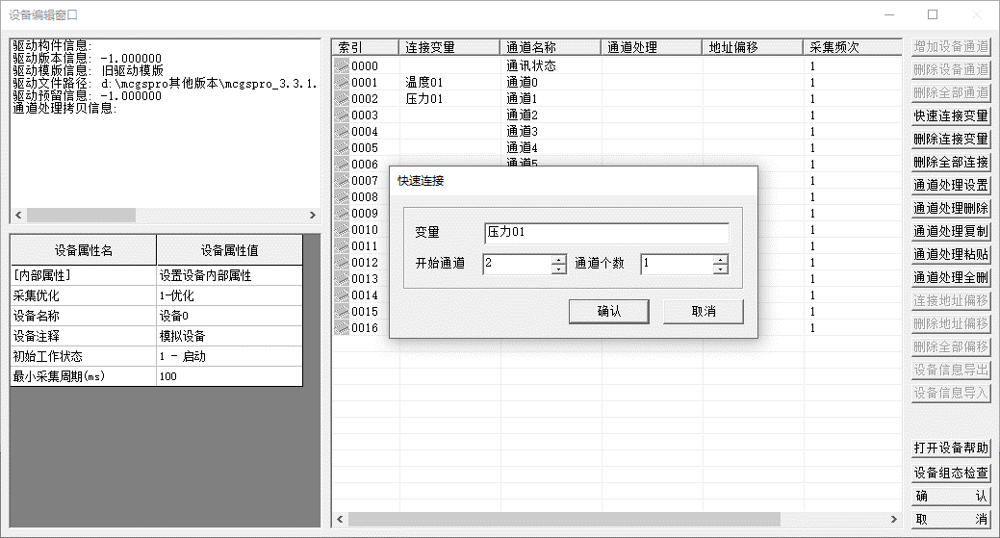

图5.2-3 连接变量

1.  添加变量：点击上图右下方的确认按钮，在弹出的“添加变量”对话框中，选择“全部添加”，变量“温度01”、“压力01”将自动添加到“实时数据库”。
2.  新增对象：关闭“设备窗口”，进入“实时数据库”，如图5.2-4，点击“新增对象”，新增一个对象。

>   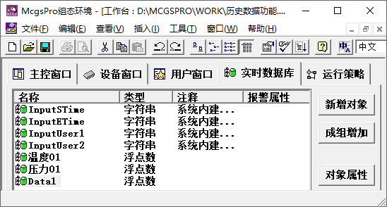

图5.2-4 新增对象

1.  设置对象名和类型：双击上图新增的对象“Data1”，修改对象名称为“储水罐数据”，修改对象类型为“组对象”。

>   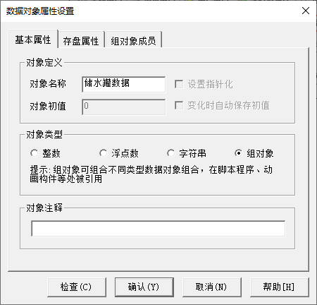

图5.2-5 设置对象名称和类型

1.  设置组对象存盘属性：如图5.2-6，存盘方式选择“定时存储到磁盘”，存盘周期设置为“3秒”。

>   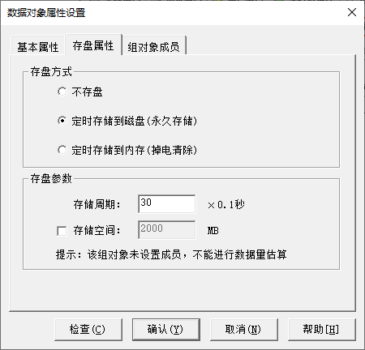

图5.2-6 设置组对象存盘属性

存盘属性配置信息：

-   不存盘：不进行历史数据存盘。
-   定时存储到磁盘：历史数据会存储到磁盘。重启TPC，历史数据仍然存在。（历史存储到磁盘有60秒写入间隔）
-   定时存储到内存：历史数据存储到系统内存，重启后数据清空。
-   存储周期：设置组对象历史数据存盘周期，设置为“0秒”，则组对象不自动进行周期存盘，但可通过执行存盘函数“!SaveData(组对象名)”，实现存盘功能，工程运行时，每执行1次该函数，可对指定的组对象存盘1次。
-   存储空间：系统根据添加的组对象成员计算出的历史数据存储条数。
1.  添加组对象成员：如图5.2-7，将变量“温度01”、“压力01”添加到右侧的组对象成员列表，对该组对象进行存盘，就是对该组对象中所有成员进行存盘。

>   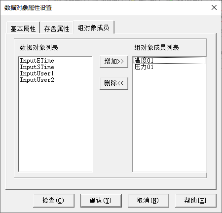

图5.2-7 添加组对象成员

1.  完成以上步骤，历史数据数据存盘功能组态完成。工程运行时，TPC将按照设置的“存储周期”对该组对象（成员）进行历史数据存盘。

**注意：TPC磁盘剩余可用空间不足10%或5M时会自动删除最早的20%，一个组对象每次最多删除12.5M历史数据。**

### 5.2.2 历史数据显示

本节继续使用章节5.2.1组态的工程，分别以曲线和表格的方式显示历史数据供用户查看，运行效果如图5.2-8所示：

>   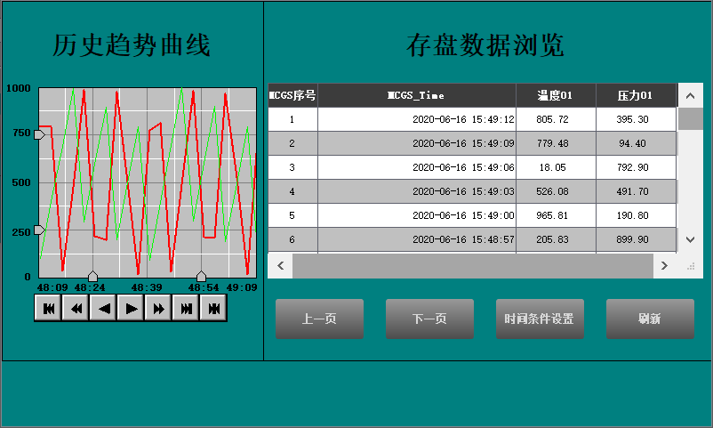

图5.2-8 历史数据显示

窗口画面功能解释：

a . 用历史曲线构件显示历史数据；

b . 历史曲线构件翻页操作按钮；

c . 用存盘浏览构件显示历史数据；

d . 存盘浏览构件部分常用方法函数，实现功能：上翻页、下翻页、显示指定时间段数据、数据刷新。

#### 5.2.2.1 趋势曲线显示历史数据

方案：利用历史曲线构件，显示历史数据趋势曲线，操作步骤如下：

1.  进入窗口组态：在章节5.2.1所组态工程的基础上，进入工作台，双击“窗口0”进入画面组态窗口，窗口背景颜色可自行定义。
2.  绘制历史曲线构件：如图5.2-9，在工具箱中选择“历史曲线”构件，并绘制，

>   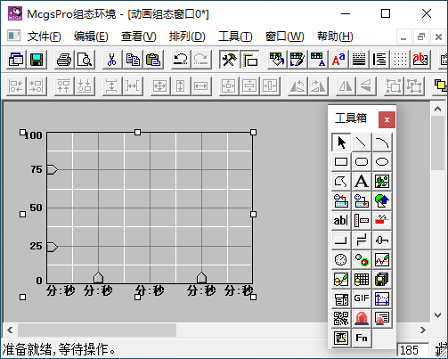

图5.2-9 绘制历史曲线构件

1.  选择数据来源：双击上图绘制的历史曲线构件，首先在其“数据来源”页，选择想要显示的变量所在的组对象，如图5.2-10，数据来源选择“储水罐数据”。

>   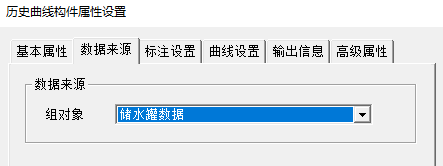

图5.2-10 选择数据来源

1.  标注设置：如图5.2-11，按照需要设置曲线的X轴（时间）标注和曲线的起始点。

>   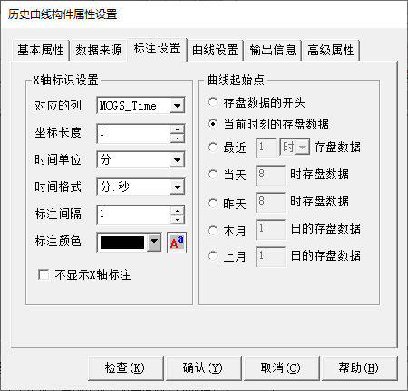

图5.2-11 标注设置

注：X轴标识：设置历史曲线构件X轴标注长度范围、间隔等；

曲线起始点：设置历史曲线构件X轴的起始时间点。

1.  曲线设置：在“曲线标识”选择待配置的曲线，曲线内容选择“数据来源”对应组对象中的成员，并设置曲线线型、颜色、单位、小数位数、坐标等，如图5.2-12所示。

>   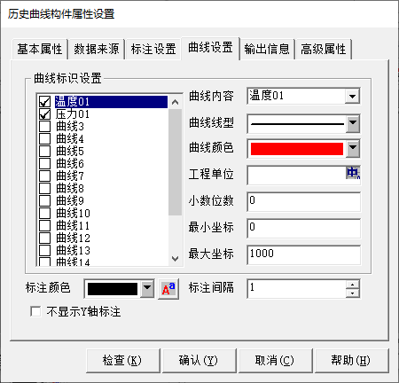 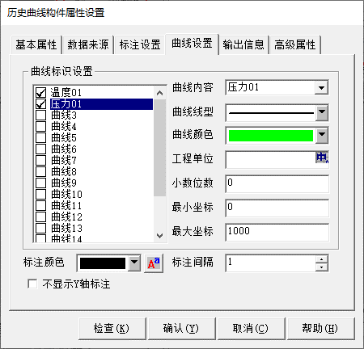

曲线1 曲线2

图5.2-12 曲线设置

1.  历史曲线构件其他属性设置：“基本属性”主要设置构件的显示外观；“输出信息”设置选择对应曲线时在输出信息窗口展示该曲线信息；“高级属性”设置构件运行时功能按钮显示、曲线信息显示、曲线刷新周期。

    这几项设置不影响历史趋势的显示，本节教程“高级属性”设置如图5.2-13。

>   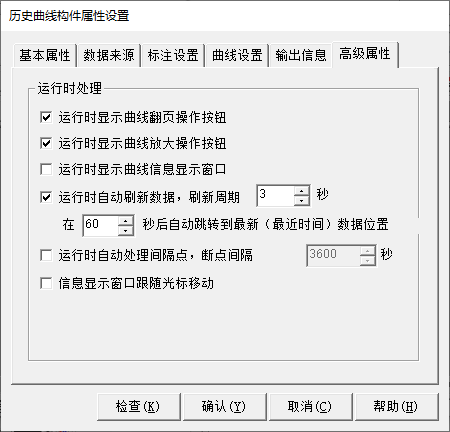

图5.2-13 高级属性

1.  运行工程，历史曲线构件自动以高级属性中设置的周期“3秒”，刷新曲线，效果如图5.2-14。

>   

图5.2-14 运行效果：历史曲线构件

#### 5.2.2.2 存盘浏览构件显示历史数据

方案：利用存盘浏览构件，以表格的方式显示TPC中存储的历史数据。操作步骤如下：

1.  进入窗口组态：在章节5.2.2.1所组态工程的基础上，进入工作台的“用户窗口”，双击“窗口0”进入其组态画面。
2.  绘制存盘浏览构件：如图5.2-15，在工具箱中选择“存盘浏览构件，并绘制。

>   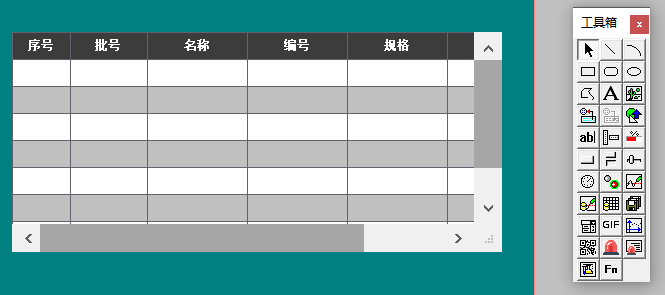

图5.2-15 绘制存盘浏览构件

1.  构件外观设置：双击上图绘制的存盘构件，在其“基本属性”页设置构件的外观显示属性。
2.  选择数据来源：进入其“数据来源”页，选择想要显示的变量所在的组对象，如图5.2-16所示，数据来源选择“组对象”→“储水罐数据”。

>   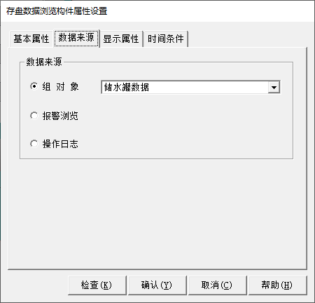

图5.2-16 选择数据来源

**数据来源配置信息解释：**

-   组对象：存盘浏览构件将显示指定组对象成员变量的历史数据；（历史数据保存功能需要单独组态）
-   报警浏览：存盘浏览构件将显示变量的历史报警数据；（历史报警功能需要单独组态）
-   操作日志：存盘浏览构件将显示工程操作日志。（操作日志功能需要单独组态）
1.  设置显示属性：如图5.2-17，在构件“显示属性”页，点击“复位”，存盘浏览构件自动获取组对象“储水罐数据”的成员列表，用户还可以在成员列表中设置数据的显示格式等。

>   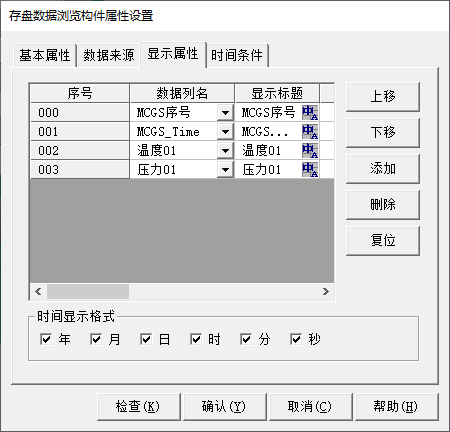

图5.2-17 设置显示属性

注意：如果用户重新选择了“数据来源”，则必须在“显示属性”页重新点击“复位”，获取新的显示成员列表。

1.  设置被浏览数据的排序方式和时间范围：在“时间条件”页，如图5.2-18所示，选择历史数据的排序方式，以及允许的时间范围。设置完成后，点击“确认”即可。

>   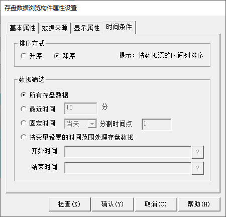

图5.2-18 时间条件设置

**时间条件配置信息解释：**

-   排序方式：根据“数据来源”的时间列进行升序或者降序排列数据。
-   数据筛选：根据“数据来源”的时间列筛选需要显示的数据。
-   所有存盘数据：显示所有时间段的数据。
-   最近时间：显示最近“XX”分钟内的数据。
-   固定时间：显示指定的时间点之后的数据。
-   按变量设置的时间范围处理存盘数据：显示指定时间段的数据。时间格式为"yyyy-MM-dd hh:mm:ss"，例："2017-01-01 00:00:00"。
1.  报警浏览构件历史数据显示功能组态完成，用户还可以选择使用报警浏览构件提供的方法函数，实现在工程运行时，执行“上一页”、“下一页”、“显示指定时间段数据”、“数据刷新”等功能。
2.  如图5.2-19所示，在“窗口0”添加一个标准按钮构件，修改标准按钮构件的显示文本为“上一页”，再进入其“脚本程序”页，点击“打开脚本程序编辑器”，在右侧对象树依次展开“用户窗口”→“窗口0”(存盘浏览构件所在的窗口名) →“控件1”(存盘浏览构件名称) →“方法”，双击其中的“PageUp”，将上翻页函数添加到脚本编辑框。

>    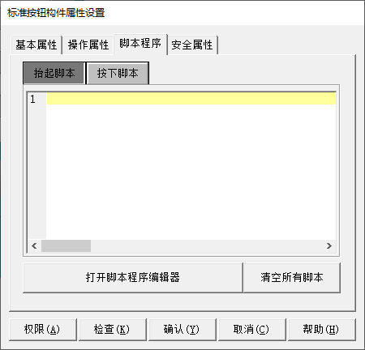 

图5.2-19 添加存盘浏览构件方法函数

1.  按照步骤8操作，再次绘制标准按钮构件，添加需要的方法函数，完成后如图5.2-20所示

>   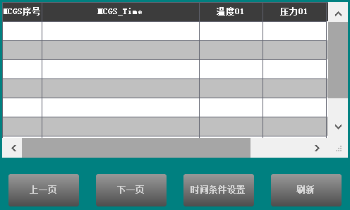

图5.2-20 存盘浏览构件方法函数

-   上一页：窗口0.控件1.PageUp( ) ‘构件向上翻页
-   下一页：窗口0.控件1.PageDown( ) ‘构件向下翻页
-   时间条件设置：窗口0.控件1.SetTimeDialog( ) ‘打开构件时间条件设置对话框
-   刷新：窗口0.控件1.Refresh( ) ‘刷新构件数据
1.  运行工程，存盘浏览构件显示历史数据如图5.2-21所示。工程运行时，用户可通过方法函数进行上下翻页、打开数据时间筛选对话框、刷新历史数据操作。

>   

图5.2-21 运行效果：存盘浏览构件

**注意：历史曲线构件也可以添加方法函数。**

### 5.2.3 历史数据统计

本节主要讲解历史数据统计最大值统计方法。其他统计数据的求和、平均值、最大值、最小值、首记录纸、末记录值同理。

方案：利用报表构件显示历史数据的最大值，操作步骤如下：

1.  新建窗口：使用章节5.2.2.2组态的工程，进入工程工作台的“用户窗口”，新建“窗口1”（注意在“窗口0”中添加标准按钮构件跳转到“窗口1”）
2.  绘制报表构件：双击新建的“窗口1”进入其组态画面（可按照需要设置“窗口1”背景色），如图5.2-22所示，在工具箱中选择“报表”构件，并绘制。

>   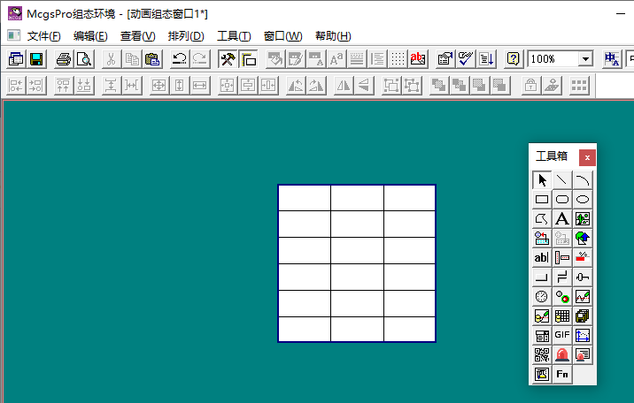

图5.2-22 绘制报表构件

1.  设置列名：双击报表构件，在分别双击第1行当单元格，设置列名，分别输入“时间”、“温度01_max”、“压力01_min”，如图5.2-23所示。

>   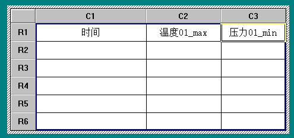

图5.2-23 设置列名

**注意，报表构件列宽和行高均可自行调整，可参考EXCEL的列宽和行高调整方法。**

1.  添加数据连接：如图5.2-24，按住鼠标左键 → 框选第2行单元格 → 移动鼠标至框选的单元格 → 右键 → 点击“点击数据连接”。

>   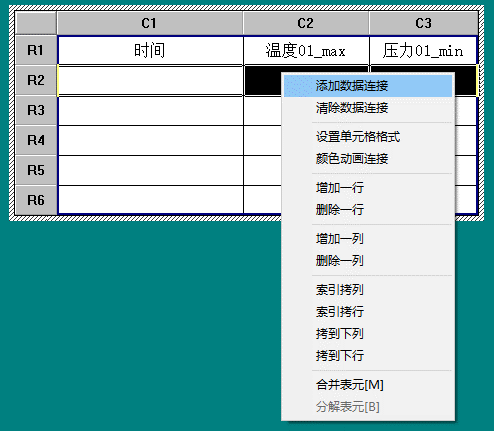

图5.2-24 添加数据连接

1.  选择数据来源：如图5.2-25，打开“添加数据连接”后，在“数据来源”页选择“历史数据统计”。

>   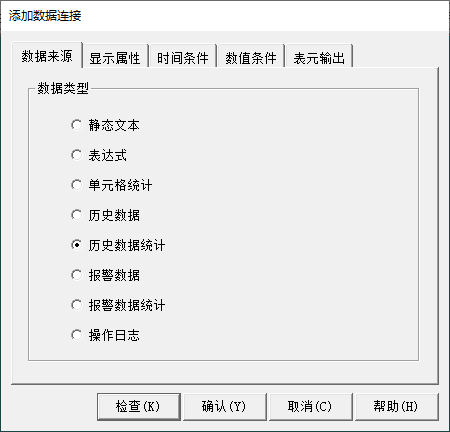

图5.2-25 选择数据来源

1.  设置显示属性：如图5.2-26，在“显示属性”页，组对象名选择“储水罐数据”→ 点击“复位”→ 按照需要修改“显示内容”。

>   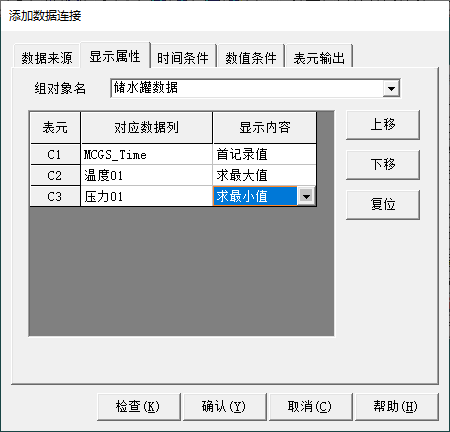

图5.2-26 显示属性设置

“显示内容”支持：求和、平均值、最大值、最小值、首记录值、末记录值。

1.  其他功能页可按照需要自行设置：

    时间条件：使构件只显示指定时间段数据；

    数值条件：以某列或某几列数据为筛选条件，使构件只显示满足条件的数据；

    表元输出：将指定单元格的数据输出到关联的变量。

2.  完成以上操作后，点击“确认”。
3.  数据格式设置：如图5.2-27所示，选择单元格“R2C1”→“右键”→“设置单元格格式”→“数据格式”，显示类型选择“日期时间”，设置完成点击“确认”。

>   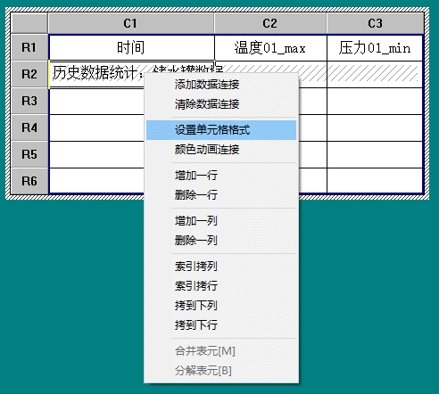 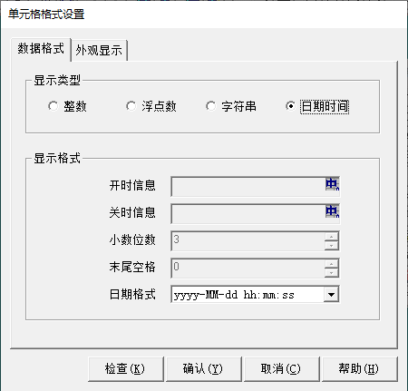

进入单元格格式设置 设置显示类型

图5.2-27 数据格式设置

1.  运行效果展示：将工程下载到TPC或直接模拟运行，运行如图5.2-28所示：

>   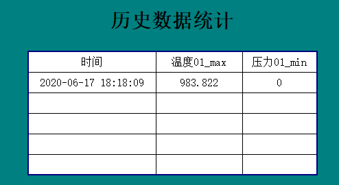

图5.2-28 工程运行效果

### 5.2.4 历史数据导出

工程运行时，用户可以使用“!ExportHisDataToCSV”函数，将保存的历史数据导出到U盘，或者触摸屏的“U盘文件区”。将触摸屏中保存的历史数据导出到U盘，操作步骤如下：

方案：工程运行时，执行“!ExportHisDataToCSV”函数，将指定组对象的历史数据导出到用户U盘，并显示历史数据导出条数和导出状态。

1.  新增对象：使用章节5.2.3工程，在“实时数据库”中新增2个整数对象“导出进度”、“状态控制”，如图5.2-29。

>   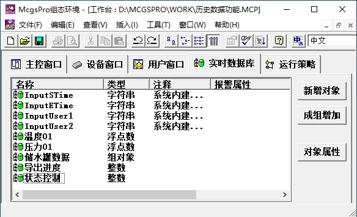

图5.2-29 新增对象

1.  历史导出按钮组态：进入“窗口1”组态画面，绘制1个标准按钮构件，修改标准按钮构件的显示文本，并在其“脚本程序”页添加如下脚本函数：

    **!ExportHisDataToCSV("储水罐历史数据/历史数据.csv","储水罐数据","","2020/6/1 0:0:0","2025/6/1 0:0:0",20000,1,"",导出进度,状态控制)**

    意义：将组对象“储水罐数据”中的“温度01”和“压力01”的历史数据以覆盖的方式导出到“U盘 / 储水罐历史数据 / 历史数据.csv”,导出数据时间范围为2020/6/1 0:0:0～2025/6/1 0:0:0，最多导出20000条数据。

>   

>   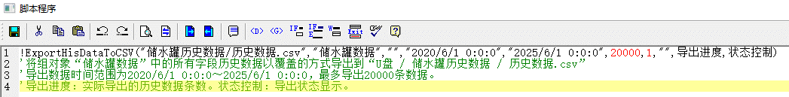

图5.2-30 历史数据导出按钮组态

**ExportHisDataToCSV函数解释**：

例：!ExportHisDataToCSV(文件名,组对象名,字段名,开始时间,结束时间,最大记录数,导出模式,导出参数,进度指示数据对象名,控制数据对象名)

-   文件名：导出文件路径，目录不存在自动创建，以“\$MCGS_DIR_USER”开头表示导出到用户分区，其它则为U盘
-   组对象名：字符串，导出的历史数据的组对象名字
-   字段名：字符串，用逗号分隔的要导出的字段名，如果字符串内容为空字符串””，则导出所有字段
-   开始时间：字符串，导出的历史数据开始时间段，格式为“YYYY-MM-DD HH:MM:SS”或“YYYY/MM/DD HH:MM:SS”
-   结束时间：字符串，导出的历史数据结束时间段，格式为“YYYY-MM-DD HH:MM:SS”或“YYYY/MM/DD HH:MM:SS”
-   最大记录数：整数，希望导出的历史数据条数，超过该记录数就返回，停止导出
-   导出模式：整数，“=1”表示覆盖现有文件；“=2”表示追加到文件最后
-   导出参数：字符串，暂时为空，保留以后使用
-   进度指示数据对象名：必须为整数数据对象，导出过程中该对象值显示当前已导出的数据条数，如果导出过程出现异常则返回错误码，错误码含义如下：

= -1001，进度或控制数据对象类型不正确

= -1004，组对象名不存在或组对象不具有存盘属性

= -1020，导出的开始时间大于结束时间

= -1021，U盘没有插入

= -1022，同一时间只允许一个导出任务

= -1023, 记录读取的条数为0

= -1024, 文件操作失败

= -1025, 导出路径为空

= -1026, 导出路径不合法

= -1027, 时间格式不正确

= -1028, 不支持的导出模式

-   控制数据对象名：整数数据对象,控制导出执行，启动导出时会自动设置该数据对象为0，导出过程中想取消导出则可以设置该值为\<0的任何值，导出函数运行结束后会自动设置对象值为1
1.  导出进度和状态控制显示：在“窗口1”添加2个输入框，分别关联变量“导出进度”和“状态控制”，用于在工程运行时显示历史数据导出进度和状态。如图5.2-31所示：

>   

图5.2-31 数据导出进度和状态控制

1.  运行工程：保证组态时设置的导出时间段正确，将工程下载到TPC或模拟运行，有历史数据保存情况下，点击按钮“导出历史数据”可导出CSV格式的历史数据，打开导出的CSV文件如图5.2-32所示：

>    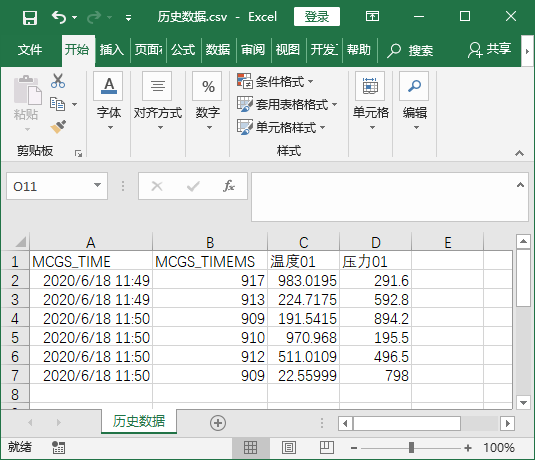

5.2-32 导出历史数据

注意：

-   数据导出起止时间可以是变量，可在工程运行时手动指定导出时间段
-   U盘格式必须为FAT32
-   模拟运行时导出的文件路径为：McgsPro组态软件安装目录 \\ Program \\ export \\ 用户设置的导出路径

### 5.2.5 历史数据删除

McgsPro提供三种方法删除历史数据：

-   方法1：下载工程时删除历史数据，如图5.2-33。

>   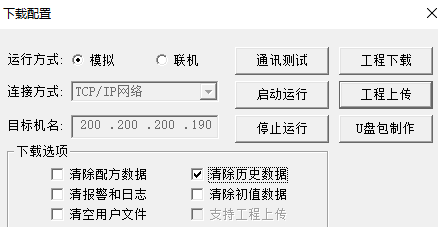

-   图5.2-33 下载界面删除历史数据
-   方法2：工程运行时，磁盘剩余空间不足10%或5M时，系统自动删除存储的历史数据，1个组对象每次触发最多会删除12.5M历史数据。
-   方法3：工程运行时，执行函数!DelSaveDat或!DelAllSaveDat删除历史数据。

本节教程主要讲解“方法3”，通过函数删除历史数据，操作步骤如下：

方案：在标准按钮中组态!DelSaveDat或!DelAllSaveDat函数，工程运行时点击按钮，删除历史数据。

1.  绘制标准按钮：使用章节5.2.4组态的工程，进入用户窗口“窗口1”，绘制1个标准按钮构件。
2.  添加历史数据删除函数：双击标准按钮构件，进入“脚本程序”页，输入脚本函数“!DelAllSaveDat(储水罐数据)”，如图5.2-34所示：

>   

>   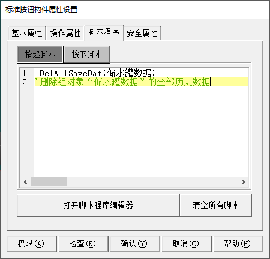

图5.2-34 添加历史数据删除函数

1.  运行工程：完成上述操作后，保存工程，并下载到TPC或模拟运行。在有历史数据记录时，点击该按钮，可删除组对象“储水罐数据”已保存的历史数据。

函数解释：

-   !DelSaveDat(DataName,Num)

函数意义： 删除组对象DataName对应的存盘数据中Num小时之前的存盘数据

-   !DelAllSaveDat(DataName)

函数意义： 删除组对象DataName对应的所有存盘数据

## 5.3 数据处理

对于McgsPro组态软件，数据处理分为：数据前处理和数据后处理。通过选择合适的数据处理方式，使采集到数据满足现场用户需求。

### 5.3.1 数据前处理

**数据前处理**：指“通道处理设置”功能，在工程“设备窗口”中双击添加的驱动设备，进入其设备编辑窗口，鼠标选中想要进行通道处理的设备通道，再点击右侧的“通道处理设置”，即可进入图5.3-1所示的通道处理设置界面。使用“通道处理”功能，下位机地址数据在传入McgsPro实时数据库变量之前就完成了处理，关联该通道的“连接变量”将直接显示“通道处理”后的数据。

>   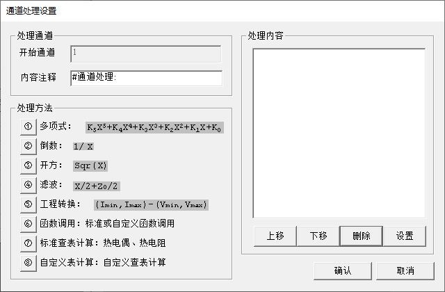

图5.3-1 通道处理设置

McgsPro提供8中通道处理方法：

-   多项式：对指定通道进行多项式运算；
-   倒数：求指定通道的倒数；
-   开方：对通道值进行开方；
-   滤波：中值滤波，本次输入信号的1/2+上次输入信号的1/2；
-   工程转换：对通道值进行线性（倍数）缩放；
-   函数调用：对指定的多个通道值进行统计计算，包括：求和、求平均值、求最大值、求最小值、求标准方差标；
-   标准查表计算：提供8中常用热电偶和Pt100热电阻查表计算；
-   自定义查表计算：自定义一个表，在每一行输入对应值后，指定查表基准。

**注意：以上处理方法只有“工程转换”支持逆向运算，即选择了“工程转换”，从PLC地址中读取数据或写入数据时，都会执行“工程转换”。其他7中通道处理方法只在从PLC地址读取数据时会进行相应的运算。**

本节教程以西门子200PLC为例，假设用户采集的PLC地址“V100”的数据，属于现场控制设备的压力原始信号，范围为1000～5000mV，而压力传感器的量程为0～2Mpa。对此，用户可选择使用通道处理中的“工程转换”对数据进行线性缩放，使TPC最终显示正确的压力数据。

方案：双击“设备窗口”中的西门子_200PPI驱动，找到地址V100，进入“通道处理”设置界面，选择“工程转换”，设置输入最大值、最小值，以及工程最大值、最小值。

1.  进入工程的设备窗口画面，双击  进入设备窗口，再双击驱动设备“西门子_200PPI”进入设备编辑窗口。
2.  如图5.3-2所示：首先在设备窗口编辑窗口选中需要进行通道处理的通道“读写VWUB100”→“通道处理设置”→“工程转换”→“工程量转换”，按照需要，设置输入最小值为1000，输入最大值为5000，工程最小值为0，工程最小值为2，设置完成依次点击“确认”保存。

>   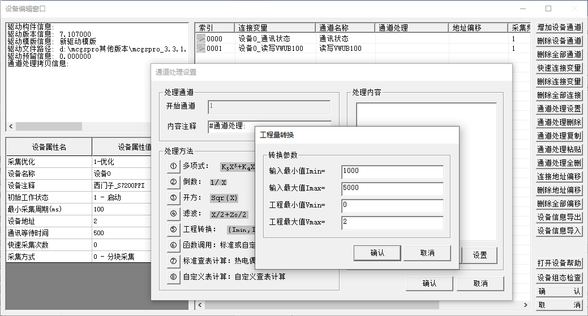

图5.3-2 工程转换设置

1.  完成步骤2操作后，在用户窗口中添加1个输入框，关联图5.3-2所示的连接变量“设备0_读写VWUB100”，保存工程，连接触摸屏和PLC，并将工程下载到TPC中运行，效果如下：
-   通道“读写VWUB100”的值小于1000，变量“设备0_读写VWUB100”值为0；
-   通道“读写VWUB100”的值大于1000，小于5000，变量“设备0_读写VWUB100”值对应0～2；
-   通道“读写VWUB100”的值大于5000，变量“设备0_读写VWUB100”值为2。

### 5.3.2 数据后处理

数据后处理：本质上是对工程“实时数据库”中变量数据的处理，本章节介绍的实时趋势曲线、历史数据功能（包括历史数据存盘、显示、数据统计、导出、删除）均属于数据后处理的范畴。关于数据后处理中统计数据的处理，用户可参考进阶篇章节5.2.3。

## 5.4 变量初值保存功能

一般来说，工程启动时，实时数据库中数据对象的初始值是组态时设置的初始值。若想重启后数据对象的值恢复为重启前的值，就需要将数据对象的值先保存起来，以备重启时调用。变量的初值保存有两种方式，一种是设置初值属性，另一种是使用初值存盘函数!SaveSingleDataInit( )。不论用哪种方式保存初值，都会在60秒后才会刷盘将初值存入磁盘，除非保存初值后马上调用函数!FlushDataInitValueToDisk( ) ，把所有需要保存初值的数据对象的设定初值立即写入磁盘。

### 5.4.1设置初值属性

当对象类型是【整数】【浮点数】或【字符串】时，可以选择数据对象的【基本属性】功能页中的【变化时自动保存初值】。勾选此复选框后，当数据对象的值发生变化时，首先自动保存初值到缓存，等待60秒后，系统再将初值刷入磁盘。若还没有到60秒屏幕就意外掉电了，将丢失60以内修改的初值。

1.  进入实时数据库，新建一个数据对象【A】。将它的【数据类型】设为【浮点数】，勾选【变化时自动保存初值】前的复选框。点击确认保存设置并关闭设置界面。如图5.4-1所示。

>   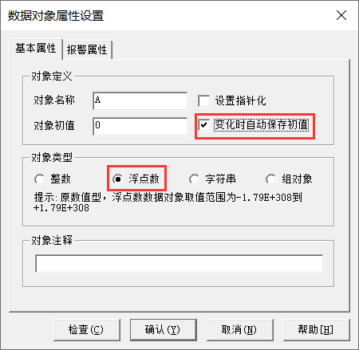 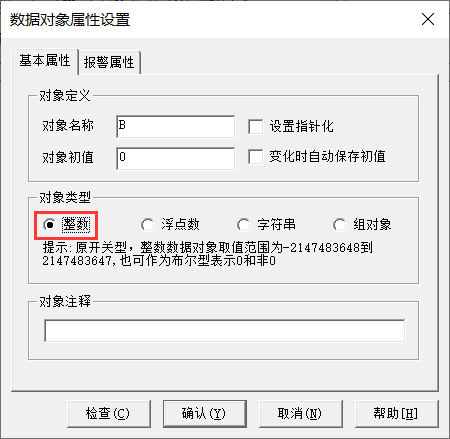

图 5.4-1 数据对象A基本属性设置 图 5.4-2 数据对象B基本属性设置

1.  进入窗口0，在一个【输入框】构件的【操作属性】功能页中关联变量【A】。下载工程并运行后，将【输入框】的值修改为3。等待60秒后，将屏幕断电重启，可以看到输入框中的值依然是3，保存了刚才修改的初值。

### 5.4.2 初值存盘函数

函数!SaveSingleDataInit(DataName)的作用是把数据对象的当前值设置为初始值，以便McgsPro组态软件下次启动时这些数据对象能自动恢复其值。

1.  进入实时数据库，新建一个数据对象【B】。将它的【数据类型】设为【整数】。点击确认保存设置并关闭设置界面。如图5.4-2所示。
2.  在窗口0中新建一个【输入框】构件，在其【操作属性】功能页中关联变量【B】。
3.  然后新建一个标准按钮构件。如图5.4-3所示将按钮的【基本属性】中的文本设置为【保存初值】，【脚本程序】中的抬起脚本设置为【!SaveSingleDataInit(B)】。按钮的功能是，当按钮抬起时，执行脚本【!SaveSingleDataInit(B)】，即将【B】的初值存入缓存，等待60秒后，初值被刷入磁盘中。此时，若立即执行脚本【!FlushDataInitValueToDisk( )】，则不必等待60秒，初值将被立即刷入磁盘。

>   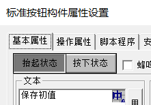 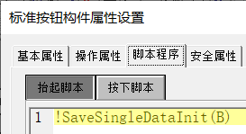

图 5.4-3 按钮属性设置

# 

# 第6章 多重复制应用实例

在组态画面过程中，经常需要快速创建一批同质不同地址(变量)的动画构件，此时可使用多重复制功能。

多重复制构件可配置项目有普通文本、多语言文本、变量名称、表达式。

 多语言文本：属性值使用了多语言项内容，自动创建或关联对应的多语言项内容。没使用多语言项内容，依旧保持不使用多语言项内容。

 变量名称：变量名称不存在时，在实时数据库中自动创建对应变量。

 表达式：表达式中存在未知变量时，在实时数据库中自动创建对应变量。

多重复制功能仅针对变化项目配置中已勾选的项目进行内容变化分发，其他未勾选的，保持跟基础构件内容一致。

## 6.1 单一控件的多重复制

使用多重复制组态一个包含100个电机状态指示灯报警界面。

-   首先使用多重复制功能复制出100个【标签】构件作为电机序号标注，使其样式保持统一，文字显示为【1\#电机】-【100\#电机】。
1.  将一个【标签】构件拖拽到画面中合适的位置和合适的大小。双击该构件，弹出【标签动画组态属性设置】界面，在【属性设置】功能页中，设置其【 填充颜色】为【没有填充】，【边线颜色】为【没有边线】。在【扩展属性】功能页中的【文本内容输入】框中，输入【1\#电机】。点击确认保存设置并关闭设置界面。

>   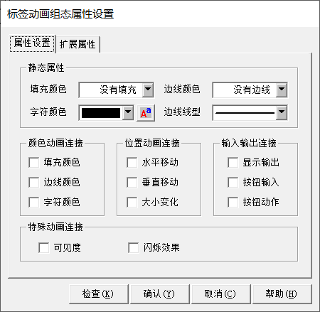 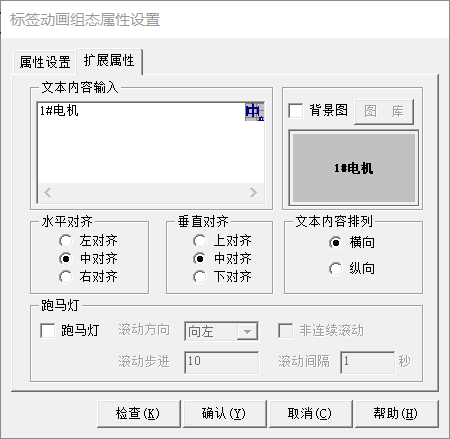

图 6.1-1标签构件动画组态属性设置界面

1.  将【标签】构件拖拽到画面的左上角，为接下来的多重复制留下足够的空间。
2.  选择【标签】构件，点击工具栏中的【多重复制】图形按钮，弹出【多重复制构件】设置界面。
3.  因为要组态100组电机指示灯，所以将【水平方向个数】和【垂直方向个数】各设置为10。
4.  然后在【水平间隔像素】和【垂直间隔像素】中输入数值，点击下方的【预览】按钮，观察多重复制后矩阵的排列效果。注意需要预留出指示灯的位置。
5.  勾选【变化项目配置】列中的【显示文本[标签][控件0]】前的复选框，这样右侧【详细配置】中的修改才会生效。
6.  在【自动递增】中自动生成的【内容】中，{R}为可递增变量，默认出现在文字最后，将它修改到需要的地方，如图 6.1-2所示。起始值修改为【1】。修改完后，下方的【列表索引】中的预览内容也会随之改变。点击确定保存设置并关闭设置界面。

>   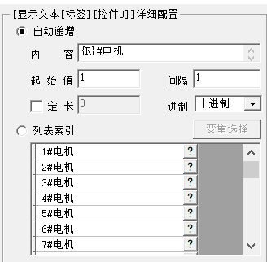 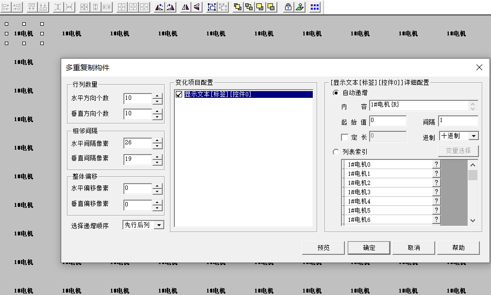

图 6.1-2 多重复制构件界面

**多重复制配置信息**

1.  水平方向个数：构件矩阵在水平方向上的个数[1,30]。
2.  垂直方向个数：构件矩阵在垂直方向上的个数[1,30]。
3.  水平间隔象素：构件矩阵在水平方向上的间隔象素[0,500]。
4.  垂直间隔象素：构件矩阵在垂直方向上的间隔象素[0,500]。
5.  水平偏移象素：构件矩阵在水平方向上的整体偏移象素[-500,500]。
6.  垂直偏移象素：构件矩阵在垂直方向上的整体偏移象素[-500,500]。
7.  选择递增顺序：先行后列(优先水平方向分配)、先列后行（优先垂直方向分配）。
8.  变化项目配置：构件属性的普通文本、多语言文本、变量、表达式。  
    勾选代表矩阵构件对应该属性内容按照预定义规则进行规律变化。  
    不勾选代表矩阵构件对应该属性内容保持不变。

    **所有的变化项目后方的中括号中标有所属控件的类型和控件名，如：显示文本[标签][控件0]。**

9.  详细配置：配置某一项具体变化项目，包含自动递增、列表索引两种方式。
10. 自动递增：按照自动递增的一些预置规则进行内容变化。（列表索引下的表格可预览配置对应的矩阵内容）。
11. 内容：基础构件对应属性下的值，{R}这三个字符代表变化部分。
12. 起始值：配置{R}部分的起始数字，默认为0，原值末尾是数字时，起始值默认为该数字。例如，”文3“起始值就是3。
13. 间隔：配置{R}部分的数字间隔，默认为1。
14. 定长：配置{R}部分的数字整体长度，默认不勾选，原值末尾是数字时，定长长度为该数字长度。例如，”文0003“定长就是4。
15. 进制：配置{R}部分的变化，起始值、间隔、定长按照八进制/十进制/十六进制进行规律变化。默认为十进制。
16. 列表索引：开启列表索引下的表格内容编辑。
17. 变量选择：在列表索引选中时，可对表格内容做整体替换。（多选）
18. 预览：预览构件矩阵的个数、间隔象素、整体偏移象素。
19. 点击确定，关闭设置界面后，画面如图6.1-3所示。

>   

图 6.1-3 标签构件多重复制效果

-   然后使用多重复制功能复制出100个【椭圆】图元，作为电机报警状态指示灯。
1.  在实时数据库中新建一个浮点数变量【电机1报警状态】。注意，变量名中不能出现【\#】字符。
2.  将一个【椭圆】拖拽到画面中【1\#电机】标签构件的右侧，拖拽成一个正圆。也可以直接在右下角的长度、宽度输入框中输入相同的数值使之成为一个正圆。

>   

图 6.1-4 将椭圆设置成正圆

1.  双击【椭圆】构件，弹出【动画组态属性设置】界面。勾选【填充颜色】前的复选框，在出现的【填充颜色】功能页中的表达式处关联变量【电机1报警状态】。下方的【填充颜色连接】保持默认不变。表示当表达式为1时，填充颜色红色，为0时填充颜色为绿色。点击确认保存设置并关闭设置界面。

>    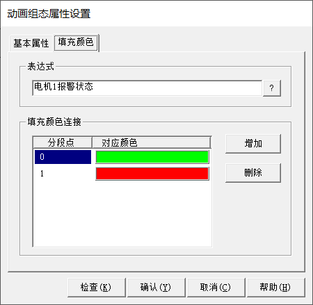

图 6.1-5 椭圆图元组态

1.  接着选中【椭圆】构件，点击工具栏中的【多重复制】图形按钮，弹出【多重复制构件】设置界面。
2.  同样的，在【水平方向个数】和【垂直方向个数】处输入10，然后在【水平间隔像素】和【垂直间隔像素】处输入数值，点击下方的【预览】按钮，使所有的【椭圆】构件都在之前复制的【标签】构件的右侧方。
3.  勾选【变化项目配置】列下方的【表达式[椭圆][控件2]】前的复选框。
4.  修改【自动递增】中的【内容】为【电机{R}报警状态】，【起始值】为【1】。下方【列表索引】中也会出现相应的预览变化。

>   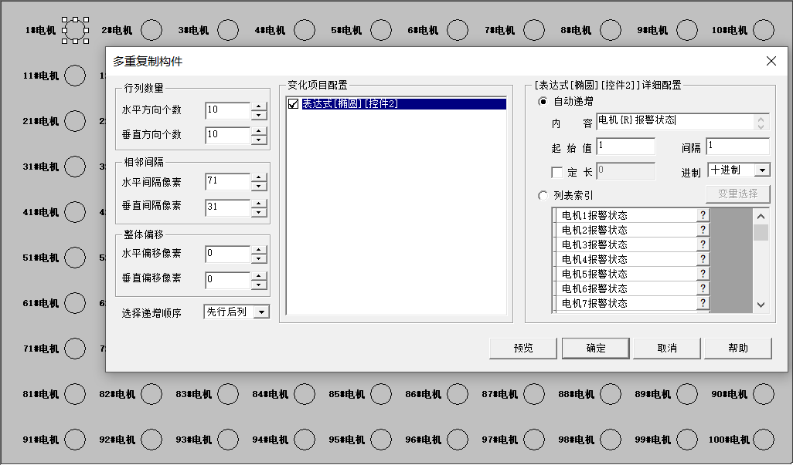

图 6.1-6 对椭圆图元进行多重复制

1.  点击确定保存设置并关闭设置界面。此时，由于我们没有提前创建变量，系统会弹出提示框询问是否添加，选择【确定】，在实时数据库中自动添加变量。

>   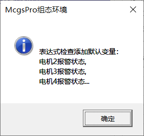

图 6.1-7 提示添加未定义变量

1.  关闭设置界面后，画面如图6.1-8所示。

>   

图 6.1-8 椭圆图元多重复制效果

1.  此时，所有的标签构件右侧的椭圆中关联的表达式都和标签构件中电机的编号一一对应。任意双击打开一个椭圆构件查看效果。

>   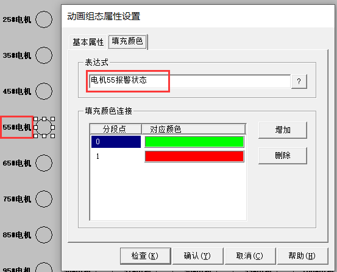

图 6.1-9 检查多重复制结果

1.  此时的实时数据库如图6.1-10所示。

>   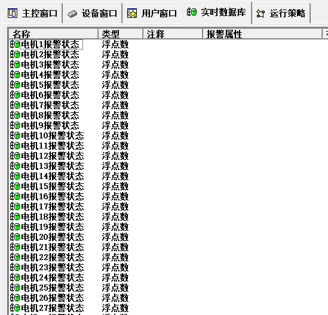

图 6.1-10实时数据库

-   组态完画面和实时数据库变量后，还需将实时数据库中变量与PLC通道相连。本样例以Smart200为例。
1.  双击【Smart200】驱动，进入【设备编辑窗口】。点击【删除全部通道】删除默认通道。再点击【添加设备通道】按钮 → 选择通道类型为【M内部继电器】 → 设置通道个数为【100】。

>   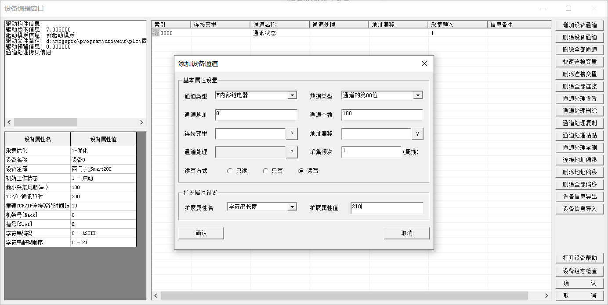

图 6.1-11设备编辑窗口

1.  然后在第一个通道的【连接变量】列双击 → 在弹出的【变量选择】界面中按住Shift选择从【电机1报警状态】到【电机100报警状态】 → 确认。

>   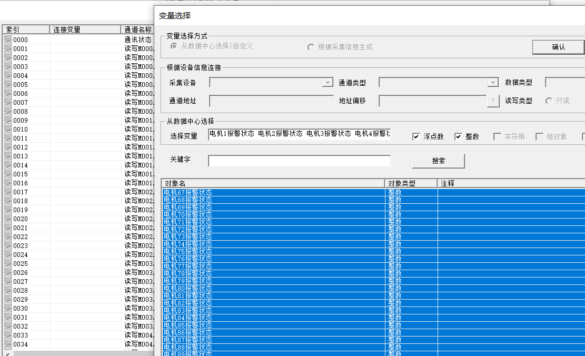

图 6.1-12连接变量

1.  连接变量完成后，【设备编辑窗口】如图6.1-13所示。点击【确认】保存设置并关闭设置界面。

>   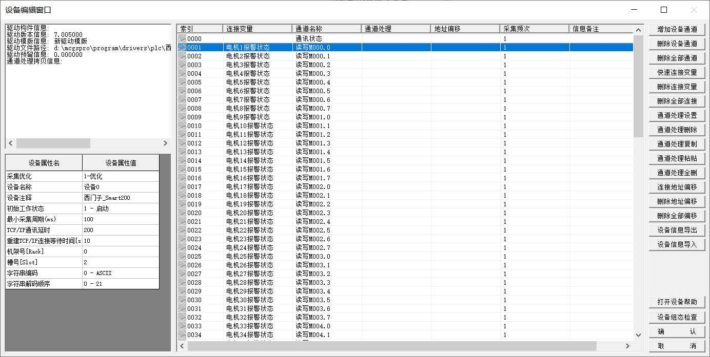

图 6.1-13连接变量结果

## 

## 6.2 单元的多重复制

在McsgPro中也可以将几个控件组合成单元后再统一多重复制，这样就节约了控件一个个单独排版的时间。本节使用【列表索引】方式来组态。

-   在实时数据库中新建20个浮点数型变量【电流1】至【电流20】，20个整数型变量【启停1】至【启停20】。
1.  进入实时数据库 → 成组增加，设置【对象名称】为【电流】，【对象类型】为【浮点数】，【起始索引】为【1】，【添加个数】为【20】个。点击确认保存设置并关闭设置界面。如图6.2-1所示。

>   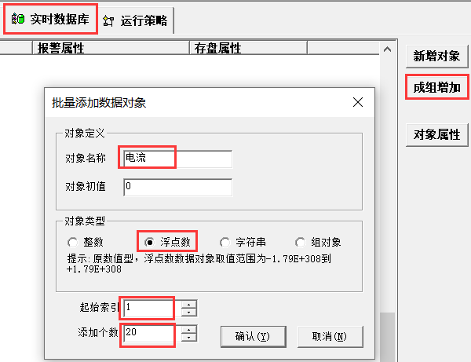 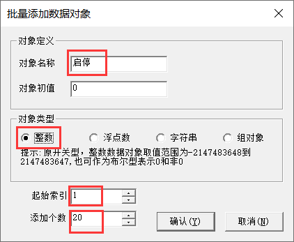

图 6.2-1 成组增加变量

1.  用同样的方法新建20个整数型变量【启停1】至【启停20】。点击【成组增加】，设置【对象类型】为【整数】，【起始索引】为【1】，【添加个数】为【20】个。点击确认保存设置并关闭设置界面。如图6.2-1所示。
2.  设置完成后实时数据库如图6.2-2所示：

>   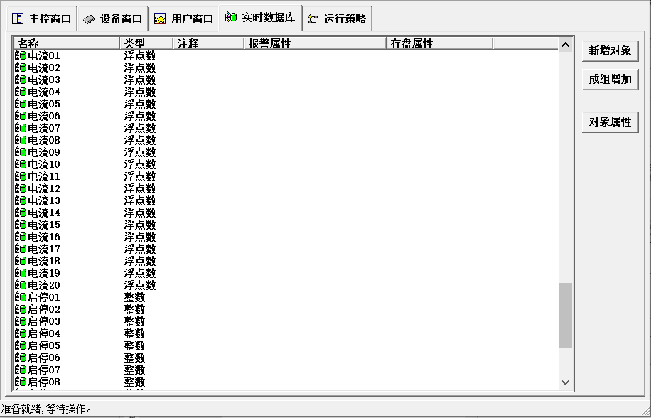

图 6.2-2 实时数据库

-   组态一个画面，显示1\#至20\#电机的电流，并能在画面中控制所有电机的启动和停止。
1.  组态如图6.2-3所示的画面，我们将对红线框出来的4个组态内容进行多重复制。其他内容，在多重复制时，不在【变化项目配置】中勾选，将保持不变。

>   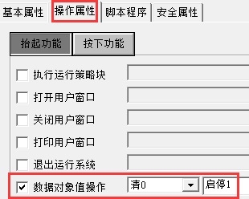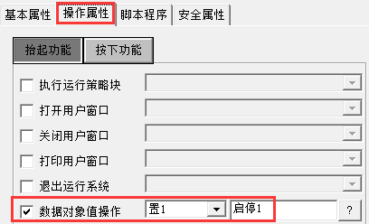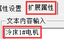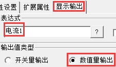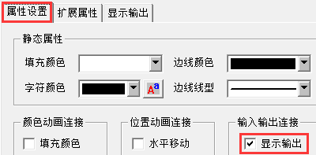 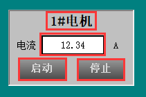

图 6.2-3单元中需要多重复制的项

1.  选中所有控件后，在控件上点击鼠标右键 → 排列 → 合成单元。

>   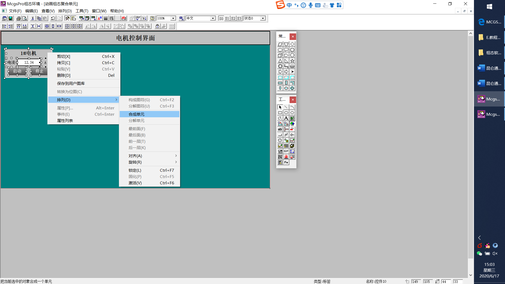

图 6.2-4合成单元

1.  选中合成后的单元，再点击工具栏中的【多重复制】图形按钮，弹出【多重复制构件】设置界面。
2.  将【水平方向个数】设置为【5】，【垂直方向个数】设置为【4】。然后结合下方的【预览】按钮，调节【水平间隔像素】和【垂直间隔像素】的值，使20个单元在画面中均匀分布。
3.  勾选【变化项目配置】列表中【显示文本[标签][控件2]】前的复选框，按图6.2-5进行设置。

>   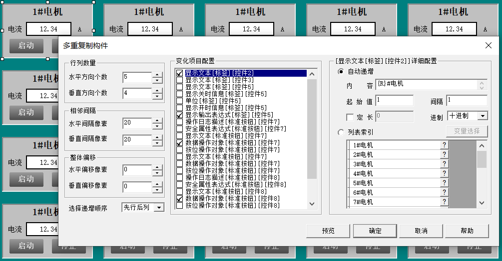

图 6.2-5 多重复制单元流程一

1.  再勾选【显示输出表达式[标签][控件5]】前的复选框 → 列表索引 → 变量选择，弹出【变量选择】窗口。按住Shift键后选中【电流1】至【电流20】，点击【确认】关闭窗口。

>   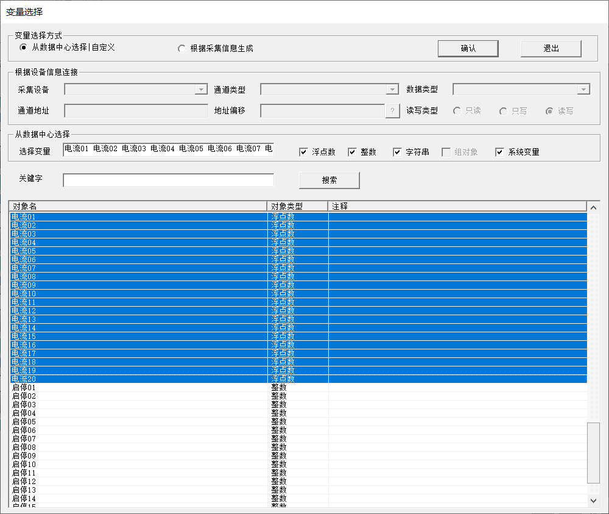

图 6.2-6 多重复制单元流程二

1.  用同样的方法配置剩下的两个变化项目。配置完成后如图6.2-7所示。

>   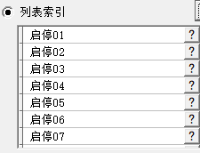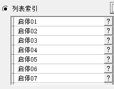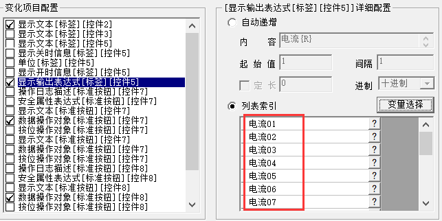

图 6.2-7 多重复制单元流程三

1.  点击确认保存设置并关闭设置界面。设置完成后的画面如图6.2-8所示：

>   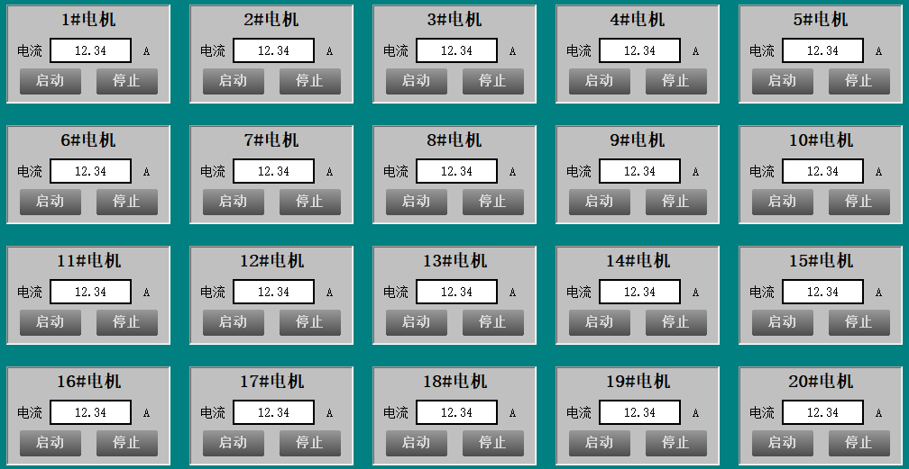

图 6.2-8多重复制单元效果

-   然后再按照6.1的方法创建通道并将变量与通道相连。

在实际使用中，还会出现窗口内容相同，变量地址有规律递增的情况。此时可以通过多重复制功能，先将所有窗口内容在同一个窗口中复制出来，直接关联好新窗口中的变量。再将各个新窗口的内容，剪切到对应的窗口中去。

# 

# 第7章 指针功能应用实例

McgsPro的指针有两种，一种是设备通道里的地址偏移，一种是实时数据库中的变量指针。

## 7.1 地址偏移应用样例

地址偏移的作用是：通过设备驱动的地址偏移，让设备通道关联的【连接变量】采集偏移后PLC地址的值。

偏移后地址计算公式：偏移后地址=当前通道地址+地址偏移数值。地址偏移数值可为负数，偏移后的地址数值最小值为0。

本节样例使用西门子_SMART200 PLC与McgsPro 进行通讯。假设在PLC的VW90中的值为900，VW100中的值为1000，VW110中的值为1100。在McgsPro中组态变量【DATA1】连接PLC的VW100，然后通过设置【偏移量】，使画面可以显示PLC的VW90和VW110中的值。

1.  在实时数据库中新建两个整数型变量【DATA1】和【偏移量】。
2.  双击西门子_SMART200驱动，打开【设备编辑窗口】，删除所有默认通道。点击【添加设备通道】按钮，弹出【添加设备通道】界面。如图7.1-1所示，设置通道类型为【V数据寄存器】，数据类型为【16位 无符号二进制】，通道地址为【100】，连接变量为【DATA1】，地址偏移为变量【偏移量】，其他设置保存默认不变。点击确认。

>   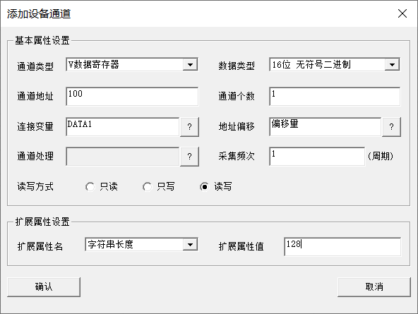

图7.1-1地址偏移设置

**地址偏移设置方法**

1.  选中通道表格中一个或多个通道，点击“连接地址偏移”按钮打开设备通道窗口设置地址偏移。多个通道可共用同一地址偏移，也可使用不同的地址偏移。
2.  选中通道表格中一个通道，在地址偏移列双击左键或者单击右键，打开通道连接变量选择窗口进行变量选择。
3.  选中通道表格中一个通道，在通道名称列双击左键或者单击右键，打开设备通道窗口设置地址偏移。
4.  设置完成后【设备编辑窗口】如图7.1-2所示

>   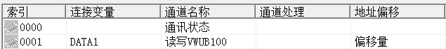

图7.1-2添加地址偏移完成

1.  进入用户【窗口0】，组态一个【输入框】构件，在它的【操作属性】功能页中关联变量【偏移量】。组态一个【标签】构件，勾选它的【显示输出】前的复选框，然后在【显示输出】功能页中关联变量【DATA1】，并选择其【输出值类型】为【数值量输出】。
2.  保存工程后，下载工程，然后启动运行。当变量【偏移量】=0时，变量【DATA1】的值为字地址VW100的值1000。用【输入框】设置【偏移量】=-10，则变量【DATA1】的值变为VW90的值900。同样的，用【输入框】设置【偏移量】=10，则变量【DATA1】的值变为VW110的值1100。如图7.1-3所示。

>     

图7.1-3地址偏移功能运行效果

## 7.2 变量指针应用样例

有的项目需要显示多路相同设备的状态，但限于触摸屏大小不能在一个画面中全部显示。这种情况下，一般是使用多个画面来显示多路设备的状态，但通过数据对象指针化的方式可以减少画面数量，实现在一个画面中即可显示全部设备状态的效果。

比如我们需要显示100路设备的温度，但在一个画面中不能全部显示，在没有指针化功能时，只能通过多个画面切换来观察100路设备的温度。而通过指针化功能，我们可以将100路设备的温度通过一个【指针数据对象（温度指针）】和【一个索引数据对象（温度索引）】关联在一起，然后通过调整温度索引的值，使画面中的温度指针发生对应的变化，即可观察所有设备的温度值。为了方便理解，本节样例只演示6个设备的温度通过指针化功能实现在屏幕上显示。使用指针化功能显示更多设备的温度的组态方式以此类推。

除数据组对象外，其它三种数据对象均可以配置指针化属性。当数据对象配置为指针化时，其属性将只能配置指针化属性，其它诸如报警、存储等属性都将不能配置。指针化数据对象的使用与普通数据对象相同，但在运行时会受到索引数据对象的值的束缚。

指针化配置有以下两种方式：

>   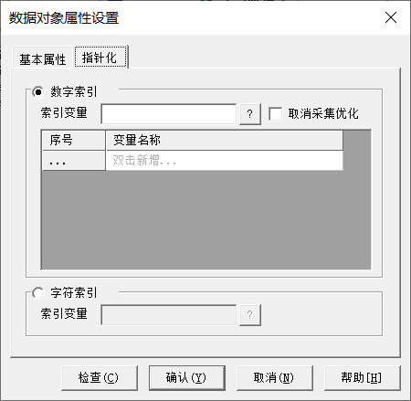

图 7.2-1 数据对象-指针化功能页

-   第一种是数字索引，即索引列表方式：
1.  在实时数据库中新建8个整数变量，名称依次为【温度指针】【温度索引】【设备0温度】至【设备5温度】。双击【温度指针】，勾选【设置指针化】，在【索引变量】处关联变量【温度索引】。然后双击下方列表的空白行增加一行，在列表中依次关联变量【设备0温度】至【设备5温度】。当需要关联的变量比较多的时候，可以使用右键的【导出数据】功能将数据导出为xml格式后，用Excel打开修改并再次保存为xml格式后使用右键的【导入数据】功能导入。

>   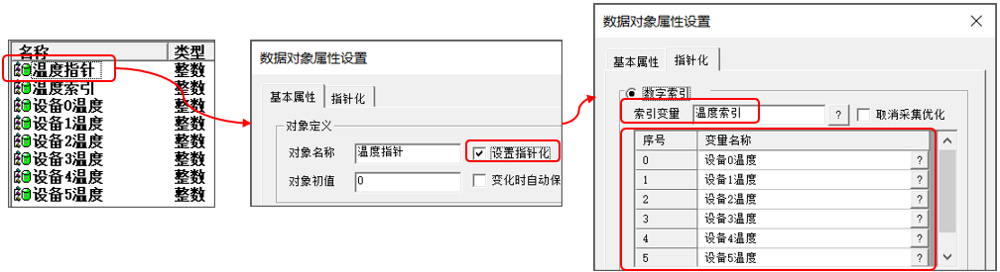

图 7.2-2 数字索引指针变量-设置流程图

1.  设置完成后，当【温度索引】=【0】时，【温度指针】=序号【0】对应的变量【设备0温度】，以此类推。

>   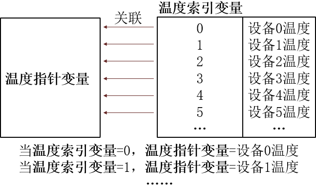

图 7.2-3 数字索引指针变量-效果

注意：数字索引变量的数据类型只能是整数或浮点数。当索引数据对象的字符内容指定的数据对象不存在或不正确时，指针数据对象操作将无效。

-   第二种是字符索引，即使用数据对象名索引的方式：

>   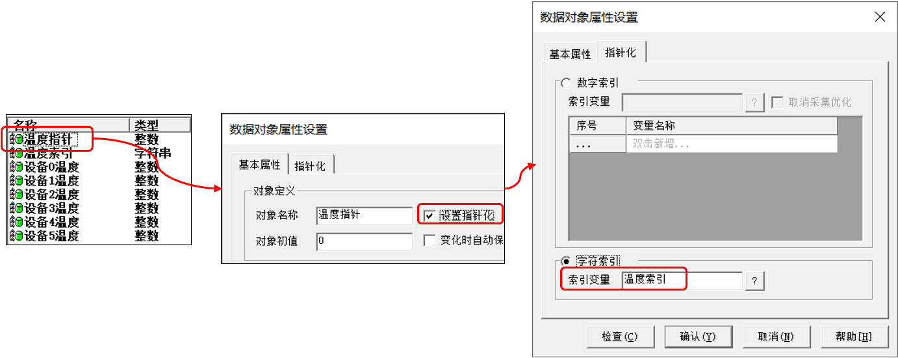

图 7.2-4 字符索引指针变量-设置流程图

相当于，字符串类型的【温度索引】变量=【设备0温度】的名字后，【温度指针】变量=【设备0温度】的值。

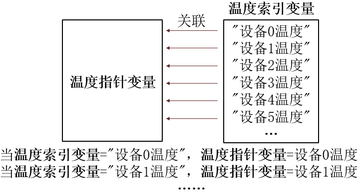

图 7.2-5 字符索引指针变量-效果

注意：字符串索引变量的数据类型只能是字符串。当索引数据对象的字符内容指定的数据对象不存在或不正确时，指针数据对象操作将无效。

# 

# 第8章 配方功能应用实例

在制造领域，配方是用来描述生产一件产品所用的不同配料之间的比例关系，是生产过程中一些变量对应的参数设定值的集合。例如面包厂生产面包时有一个配料配方。此配方列出所有要用来生产面包的配料（如水、面粉、糖、盐、蜂蜜等），而不同口味的面包会有不同的配料用量。例如甜面包会使用更多的糖，而低糖面包则使用更少的糖。在组态软件中，每一种口味的面包原料的用量信息称为一个配方，所有面包配方合起来称为配方组。可以把配方组想象成一张表格，表格的每一列就是一种原料，而每一行就是一个配方，单元格的数据则是每种原料的具体用量。

>   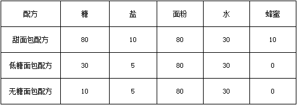

图 8-1 配方表格

在McgsPro系列产品配方功能可通过配方选择对话框，配方编辑对话框以及各种脚本操作来完成对配方数据的增、删、改、查等操作。下面对配方组态中涉及到的名词进行说明：

 配方组：配方组即同类配方所组成的集合，这一类配方拥有相同的配方成分，不同的是配方成分的数量不同，在配方组中可以使用配方名称来区分这些不同的配方。上表整体就为一个配方组。

 配方项：配方项就是配方的配方成分，如图8-1中糖、盐等。上表每一列即一个配方项。

 配方：配方组中的数据成员，每个配方的配方成分一致，数量不同。上表每一行就表示一个配方。

 变量名称：配方项关联的变量名称。

 列标题：配方项用于展示(配方构件、配方编辑时)的标题文本，支持多语言设置；在配方的导入和导出时，作为匹配依据，并且区分语言，即在英文状态下无法导入中文状态导出的配方。上表第一行即为列标题。

## 8.1组态配方组

使用配方功能需要先完成配方组的组态设计，然后才能使用配方构件或配方函数对配方进行显示和编辑。

-   使用McgsPro的配方功能组态一个面包配方组，配方组包含有三个配方：甜面包配方、低糖面包配方、无糖面包配方，每个配方有5个配方项：糖、盐、面粉、水和蜂蜜。
1.  创建关联配方项的变量：在实时数据库中新建5个浮点数型变量，名称依次为【糖】【盐】【面粉】【水】【蜂蜜】。

>   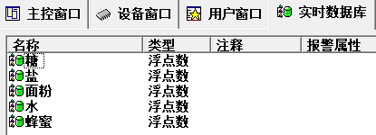

图 8.1-1 创建关联配方项的变量

1.  进入【配方组态设计】界面：点击菜单栏 → 工具 → 配方组态设计，进入【配方组态设计】界面。

>   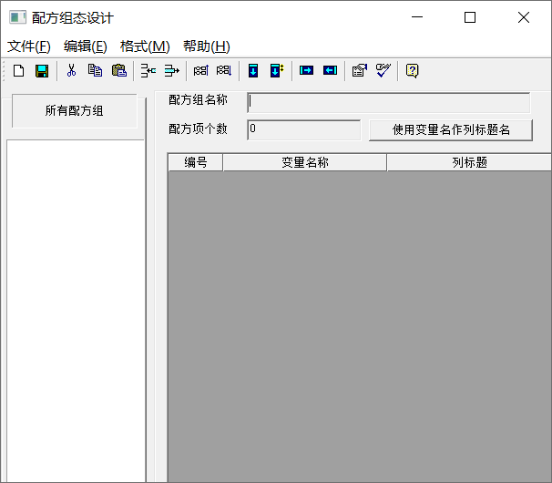

图 8.1-2 配方组态设计界面

1.  新建一个配方组并改名：用鼠标点击工具栏上的【新建】图标，增加一个配方组。然后右击新增加的配方组 → 配方组改名，将新配方组的名称改为【面包】。

>   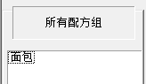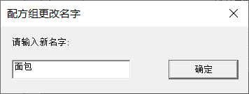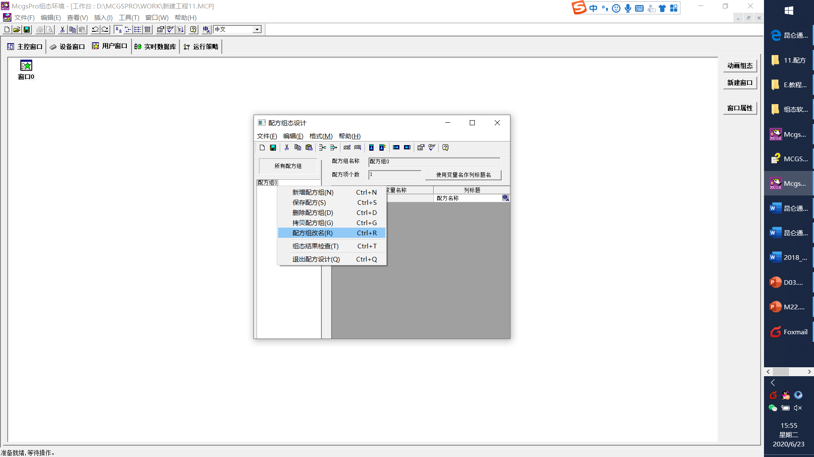

图 8.1-3 新建一个配方组并改名

1.  给配方组添加配方项：点击工具栏中的【增加一行】图标增加一行配方项 → 点击按钮弹出【变量选择】界面 → 按住Shift键选择对象【糖】【盐】【面粉】【水】【蜂蜜】 → 确认。可以看到，刚才选择的对象都出现在了配方项列表中。

>   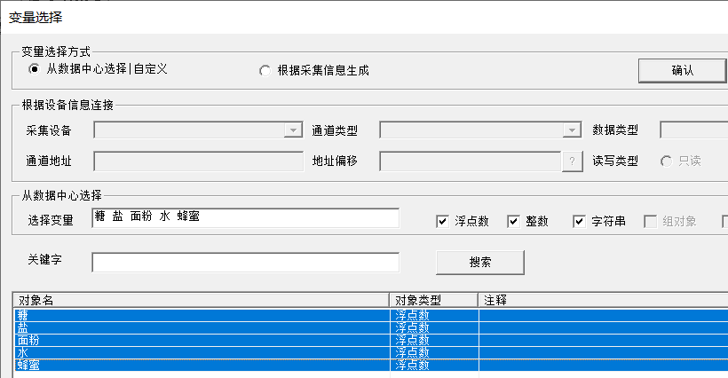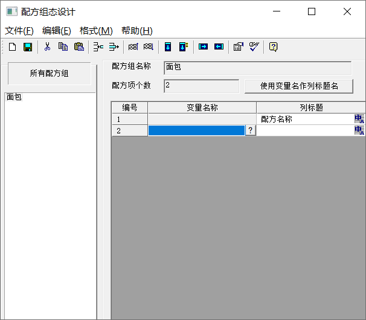

>   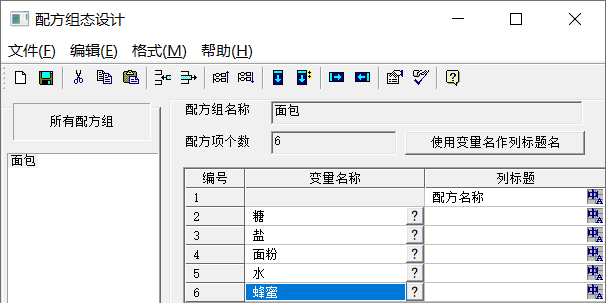

图 8.1-4 给配方组添加配方项

1.  然后点击配方项列表上方的【使用变量名做列标题名】按钮，将变量名称添加为配方的列标题名。此时，相当于组态好了配方组的如图8.1-5红框所示部分的内容：

>   

图 8.1-5 配方组列表

1.  双击配方组名【面包】或点击上方工具栏中的【编辑配方】图标 → 点击三次【增加一行】图标，在下方的列表中输入如图8.1-6所示的内容 → 点击【保存】图标保存设置后关闭界面。

>   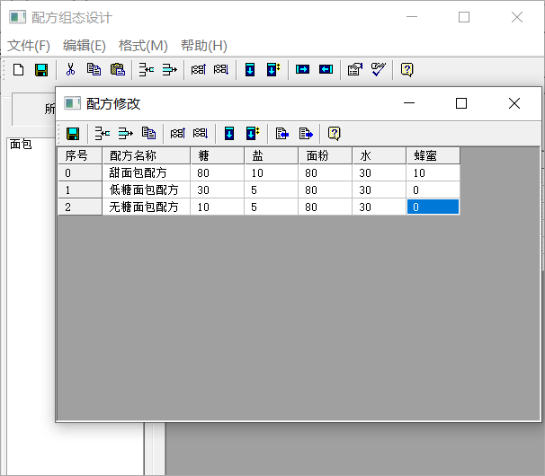

图 8.1-6 增加三条配方

-   配方的导入导出

    在组态过程中，McgsPro组态软件支持将配方组以CSV格式导出到电脑中，然后使用Excel打开表格进行修改。修改完成后将表格再次保存为CSV格式后导入到McgsPro组态软件中。

1.  将配方组导出到CSV文件：双击配方组 → 点击【导出】图标 → 选择保存路径 → 保存。

>   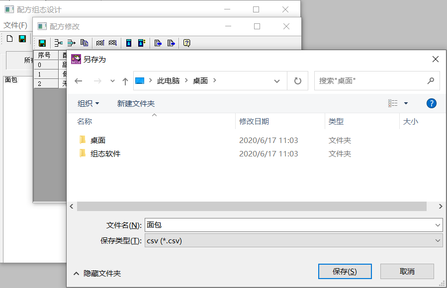

图 8.1-7 导出配方

1.  使用Excel打开导出的CSV文件按需要对配方组进行修改。修改完成后依然保存为CSV格式。本样例将【无糖面包配方】中【糖】的含量从10修改为0，然后依然保存为CSV文件。

>   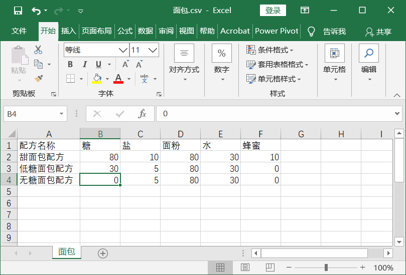

图 8.1-8 使用Excel修改配方

1.  点击【配方修改】窗口中工具栏上的【导入】图标，在弹出的窗口中选择刚才修改好的CSV文件后点击【打开】。

>   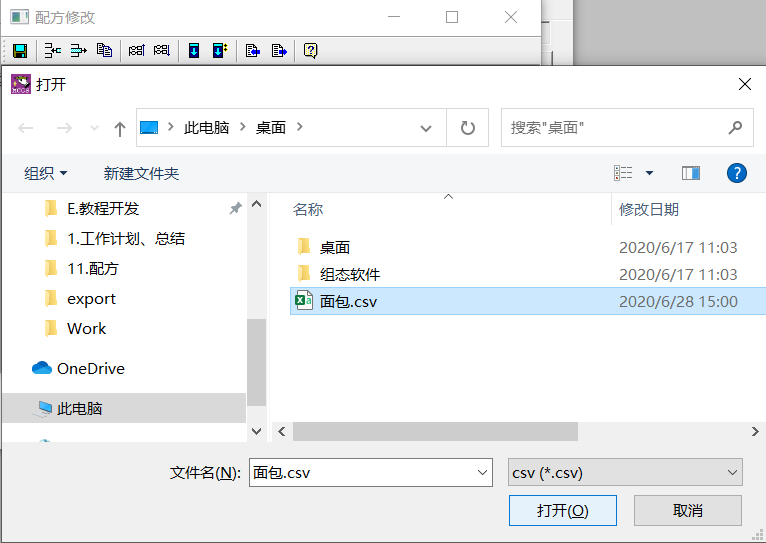

图 8.1-9 导入配方

1.  可以看到，导入后的配方组中，【无糖面包配方】中【糖】的含量变成了0。

>   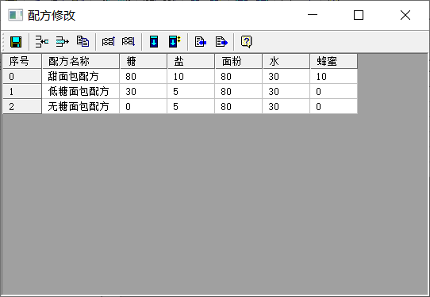

图 8.1-10 导入配方效果

## 8.2 配方构件控制生产工艺

组态完配方组后，还需要对配方组进行显示和编辑，本节介绍使用【配方】构件来控制面包生产工艺的组态过程。

### 8.2.1 组态配方构件

1.  从工具栏中将【配方】构件拖拽到画面中合适的位置和合适的大小。

>    

图 8.2-1 在画面中添加配方构件

1.  设置配方构件【基本属性】：双击【配方】构件，打开【配方构件属性设置】界面。按需求设置【基本属性】功能页中的内容。为了使标题行更醒目，本节样例将【背景颜色】设置为【青色】，将【字符颜色】设置为【白色】，其他设置保持默认不变。

>   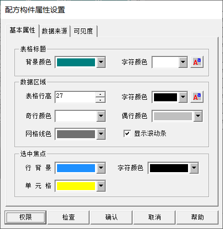

图 8.2-2 配方构件基本属性功能页

**基本属性配置信息：**

1.  表格标题-背景颜色：标题行背景颜色；
2.  表格标题-字符颜色：标题行字符颜色；
3.  表格标题-字符设置：标题行字符、字形、大小设置；
4.  数据区域-表格行高：表格每行高度，包括标题行；
5.  数据区域-字符颜色：表格除标题行的字符颜色；
6.  数据区域-字符设置：标题行字符、字形、大小设置；
7.  数据区域-奇行颜色：表格奇数行背景颜色；
8.  数据区域-偶行颜色：表格偶数行背景颜色；
9.  数据区域-网格线色：表格线颜色；
10. 数据区域-是否显示滚动条：运行时构件是否绘制滚动条；
11. 选中焦点-行背景：焦点行背景颜色；
12. 选中焦点-单元格：焦点单元格背景颜色；
13. 选中焦点-字符颜色：焦点行字符颜色。
14. 设置配方构件【数据来源】：然后点击进入【数据来源】功能页，在【配方组】处的下拉菜单中选择8.1中设置好的【面包】配方组。勾选【全显示】，【全编辑】，调整【列宽】到合适的宽度使字体能全部显示。点击确认保存设置并关闭设置界面。

>   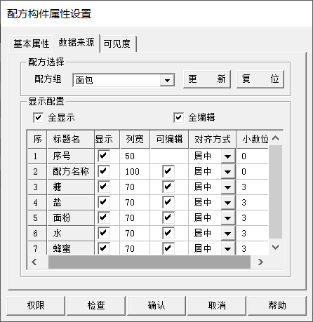

图 8.2-3 配方构件数据来源功能页

**数据来源配置信息：**

1.  配方组：下拉框选择构件关联配方组。
2.  更新：修改配方组后需点击更新按钮使配方组最新。
3.  复位：关联配方显示配置初始化。
4.  全显示：全部列均显示或不显示。
5.  全编辑：除序号列外全部列在运行时可以或者不可以点击编辑。
6.  标题名：配方项显示名称，多语言时根据语言切换，无法修改。
7.  显示：控制指定列是否显示。
8.  列宽：控制指定列列宽。
9.  可编辑：控制指定列（序号列除外）是否可在运行时点击编辑。
10. 对齐方式：控制指定列文本对齐方式（左对齐/居中/右对齐）。
11. 小数位数：控制指定列数值显示时的小数位数。
12. 设置完成后，配方构件在画面中显示如图8.2-4所示。如果配方组内容显示不全，可以选中构件后，拖拽边框上出现的白色方框进行调整。

>   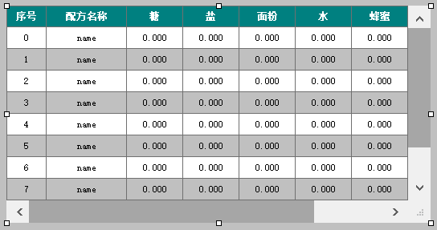

图 8.2-4 配方构件组态完成效果图

1.  运行演示：保存工程后，下载工程，然后启动运行。如图 8.2-5所示，配方构件显示了8.1中组态的配方组。鼠标选中的行变成了8.2.1中设置的蓝色，鼠标选中的单元格变成了设置的黄色。除了第一行的列标题和第一列的序号外，表格中的内容都可以通过双击表格弹出的键盘进行修改。通过右侧和下方的滚动条可以拉动

>   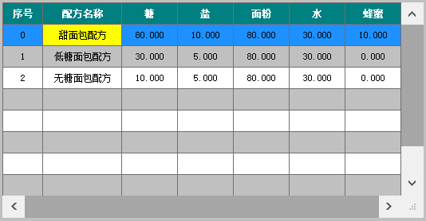

图 8.2-5 配方构件运行效果

### 8.2.2 配方构件方法应用

在运行状态下，常常也需要对配方组进行操作。本节重点介绍如何使用配方构件方法函数对运行状态下的配方组进行操作。

#### 8.2.2.1 新增/删除一条配方。

-   **新增一条配方**
1.  组态拖拽一个【标准按钮】构件到画面中，双击该构件，在其【基本属性】功能页中将文本修改为【新增】。进入【脚本程序】功能页，点击下方的【打开脚本程序编辑器】弹出【脚本程序】编辑窗口。在右侧的对象树中依次点击：用户窗口 → 窗口0 → 控件0[配方] → 方法，双击【Add】，则左侧的脚本编辑框中出现一行脚本【窗口0.控件0.Add】。点击保存后关闭窗口。

>    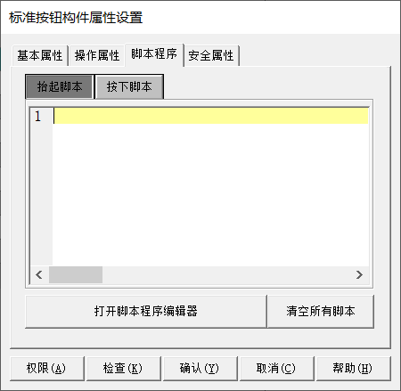

>   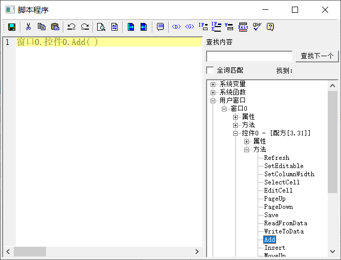

图 8.2-6 配方构件方法函数

**配方构件方法函数解释：**

1.  Refresh( )：刷新配方构件数据
2.  SetEditable(列索引, 编辑标志)：设置配方构件指定列是否可编辑
3.  SetColumnWidth(列索引，列宽)：设置配方构件指定列列宽
4.  SelectCell(行索引，列索引)：设置构件选中配方行与单元格
5.  GetName( )：获取当前配方的配方名称
6.  EditCell( )：编辑构件当前选中单元格
7.  PageUp( )：上翻页
8.  PageDown( )：下翻页
9.  Save( )：配方数据存盘
10. ReadFromData( )：读取配方关联变量当前数据写入构件光标所在配方数据
11. WriteToData( )：将构件光标所在配方数据写入配方关联变量中
12. Add( )：在配方末尾新增配方
13. Insert( )：配方构件光标所在配方前插入配方
14. Copy( )：配方构件光标所在配方拷贝后插入到下一条配方，并定位
15. MoveUp( )：配方构件光标所在配方前移一个位置
16. MoveDown( )：配方构件光标所在配方后移一个位置
17. Delete( )：删除配方组处于构件光标位置的配方
18. Import( )：从csv文件中导入配方数据
19. Export( )：导出配方数据到csv文件
20. 保存工程后下载工程，然后启动运行。通过点击【新增】按钮，可以在配方构件中新增一行，然后双击表格进行修改。

>   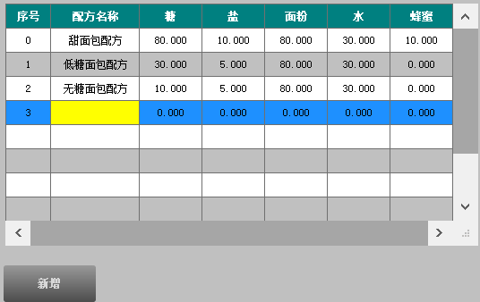

图 8.2-7 在配方构件中新增一行

-   删除一条配方：用和新增一条配方同样的方法，建一个【标准按钮】构件，将它的文本修改为【删除】，设置抬起脚本为【窗口0.控件0. Delete（）】。它的作用是删除配方组处于构件光标位置的配方。

#### 8.2.2.2 配方数据的上传与下载

-   从PLC上传数据到配方：在用户窗口中新建一个【标准按钮】构件，将它的文本修改为【上传】，用8.2.2.1中的步骤，设置抬起脚本为【窗口0.控件0. ReadFromData( )】。在运行状态下点击该按钮，可读取配方关联变量当前数据写入构件光标所在配方数据中。
-   将配方数据下载到PLC：在用户窗口中新建一个【标准按钮】构件，将它的文本修改为【下载】，用8.2.2.1中的步骤，设置抬起脚本为【窗口0.控件0.WriteToData( )】。在运行状态下点击该按钮，可将构件光标所在配方数据写入配方关联变量中。

#### 8.2.2.3 配方的导入导出

在运行状态下，也可以将配方导出到CSV文件，使用Excel打开修改后，保存为CSV文件再导入到配方中。导入导出文件名为配方组名称，屏幕上文件路径为U盘路径，Windows模拟运行环境上，文件应位于../安装目录/Program/export目录下。

-   配方的导出：在用户窗口中新建一个【标准按钮】构件，将它的文本修改为【导出】，用8.2.2.1中的步骤，设置抬起脚本为【窗口0.控件0. Export（）】。
-   配方的导入：在用户窗口中新建一个【标准按钮】构件，将它的文本修改为【导入】，用8.2.2.1中的步骤，设置抬起脚本为【窗口0.控件0. Import（）】。导入文件名为配方组名称，文件中数据结构需要与配方结构一致，否则会导入失败。

#### 8.2.2.4 配方数据的保存

-   在用户窗口中新建一个【标准按钮】构件，将它的文本修改为【保存】，用8.2.2.1中的步骤，设置抬起脚本为【窗口0.控件0.Save( )】。工程运行时按下按钮，系统将会把配方数据存盘到屏。掉电时没有保存的修改内容将会丢失。

## 8.3 配方函数控制生产工艺

在当前画面中没有配方构件时，将不能使用配方构件方法函数，且初始时配方处于未加载状态，此时可以使用配方脚本函数对运行环境中的配方进行操作。本节继续使用8.1中组态好的面包配方组工程。

### 8.3.1 配方的加载和关闭

-   **!RecipeLoad(配方组名称)：**加载指定配方组

**实 例：**!RecipeLoad(“面包”)

**注意事项：**!RecipeLoad函数的调用和配方构件的存在均可以使配方变为已加载状态， **只有当配方组处于已加载时，其他的配方函数才可以正确执行**。配方已加载情况下再次加载不影响已加载状态。

-   **!RecipeClose(配方组名称)：** 关闭配方组

**实 例：**!RecipeClose(“面包”)

**注意事项：**函数可以使配方关闭，离开已加载状态，但是不会保存配方数据到磁盘文件。

### 8.3.2 选择与修改配方

-   **!RecipeLoadByDialog(配方组名称,对话框标题)：**弹出配方选择对话框选择配方。

**实 例：** !RecipeLoadByDialog(“面包”,”配方选择”)，效果如图8.3-1所示。

>   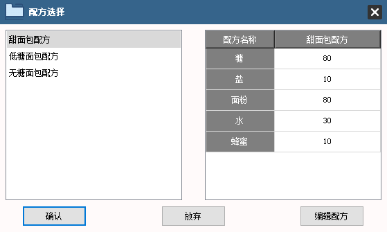

图 8.3-1 配方选择窗口

-   除了使用上图中的【编辑配方】按钮进入【配方编辑窗口】，还可以使用脚本函数实现该功能。

**!RecipeModifyByDialog(配方组名称)：**弹出配方编辑对话框供配方编辑。

**实 例：**!RecipeModifyByDialog(“面包”)，效果如图8.3-2所示，在此窗口中可实现配方的增加、删除、拷贝、上移、下移、存盘等操作。

>   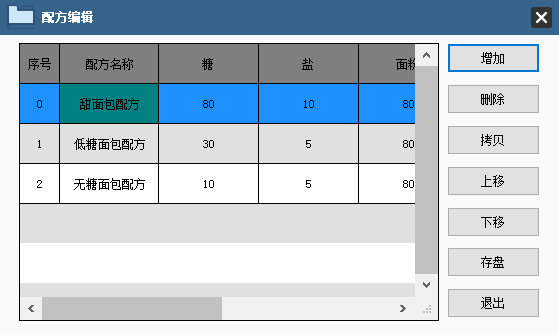

图 8.3-2 配方编辑窗口

### 8.3.3 配方数据的上传与下载

-   上传：

**!RecipeGetValueFrom(配方组名称,组对象)：**将组对象中变量的当前值写入到配方组当前配方中

**实 例：**在实时数据库中新建一个组对象【配方组】，将配方项关联的变量【糖】【盐】【面粉】【水】【蜂蜜】设置为该组对象的成员。脚本!RecipeGetValueFrom(“面包”,组对象)的运行效果是：将组对象【配方组】中的变量【糖】【盐】【面粉】【水】【蜂蜜】的当前值写入到配方组【面包】的当前配方中。

-   下载：

**!RecipeGetCurrentValue(配方组名称)：**获取当前配方数据写入到关联变量中

**实 例：** 脚本!RecipeGetCurrentValue(“面包”)的运行效果是：获取配方组【面包】的当前配方数据写入到关联的变量【糖】【盐】【面粉】【水】【蜂蜜】中。

### 8.3.4 配方的导入导出

-   导出：

**!RecipeToCsv(配方组名称,文件名,导出列名,起始编号,期望导出条数,实际导出条数,导出参数)：**导出指定配方数据到CSV文件。

**参数说明：**配方组名称，字符串，指定配方组

文件名，字符串，csv文件名，不含”\\\\”、”/”、”..”等非法字符  
导出列名，字符串，需要导出的列的集合，英文逗号分割，空表示全部列  
起始编号，整数，从起始编号开始导出配方数据  
期望导出条数，整数，希望导出配方的数目  
实际导出条数，整数，实际导出的配方数目，此为输出参数  
导出参数，整数  
BIT0表示导出数据的方式  
BIT0 = 0：代表保存现有数据，并追加到文件尾部  
BIT0 = 1：代表删除文件中现有数据，写入导出数据  
BIT1表示控制导出数据的内容  
BIT1 = 0：代表包含配方组成员字段名称  
BIT1 = 1：代表不包含配方组成员字段名称

**实 例：**脚本!RecipeToCsv(“面包”,“面包.csv”,“”,0,100,实际导出条数,3)的运行效果是：将配方组【面包】的数据，导出到U盘目录下名为【面包.CSV】的文件中，导出全部列，从编号0开始导出，最多导出100条，把实际导出条数保存的变量【实际导出条数】中。导出时，删除文件中现有的数据，写入导出数据，导出数据不包含配方组成员字段名称。

**注意事项：**导出路径为U盘目录，导出配方时建议只插入一个U盘，避免系统找不到U盘。Windows模拟运行环境导出目录为../安装目录/Program/export。

-   导入：

**!CsvToRecipe(配方组名称,文件名,导入列名,期望导入条数,实际导入条数,导入参数)：**从Csv文件中导入数据到配方组

**参数说明：**配方组名称，字符串，指定配方组

文件名，字符串，csv文件名，不含”\\\\”、”/”、”..”等非法字符  
导入列名，字符串，需要导入的列的集合，英文逗号分割，空表示全部列  
期望导入条数，整数，希望导入配方的数目  
实际导入条数，整数，实际导入的配方数目，此为输出参数  
导入参数，整数  
BIT0表示导入数据的方式  
BIT0 = 0：代表更新导入文件数据，已有配方更新数据，没有的配方新增配方数据  
BIT0 = 1：代表删除配方现有数据，导入文件数据  
BIT1表示导入文件是否有文件列标题  
BIT1 = 0：代表文件中不包含列标题字段  
BIT1 = 1：代表文件中包含列标题字段

**实 例：**脚本!CsvToRecipe(“面包”,“面包.csv”,“”,100,实际导入条数,2)的作用是：将文件名为【面包.CSV】的文件数据导入到配方组【面包】中，导入配方的全部列，最多导入100行，将实际导入条数保存到变量【实际导入条数】中。导入时，更新已有配方数据，新增没有的配方数据，且导入文件包含文件列标题。

**注意事项：**导入配方时建议只插入一个U盘，避免系统找不到U盘。Windows模拟运行环境导入目录为../安装目录/Program/export中。此外，目前配方导入不支持分列导入，在写配方导入时导入列名请保持为空列名，始终导入全部列。

### 8.3.5 配方的保存

**!RecipeSave(配方组名称)**：将当前配方组数据写入磁盘文件中保存

**实 例：** 配方返回值 = !RecipeSave(“面包”)

**注意事项：**未保存配方掉电时，未保存内容将会丢失。

## 8.4 顺序控制器功能

顺序控制器：通过执行事先配置好的动作，控制设备的运行，使产品生产流程安全可靠。本节教程我们以点胶机为例学习顺序控制功能。如图8.4-1，以配方构件为主，通过配方构件脚本函数，模拟点胶机的动作，按照预置动作步骤，完成点胶。

>   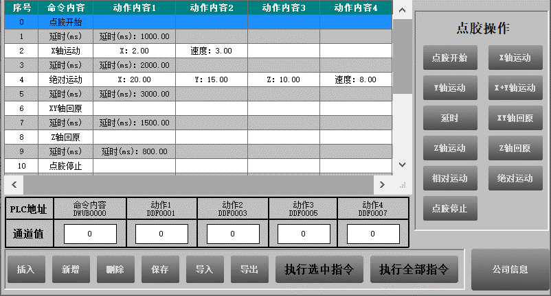

图8.4-1 点胶机 控制画面

-   **点胶机控制画面功能解释**

a . 点胶机预置指令：由配方构件显示的点胶机动作指令。

b . 点胶操作：提供点胶机指令内容设置功能，点击按钮可插入对应的点胶指令。

c . PLC通道值显示：显示当前点胶机正在执行的控制指令。

d . 点胶机流程控制：增删、保存、导入、导出点胶指令，以及执行选中的指令，或者执行全部指令。

-   **点胶机操作流程：**

工程运行时，用户首先通过“d . 点胶机流程控制”插入指令行；然后在“a . 点胶机预置指令”选中插入的指令行；再通过“b . 点胶操作”设置选中指令行当命令内容；最后点击途中的“保存“按钮，保存命令内容。完成以上操作，点击“指令选中指令”或“执行全部指令”，将指定的命令内容和动作内容下发到PLC。

下面介绍顺序控制器点胶机点胶功能组态：

方案：本节教程下位机采用三菱FX0N PLC，通讯协议采用“三菱FX系列串口”。使用McgsPro提供的配方功能存储点胶机控制指令，通过配方构件显示当前的预置指令，并用配方构件方法函数完成预置指令插入、修改指令内容、保存，并支持将预置的控制指令下载到PLC。

**首先进行配方功能组态：**

1.  新建变量：通过McgsPro组态软件新建一个工程，进入工程的“实时数据库”，如图8.4-2，新增 5个字符串变量：“命令内容”、“动作内容1”、“动作内容2”、“动作内容3”、“动作内容4”（这5个字符串变量用于配方项关联，以及在配方构件中显示控制指令）；以及新增整数变量“命令内容_数值”，浮点数变量“动作内容1_数值”、“动作内容2_数值”、“动作内容3_数值”、“动作内容4_数值”，用来保存转换成数值的命令和动作内容。另外，再新增1个整数变量“使能”，在工程运行时，通过该变量控制按钮的使能功能，防止现场用户误操作。

>   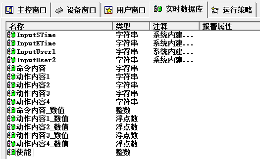

图8.4-2 新建配方项变量

1.  进入配方组态：如图8.4-3，通过软件菜单栏 “工具”→“配方组态设计”，进入配方组态设计界面

>   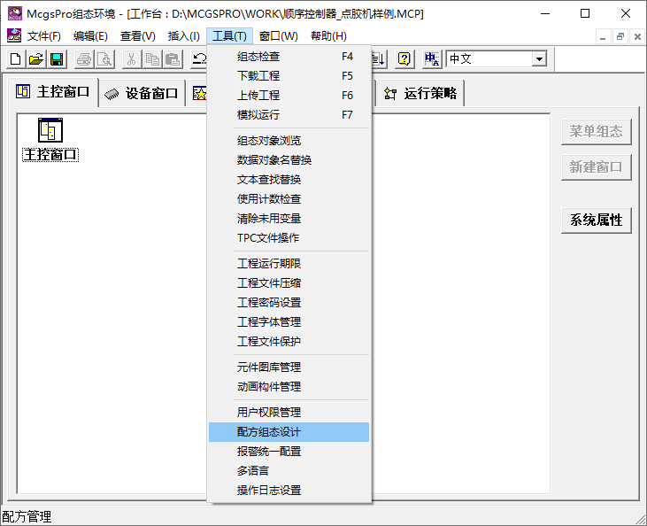 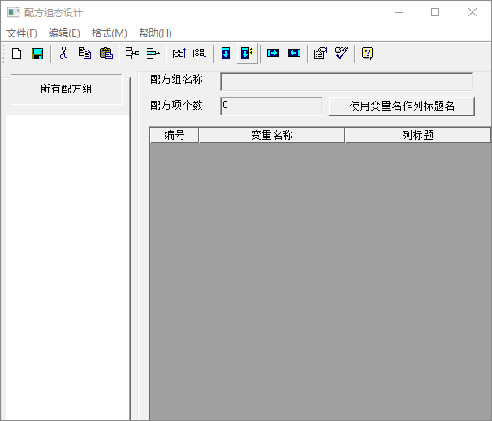

图8.4-3 进入配方组态设计

1.  配方功能组态：如图8.4-4，在配方组态设计页面新增配方组“点胶机工艺”，再新增配方项，并在新增的配方项中关联变量“命令内容”、“动作内容1”、“动作内容2”、“动作内容3”、“动作内容4”。配方组态完成，保存并关闭配方组态设计界面。

>   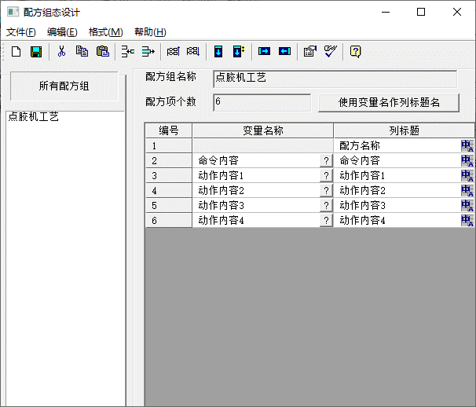

图8.4-4 配方功能组态

1.  添加驱动：如图8.4-5，双击工作台中的“设备窗口”，在设备窗口界面添加“通用串口父设备”和“三联FX系列串口”驱动，驱动添加方法参考入门篇章节3.5.2。

>   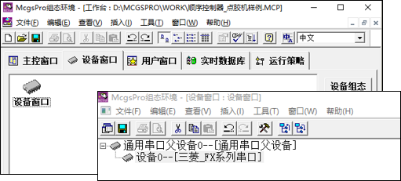

图8.4-5 添加驱动：三菱FX系列串口

1.  增加设备通道：双击上图的“三菱_FX系列串口”，进入图8.4-6所示的设备编辑窗口，通过“增加设备通道”按钮，新增PLC通道，选择D寄存器，通道地址地址0、1、3、5、7，用于接收触摸屏发送的点胶控制指令。

注意：增加设备通道前，请先通过“删除设备通道”，删除用户不需要的默认通道。

>   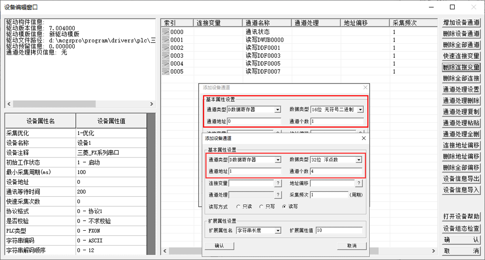

图8.4-6 增加设备通道

1.  快速连接变量：如图8.4-7，通过【快速连接变量】→【默认设备变量连接】，为设备通道中关联变量。

>   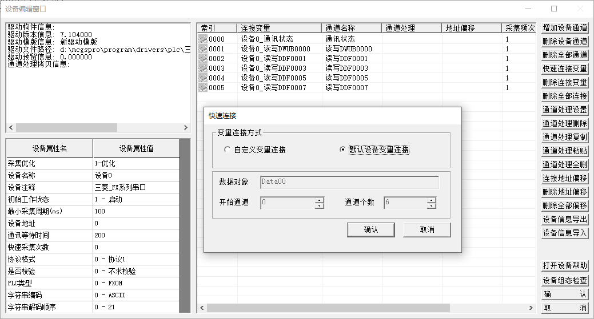

图8.4-7 快速连接变量

1.  添加变量：完成上图设置后，点击设备编辑窗口右下方的确认按钮，弹出图8.4-8所示的“添加变量”界面，点击“全部添加”，将“连接变量”添加到实时数据库。

>   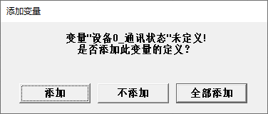

图8.4-8 添加变量

**完成以上操作，下面进行配方构件组态：**

1.  新建窗口：首先进入工作台“用户窗口”，新建一个窗口，并修改窗口名为“点胶操作”。
2.  窗口画面组态：双击窗口“点胶操作”，进入其窗口组态画面，通过工具箱添加配方构件、输入框构件、标签构件，组态如图8.4-9所示画面。

>   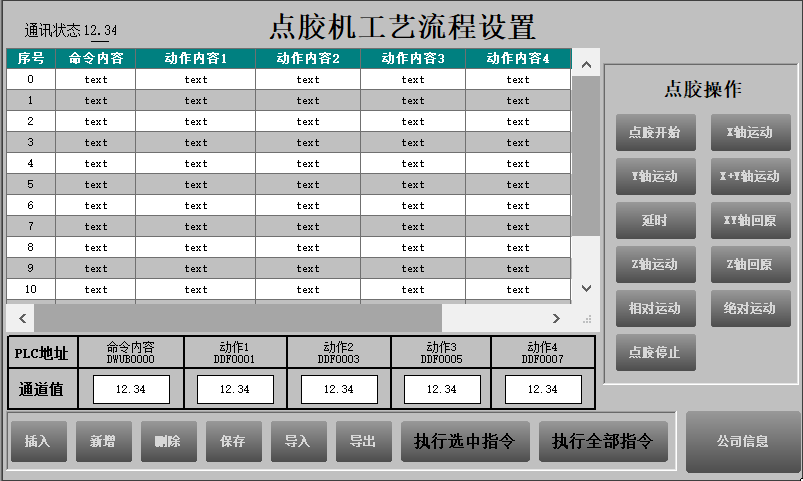

图8.4-9 窗口画面组态

1.  配方构件设置：双击上图绘制的配方构件，按照图8.4-10设置配方构件。

>    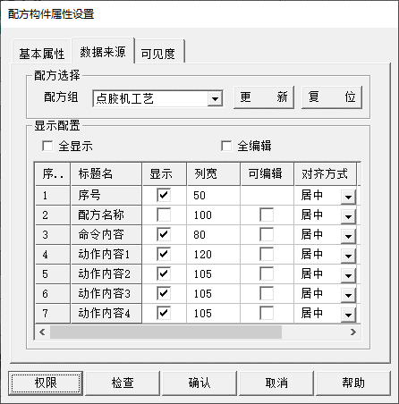

图8.4-10 配方构件设置

**完成配方构件组态，下面进行点胶操作组态：**

1.  点胶操作组态：如图8.4-11所示，依次组态图中所示的点胶命令。

>   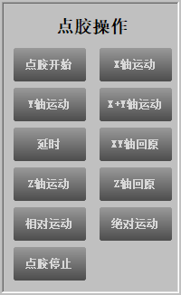

图8.4-11 点胶命令展示

**注意：工程运行时，选中配方构件显示的配方，点击“点胶操作”中的命令，可将对应的点胶命令内容写入所选配方。**

1.  点胶开始：在“点胶开始”按钮的脚本程序中，添加图8.4-12所示脚本，用于插入“点胶开始”命令。

>   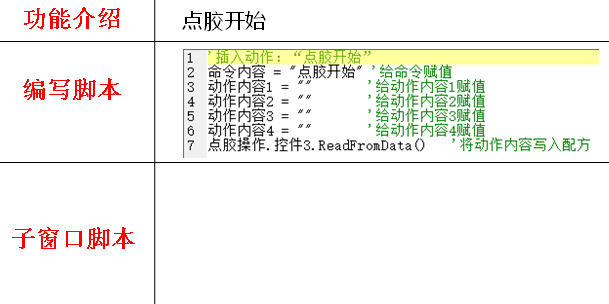

图8.4-12 点胶命令组态：点胶开始

1.  X轴运动：在“X轴运动”按钮的脚本程序中，添加图8.4-13所示脚本，用于打开子窗口“X轴”。并在子窗口“X轴”中组态如图8.4-13所示的窗口画面和脚本。

>   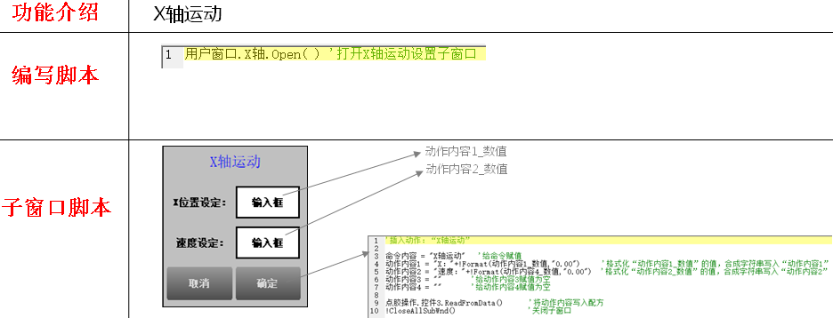

图8.4-13 点胶命令组态：X轴运动

**注意：组态“X轴运动”需要新建用户窗口（窗口名称如图8.4-13所示：“X轴”），并将其设置为子窗口，子窗口设置方法参考进阶篇章节4.2.4。**

1.  Y轴运动：在“Y轴运动”按钮的脚本程序中，添加图8.4-14所示脚本，用于打开子窗口“Y轴”。并在子窗口“Y轴”中组态如图8.4-14所示的窗口画面和脚本。

>   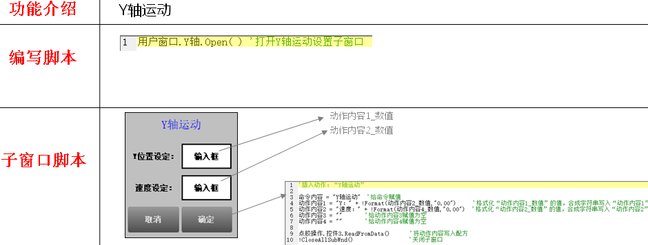

图8.4-14 点胶命令组态：Y轴运动

1.  X+Y轴运动：在“X+Y轴运动”按钮的脚本程序中，添加图8.4-15所示脚本，用于打开子窗口“XY轴”。并在子窗口“XY轴”中组态如图8.4-15所示的窗口画面和脚本。

>   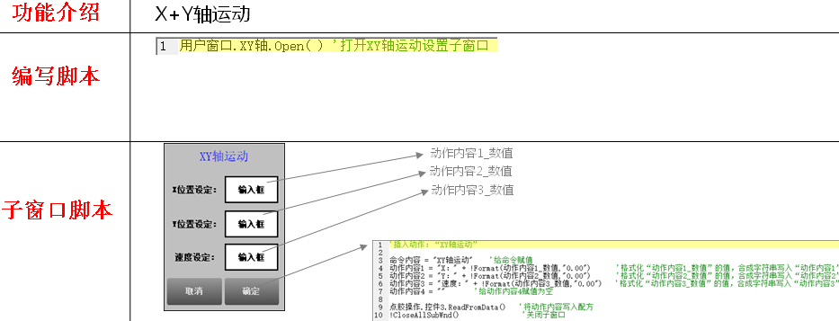

图8.4-15 点胶命令组态：X+Y轴运动

1.  延时：在“延时”按钮的脚本程序中，添加图8.4-16所示脚本，用于打开子窗口“延时”。并在子窗口“延时”中组态如图8.4-16所示的窗口画面和脚本。

>   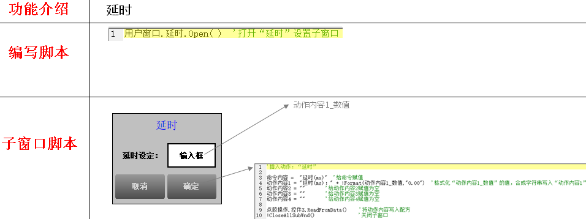

图8.4-16 点胶命令组态：延时

1.  XY轴回原：在“XY轴回原”按钮的脚本程序中，添加图8.4-17所示脚本，用于插入“XY轴回原”命令。

>   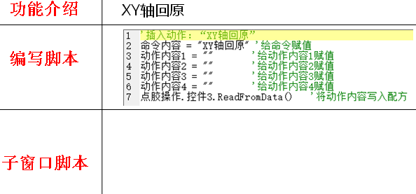

图8.4-17 点胶命令组态：XY轴回原

1.  Z轴运动：在“Z轴运动”按钮的脚本程序中，添加图8.4-18所示脚本，用于打开子窗口“Z轴”。并在子窗口“Z轴”中组态如图8.4-18所示的窗口画面和脚本。

>   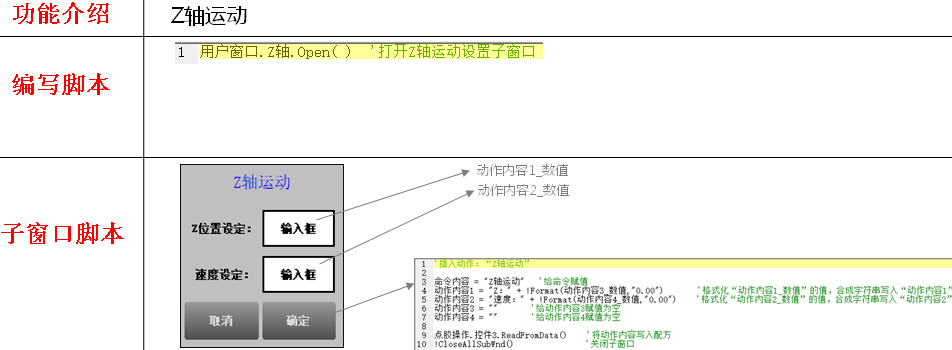

图8.4-18 点胶命令组态：Z轴运动

1.  Z轴回原：在“Z轴回原”按钮的脚本程序中，添加图8.4-19所示脚本，用于插入“Z轴回原”命令。

>   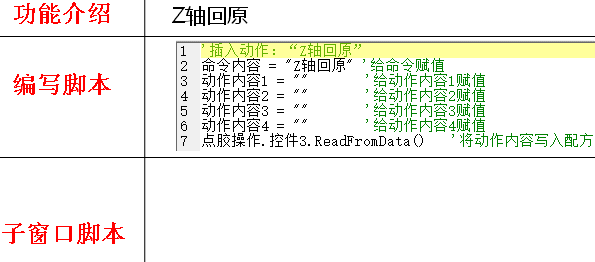

图8.4-19 点胶命令组态：Z轴回原

1.  相对运动：在“相对运动”按钮的脚本程序中，添加图8.4-21所示脚本，用于打开子窗口“相对运动”。并在子窗口“相对运动”中组态如图8.4-20所示的窗口画面和脚本。

>   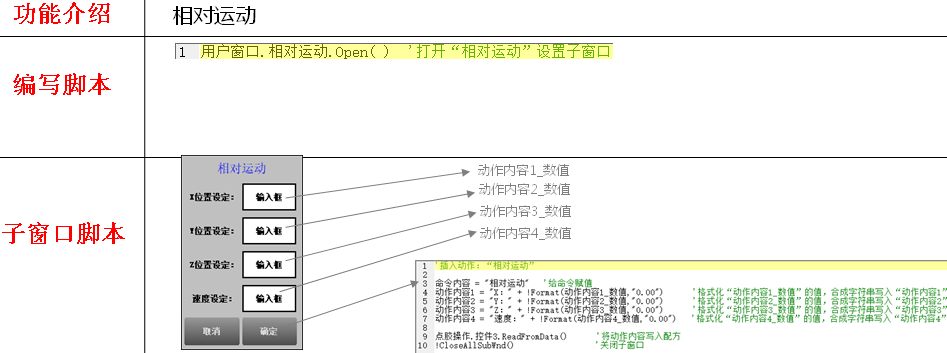

图8.4-20 点胶命令组态：相对运动

1.  绝对运动：在“绝对运动”按钮的脚本程序中，添加图8.4-21所示脚本，用于打开子窗口“绝对运动”。并在子窗口“绝对运动”中组态如图8.4-21所示的窗口画面和脚本。

>   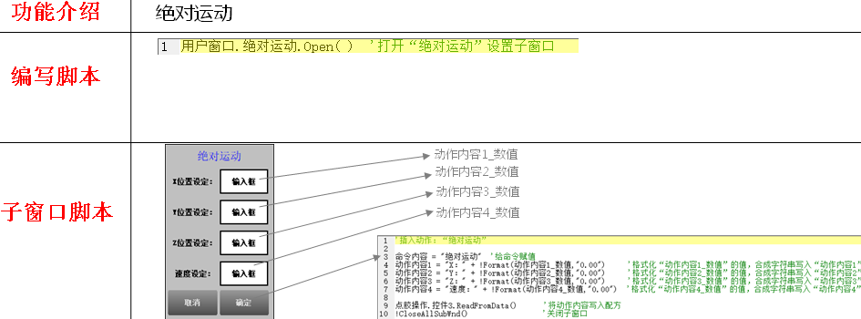

图8.4-21 点胶命令组态：绝对运动

1.  点胶停止：在“点胶停止”按钮的脚本程序中，添加图8.4-22所示脚本，用于插入“点胶停止”命令。

>   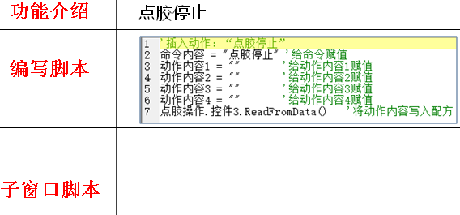

图8.4-22 点胶命令组态：点胶停止

**完成点胶操作组态，下面组态配方操作功能：**

1.  配方构件方法函数：通过配方构件方法函数实现配方操作，用户可以在工程运行时插入、新增、删除、保存、导入、导出配方。本期教程需要添加的方法函数如图8.4-23所示。配方构件方法函数添加方法请参考：进阶篇_8.2.2 配方构件方法应用。

>   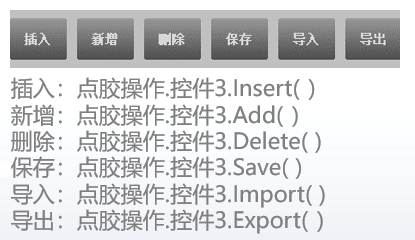

图8.4-23 组态配方构件方法函数

**完成配方操作功能组态，下面进行点胶指令执行组态：**

1.  由于点胶指令中有延时功能，所以点胶脚本需要添加到策略中，本期教程我们在用户策略中添加点胶指令执行脚本，再通过标准按钮构件执行用户策略。本期教程需组态图8.4-24所示的“执行选中指令”、“执行全部指令”功能。

>   

图8.4-24 组态执行点胶指令功能

1.  执行选中指令：用户需要在“运行策略”中新建用户策略，策略名命名为“执行选中指令”。并在策略“执行选中指令”中新增一个策略行，再添加图8.4-26所示脚本，最后通过图8.4-25所示的标准按钮构件“执行选中指令”调用该策略，实现工程运行时点击按钮“执行选中指令”，即可将当前配方构件中选择的指令下载到PLC。

>   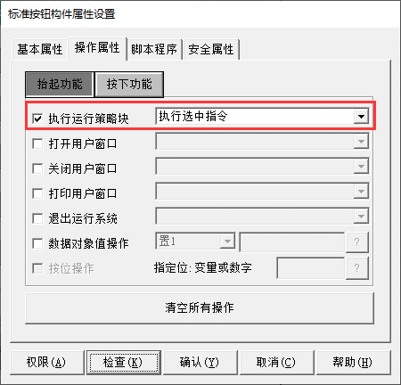 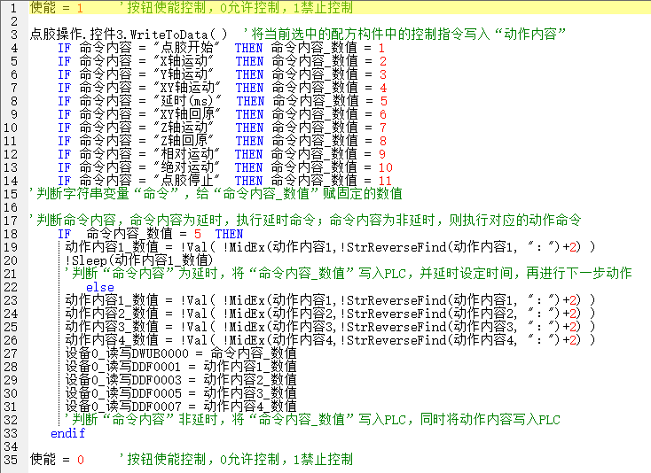

图8.4-25 标准按钮：执行选中指令 图8.4-26“执行选中指令”策略脚本内容

1.  执行全部指令：用户需要在“运行策略”中新建用户策略，策略名命名为“执行全部指令”。并在策略“执行全部指令”中新增一个策略行，再添加图8.4-28所示脚本，最后通过图8.4-27所示的标准按钮构件“执行选中指令”调用该策略，实现工程运行时点击按钮“执行全部指令”，即可将当前配方中的全部指令依次下载到PLC。

>   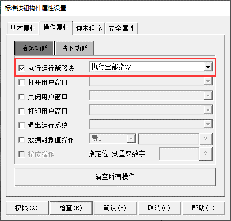 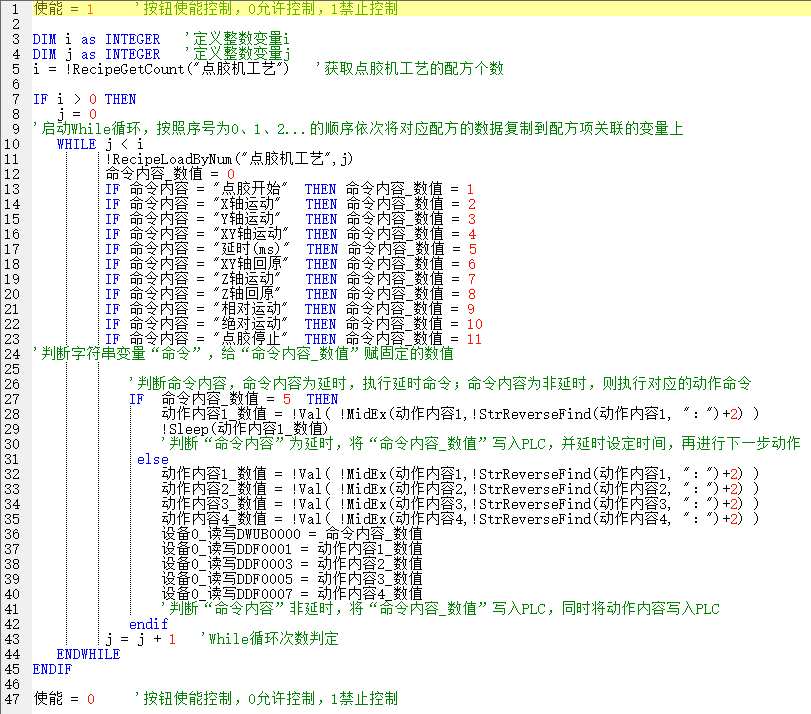

图8.4-27 标准按钮：执行全部指令 图8.4-28“执行全部指令”策略脚本内容

**完成点胶指令执行组态，下面进行使能功能组态：**

1.  使能组态：使能功能组态不属于必要功能，主要为了防止用户在点胶指令执行过程时误操作。参考图8.4-26、图8.4-28，脚本的开头将变量“使能”赋值为1，脚本执行结束后将变量“使能”赋值为0，我们可以在用户窗口“点胶操作”中所有标准按钮构件的“安全属性”页面关联变量“使能”，使点胶指令在执行时，对应的标准按钮构件失效。如图8.4-29所示。

>   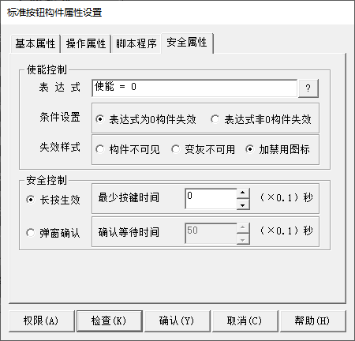

图8.4-29 使能功能组态

**完成点击质量执行组态，下面组态PLC通道值显示**：

1.  PLC通道值显示组态：如图8.4-30所示，在通道值所在行的标签构件中勾选“显示输出”，并依次关联变量“设备0_读写DWUB0000”、“设备0_读写DDF0001”、“设备0_读写DDF0003”、“设备0_读写DDF0005”、“设备0_读写DDF0007”，方便工程运行时显示当前PLC接收的指令数据。

>   

图8.4-30 PLC通道值显示组态

1.  以上操作步骤全部完成，即可连接触摸屏和PLC，再将工程下载到触摸屏中运行。通过点击“插入”或“新增”按钮，在配方构件中插入配方（指令），再选中插入的指令，点击点胶操作中的点胶指令，写入用户需要的点胶指令（如点胶开始、X轴运动等），最后点击“保存”按钮保存指令内容，再点击“执行选中指令”或“执行全部指令”，将指令下方到PLC，效果如图8.4-31所示。

>   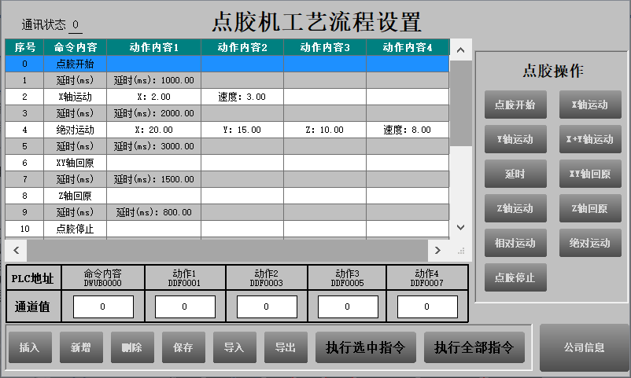

图8.4-31 点胶机工艺流程效果展示

# 

# 第9章 生产工艺流程预览应用实例

若用户需要在产品正式生产前，先进行轨迹、图形等曲线的预览，减少实际生产试错的成本，可以使用McgsPro提供的的XY曲线构件功能。

## 9.1 XY曲线的基本属性和标注属性

-   首先介绍XY曲线构建的属性设置功能，其基本属性设置如图9.1-1所示：

>   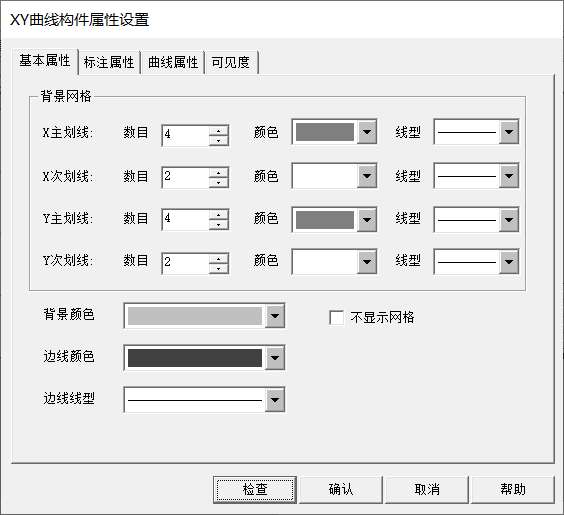

图 9.1-1 XY曲线构件基本属性

**基本显示配置信息：**

1.  X主划线：设置X主划线的数量、颜色和线型，取值范围为[1， 20]，超出范围时，检查不通过；
2.  X次划线：设置X次划线的数量、颜色和线型，取值范围为[1， 20]，超出范围时，检查不通过；
3.  Y主划线：设置Y主划线的数量、颜色和线型，取值范围为[1， 20]，超出范围时，检查不通过；
4.  Y次划线：设置Y次划线的数量、颜色和线型，取值范围为[1， 20]，超出范围时，检查不通过；
5.  背景颜色：设置构件的背景颜色，若选择没有填充时，则构件背景与窗体背景保持一致；
6.  边线颜色：设置构件的边线颜色，若选择没有边线时，则构件不绘制边线；
7.  边线线型：设置构件的边线线型，包括有6种不同的线宽。
8.  不显示网格：当勾选时，XY主次划线设置不生效，构件不绘制XY主次划线；、
-   XY曲线构建标注属性设置如图9.1-2所示：

>   

图 9.1-2 XY曲线构件标注属性

**标注属性配置信息：**

1.  X轴标注颜色：设置X轴标注颜色；
2.  X轴标注字体：设置X轴标注的字体；
3.  X轴标注间隔：设置X轴标注间隔，取值范围为[1，20]；
4.  X轴标注小数位数：设置X轴标注的小数位数，取值范围为[0，6]；
5.  X轴最小值：设置X轴最小值，取值范围为[-FLT_MAX，FLT_MAX]，FLT_MAX=3.402823466e+38F，下同；
6.  X轴最大值：设置X轴最大值，取值范围为[-FLT_MAX，FLT_MAX]；
7.  不显示X轴坐标标注：当勾选时，X轴标注设置无效，构件不显示X轴标注；
8.  Y轴标注颜色：设置Y轴标注颜色；
9.  Y轴标注字体：设置Y轴标注的字体；
10. Y轴标注间隔：设置Y轴标注间隔，取值范围为[1，20]；
11. Y轴标注小数位数：设置Y轴标注的小数位数，取值范围为[0，6]；
12. Y轴最小值：设置Y轴最小值，取值范围为[-FLT_MAX，FLT_MAX]；
13. Y轴最大值：设置Y轴最大值，取值范围为[-FLT_MAX，FLT_MAX]；
14. 不显示Y轴坐标标注：当勾选时，Y轴标注设置无效，构件不显示Y轴标注。

## 9.2 XY曲线的曲线属性

XY曲线构件有两个功能，一是用于绘制二维坐标数据\<x，y\>， 便于直观地观察y随x的变化情况，二是X轴按某一正整数递增，反映一组数据的变化趋势。曲线数据有三种来源：历史数据，CSV（文件或字符串），字符串；支持8条曲线同时绘制，每条曲线最大可加载并显示20480个数据点。

### 9.2.1 XY曲线_历史数据

XY曲线历史数据通过关联存盘的组对象，设置起点时间与终点时间限制曲线显示的时间段，X值和Y值均选择组对象里的成员，运行时通过“窗口0.控件0.Refresh( )”刷新脚本可将构件绘制的曲线显示出来。

>   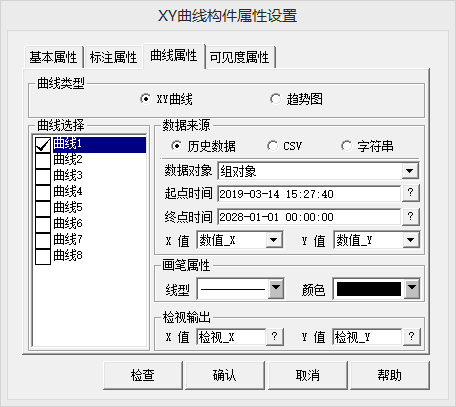

图 9.2-1 数据来源为XY曲线_历史数据

检视输出：当检视输出X值和Y值分别关联上变量（开关型或者数值型），运行时将指针定位在XY曲线构件任意位置，将会出现横向和纵向交叉的黑直线，交叉点的XY值会输出给对应的变量，并且可以通过标签或输入框显示出来。这里检视输出默认显示6位有效数字。

注意：红线为绘制的历史曲线，黑线为检视输出的基准线。

>   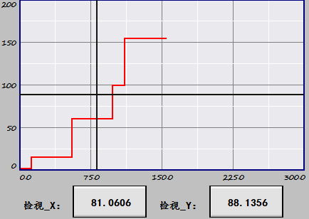

图 9.2-2 数据来源为XY曲线_历史数据效果图

### 9.2.2 XY曲线_CSV

XY曲线CSV中包含文件和字符串，文件中文件路径可以关联字符型变量，变量内容为CSV文件的路径。也可手动填入，此时有两种情况，第一种为“\$MCGS_DIR_USER/文件名.csv”，模拟器时对应路径为安装路径下/data/user_dir/文件名.csv；第二种为“/文件名.csv”或者“文件名.csv”，触摸屏路径为U盘/文件名.csv，模拟器时对应路径为安装路径下/export/文件名.csv。起始行号、X所在列、Y所在列这三项可写常量或者关联整数型的变量（关联整数型变量运行时需输入数据才可绘制出曲线）。这里将参数设置为固定路径和常量。

>   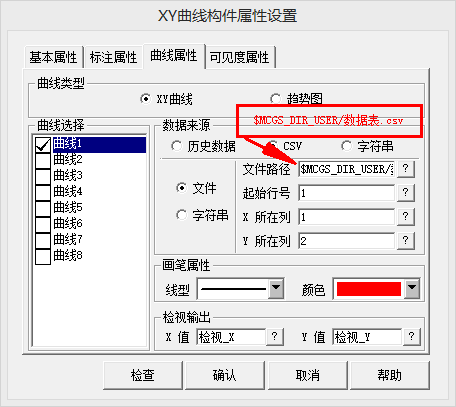

图 9.2-3 数据来源为XY曲线_CSV_文件

在“组态软件安装路径\\Program\\data\\user_dir”文件夹下建立“数据表.csv”文件。表格内的内容设置方式如下：

>   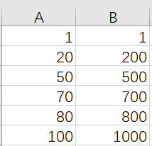

图 9.2-4 数据表.CSV

此时运行工程，将会绘制出如下的曲线（若起始行号、X所在列、Y所在列关联的是变量，那么在设置好对应参数后，需用“窗口0.控件0.Refresh( )”来刷新曲线）。

>   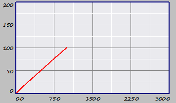

图 9.2-5 数据来源为XY曲线_CSV_文件效果图

XY曲线/CSV/字符串中，数据变量关联字符型变量“csv_字符”，起始行号、X所在列、Y所在列按照下图设置，将数据变量关联变量“csv_字符”，该字符型变量中的内容可由关联了变量“csv_字符”的输入框输入。

>   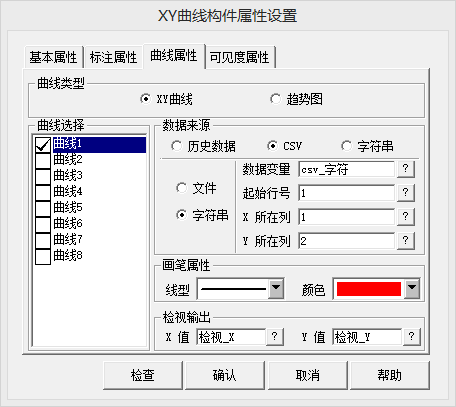

图 9.2-6 数据来源为XY曲线_CSV_字符串

注意：运行时弹出的软键盘里面没有换行符，所以只能通过复制表格里面的数据生成曲线，无法直接手动在输入框输入数据。

>   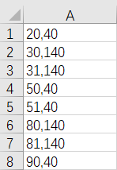

图 9.2-7 输入框的数据表格

通过编写脚本的方式亦可绘制曲线，McgsPro支持使用“\\N”或!I2Ascii(13)+!I2Ascii(10)表示换行。注意，若脚本使用“\\N” 换行，则需要加双引号，若使用!I2Ascii(13)+!I2Ascii(10)，则不用加双引号。

>   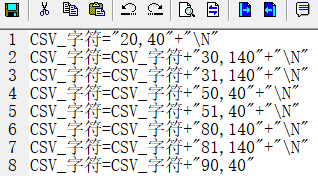

图 9.2-8 使用“\\N”给脚本换行

>   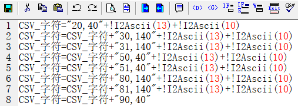

图 9.2-9 使用!I2Ascii(13)+!I2Ascii(10)给脚本换行

### 9.2.3 XY曲线_字符串

在XY曲线中，勾选“字符串”，X值和Y值可以取自不同的字符串，也可以取自同一字符串，用户可根据需求来配置。这里使用取自同一字符串，关联“XY字符串”变量。

>   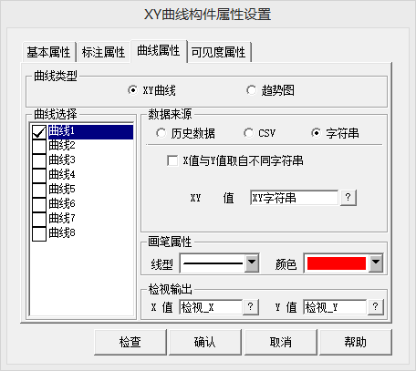

图 9.2-10 数据来源为XY曲线_字符串

用户可以直接在输入框中输入使用英文逗号相隔开的一串数字，第一个数字是X的值，第二个数字是Y的值，以此类推。也可以通过编写脚本的方式来实现此功能，数字之间使用“, ”或!I2Ascii(13)+!I2Ascii(10)来分隔。

>   

图 9.2-11 使用“, ”分隔字符串

>   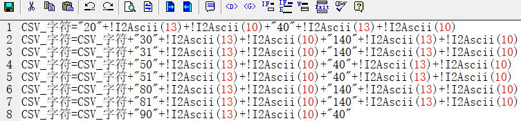

图 9.2-12 使用!I2Ascii(13)+!I2Ascii(10)分隔字符串

### 9.2.4 趋势图_历史数据

趋势图/历史数据与XY曲线/历史数据区别在于，前者引入了新的概念--步进，后者的X值只能关联组对象内的变量，步进则没有这方面的限制，可任意关联一个整数型变量，也可输入常量，Y值为组对象内的变量。

>   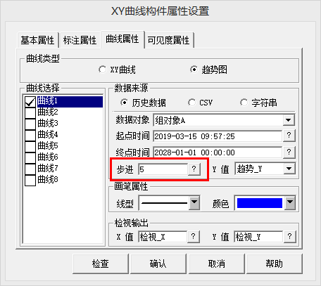

图 9.2-13 数据来源为趋势图_历史数据

检视输出：当检视输出X值和Y值分别关联上变量（整数型或者浮点数型），运行时将指针定位在XY曲线任意位置，出现纵向的黑直线，与曲线交叉点的XY值会输出给对应的变量，并且可通过标签或输入框显示出来，检视输出默认显示整数。

注意：蓝线为绘制的历史曲线，黑线为检视输出的基准线。

>   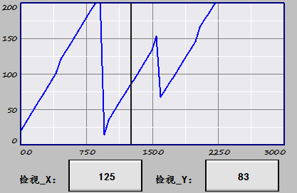

图 9.2-14 数据来源为趋势图_历史数据效果图

### 9.2.5 趋势图_CSV

数据来源为趋势图_csv与XY曲线_csv做法相同，这里不作介绍，用户可参见“XY曲线_CSV”。

### 9.2.6 趋势图_字符串

趋势图中字符串的步进值可输入常量或者关联整数型变量，Y值根据步进值变化。Y值的设置请参见“XY曲线_字符串 ”。

>   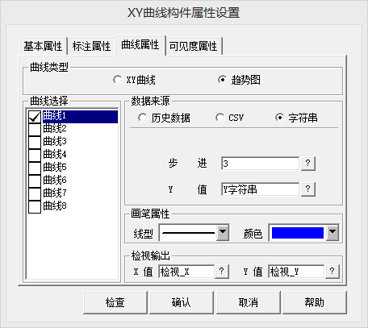

图 9.2-15 数据来源为趋势图_字符串

## 9.3 XY曲线的方法函数

报警浏览构件方法函数解释：

-   **Refresh()：**刷新，在运行过程中若是数据改变，可调用此函数刷新XY曲线构件的显示。

    组态方法：新建一个【标准按钮】构件，将它的【基本属性】中的【文本】设置为【刷新】，抬起脚本设置为【窗口0.控件0.Refresh( )】。注意，其中【窗口0】是XY曲线构件所在窗口名，【控件0】是XY曲线构件的名称，点击XY曲线构件后，右下角的信息栏显示构件名称。构件方法的详细设置步骤请参考章节：进阶篇_3.5.4 构件方法。

>   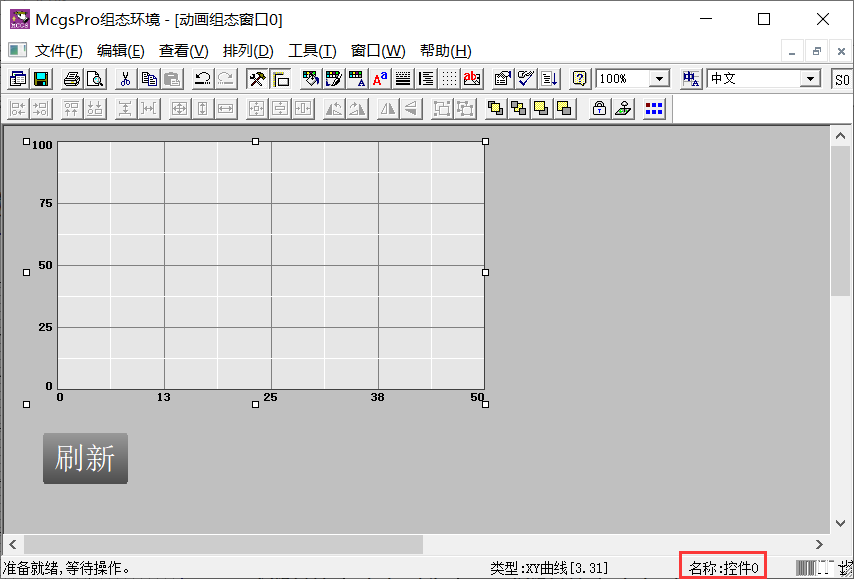

图 9.3-1 获取控件名称

-   **ClearData(Index)：**清除曲线数据

    **注意事项：**调用该函数只是清除构件上的显示，并没有清除实际存储的数据

-   **AddXYDataFromFile(Index,Count,Xcolumn,Ycolumn,StrFilePath,StartLine,XStep)：**从文件中加载数据
-   **AddXYDataFromCSVString(Index,Count,Xcolumn,Ycolumn,StrCSVString,StartLine,XStep)：**从CSV字符串中加载数据
-   **AddXYDataFromGroupObject(Index,Count,GroupObject,VarX,VarY,StrStartTime,XStep)：**从存盘数据中加载数据
-   **AddXYDataFromString(Index,Count,StrVarX,StrVarY,StrVarXY,XStep)：**从字符串中加载数据
-   **SetTrendRange(Index,Min,Max)：**设置特定曲线的上下限值
-   **GetTrendRange(Index,Min,Max)：**取特定曲线的上下限值
-   **SetTrendVisible(Index,Flag)：**置特定曲线的可见度
-   **GetTrendVisible(Index)：**取定曲线的可见度
-   **GetXRange(Min,Max)：**取X轴最小值和最大值
-   **SetXRange(Min,Max)：**置X轴的最小值和最大值
-   **ShowYaxis(Index)：**显示指定曲线的Y轴坐标标注
-   **SetDrawMode (Index,Mode)：**设置曲线绘制模式

## 9.4 XY曲线的注意事项

-   XY曲线的曲线是可以来回变化的，而趋势图的曲线是单调往右变化。
-   步进值若设置为常量，不能为负数。
-   曲线的X轴固定不动，若需要移动，可使用SetXRange(Min，Max)函数来设置X轴的最大值和最小值。

>   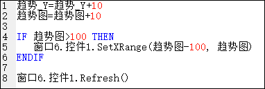

图 9.4-1 SetXRange(Min，Max)函数的使用

# 

# 第10章 脚本程序功能介绍

## 10.1 脚本知识概要

脚本程序是组态软件中的一种内置编程语言引擎。在McgsPro组态件中，脚本语言是一种语法上类似Basic的编程语言，有些HMI软件中也叫做“宏指令”。

脚本可以在运行策略、窗口启动脚本、窗口循环脚本、窗口退出脚本、窗口事件脚本、构件事件脚本、按钮脚本中运用。

### 10.1.1 编辑环境介绍

脚本程序编辑窗口是用户进行脚本编写最主要的地方，操作界面分为以下几个部分：

>   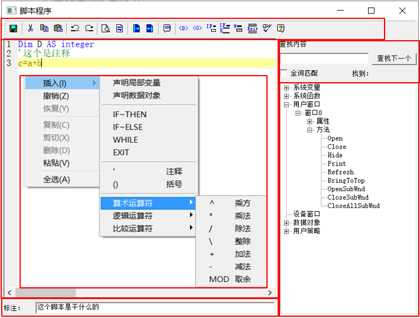

图 10.1-1 脚本程序编辑窗口

1.  工具条按钮：请参考章节：进阶篇_1.3.5脚本程序窗口工具条。
2.  脚本编辑框：脚本编辑框是用户进行脚本编写最主要的地方，所有脚本内容均显示在此处。

    脚本编辑框支持自动完成功能。自动完成功能主要是在用户输入内容时自动提示与用户输入相关的内容，辅助用户快速完成输入。比如McgsPro中以“!AS”开头的函数有两个，当用户在脚本编辑框中输入“!AS”时会自动提示用户匹配对象（如图10.1-2所示），用户这时可以按上下键选择想输入的内容后按enter键直接快速输入。

>   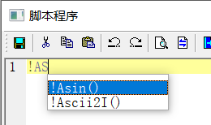

图 10.1-2 脚本自动完成

当用户通过自动未完成提示快速输入系统函数后，系统函数需要填入参数，此时用户可以将鼠标移动到已经输入的系统函数上，此时编辑框会自动对此脚本函数的功能、参数类型和返回值类型进行提示，如图10.1-3所示。

>   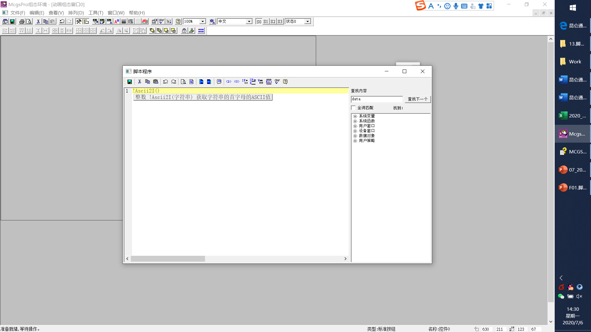

图 10.1-3 函数提示

1.  右键菜单：脚本编辑框中点击鼠标右键弹出操作菜单，可以进行一些语法或操作符的快捷输入。
2.  脚本注释框：策略特有标注信息，注释脚本的作用等。
3.  查找功能区：查找范围为系统变量、系统函数、窗口名称、构件名称、设备名称、变量名称、策略名称等。注：不包含属性、方法。分为非全词匹配和全词匹配两种。
4.  对象树：对象树以树结构的形式，列出了工程中所有的窗口、策略、设备、变量、系统支持的各种方法、属性以及各种函数，用户可以在此快速查找。对象树只有在脚本编辑窗口中有效。

### 10.1.2 语言要素介绍

#### 10.1.2.1 变量

-   数据对象：相当于全局变量，在所有的程序段共用。它可以在实时数据库中定义，也可以通过脚本框上方的【声明数据对象】图标按钮定义，如图10.1-4所示。脚本编辑中可以用数据对象的名称来读写数据对象的值，也可以对数据对象的属性进行操作，支持整数、浮点数、字符串三种数据对象。

>   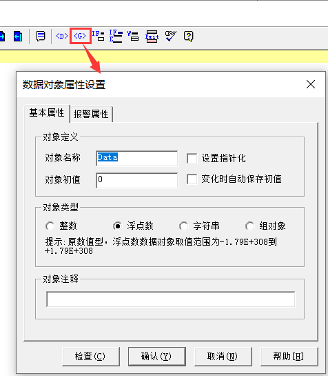

图 10.1-4 在脚本程序编辑窗口中声明数据对象

-   局部变量：支持整数、浮点数、字符串、字节型四种数据类型，只能在当前脚本中使用。可直接输入脚本“Dim…As…”语句对局部变量进行声明，或使用工具栏上的【声明局部变量】图标按钮进行声明。需要注意的是，声明语句不能嵌套在其他任何语句中。

>   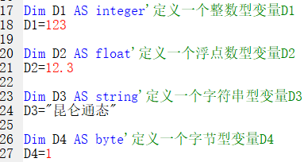

图 10.1-5 在脚本程序编辑窗口中声明局部变量

-   局部数组变量：支持整数数组、浮点数数组、字符串数组、字节型数组四种数据类型，只能在当前脚本中使用，声明方法同【局部变量】。定义数组变量最大长度是65535，其访问元素的方式为array[index]，其中“array”为数组变量、“index”为访问元素的位置（从1开始），如图10.1-6所示。

>   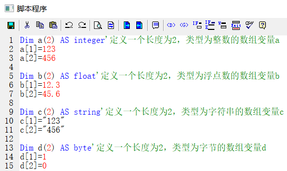

图 10.1-6 在脚本程序编辑窗口中声明局部数组变量

#### 10.1.2.2 常量

-   整数常量：类似123的整数
-   十六进制整数常量：类似0x123的十六进制整数
-   浮点数常量：带小数点的数值，如：12.45
-   字符串常量：英文双引号内的字符串，如："OK ", "正常"
-   字符串常量内支持以下转义：  
    “\\n”：代表换行  
    “\\r”：需要和“\\n”一起使用（“\\r\\n”），在微软环境中代表换行  
    “\\"”：代表双引号  
    “\\t”：代表制表符  
    “\\\\”：代表反斜杠自身  
    其他以“\\”开始的字符将作为非法字符串。

#### 10.1.2.3 系统变量

McgsPro组态定义的内部数据对象作为系统内部变量，在脚本程序中可自由使用，在使用系统变量时，变量的前面必须加“\$”符号，如 \$Date。系统变量为只读类型，在脚本编辑环境中，点击展开“对象树”中的“系统变量”，再双击变量名称即可添加到编辑框中。系统变量的详细内容将在后续章节：进阶篇11.8 系统变量进行介绍。

#### 10.1.2.4 属性和方法

属性和方法函数的详细内容请参考章节：进阶篇_3.5 构件或窗口的属性和方法。

#### 10.1.2.5 表达式

由变量、括号和各种运算符组成的运算式称为表达式，表达式的计算结果称为表达式的值。例如：a=b+c；str=“aa”+”bb”。

#### 10.1.2.6 运算符

| 分类       | 名称     | 运算符 |
|------------|----------|--------|
| 算术运算符 | 乘方     | \^     |
|            | 乘法     | \*     |
|            | 除法     | /      |
|            | 整除     | \\     |
|            | 加法     | +      |
|            | 减法     | -      |
|            | 取余     | MOD    |
| 逻辑运算符 | 与       | AND    |
|            | 非       | NOT    |
|            | 或       | OR     |
|            | 异或     | XOR    |
| 比较运算符 | 大于     | \>     |
|            | 大于等于 | \>=    |
|            | 等于     | =      |
|            | 小于等于 | \<=    |
|            | 小于     | \<     |
|            | 不等于   | \<\>   |

#### 10.1.2.7 优先级

>   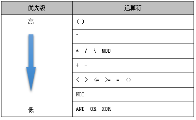

图 10.1-7 运算符优先级

#### 10.1.2.8 注意事项

所有能够在脚本中使用的对象名称（如窗口、变量、策略），不能用以下的关键字命名：

-   if、then、else、endif、while、break、endwhile、and、or、xor、not、exit、break、byte、integer、single、float、string。
-   不能以数字开头
-   不能含有以下的特殊字符：
-   \`\~!@\#\$%\^&\*()-=+\\\\\|]}[{'\\";:/?.\>,\<～！·＃￥％……—＊（）——＋｜？，。《》／。
-   不能为空
-   不能为“_”

## 10.2基本语句规则及应用

脚本程序是为了实现流程的控制及对象操作处理，包括如下语句：

赋值语句、条件语句、循环语句、退出语句、注释语句、声明语句、跳出语句，如图10.2-1所示。

>   

图 10.2-1 语句种类

### 10.2.1 赋值语句

赋值语句的格式为：数据对象 = 表达式。

赋值号（等号）左边必须是能够读写的数据对象。

赋值号的右边为表达式，表达式的数据类型必须与左边数据对象的值的类型相符合，否则系统会提示“类型不匹配”的错误信息。

>    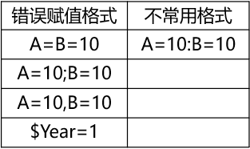

图 10.2-2 应用举例

### 10.2.2 条件语句

>   

图 10.2-3 条件语句逻辑

“**IF**”语句的表达式一般为逻辑表达式，当表达式的值为非0时，条件成立，执行“**Then**”后的语句，否则，条件不成立，将不执行条件块中包含的语句，开始执行条件块后面的语句。

条件语句有如下三种形式：

形式一：

**If** 〖表达式〗 **Then** 〖赋值语句或退出语句〗

形式二：

**If** 〖表达式〗 **Then**

〖语句〗

**EndIf**

形式三：

**If** 〖表达式〗**Then**

〖语句〗

**Else**

〖语句〗

**EndIf**

条件语句中的四个关键字“**If**”、“**Then**”、“**Else**”、“**Endif**”不分大小写。如拼写不正确，检查程序会提示出错信息。

条件语句允许多级嵌套，即条件语句中可以包含新的条件语句。

值为字符串的表达式不能作为“if”语句中的表达式。

-   使用条件语句组态脚本实现：点击启动按钮后，传送带上的物体向左传送。
1.  首先在实时数据库中新建两个整数型变量【传送带移动】和【传送带启动】。
2.  进入用户窗口【窗口0】，点击【工具栏】 → 【插入元件】 → 在弹出的元件图库管理窗口中选择类型为【公共图库】 → 【传送带】 → 【传输带5】 → 确定。将传送带拖拽都画面合适的位置。

>   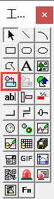 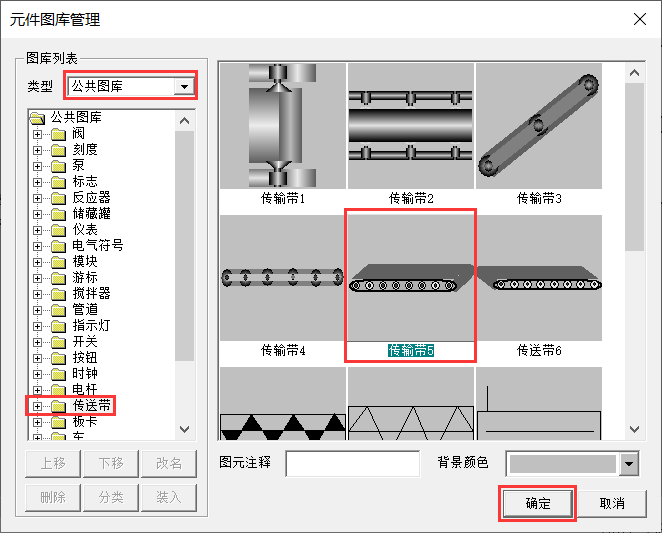

>   

图 10.2-4 新建一个传送带

1.  点击【工具栏】中的【常用符号】 → 【立方体】 → 拖拽到传送带靠右端合适的位置。

>   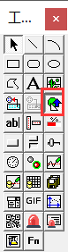 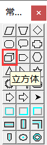 

图 10.2-5 新建传送带上运载的物件

1.  双击画面窗口中的【立方体】，在弹出的动画组态属性设置界面中点击【基本属性】 → 勾选【水平移动】前的复选框 → 点击出现的的【水平移动】功能页 → 设置【表达式】为【传送带移动】，【最小移动偏移量】为0，对应的表达式的值为【0】，【最大移动偏移量】为-300，对应的表达式的值为【100】。注意：偏移量是以组态时图形对象所在的位置为基准（初始位置），单位为像素点，向左为负方向，向右为正方向。通过“最小移动偏移量”及其“表达式的值”和“最大移动偏移量”及其“表达式的值”可以得到“表达式”值与偏移量之间的线性映射关联，当“表达式”为某一个值时，即可根据此线性关系计算出实际的偏移量从而定位图形。

>   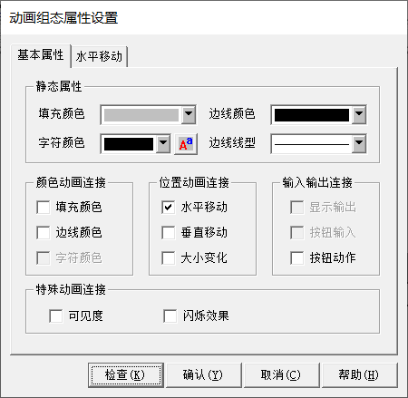 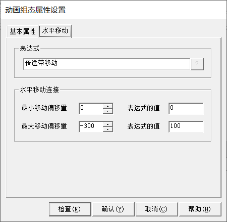

图 10.2-6 组态传送带所运载物件的水平移动

1.  从工具箱拖拽一个【标准按钮】构件到窗口画面中。双击该构件，弹出标准按钮构件属性设置窗口 → 【基本属性】 → 修改文本为【启动】 → 【操作属性】 → 关联【数据对象值操作】【置1】为【传送带启动】 → 确认。

>   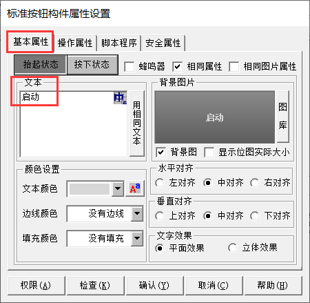 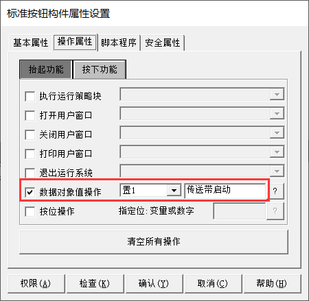

图 10.2-7 组态启动按钮

1.  进入【运行策略】窗口 → 【新建策略】 → 【循环策略】 → 双击出现的策略1，进入策略组态窗口。

>   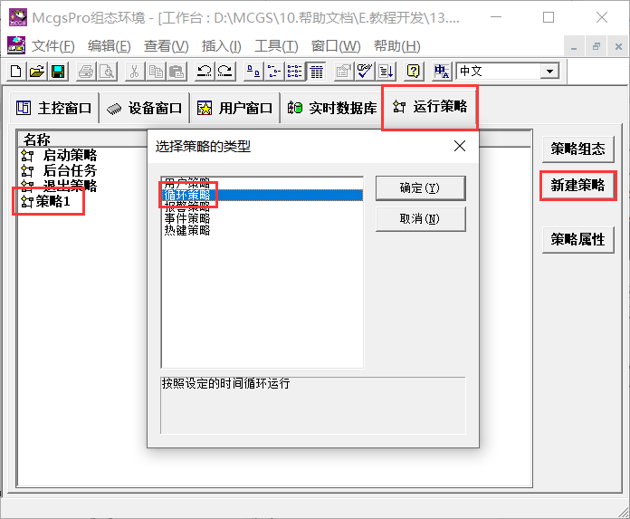

图 10.2-8 新建循环策略1

1.  在策略组态窗口中，修改策略1的【循环时间】为100ms。然后新增一行策略行，编辑策略脚本如图10.2-9所示。然后保存脚本，关闭脚本程序编辑窗口，保存策略1。

>   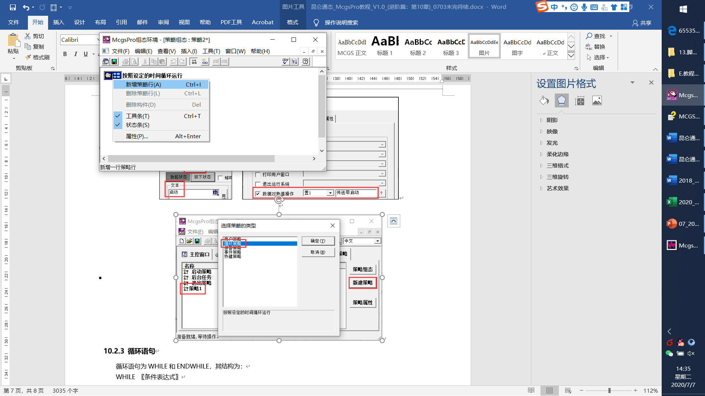 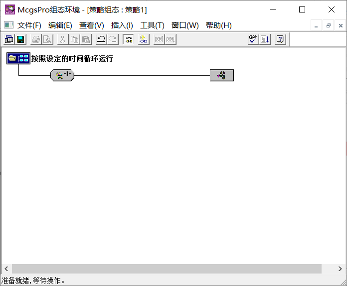

>   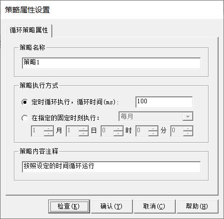 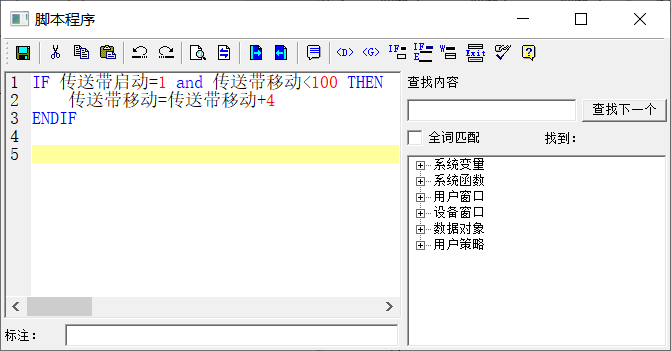

图 10.2-9 组态循环策略

1.  保存工程后下载工程，然后启动运行。点击【启动按钮】，传送带上的物料由右向左移动。

>    

图 10.2-10 模拟运行效果

### 10.2.3 循环语句

循环语句为WHILE和ENDWHILE，其结构为：

WHILE 〖条件表达式〗

…

ENDWHILE

当条件表达式成立时（非零），循环执行WHILE和ENDWHILE之间的语句。直到条件表达式不成立（为零）时退出。

-   通过以下脚本使MAX变量的值为数组中的最大值。

>   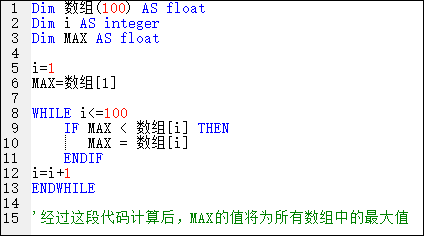

图 10.2-11 循环语句应用实例

### 10.2.4 注释语句

图10.2-11中的绿色文字就是注释语句，它在脚本运行过程中不执行，仅起到解释作用，可通过在语句前输入英语单引号或点击工具栏的【注释】图标按钮实现。

### 10.2.5 跳出语句

跳出语句为“Break”，用于跳出当前循环，必须在循环语句中使用。

### 10.2.6 退出语句

退出语句为“EXIT”，用于中断脚本程序的运行，停止执行其后面的语句。一般在条件语句中使用退出语句，以便在某种条件下，停止并退出脚本程序的执行。

### 10.2.7 声明语句

脚本格式为“Dim…As…”，具体用法请参考章节：进阶篇_10.1.2.1 变量。

## 10.3 脚本查错

脚本程序编制完成后，可点击工具栏上的【检查】图标按钮对程序代码进行检查，以确认脚本程序的编写是否正确。检查过程中，如果发现脚本程序有错误，则会返回相应的信息，以提示可能的出错原因，帮助用户查找和排除错误。如图10.3-1所示：

>   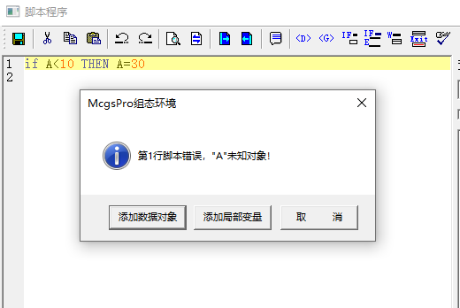

图 10.3-1 脚本检查报错

注：脚本程序里面未通过语法检查也能保存，但是无法下载。

常见的提示信息有：

 未识别的标识符：该标识符不是局部变量和全局可访问的对象

 未识别的类型：变量声明时没有输入正确的类型

 未填入参数：函数调用（需要参数）没有填入参数

 需要一个逻辑值：在条件语句和循环语句中的条件判断中的表达式的值，必须是字节型、整数、浮点数，而不能是字符串和数组

 需要引用参数：函数的当前参数类型为引用

 需要一个数据对象：函数的当前参数类型为数据对象

 局部变量声明错误：局部变量声明的格式错误

 局部数组变量声明错误：局部数组变量声明的格式错误

 局部数组变量声明长度非法：局部数组声明的初始长度错误，须在0-65535之间

 下标访问类型不匹配：访问数组的元素时，下标类型错误；必须是字节/整数，最好是整数

 无副作用的表达式：除了函数调用，一般的表达式需要一个赋值语句来使用表达式的结果

 类型不匹配：一般是表达式的操作类型不匹配，如整数+字符串

 参数个数不匹配：函数的参数个数不匹配

 参数类型不匹配：函数的参数类型不匹配

# 

# 第11章 脚本函数应用实例

本章主要介绍McgsPro的功能函数及其应用实例。McgsPro的功能函数可分为运行环境函数，数据对象操作函数，用户权限函数，时间函数，数学函数，字符串函数，系统变量，文件操作函数，内存操作函数和计时器函数。

## 11.1 使用帮助引导

脚本函数的详细介绍和使用说明，可参考McgsPro组态软件帮助。以运行环境函数为例，点击工具栏上按钮图标-目录-第十二章，找到运行环境函数，可查看各个函数的意义、参数、返回值、实例等的介绍。

>   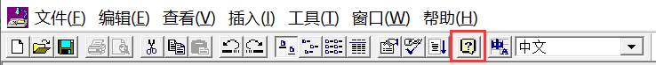

>   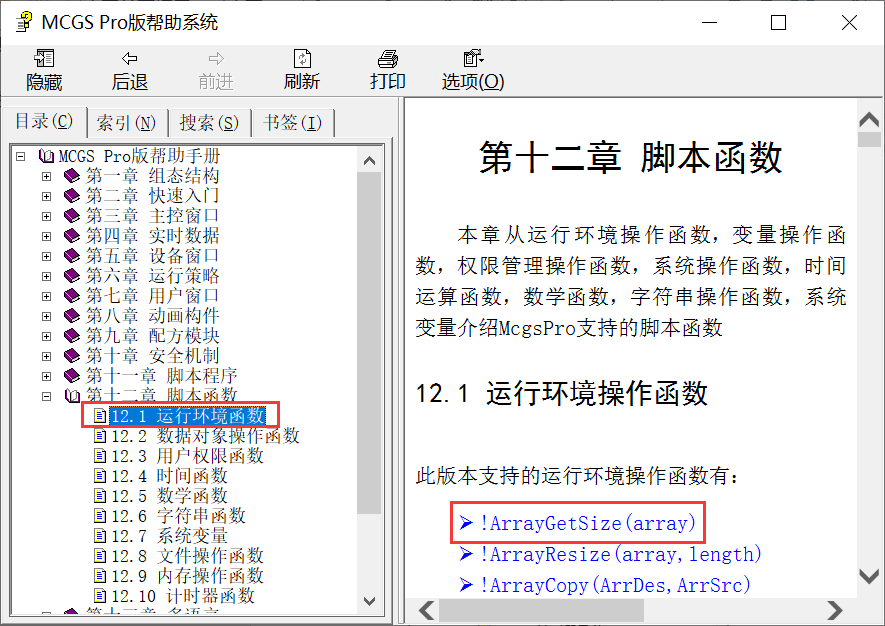

>   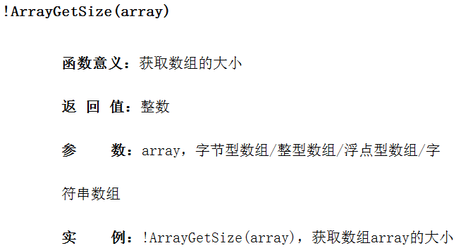

图 11.1-1 McgsPro帮助使用方法

## 11.2 运行环境函数

McgsPro中，涉及运行环境操作的函数大致可以分为5类：数组操作函数、运行策略函数、窗口操作函数 、系统操作函数、操作日志函数。接下来为大家进行常用函数的介绍。

### 11.2.1 数组操作函数

#### 11.2.1.1 常用函数介绍

下面7个函数是针对数组的操作函数，通过这些函数可以对数组进行设置大小、获取大小、复制、追加、添加元素等操作。数组的介绍请参考章节：进阶篇10.1.2.1 变量。

**!ArrayGetSize(array)：**获取数组array的大小。

**!ArrayResize(array,length)：**设置数组array的大小为length。

**!ArrayCopy(ArrDes,ArrSrc)：**把一个数组ArrSrc的内容复制到另外一个数组ArrDes中去，两者必须是同一类型，目标数组的大小也跟源数组一致。

**!ArrayAppend(Arr1,Arr2)：**把一个数组Arr2追加到另外一个数组Arr1的后面。要求两个数组类型一致,数组大小变为两个数组大小之和。

**!ArrayIntAdd(Arr,n)：**在一个整型数组Arr后面添加一个整数元素n，数组大小加1。

**!ArraySingleAdd(Arr,x)：**给一个浮点数组Arr添加一个浮点数元素x，数组大小加1。

**!ArrayStringAdd(Arr,str)：**给一个字符串数组Arr添加字符串元素str，数组大小加1。

#### 11.2.1.2 样例演示

本节主要介绍：如何获取当前数组的大小且以及将数组大小重新设置。

1.  使用McgsPro新建一个工程，进入用户窗口0。然后新建一个按钮，将它的显示文本设为【获取数组大小】，脚本函数设置为：

    *Dim array(5) AS integer  ‘定义一个长度为5的整数型数组*

    *size=!ArrayGetSize(array)  ‘获取数据【array】的大小，并将值赋给变量【size】*

>   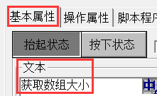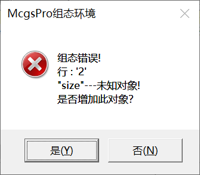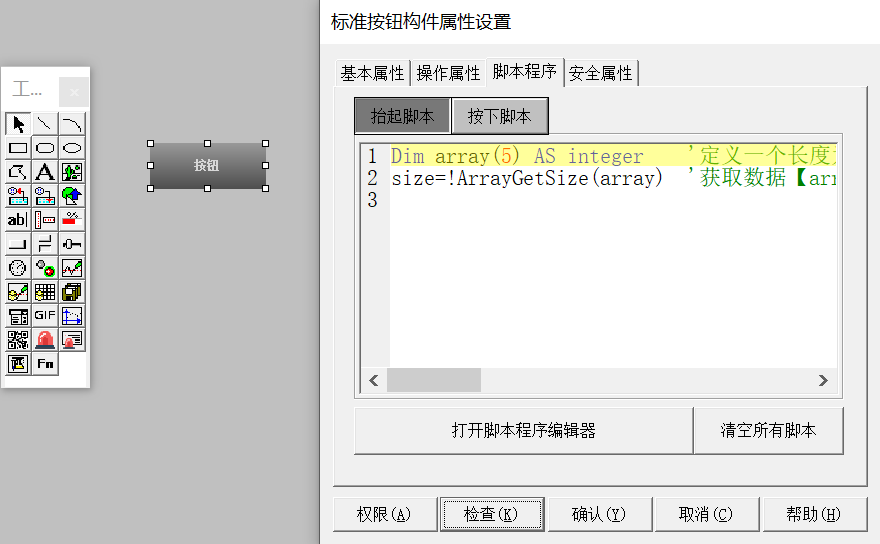

图 11.2-1 获取数组大小功能按钮设置步骤

由于没有提前在实时数据库中定义变量【size】，所以点击【确认】按钮时，会弹出对话框提示【size】是位置对象，询问【是否增加次对象？】。选择【是】，则弹出【数据对象属性设置】界面，界面的【对象名称】处自动填写未定义的变量名，选择【对象类型】为【整数】，点击确认即可。此时实时数据库中自动生成了一个名为【size】的【整数】型变量，如图11.2-2所示。

>   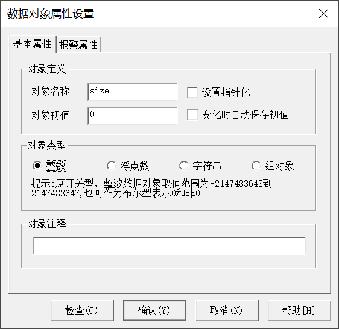 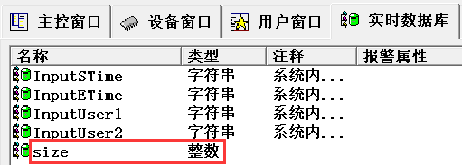

图 11.2-2 自动生成未定义变量

1.  用同样的办法，再次新建一个按钮，将它的文本显示设置为【设置数组大小】，脚本函数设置为：

    *Dim array(5) AS integer   '定义一个长度为5的整数型数组*

    *!ArrayResize(array, 7)  ‘将数组array的长度设置为7*

    *size=!ArrayGetSize(array)   ‘获取数据【array】的大小，并将值赋给变量【size】*

    由于数组是局部变量，只能在当前脚本中使用，所以在上一个按钮中定义过的数组在新按钮中已经失效，需要重新定义。

2.  然后新建一个输入框构件，用它显示【size】的值。
3.  组态完成后，保存工程，然后下载工程，下载成功后启动运行。

>   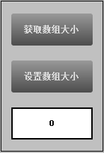  

图 11.2-3 画面运行效果

### 11.2.2 运行策略函数

#### 11.2.2.1 常用函数介绍

下面3个函数是针对运行策略的操作函数：

**!ChangeLoopStgy(StgyName,n)：**改变循环策略的循环时间。

**!SetStgy(StgyName)：**执行StgyName指定的运行策略。该函数是异步执行的策略，即：使用该函数时，函数中的策略StgyName和函数所在行的下一行脚本程序可以同时执行。

>   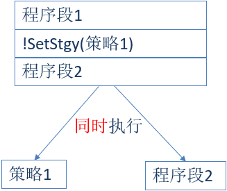

图 11.2-4 函数!SetStgy执行机制

**!SetStgyMode(StgyName)：**以模态方式执行策略。该函数是同步执行的策略，即：使用该函数时，必须先执行完函数中的策略StgyName才会执行函数所在行的下一行脚本程序。

>   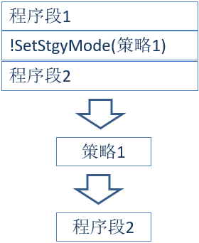

图 11.2-5 函数!SetStgyMode执行机制

#### 11.2.2.2 样例演示

组态一个样例，演示函数!SetStgy(StgyName)和!SetStgyMode(StgyName)运行时的区别。

1.  进入实时数据库，新建整数型变量【A】和【B】。

>   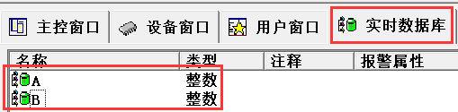

图 11.2-6 新建变量

1.  进入运行策略窗口，新建一个【用户策略】。

>   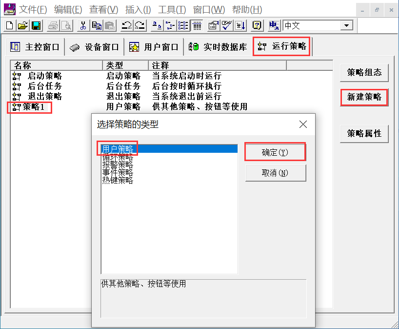

图 11.2-7 新建用户策略

1.  双击新建的用户策略【策略1】，将它的名字修改为【等待3S策略】，脚本设置为：

    *A=300  ‘将300赋值给变量【A】*

    *!Sleep(3000)  ‘暂停3000毫秒*

>   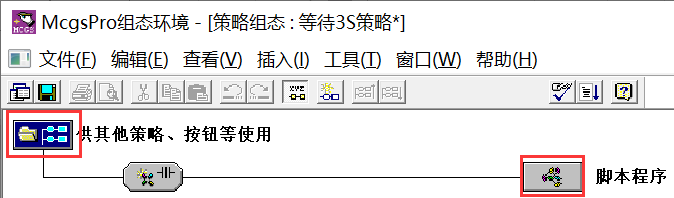

>   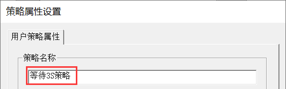 

图 11.2-8 用户策略设置

1.  用同样的方法再建立两个用户策略，策略名分别为【异步策略】和【同步策略】。

    其中【异步策略】的脚本为：

    *‘执行策略【等待3S策略】的同时将500赋值给变量【B】*

    *!SetStgy(等待3S策略)*

    *B=500*

    【同步策略】的脚本为：

    *‘执行策略【等待3S策略】完毕后再将500赋值给变量【B】*

    *!SetStgyMode(等待3S策略)*

    *B=500*

2.  进入用户窗口，新建一个按钮，将它的显示文本设置为【执行异步策略】，操作属性设置为【执行运行策略块】【异步策略】。

>   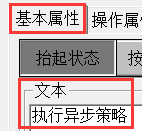 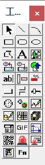  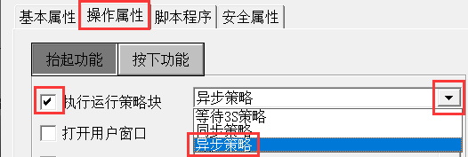

图 11.2-9 执行异步策略功能按钮设置

1.  用同样的方法再建立一个按钮，将它的显示文本设置为【执行同步策略】，操作属性设置为【执行运行策略块】【同步策略】。
2.  再次建立一个按钮，将它的显示文本设置为【Clear】，脚本设置为：

    *‘将A和B的值清零*

    *A=0*

    *B=0*

3.  然后建立两个标签构件，分别将它们的显示输出关联变量【A】和【B】，输出值类型都选择为【数值量输出】。关联变量【A】的标签属性如图11.2-10所示。

>   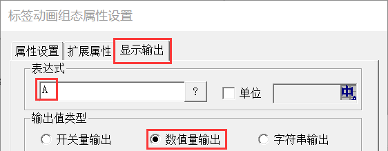

图 11.2-10 标签构件显示输出设置

1.  组态完成后，保存工程，然后下载工程，下载成功后启动运行。

>   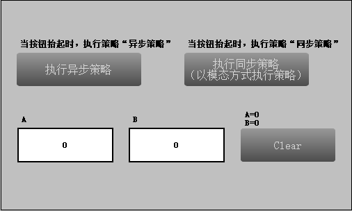

>   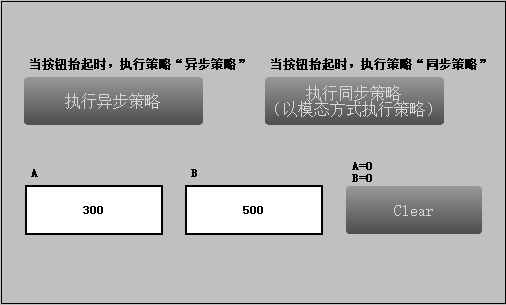

>   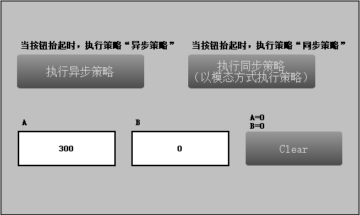

>   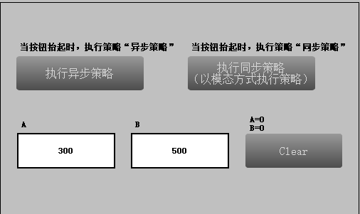

图 11.2-11 画面运行效果

### 11.2.3 窗口操作函数

#### 11.2.3.1 常用函数介绍

以下7个函数为针对窗口的操作函数，通过这些函数可以对窗口执行关闭、显示、获取状态、获取名字等操作。

**!CloseAllWindow(WndName)：**关闭所有窗口。如果在字符串“WndName”中指定了一个窗口，则首先关闭其他所有窗口，再打开这个窗口。如果“WndName”为空，则关闭所有窗口。

**!CloseAllSubWnd()：**关闭当前标准窗口中的所有子窗口。

**!CloseSubWnd(WndObject)：**关闭窗口名为“WndObject”的子窗口。

**!OpenSubWnd(参数1,参数2，参数3，参数4，参数5，参数6)：**在当前窗口中打开子窗口。

**!GetWindowName(Index)：**按用户窗口组态时排列的顺序获得用户窗口的名字。

**!GetWindowState(WndObject)：**根据用户窗口名获取窗口工作状态。

**!SetWindow(WndObject,Op)：**按照名字操作用户窗口，如打开、关闭、打印。

说明：当函数*!OpenSubWnd*的【参数6】为1时表示【以模态模式】打开子窗口，为2时表示以【菜单模式】打开子窗口。【参数6】的更多信息，请查看McgsPro组态软件帮助。

#### 11.2.3.2 样例演示

本节样例主要演示使用函数打开模态式子窗口和菜单式子窗口的区别，以及如何关闭子窗口。

1.  新建两个窗口，分别为【窗口0】和【窗口1】。
2.  在【窗口0】中新建两个按钮，将它们的显示文本分别修改为【以模态模式打开子窗口】和【以菜单模式打开子窗口】。

【以模态模式打开子窗口】按钮中的脚本程序为：

*!OpenSubWnd(窗口1,0,0,400,240,1) ‘在当前窗口的坐标值为（0,0）的位置，以模态模式打开一个长宽为（400,240）的名为【窗口1】的子窗口。以模态方式打开子窗口时，子窗口外的构件对鼠标操作不响应，且鼠标在窗口外点击时窗口不会关闭，必须调用函数CloseSubWnd或CloseAllSubWnd来关闭此子窗口。*

【以菜单模式打开子窗口】按钮中的脚本程序为：

!OpenSubWnd(窗口1,0,0,600,350,2)  *‘在当前窗口的坐标值为（0,0）的位置，以菜单模式打开一个长宽为（600,350）的名为【窗口1】的子窗口。以菜单方式打开子窗口时，一旦在子窗口之外按下鼠标，则子窗口关闭。*

1.  进入【窗口1】，新建一个按钮，将它的显示文本修改为【关闭子窗口】，脚本程序为：

    *!CloseAllSubWnd( ) ‘关闭所有子窗口。*

    将【窗口1】的窗口背景颜色设置为【浅蓝色】以突出打开子窗口时的效果。然后将按钮拖拽到本窗口坐标（400,240）以内，避免以模态方式打开子窗口或无法关闭子窗口。

2.  组态完成后保存工程，然后下载工程，下载成功后点击启动运行。启动时画面如图11.2-12所示：

>   

图 11.2-12 启动画面

1.  点击【以模态模式打开子窗口】按钮，系统按照按钮中函数的设置，在当前窗口的坐标值为（0,0）的位置，以长宽（400,240）的显示大小打开【窗口1】。此时用鼠标点击子窗口外的画面系统没有任何反应，点击子窗口内部的【关闭子窗口】按钮后，子窗口关闭。

>   

图 11.2-13 以模态模式打开子窗口画面

1.  然后点击【以菜单模式打开子窗口】按钮，系统按照按钮中函数的设置，在当前窗口的坐标值为（0,0）的位置，以长宽（600,350）的显示大小打开【窗口1】。此时用鼠标点击子窗口外的画面，子窗口关闭。也可以直接点击子窗口内的【关闭子窗口】按钮关闭该子窗口。

>   

图 11.2-14 以菜单方式打开子窗口画面

### 11.2.4 系统操作函数

#### 11.2.4.1 常用函数介绍

下面15个函数为系统相关的操作函数，通过这些函数可以执行获取当前工程运行期限状态、最后鼠标操作时机等系统相关的操作。

**!GetExpiryStatus（）：**获取当前工程的运行期限状态。0为工程未到期；1为已到期。

**!GetLastMouseActionTime（）：**获取最后一次鼠标的动作发生的时间。

**!SetDevice(DevName,DevOp,CmdStr)：**按照设备名字对设备进行操作。该函数的详细介绍和应用举例请参考章节：进阶篇_15.2.3 设备命令。

**!Beep（）：**发出嗡鸣声。

**!SendKeys(string)：**将一个或多个按键消息发送到活动窗口，如同在键盘上进行输入一样。

**!SetTime(n1,n2,n3,n4,n5,n6)：**设置当前系统时间。

**!GetCurrentLanguageIndex（）：**获取当前使用的语言的索引值。

**!SetCurrentLanguageIndex(整数)：**过索引项设定当前语言环境。

**!GetLocalLanguageStr(整数)：**获得指定自定义ID对应的当前语言的内容。

**!GetLanguageNameByIndex(整数) ：**根据语言索引值返回语言名称。

**!PrintToFile(folder, filename, flag) ：**截屏输出到文件。

**!SetDialogBy9Palace(对话框索引, 对话框大小等级, 九宫格模拟弹出方位)：**根据需要调整键盘或指定模态对话框的大小和九宫格弹出位置。

**!SetDialogByXYPosition(对话框枚举, 对话框大小等级, X轴弹出方位, Y轴弹出方位)：**根据需要调整键盘或指定模态对话框的大小和XY轴弹出位置。

**!PrinterSetup（）：**调用打印设置。

**!Sleep(interval（）：**暂停指定的时间，单位毫秒。

#### 11.2.4.2 样例演示

在工程运行过程中，往往会出现需要将当前画面截屏并保存下来的情况，此时可以使用函数*!PrintToFile。*

1.  在McgsPro组态软件中，进入希望截图的窗口画面，增加一个按钮，将按钮的显示文本显示为【打印屏幕】，脚本设置为：

    *!PrintToFile("Folder","Name", 0)  ‘截屏内容保存为Name.jpg文件，存储到U盘的Folder目录下。*

>   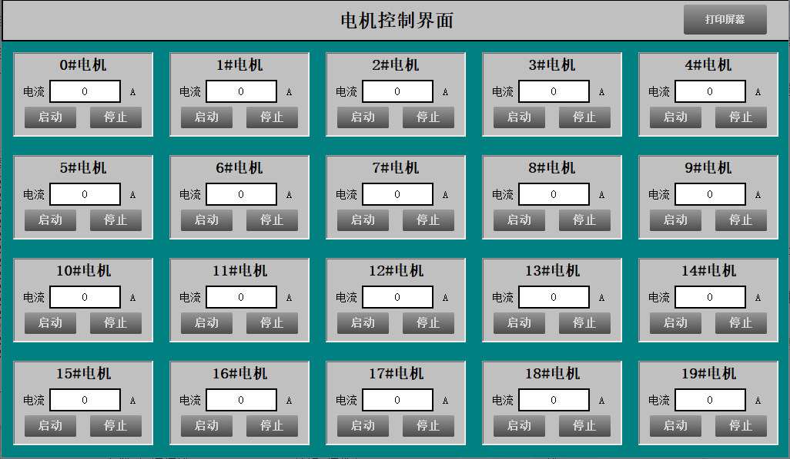

图 11.2-15 打印屏幕功能按钮设置

1.  此时在工程运行过程中点击此按钮已经可以实现截屏的目的了，但是为了美观和符合实际，我们不希望在屏幕中出现【打印屏幕】按钮。此时可以选中【打印屏幕】按钮，点击工具栏上的【置于最后】图标按钮，将【打印屏幕】按钮放置到最后一层，被上层构件遮挡住。设置步骤和效果如图11.2-16所示。

>   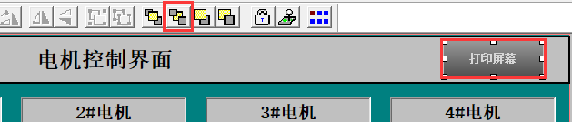 

图 11.2-16 遮蔽不希望被截屏的按钮

1.  然后进入工作台 → 主控窗口 → 双击 → 选择【响应重叠区所有构件】。

>   

图 11.2-17 设置相应重叠区域所有构件

1.  此时在运行工程，即可凭记忆点击按钮所在位置，实现截屏并保存到U 功能。

如果将函数设置为*!PrintToFile("\$MCGS_DIR_USER/Folder","Name", 0)*，则可以将截屏文件Name.jpg保存到TPC的用户自定义分区的Folder目录下。

### 11.2.5 操作日志函数

#### 11.2.5.1 常用函数介绍

以下4个函数为与操作日志相关的函数，通过这些函数可以执行操作日志的导出、清除、开启、关闭。

**!ExportOperationLogToCSV(文件名，开始时间，结束时间，导出模式)：**导出操作日志到csv文件。

**!OperationLogClear()：**清除所有的操作日志。

**!OperationLogDisable()：**关闭操作日志功能，最小执行间隔3秒，频繁调用无效。

**!OperationLogEnable()：**开启操作日志功能，最小执行间隔3秒，频繁调用无效。

#### 11.2.5.2 样例演示

关于操作日志函数的样例演示将在后续章节：进阶篇_13.1.3.2 对日志进行操作进行介绍。

## 11.3 数据对象操作函数

数据对象操作函数主要分为数据设置函数、组对象操作函数、历史数据操作函数、初值保存函数和报警操作函数。

### 11.3.1 数据设置函数

#### 11.3.1.1 常用函数介绍

**!DataGetInt (DatName，Value) ：**通过数据对象名【DatName】读取整数数据对象的值【Value】。

**!DataSetInt (DatName，Value) ：**通过数据对象名【DatName】写入整数数据对象的值【Value】。

#### 11.3.1.2 样例演示

1.  在实时数据库中新建两个整数型变量【A】和【B】

>   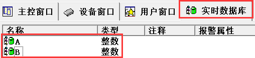

图 11.3-1 新建变量

1.  进入用户窗口，新建两个按钮，将它们的显示文本分别设置为【获取变量数据】和【设置变量数据】。

    其中，【获取变量数据】按钮的脚本程序是：

    *!DataGetInt("A",B) ‘将变量A的值赋值给变量B*

    【设置变量数据】按钮的脚本程序是：

    *!DataSetInt("A",B)  ‘将变量B的值赋值为变量A*

2.  然后新建两个输入框构件，在它们的操作属性处分别关联变量【A】和【B】，用于函数参数的赋值和运行结果显示。
3.  组态完成后，保存工程，然后下载工程，下载成功后启动运行。将变量【A】的值设置为【9】。然后点击【获取变量数据】按钮，可以看到，变量【B】的值变成【9】。

>   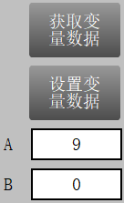 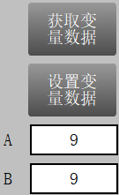

图 11.3-2 *!DataGetInt("A",B)*的运行效果

1.  然后将【B】设置为5，点击【设置变量数据】按钮，可以看到，【A】的值也变成了【5】。

>    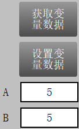

图 11.3-3 *!DataSetInt("A",B)*的运行效果

### 11.3.2 组对象操作函数

当变量是组对象的成员时，也可以使用组对象操作函数来获取和设置变量的值。

#### 11.3.2.1 常用函数介绍

**!GroupGetInt(组对象名,成员编号,返回值) ：**读取【组对象名】中由【成员编号】指定的成员的值给【返回值】。

**!GroupSetInt(组对象名,成员编号,设置值) ：**设置【组对象名】中由【成员编号】指定的成员的值为【设置值】。

#### 11.3.2.2 样例演示

1.  在实时数据库中新建两个整数型变量【A】和【B】，一个组对象【GROUP】。

>   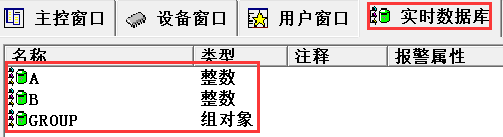

图 11.3-4 新建变量

1.  将【A】设置为【GROUP】的组对象成员。组对象成员的编号是从0开始的，设置完后，【A】的编号为0。

>   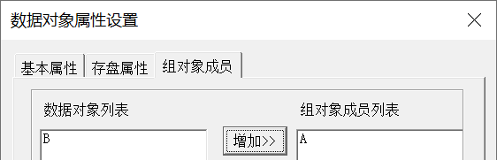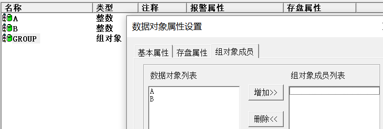

图 11.3-5 设置组成员

1.  在用户窗口中新建两个按钮，将它们的显示文本设置为【获取组对象成员数据】和【设置组对象成员数据】。

    其中，【获取组对象成员数据】按钮的脚本程序是：

    *!GroupGetInt(Group,0,B) ‘将组对象【GROUP】的编号为【0】的组成员（即A）的值赋值给【B】*

    【设置组对象成员数据】按钮的脚本程序是：

    *!GroupSetInt(Group,0,B) ‘设置组对象【GROUP】的编号为【0】的组成员（即A）的值赋值为【B】*

2.  然后新建两个输入框构件，在它们的操作属性处分别关联变量【A】和【B】，用于函数参数的赋值和运行结果显示。
3.  组态完成后，保存工程，然后下载工程，下载成功后启动运行。将变量【A】的值设置为【22】。然后点击【获取组对象成员数据】按钮，可以看到，变量【B】的值变成【22】。

>   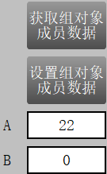 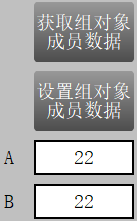

图 11.3-6 *!GroupGetInt(Group,0,B)*的运行效果

1.  然后将【B】设置为66，点击【设置组对象成员数据】按钮，可以看到，【A】的值也变成了【66】。

>    

图 11.3-7 *!GroupSetInt(Group,0,B)*的运行效果

### 11.3.3 历史数据操作函数

以下4个函数为历史数据操作函数。

#### 11.3.3.1 常用函数介绍

-   函数的意义

**!SaveData(DataName)：**把组对象DataName所有成员的当前值存入存盘数据库中，此组对象必须具有存盘属性，即需在其【存盘属性】设置界面勾选“定时存储到磁盘”或“定时存储到内存”,否则会操作失败。

**!FreshDataSave( )：**将已存盘的历史数据写入磁盘，最长等待时间3s。

**!DelAllSaveDat(DataName)：**删除组对象DataName对应的所有存盘数据(包括内存中和磁盘中的数据）。**注意：**此函数不能用来删除报警存盘数据。

**!ExportHisDataToCSV(文件名,组对象名,字段名,开始时间,结束时间,最大记录数,导出模式,导出参数,进度指示数据对象名,控制数据对象名)：**以CSV格式导出指定时间段的历史存盘数据或历史报警数据到U盘。

-   存盘的定义和机制

McgsPro 在运行过程中，根据设定周期或通过脚本调用将指定数据的值写入磁盘文件进行保存的过程，就是历史数据存盘。历史数据存盘只对具有存盘属性的组对象起作用。

>   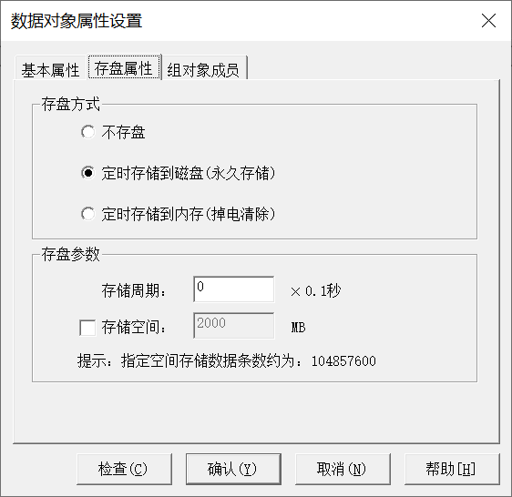

图 11.3-8 存盘属性

**存盘方式分类**

选择【定时存储到内存】时，历史数据不会被被存储到磁盘，掉电后数据清除。

选择【定时存储到磁盘】有两种历史数据存盘方式：

１.定时周期存盘：存盘周期大于 0 秒，按照设置的存盘周期循环存盘。

２.函数触发存盘：存盘周期等于 0 秒，需要使用*!SaveData*脚本函数存盘。

**实现机制**

>   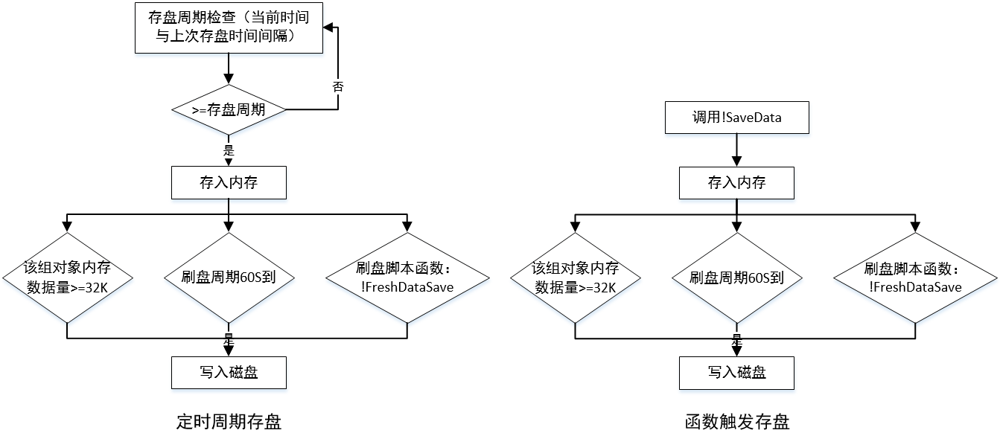

图 11.3-9 存盘机制

历史数据都是先保存在内存中，在满足一定的条件（三种：该组对象内存数据量\>=32KB；刷盘周期60SH时间到；调用了刷盘函数!FreshDataSave）时，才写入到磁盘中实现永久保存。 定时周期存盘和函数触发存盘的内部实现机制差不多，只是它们的触发方式不同而已。定时周期存盘是按照设置的存盘周期循环保存数据，而函数触发存盘是由函数脚本触发的。

#### 11.3.3.2 样例演示_历史数据保存

-   定时周期存盘

定时周期存盘组态非常简单，只要按需求设置存盘组对象的存盘周期即可。

例如：实时数据库中有三个数值型变量 Data01、Data02、Data03，需要记录它们每 1 秒的数据。则组态步骤为：

１.在实时数据库中，将这三个变量加入到一个组对象（Group1）中。

２.设置组对象的存盘属性为【定时存储到磁盘】，存储周期为10\*0.1 秒。

>   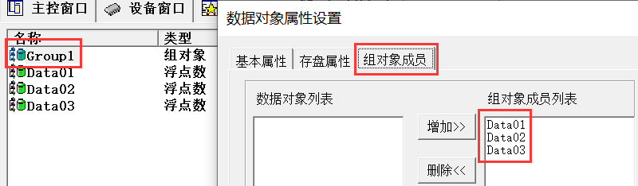

>   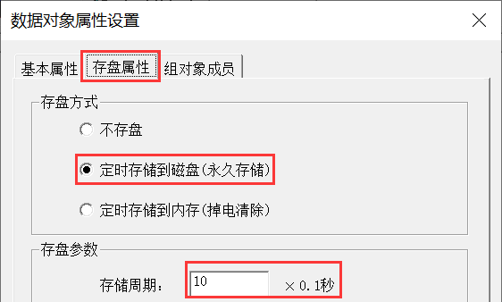

图 11.3-10 定时周期存盘

-   函数触发存盘

函数触发存盘需要调用函数*!SaveData*实现存盘操作。

例如：有三个数值型成员 Data04、Data05、Data06，需要在数据对象 Data00 变化的时候进行存盘。则

组态步骤为：

１.在组态环境中，将这三个变量加入到一个组对象（Group2）中。

２.设置组对象的存盘属性为【定时存储到磁盘】，存盘周期为 0 秒。

３.在运行策略窗口添加事件策略【策略1】。

>   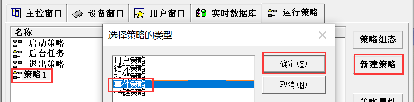

图 11.3-11 新增事件策略

４.向该事件策略【新增策略行】，设置事件策略属性，并加入存盘脚本程序。

>   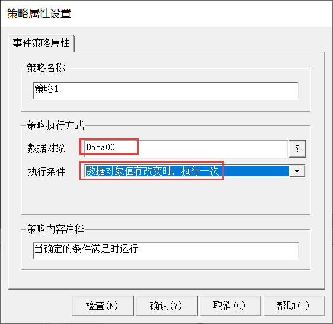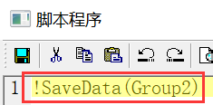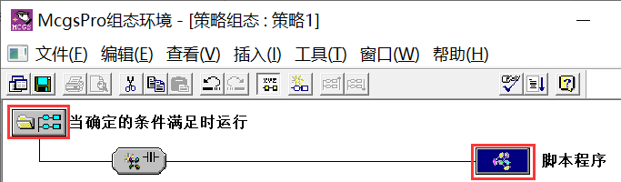

图 11.3-12 设置策略属性和存盘脚本

从存盘的运行机制可以知道，存盘动作产生后，并没有立即将保存的历史数据存储到磁盘文件中，而是暂存在内存里，等到组对象内存数据\>=32KB或刷盘周期60S时间到之后，才会被系统刷入磁盘中永久保存。为了防止断电丢失内存中的历史数据，可以在脚本*!SaveData(Group2)*下再增加一行刷盘脚本程序*!FreshDataSave( )，*在存盘后立即将数据存入磁盘。

请注意：频繁调用*!FreshDataSave( )*脚本，会对系统性能造成影响。该脚本一般在使用触发存盘时才使用，若都是定时周期存盘，不建议使用。

另外，建议在断电前安全退出运行环境，这样会将内存中的所有历史数据保存到磁盘文件中。可以添加一个按钮，将它的操作属性设置为【退出运行系统】，点击该按钮退出运行环境后再断电。

>   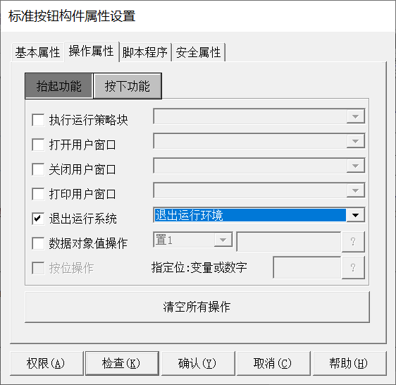

图 11.3-13 使用按钮安全退出运行环境

#### 11.3.3.3 历史数据的显示和统计

历史数据存盘，也是为了以后可以分析这些数据，所以就必然要查看这些数据或者形象地表示这些数据。主要有三种构件用来查看分析历史数据：

１.存盘数据浏览构件：主要用于对历史数据的直观浏览；

２.历史曲线构件：主要用于形象的表达历史数据变化趋势；

３.报表构件：主要用于统计分析历史数据。

**存盘数据浏览构件**

以前面提到的Group1为例，设置存盘数据浏览构件的数据来源为Group1，在显示属性中设置序号、时间和成员值，运行工程，就可以浏览Group1的所有历史数据了，如图11.3-14所示。

>   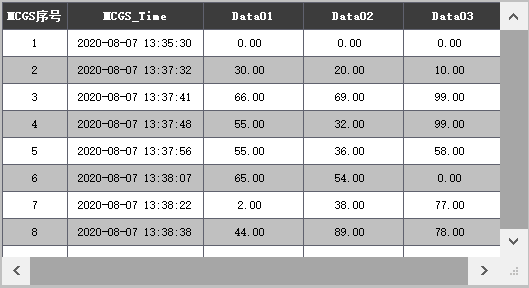

图 11.3-14 存盘浏览构件

**历史曲线构件**

仍然以Group1为例，设置历史曲线的存盘数据为Group1，并设置其成员Data01、Data02、Data03对应三条曲线，假如它们的数值分别按照正弦、方波、三角曲线的方式变化，则最后历史曲线显示的效果如图11.3-15所示。

>   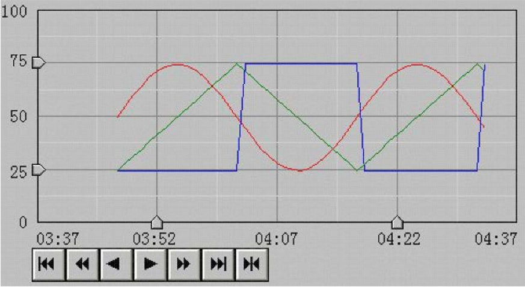

图 11.3-15 历史曲线构件

#### 使用存盘数据浏览构件和历史曲线构件显示历史数据的详细步骤请参考章节：进阶篇_5.2.2.2 存盘浏览构件显示历史数据。

**报表构件**

比如可以分别对Group1和Group2的成员各自求和，显示效果如图11.3-16所示。

>   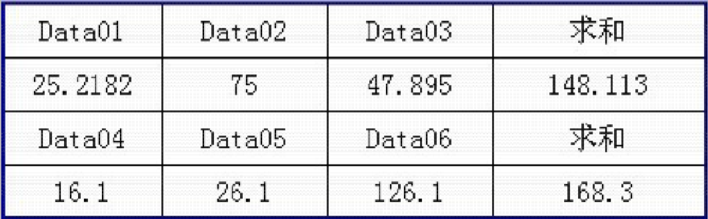

图 11.3-16 报表构件

使用报表构件统计历史数据的详细步骤请参考章节：进阶篇_5.2.3 历史数据统计。

#### 11.3.3.4 历史数据的导出和删除

**导出**

有时候需要将历史数据以更好的格式导出到电脑中，以便更方便地查看分析其数据，这时可以使用脚本函数!ExportHisDataToCSV 将组对象的历史数据导出到 CSV 文件中，使用 Excel 软件方便地查看数据。

详细介绍请参考章节：进阶篇_5.2.4 历史数据导出。

**删除**

McgsPro提供三种方法删除历史数据，详细介绍请参考章节：进阶篇_5.2.5 历史数据删除。

### 11.3.4 保存初值（掉电保持）函数

一般来说，工程启动时，实时数据库中变量的初始值是组态时设置的初始值。若想重启后变量的值恢复为重启前的值，就需要将变量的值先保存起来，使用的功能是【保存初值】功能。

**!SaveSingleDataInit(DataName)：**把数据对象的当前值设置为初始值。

**!FlushDataInitValueToDisk( )：**把保存在内存中的初值写入磁盘，调用后即刻刷盘。

函数的详细介绍请参考章节：进阶篇_5.4 变量初值保存功能。

### 11.3.5 报警操作函数

#### 11.3.5.1 常用函数介绍

报警相关的函数需要指定对象是整数或浮点数，并且需要指定报警序号的报警已设置。以下为3个常用的报警相关的函数。

**!GetAlmValue(DataName,AlarmIndex,Value,Flag):** 读取数据对象DataName的报警序号为AlarmIndex 的由Flag指定的报警属性值，赋值给Value。

**!SetAlmValue(DataName,AlarmIndex,Value,Flag):** 设置数据对象DataName的报警序号为AlarmIndex 的由Flag指定的报警属性值。

!**ClearHistoryAlarmData( ):** 删除所有的历史报警数据。

说明：当函数*!GetAlmValue*和*!SetAlmValue*的参数【Flag】为12时表示【报警基准值】，参数【Flag】的更多信息，请查看McgsPro组态软件帮助。

#### 11.3.5.2 样例演示_读取和设置报警基准值

1.  在实时数据库中新建三个浮点型变量【A】【B】和【温度】。

>   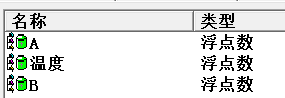

图 11.3-17 新建变量

1.  给变量【温度】添加一条报警：当【温度】的值\<=10时报警，报警内容为【温度过低】。

>   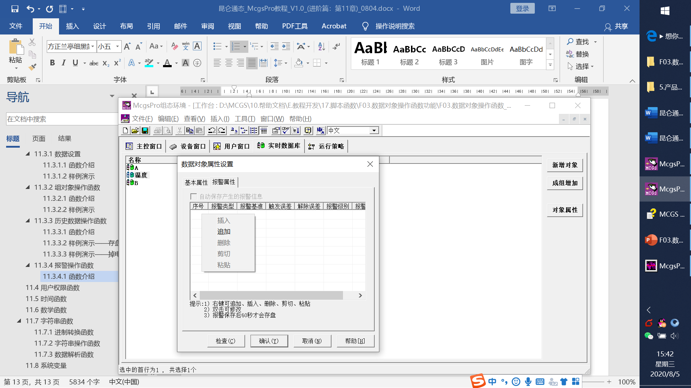

>   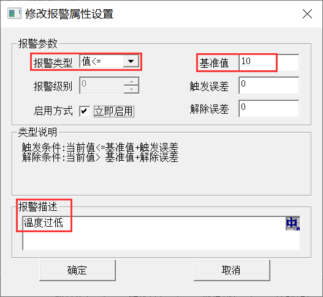

图 11.3-18 设置一条报警

1.  添加的报警序号为【0】。

>   

图 11.3-19 报警序号

1.  在用户窗口中新建两个按钮，将它们的显示文本分别设置为【获取序号0报警基准值】和【设置序号0报警属性】。

    其中，按钮【获取序号0报警基准值】中的脚本程序为：

    *!GetAlmValue(温度,0,A,12) ‘获取变量【温度】的序号为【0】的那条报警的报警基准值给变量【A】*

    按钮【设置序号0报警基准值】中的脚本程序为：

    *!SetAlmValue(温度,0,B,12) ‘设置变量【温度】的序号为【0】的那条报警的报警基准值为变量【B】的值*

2.  新建3个输入框构件，分别在它们的【操作属性】处关联变量【A】【B】和【温度】。
3.  新建一个报警浏览构件。选择【数据来源】为【实时报警数据】。

>   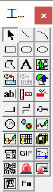 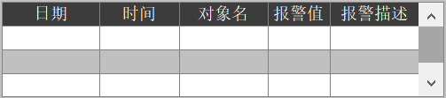

>   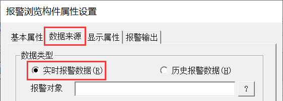

图 11.3-20 设置实时报警浏览构件

1.  组态好工程后保存工程，然后下载工程，下载成功后启动运行。由于变量【温度】的默认初始值为【0】，小于设置的报警基准值【10】，所以在工程运行的最初，报警浏览构件即显示了一条报警消息。

>   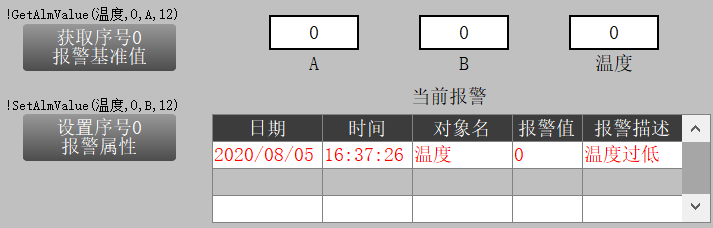

图 11.3-21 运行演示一

1.  点击【获取序号0报警基准值】按钮，变量【A】的值变为【温度】第0条报警的报警基准值【10】。如图11.3-21所示。
2.  将变量【B】的值设为【-2】，然后点击【设置序号0报警属性】按钮，则【温度】第0条报警的报警基准值被设置成了【-2】。此时由于【温度】的值【0】，已经不再小于新的基准值【-2】，故报警消除，报警浏览构件中的报警消息也随之消失。

>   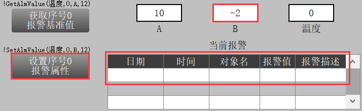

图 11.3-22 运行演示二

#### 11.3.5.3 样例演示_删除历史报警数据

1.  回到McgsPro组态软件，在11.3.5.3样例工程的的用户窗口中，再添加一个【报警浏览】构件，设置它的【数据来源】为【历史报警数据】。

>   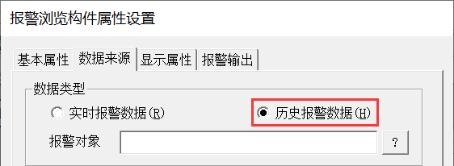

图 11.3-23 设置历史报警浏览构件

1.  在窗口空白处双击鼠标，设置窗口循环脚本为*Refresh()*，循环时间为1000ms。
2.  新增一个按钮，将它的显示文本设置为【清除所有历史报警】，脚本程序为：

    *!ClearHistoryAlarmData() ‘删除所有历史报警数据*

3.  组态好工程后保存工程，然后下载工程，下载成功后启动运行。注意，由于重新下载了工程，此时【温度】的报警基准值依然是【10】，初始值为【0】。通过输入框设置【温度】的值依次为【22（大于10）】 → 【2（小于10）】 → 【33（大于10）】 → 【3（小于10）】。可以看到设置了【数据来源】为【历史报警数据】的【报警浏览】构件上出现了3条报警信息，即显示了所有出现过的报警。

>   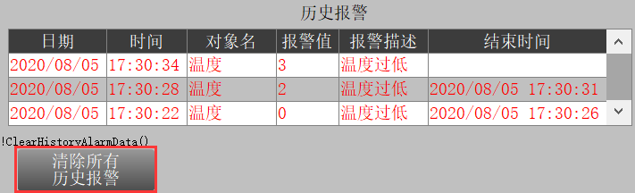

图 11.3-24 运行演示一

1.  然后点击【清除所有历史报警】，构件中的历史报警消失。

>   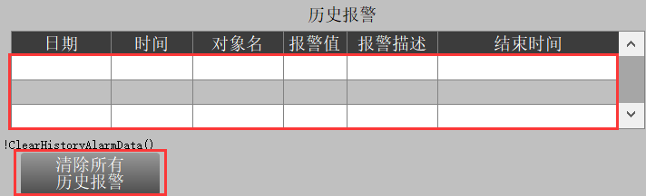

图 11.3-25 运行演示二

## 11.4 用户权限函数

在McgsPro组态软件中，可以通过脚本函数来实现用户的登录、退出、登录用户名获取、登录用户组名获取、打开用户管理对话框、登录用户密码修改。相关函数的详细内容将在后续章节：进阶篇_13.1.2.4进行介绍。

## 11.5 时间函数

McgsPro中，所有的时间在电脑端的模拟将以1970年1月1日8时0分0秒为基线，而人机界面端的实际运行将以1970年1月1日0时0分0秒为基线，时间值为以基线作为基准增加的秒数。

涉及时间操作的函数有以下几类：

>   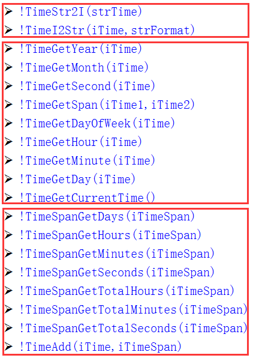

图 11.5-1 时间函数

### 11.5.1 常用函数介绍

**!TimeI2Str(iTime,strFormat)：**将时间值转换为字符串表示的时间。

**!TimeGetCurrentTime( )：**获取当前时间值。

**!TimeAdd(iTime,iTimeSpan)：**向时间iTime中加入由iTimeSpan指定的秒数。

### 11.5.2 样例演示

本节样例介绍如何使用时间函数推算：当前时间再过数分钟后的时间是多少。

1.  首先在实时数据库中新建三个整数型变量【iTime】【addTime】和【iTime2】用来表示当前时间值、增加的时间和增加后的时间值，两个字符串型变量【strTime】和【strTime2】用来表示当前时间和增加后的时间。

>   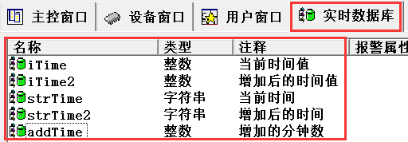

图 11.5-2 新建变量

1.  在用户窗口中，新建一个输入框构件，将它的显示输出关联变量【iTime】。

>   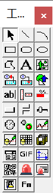  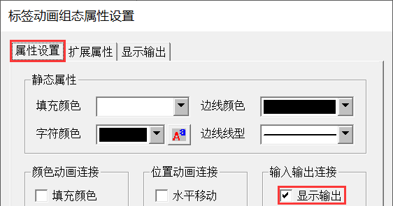

>   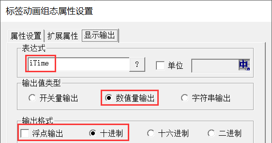

图 11.5-3 设置标签构件步骤

1.  用同样的方法再新建三个标签构件，使它们分别关联变量【iTime2】、【strTime】和【strTime2】。由于【strTime】和【strTime2】是字符串型变量，所以在第4步关联变量后选择输出值类型为【字符串输出】，其他使用系统默认设置，点击确认即可。

>   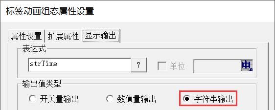

图 11.5-4 设置其它标签构件

1.  然后新建一个输入框构件，在它的操作属性中关联变量【addTime】。

>   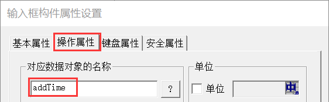

图 11.5-5 设置输入框构件关联变量

1.  给输入框添加事件脚本，实现功能：当输入框内容有变化时，执行脚本给当前时间值加上增加的时间，得到加时后的时间值，并转换成字符串表示。设置步骤如图11.5-6所示。

>   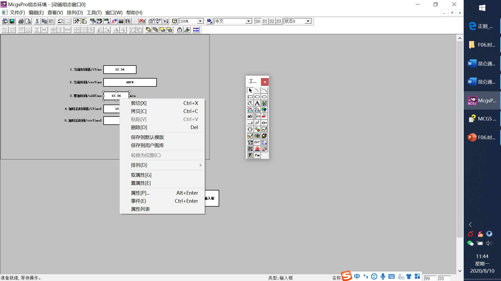 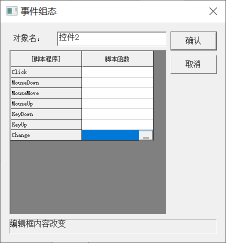

>   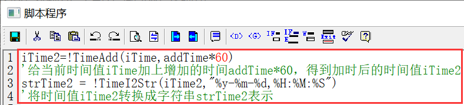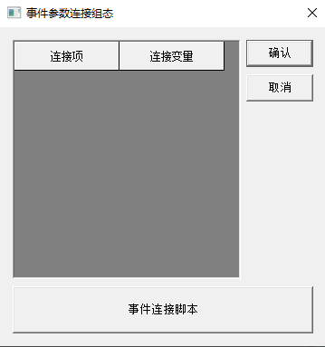

图 11.5-6 设置输入框构件事件脚本

1.  然后在窗口空白处双击，添加启动脚本：获取当前时间值【iTime】，并转换为字符串【strTime】表示。

>   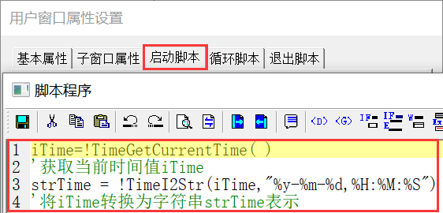

图 11.5-7 启动脚本

1.  保存工程后下载工程，然后启动运行。屏幕显示当前时间值【iTime】和当前时间【strTime】。在关联【addTime】的输入框中输入30，系统自动计算出30分钟后的时间值【iTime2】和时间【strTime2】。

>   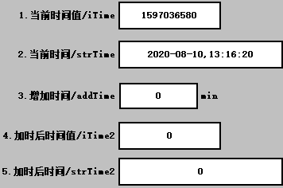 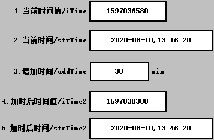

图 11.5-8 运行演示

## 11.6 数学函数

数学函数一共包含31个函数，主要分为三角函数、反三角函数、按位运算函数、取整函数和其他数学函数。

-   函数介绍及举例

    **三角函数：**

    !Sin(x)：正弦函数。

    !Cos(x)：余弦函数。

    !Tan(x)：正切函数。

    !Cot(x)：余切函数。

    !Sec(x)：正割函数。

    !Csc(x)：余割函数。

    请注意：三角函数中的参数x均为弧度。

    三角函数举例：

    !Sin(x) ：正弦函数。

>   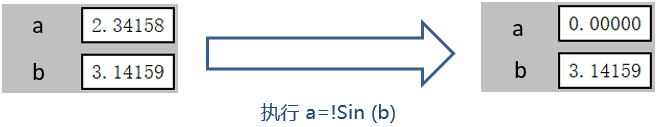

图 11.6-1 三角函数应用举例

**反三角函数**

!Asin(x)：反正弦函数。

!Acos(x)：反余弦函数。

!Atn(x) ：反正切函数

!Acot(x)：反余切函数。

请注意：反三角函数中的参数x均为弧度。

反三角函数举例：

!Asin(x)：反正弦函数。

>   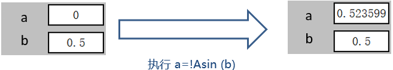

图 11.6-2 反三角函数应用举例

**按位运算函数**

!BitAnd(x,y)：按位与。

!BitOr(x,y)：按位或。

!BitXor(x,y)：按位异或。

!BitClear(x,y)：对x的位y进行清0 。

!BitSet(x,y)：对x的位y进行置1操作 。

!BitTest(x,y)：检测x对应二进制数的位y是否为1 。

!BitLShift(x,y)：将参数x左移y位。

!BitRShift(x,y)：将参数x右移y位。

!BitNot(x)：按位取反。

按位运算函数举例：

!BitAnd(x,y)：按位与。

>   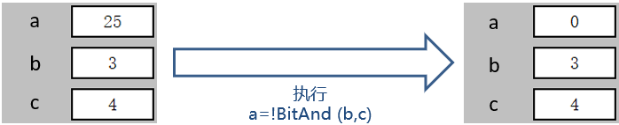

图 11.6-3 按位运算函数应用举例

**取整函数：**

!Ceil(x)：向上取整。

!Floor(x)：向下取整。

取整函数举例：

!Ceil(x)：向上取整。

>   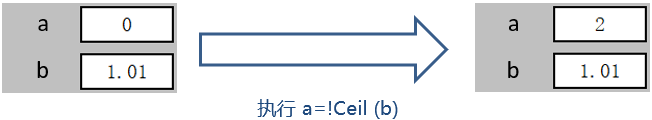

图 11.6-4 取整函数应用举例

**其他数学函数：**

!Log(x)：以e为底数的对数函数。

!Log2(x)：以2为底的对数。

!Log10(x)：以10为底的对数。

!ToDeg(x)：将弧度转换为角度。

!ToRad(x)：将角度转换为弧度。

!Sqr(x)：平方根函数。

!Exp(x) ：以e为底数的指数函数。

!Abs(x) ：绝对值函数。

!Sgn(x) ：符号函数。

!Rand(x,y)：生成随机数，随机数的范围在x和y之间。

其他数学函数举例：

!Rand(x,y)：生成随机数，随机数的范围在x和y之间。

注意事项：

（1）当x = y 时，在（x，x+1）之间生成随机数。

（2）当x \> y 时，在（y，x）之间生成随机数。

>   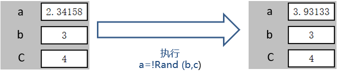

图 11.6-5 随机函数运行效果

## 11.7 字符串函数

字符串函数一共包含三大类，分别为“进制转换函数”、“字符串操作函数”和“数据解析函数”。本教程主要介绍6个具有代表性的函数，其他函数的使用请参考McgsPro帮助文档。

### 11.7.1 进制转换函数

-   函数介绍：

    **!Hex2I(s)：**把十六进制字符串转换为十进制数值。

    应用举例：十六进制数11转换为十进制数是？

>   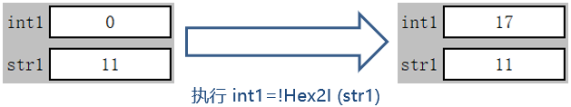

图 11.7-1 进制转换函数应用举例一

请注意：字符串s应为‘0’\~‘9’、‘a’\~‘f’、‘A’\~‘F’或‘-’字符组成的字符串，‘-’在开头才有效，除‘-’外最多8个字符。若指定字符串不是以0-9、a-f、 A-F、‘-’开头，则函数执行返回值为0，表示转换失败。

>   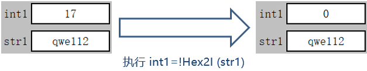

图 11.7-2 进制转换函数应用举例二

-   函数介绍：

    **!I2Hex(s)：**把十进制数值转换为十六进制字符串。

    应用举例：十进制数17转换为十六进制数是？

>   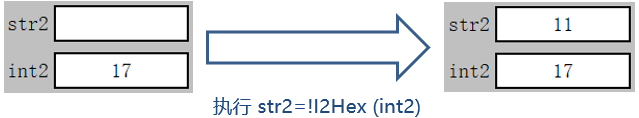

图 11.7-3 进制转换函数应用举例三

### 11.7.2 字符串操作函数

-   函数介绍：

    **!Mid (str,n,k)：**从字符串变量str左边第n个字符起，取k个字符。

    应用举例：从字符串“aBcDeFg”左边第4个字符起，取2个字符，赋值给变量str3。

>   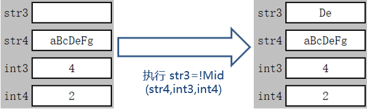

图 11.7-4 字符串操作函数应用举例一

请注意：（1）当n以后的字符个数小于k时，函数将返回n以后的所有字符串；（2）当k=-1时，返回n以后的所有字符；（3）当n \<1时，返回空字符。

-   函数介绍：

    **!StrComp (str1,str2) ：**比较字符串变量str1和str2是否相等，不区分大小写字母。当返回值为0，则表示两个字符串相等，反之表示不相等。

    应用举例：

>   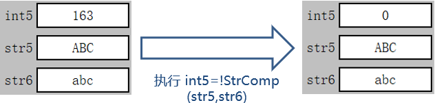

图 11.7-5 字符串操作函数应用举例二_两字符串相同

>   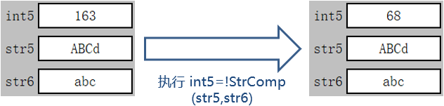

图 11.7-6 字符串操作函数应用举例三_两字符串不同

### 11.7.3 数据解析函数

-   函数介绍

    **!SetIntToByteArr (ByteArr,start,n)：**对字节数组ByteArr中从start位置开始的内容进行填充，填充的长度为4字节，填充的内容为n。

    **!SvrGetIntFromByteArr (ByteArr,start,n,Flag)：**将字节数组ByteArr中从start位置开始的内容输出到变量n中，输出的格式为4字节整数，字节数组位置计数从1开始。

    应用举例：

    在实时数据库中新建5个整数型变量【in6】至【int10】。

    进入用户窗口，新建6个输入框构件，将其中5个输入框构件的操作属性分别关联【in6】至【int10】，进制设为【十进制】。【int6】的操作属性如图11.7-7所示，其他变量以此类推。

>   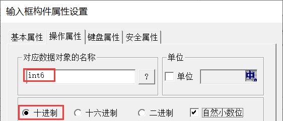

图 11.7-7 输入框构件一操作属性

再将一个输入框构件的操作属性关联【int6】，进制设为【二进制】。

>   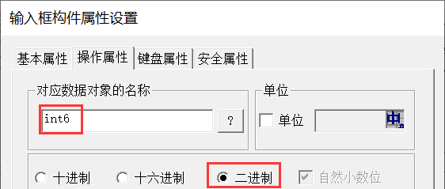

图 11.7-8 输入框构件二操作属性

新建一个按钮，将它的脚本函数设置为：

>   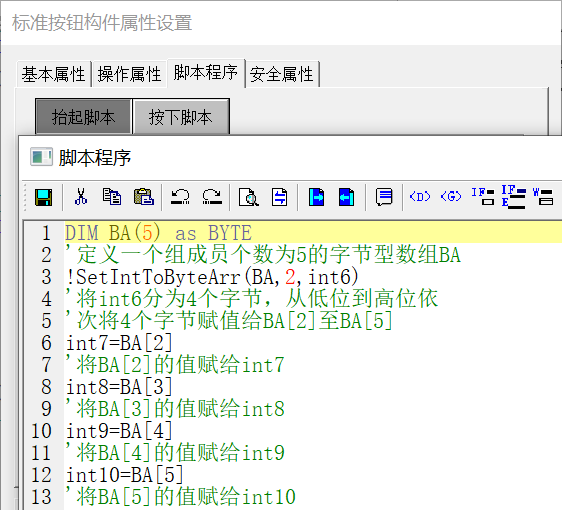

图 11.7-9 按钮脚本

【int6】的字节1至4分别被赋值为BA[2]至BA[5]。由于BA[2]至BA[5]不能直接关联输入框，为了观察函数运行效果，我们又将BA[2]至BA[5]赋值给int7至int10以显示脚本函数运行结果。

保存工程后下载工程，然后启动运行。在以十进制显示的关联【int6】的输入框内任意输入一个数字，可以看到以二进制显示【int6】的输入框显示了该数据的二进制形式。为了便于观察，我们用红线将该二进制值分割成4个字节，最高位的第4个字节不够8位的看作用由0补齐。

>   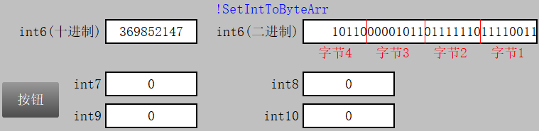

图 11.7-10 运行演示一

点击按钮运行脚本。关联【int7】的输入框显示字节1的十进制形式，以此类推。

>   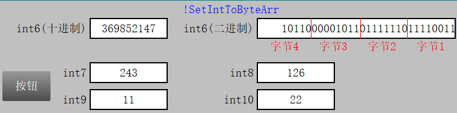

图 11.7-11 运行演示二

## 11.8 系统变量

McgsPro内部定义了一些变量，我们称之为McgsPro系统变量。在进行组态时，可直接使用这些系统变量。为了和用户自定义的变量相区别，系统变量的名称一律以“\$”符号开头。McgsPro系统变量多数用于读取系统内部设定的参数，它们只有值的属性，没有最大值、最小值及报警属性。

### 11.8.1 常用系统变量介绍

**\$Date：**读取当前时间：“日期”，字符串格式为：（年-月-日），年用四位数表示，月日用两位数表示，如1997-01-09。

**\$Time：**读取当前时间：“时刻”，字符串格式为：（时:分:秒），时、分、秒均用两位数表示，如20:12:39。

**\$Week：**读取计算机系统内部的当前时间：“星期”（1～7）。

**\$RunTime：**读取应用系统启动后所运行的秒数，小数部分表示毫秒值。

**\$UserName：**在程序运行时记录当前用户的名字。若没有用户登录或用户已退出登录，“\$UserName”为空字符串。

### 11.8.2 样例演示_显示当天日期

本节样例介绍使用标签构件显示当天的的日期。

1.  进入用户窗口，新建一个标签构件，将它的显示输出关联变量【\$Date】，输出值类型设为【字符串输出】。

>     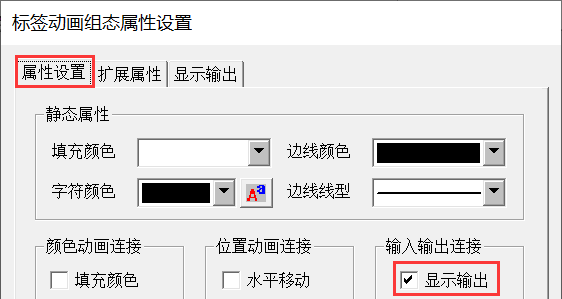

>   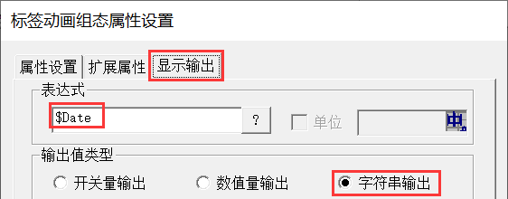

图 11.8-1 标签构件设置

1.  保存工程后下载工程，然后启动运行。画面中标签构件显示系统当前日期。

>   

图 11.8-2 运行演示

### 11.8.3 样例演示_显示当天星期

McgsPro中的系统变量\$Week显示的值的范围为1\~7，对应星期一\~星期天。如果需要标签构件直接显示星期，可以用一个简单的脚本程序来实现。

首先在实时数据库中新建一个字符串型变量【星期显示】。

>   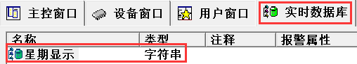

图 11.8-3 新建变量

然后进入工作台 → 运行策略 → 后台任务，后台任务的默认循环周期为60000ms，用户可根据需要自行设置脚本执行周期。给后台任务添加一条策略行，编辑它的脚本如图11.8-4所示。

>   

>   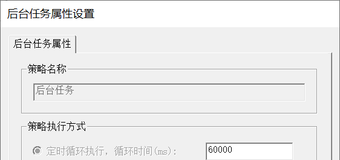 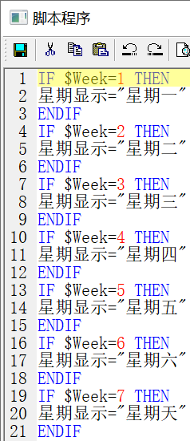

图 11.8-4 设置后台策略

进入用户窗口，将一个标签构件的显示输出关联变量【星期显示】，输出值类型设为【字符串输出】。

保存工程后下载工程，然后启动运行。画面启动后，标签中显示当天的星期。

>   

图 11.8-5 运行演示

## 11.9 文件操作函数

### 11.9.1 常用函数介绍

以下几个函数为文件操作函数，通过文件操作函数可以在人机界面系统中对文件进行创建、复制、删除、查找、移动等操作。

**!GetFreeDiskSpace( )：**读取空余存盘空间。

**!CreateDirectory(strDirPath)：**创建指定路径的文件夹目录。

**!FileFind (strFilename,nameArr,sizeArr,attribArr)：**查找指定路径下及其子文件下指定条件的文件或文件夹。

**!FileDelete(strFilename)：**将指定的文件或目录删除。

**!FileWriteByStr(strFileName,strValue,mode,encode)：**将字符串按照指定编码方式写入指定文件的指定位置。

**!FileReadByStr (strFilename,filePos,strLength,strResultRef,encode)：**从指定文件指定位置开始，按照指定编码方式读取指定字节的字符串，或一整行，或全部字符串并将结果保存到strResultRef变量中。

说明：

1.文件操作涉及路径均以“\$MCGS_DIR_USER/”开始表示用户目录，其他情况则表示U盘目录，且不能存在操作系统根目录的写法（即 “../”、“/..”、“/../” ）。

举例说明：

1.  如路径为test.csv，表示U盘目录下test.csv文件；a/test.csv，表示U盘目录下文件夹a中的tes.csv文件
2.  使用电脑模拟时[../安装目录/Program/data/user_dir]表示用户目录，[../安装目录/Program/export]表示U盘目录。

2.文件操作涉及的路径或文件名，在模拟环境下不区分大小写；实际触摸屏运行环境下严格区分大小写。

3.若某个路径下存在文件时，在该路径不能创建同名文件夹。

### 11.9.2 样例演示_文件（夹）的创建、查找和删除

#### 11.9.2.1 创建文件夹

首先在实时数据库中新建两个字符串型变量【strDirPath】和【DC】。

然后在用户窗口中新建一个标准按钮构件，将它的显示文本修改为【创建文件夹】，脚本程序设置如图11.9-1所示。

>   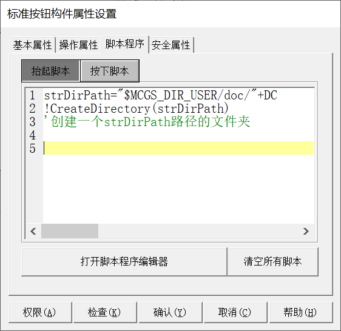

图 11.9-1 创建文件夹功能按钮设置

再新建一个输入框构件，将它的操作属性关联变量【DC】，作为文件夹名称的输入入口。

#### 11.9.2.2 查找文件

在实时数据库中新建5个字符串型变量【str000】至【str004】。

然后在用户窗口中新建一个标准按钮构件，将它的显示文本修改为【查找文件】，脚本程序设置如图11.9-2所示。

>   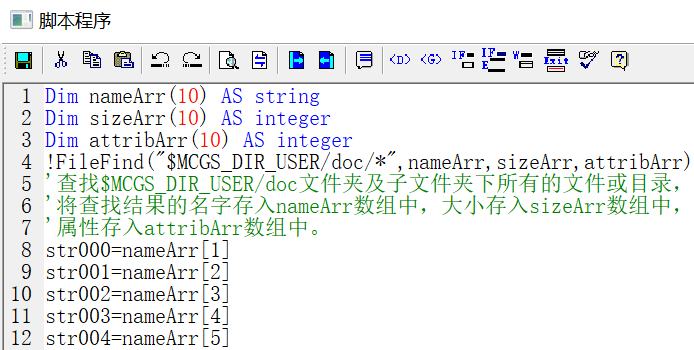

图 11.9-2 查找文件夹功能按钮设置

再创建5个标签构件，分别将它们的显示输出关联变量【str000】至【str004】，输出值类型为【字符串输出】。关联变量【str000】的标签构件的显示属性设置如图11.9-3所示，其他标签构件以此类推。

>   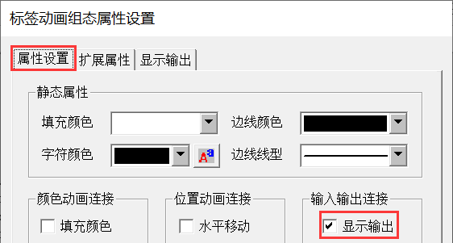 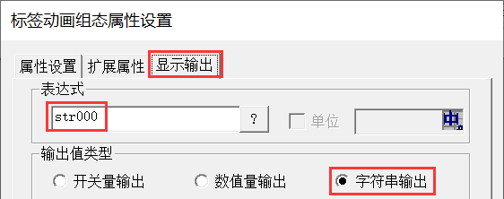

图 11.9-3 将标签关联变量

#### 11.9.2.3 删除文件

首先在实时数据库中新建量给字符串型变量【strFilename】和【DC1】。

然后在用户窗口中新建一个标准按钮构件，将它的显示文本修改为【删除文件】，脚本程序设置如图11.9-4所示。

>   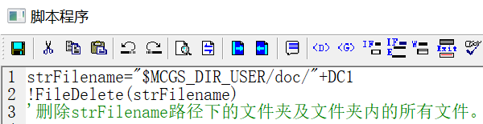

图 11.9-4 删除文件功能按钮设置

再新建一个输入框构件，将它的操作属性关联变量【DC1】

>   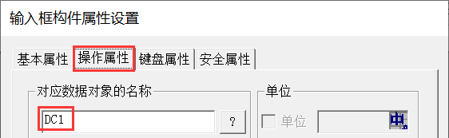

图 11.9-5 输入框构件设置

#### 11.9.2.4 模拟运行演示

组态完成后保存工程，然后下载工程，下载成功后启动运行。在关联【DC】的输入框内输入想要创建的文件夹的名称，然后点击【创建文件夹】按钮。

>   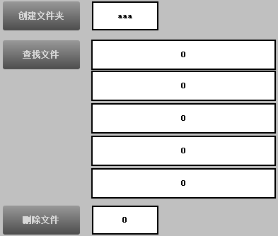

图 11.9-6 运行演示_创建文件夹

此时的安装目录/Program/data/user_dir下，创建了一个名为【doc】的文件夹，文件夹中又创建子文件夹【aaa】。

>   

图 11.9-7 运行演示_创建文件夹效果

在【doc】文件夹中新建数个文件（夹），如图11.9-8所示。

>   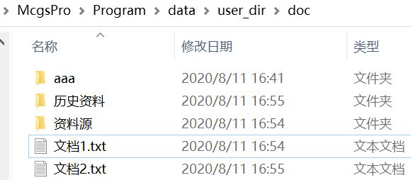

图 11.9-8 运行演示_手动在【doc】文件夹中新建数个文件（夹）

回到模拟运行界面，点击【查找文件】按钮，系统查找到【doc】文件夹中的文件，由关联好变量的标签构件显示。

>   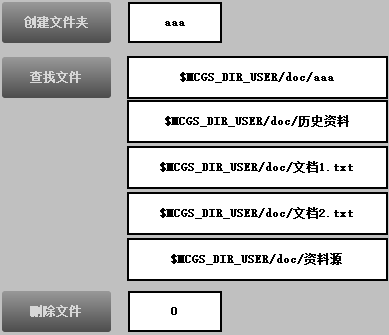

图 11.9-9 运行演示_查找文件效果

在关联【DC1】的输入框中输入【资料源】，点击【删除文件】按钮。可以看到该文件夹被删除。

>    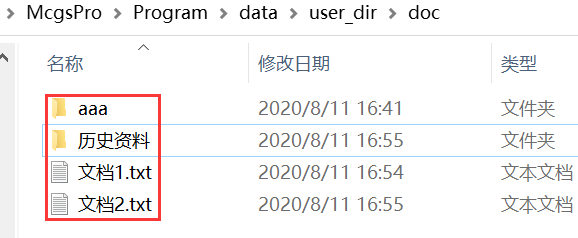

图 11.9-10 运行演示_删除文件效果

### 11.9.3 样例演示_文件写入和文件读取

继续使用11.9.2中的样例。

#### 11.9.3.1 创建并写入

首先在实时数据库中新建一个字符串型变量【strValue】。

然后在用户窗口中新建一个标准按钮，将它的显示文本修改为【创建并写入】，脚本程序设置如图11.9-11所示。

>   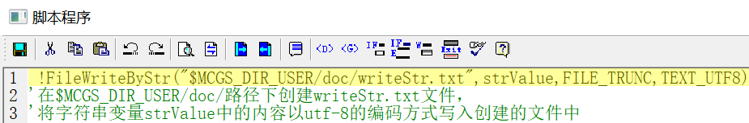

图 11.9-11 创建并写入功能按钮设置

再新建一个输入框构件，将它的操作属性关联变量【strValue】。

#### 11.9.3.2 追加写入

再在用户窗口中新建一个标准按钮，将它的显示文本修改为【追加写入】，脚本程序设置如图11.9-12所示。

>   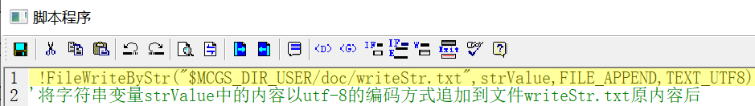

图 11.9-12 追加写入功能按钮设置

#### 11.9.3.3 读取内容

在实时数据库中新建一个字符串型变量【strResultRef】。

然后在用户窗口中新建一个标准按钮，将它的显示文本修改为【读取】，脚本程序设置如图11.9-13所示。

>   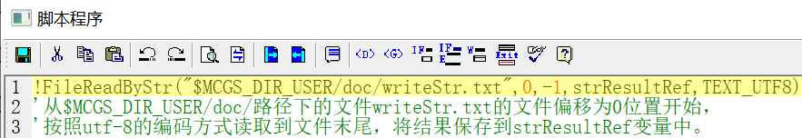

图 11.9-13 读取内容功能按钮社会组

再新建一个输入框构件，将它的操作属性关联变量【strResultRef】。

#### 11.9.3.4 模拟运行演示

组态完成后保存工程，然后下载工程，下载成功后启动运行。在关联【strValue】的输入框内输入想要创建的文件内容，比如【昆仑通态】，然后点击【创建并写入】按钮。

>   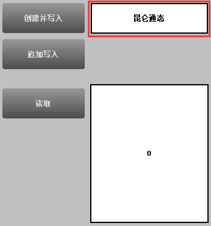

图 11.9-14 运行演示_创建文件并写入内容

此时的安装目录/Program/data/user_dir/doc下，创建了一个名为【writeStr.txt】的文件。使用记事本打开该文件，可以看到文件内容如图11.9-15所示。

>   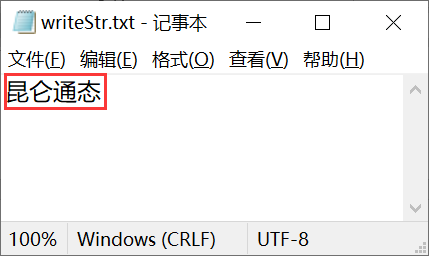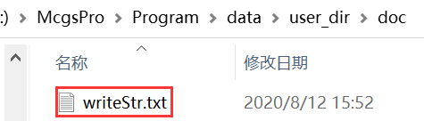

图 11.9-15 运行演示_打开创建的文件

点击【读取】按钮，将【writeStr.txt】文件中的内容读取到模拟屏上，如图11.9-16所示。

>   

图 11.9-16 运行演示_读取内容

再在关联【strValue】的输入框内输入想要追加的文件内容，比如【创世界精品】，然后点击【追加写入】按钮。点击【读取】，可以看到系统在上一步写入的内容后面增加了新的内容。

>   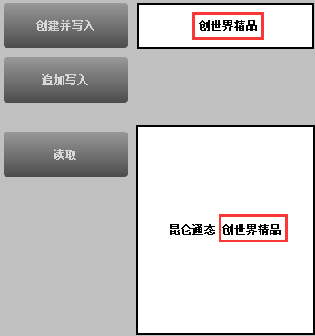

图 11.9-17 运行演示_追加写入

## 11.10 内存操作函数

### 11.10.1 常用函数介绍

以下4个函数为内存操作函数，通过内存操作函数可以在人机界面系统内存中进行创建缓冲区、清除缓冲区数据、释放缓存、获取缓存大小、加载字符串到缓冲区等操作。

**!BufferCreate(bufID,bufSize,byteOrder,encode)：**创建一个ID为bufID，大小bufSize，字节排序方式为byteOrder，编码格式为encode的缓冲区。

**!BufferSetInt(bufID,pos,intValue,type)：**将type类型的整型值intValue写入ID为bufID的缓冲区的pos位置。

**!BufferGetInt(bufID,pos,intValueRef,type)：**获取ID为bufID的缓冲区pos位置的type型整型值，赋给变量intValueRef。

**!BufferWriteToCsvStr(bufID,bufPos,formatStr,count,csvStrRef)：**将ID为bufID的缓冲区，bufPos位置开始的数据，按formatStr格式导出count行到csvStrRef字符串变量中。

说明：

1.缓冲区个数：最多128个。

2.缓冲区总大小：小于等于1M。

3.缓冲区ID：0-127。

4.涉及路径标识时：

\$MCGS_DIR_USER：表示用户分区目录

非\$开头：U盘分区目录，如DOC/a.CSV，表示U盘中DOC文件夹下的a.csv文件

### 11.10.2 样例演示

1.  创建缓冲区：

    在用户窗口中新建一个标准按钮，将它的显示文本修改为【创建缓冲区】，脚本程序设置如图11.10-1所示。

>   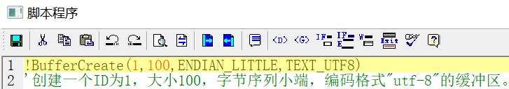

图 11.10-1 创建缓冲区功能按钮设置

1.  将整数写入缓冲区：

    在实时数据库中新建一个整数型变量【A】。

    然后在用户窗口中新建一个标准按钮，将它的显示文本修改为【将整数写入缓冲区】，脚本程序设置如图11.10-2所示。

>   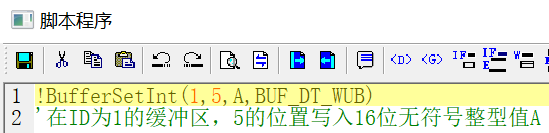

图 11.10-2 将整数写入缓冲区功能按钮设置

再新建一个输入框构件，将它的操作属性关联变量【A】,格式为【十进制】。

1.  从缓冲区读取整数：

    在实时数据库中新建一个整数型变量【B】。

    然后在用户窗口中新建一个标准按钮，将它的显示文本修改为【从缓冲区读取整数】，脚本程序设置如图11.10-3所示。

>   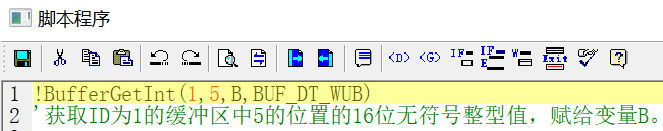

图 11.10-3 从缓冲区读取整数功能按钮设置

再新建一个标签构件，将它的显示输出关联变量【B】,输出值类型为【数值量输出】。

1.  缓冲区数据写到字符串：

    在实时数据库中新建一个字符串型变量【csvStrRef】。

    然后在用户窗口中新建一个标准按钮，将它的显示文本修改为【缓冲区数据写到字符串】，脚本程序设置如图11.10-4所示。

>   

图 11.10-4 缓冲区数据写到字符串功能按钮设置

再新建一个标签构件，将它的显示输出关联变量【csvStrRef】,输出值类型为【字符串输出】。

1.  模拟运行演示：

    组态完成后保存工程，然后下载工程，下载成功后启动运行。

    首先点击【创建缓冲区】按钮，在内存中新建一个ID为1的缓冲区。

>   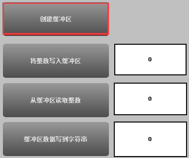

图 11.10-5 运行演示_创建缓冲区

在关联变量【A】的输入框中任意输入一个数字，比如【789】，点击按钮【将整数写入缓冲区】，将【789】存入缓冲区指定位置。然后点击【从缓冲区读取整数】按钮，将缓冲区指定位置内容赋值给变量【B】，可以看到关联变量【B】的标签构件的显示内容为【789】。

>   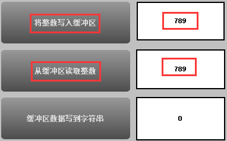

图 11.10-6 运行演示_读写缓冲区内容

点击【缓冲区数据写到字符串】按钮，将缓冲区的指定位置内容赋值给字符串变量【csvStrRef】，可以看到关联变量【csvStrRef】的标签构件的显示内容为【789】。

>   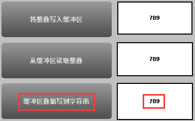

图 11.10-7 运行演示_缓冲区数据写到字符串

## 11.11 计时器函数

McgsPro可用的系统计时器范围为0到127，即系统内嵌128个系统计时器。用户可以随意使用其中的任意一个。

计时器返回时间值为浮点数，单位为秒，小数位表示毫秒。因为采用浮点数表示，随着数值增大会略有误差。

### 11.11.1 常用函数介绍

**!TimerRun(计时器号)：**启动计时器开始工作。

**!TimerStop(计时器号)：**停止计时器工作。

**!TimerReset(计时器号,数值)：**设置计时器的当前值。

**!TimerValue(计时器号)：**取计时器的当前值。

**!TimerState(计时器号)：**取计时器的工作状态。

**!TimerSetLimit(计时器号,上限值,参数3)：**设置计时器的上限值及运行模式。

**!TimerSetOutput(计时器号,变量)：**将计时器的值输出给参数二。

**!TimerWaitFor(定时器,数值)：**等待定时器工作到参数二指定的值后，脚本程序才向下执行。

### 11.11.2 样例演示_启动、停止、获取当前值、获取状态

1.  首先在实时数据库中新建1个浮点数型变量【计时器状态】。
2.  进入用户窗口0，在窗口中新建2个标准按钮构件，将它们的显示文本分别设置为【启动计时器】和【停止计时器】。

    其中，【启动计时器】按钮的脚本为：

    *!TimerRun(0)  ‘启动计时器0*

    【停止计时器】按钮的脚本为：

    *!TimerStop(0) ‘停止计时器0*

3.  双击窗口空白处，设置窗口的循环脚本时间设置为100ms，循环脚本设置如图11.11-1所示：

>   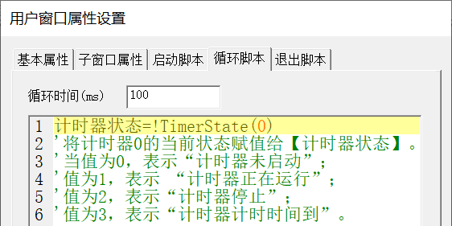

图 11.11-1 窗口循环脚本设置

1.  新建一个【动画显示】构件。双击进入基本属性 → 分段点0 → 外形 → 图像0 → 点击图库按钮 → 扁平风格 → 图标 → 白色背景_按钮抬起 → 确定。

>   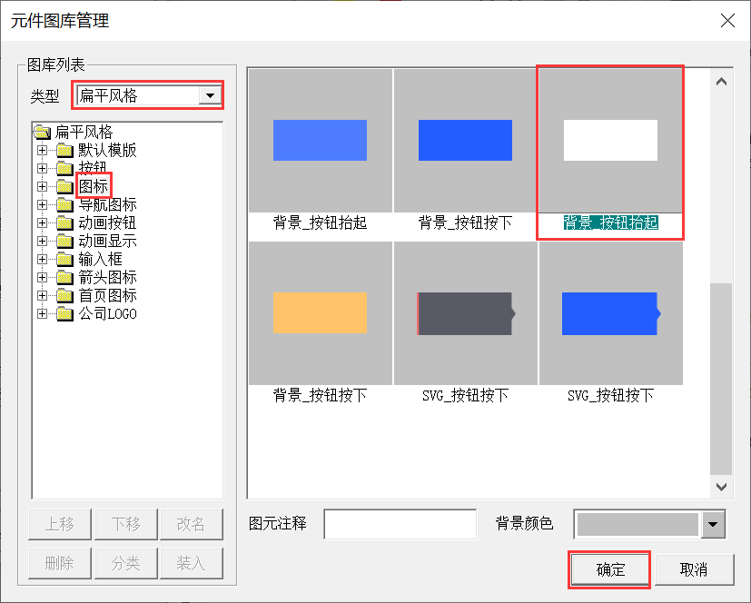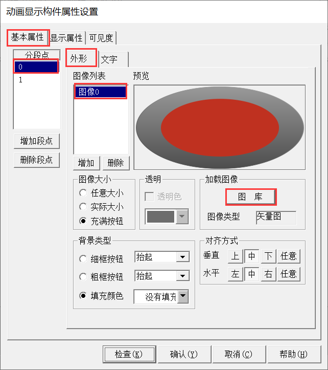

图 11.11-2 动画显示分段点0图像设置

然后点击基本属性分段点0中的文字 → 点击增加按钮 → 选中出现的文本0 → 修改文本内容为【计时器未启动】。

>   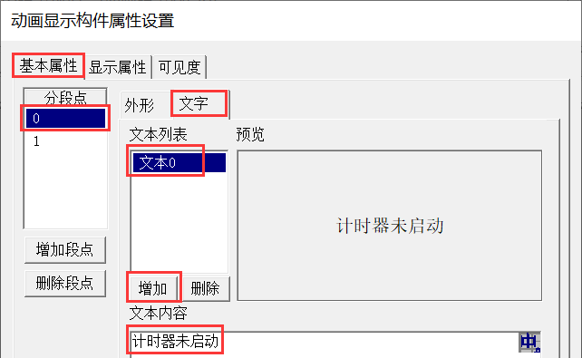

图 11.11-3 动画显示分段点0文本设置

点击基本属性中的【增加段点】按钮增加2个分段点【分段点2】和【分段点3】。按照前面的步骤，将【分段点1】至【分段点3】的外形统一设置成和【分段点0】一致，文本显示分别为【计时器正在运行】【计时器停止】【计时器时间到】。

然后进入【显示属性】功能页，设置显示变量类型为【数值显示】，关联的变量为【计时器状态】，切换方式为【根据变量值切换】。

>   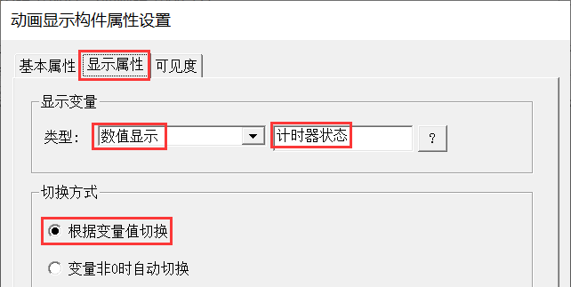

图 11.11-4 动画显示显示属性设置

1.  保存工程后下载工程，然后启动运行。此时画面中关联【计时器状态】的动画显示构件显示内容为【计时器未启动】。

>   

图 11.11-5 运行演示_刚开始运行时的画面

点击【启动计时器】按钮，计时器状态变为【计时器正在运行】。

>   

图 11.11-6 运行演示_启动计时器

点击【停止计时器】按钮，计时器状态变为【计时器停止】。

>   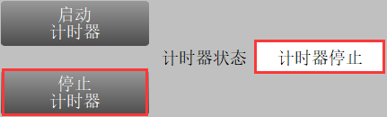

图 11.11-7 运行演示_停止计时器

### 11.11.3 样例演示_获取当前值、重置当前值

继续使用11.11.2中的样例工程。

1.  首先在实时数据库中新建2个浮点数型变量【当前值】和【重置当前值】。
2.  进入用户窗口0，双击窗口空白处，将窗口的启动脚本设置如图11.11-8所示：

>   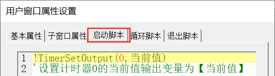

图 11.11-8 窗口启动脚本

1.  新建一个标签构件，将它的显示输出关联变量【当前值】，单位设置为【秒】，输出值类型为【数值量输出】，取消勾选输出格式中的【浮点输出】和【自然小数点】，默认输出格式为【十进制】。

>   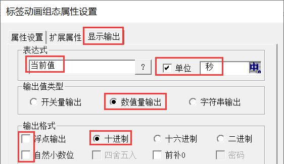

图 11.11-9 标签构件显示属性设置

1.  新建一个标准按钮构件，将它的显示文本设置为【重置当前值】，脚本设置为：

    *!TimerReset(0,重置当前值)  ‘将计时器0的当前值重置为变量【重置当前值】的值*

2.  新建一个输入框构件，将它的操作属性关联变量【重置当前值】，单位设为【秒】。

>   

图 11.11-10 输入框属性设置

1.  保存工程后下载工程，然后启动运行。点击【启动计时器】按钮，关联变量【当前值】的标签构件的显示值以每秒加一的速度递增。

>   

图 11.11-11 运行演示_启动计时器

1.  将关联变量【重置当前值】设为【0】，点击【重置当前值】按钮，可以看到，关联变量【当前值】的标签的显示内容变成了【0】，重置成功。

>   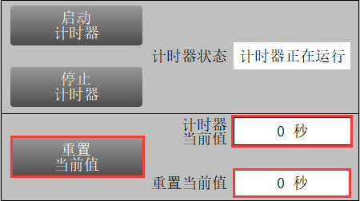

图 11.11-12 运行演示_重置计时器值

### 11.11.4 样例演示_锁定屏幕N秒

继续使用11.11.3中的样例工程。

1.  在实时数据库中新建一个浮点数变量【锁定时间】，将它的初值设定为【5】。

>   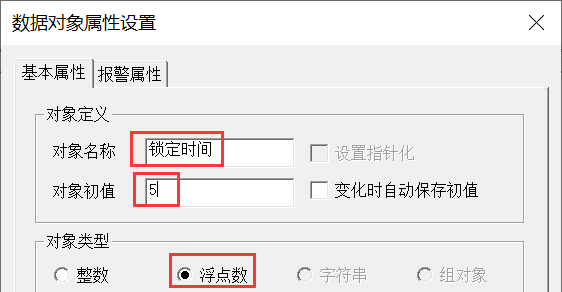

图 11.11-13 新建变量并设定其初值

1.  进入工作台 → 用户窗口 → 新建窗口。

>   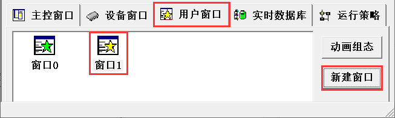

图 11.11-14 新建窗口

1.  双击新建的窗口1进入窗口。双击窗口空白处，弹出【用户窗口属性设置】界面，将窗口名称修改为【屏幕锁定】。窗口背景设置为【浅蓝色】。

>   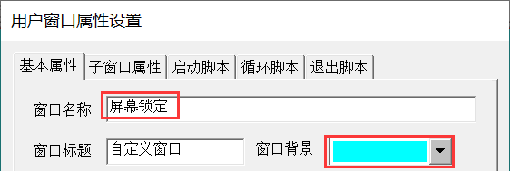

图 11.11-15 设置窗口基本属性

1.  进入【子窗口属性】功能页，勾选【作为子窗口使用】前的复选框，设置窗口宽度为【160】，窗口高度为【110】，其他设置保持默认不变。

>   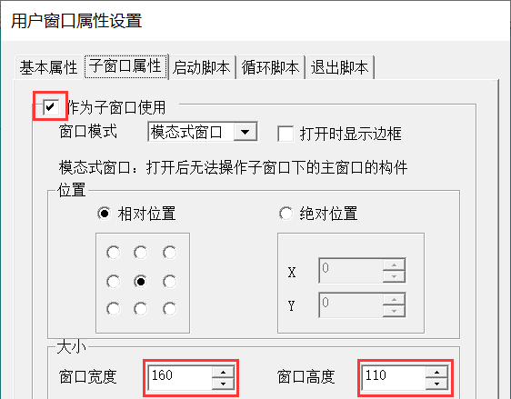

图 11.11-16 设置窗口子窗口属性

1.  进入【循环脚本】功能页，设置循环时间为【100】ms，循环脚本程序如图11.11-17所示，它的作用是计时器0运行t秒后，关闭子窗口【屏幕锁定】。

>   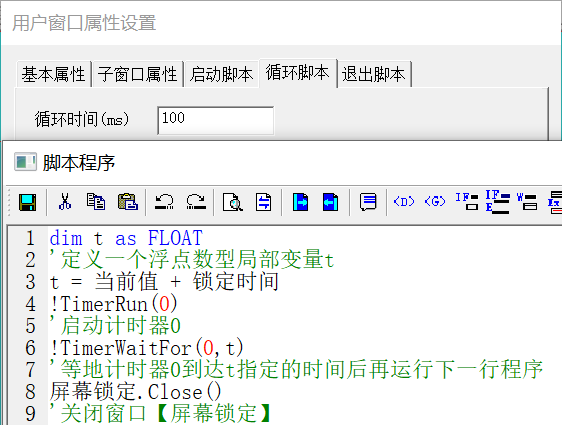

图 11.11-17 设置窗口循环脚本

1.  新建一个标签构件，将它的文本设置为【屏幕锁定中！请稍等！】，填充颜色为【没有填充】和边线颜色为【没有边线】。

>   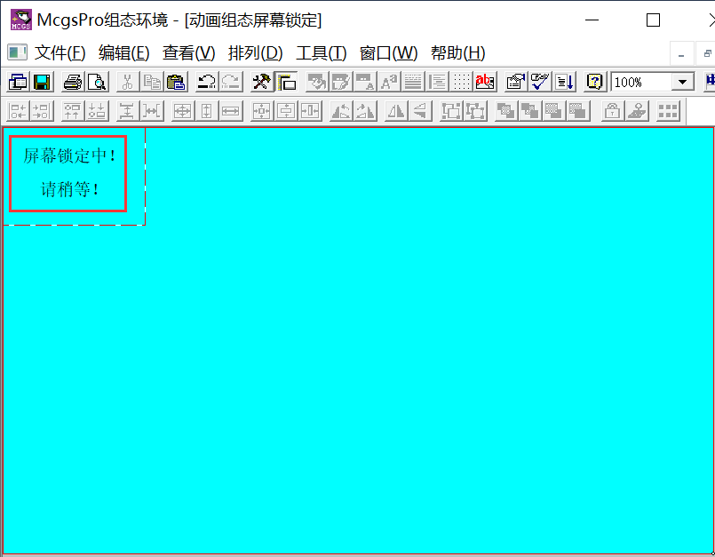

图 11.11-18 新建提示内容标签

1.  进入用户窗口0，新建一个按钮，将按钮的显示文本设置为【锁定屏幕】，操作属性设置为打开用户窗口【屏幕锁定】。

>   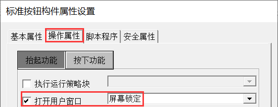

图 11.11-19 设置按钮属性

1.  新建一个【输入框】构件，将它的操作属性关联变量【锁定时间】，单位设置为【秒】。

>   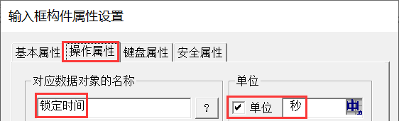

图 11.11-20 设置输入框属性

1.  保存工程后下载工程，然后启动运行。由于已经将变量【锁定时间】的初值设置为【5】，故画面刚开始运行时，关联变量【锁定时间】的输入框显示的值即为【5】。点击【锁定屏幕】按钮，屏幕正中间弹出子窗口【屏幕锁定】。由于我们将子窗口默认设置为【模态窗口】，此时点击子窗口外的构件操作无效。

>   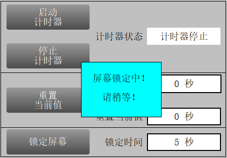

图 11.11-21 运行演示_锁定屏幕

1.  5秒之后，计时器等待时间到，子窗口自动关闭。我们也可以根据需求通过输入框设置屏幕的锁定时间。

>   

图 11.11-22 运行演示_锁屏时间到

# 

# 第12章 多语言功能应用实例

当用户需要在多个国家使用同一工程，或将工程提供给工厂中使用不同语言的人员操作时，工程可使用McgsPro的多语言功能。

>   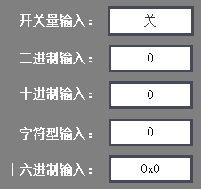 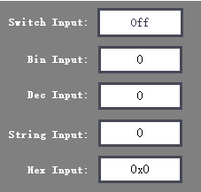

图 12-1多语言功能切换效果

多语言支持的模块有内置语言和组态语言。

1.  内置语言：系统设置界面，内置键盘（数值、字符、开关），提示窗口，时间设置窗口等，这些窗口显示的固定字符串为内置语言。
2.  组态语言：各动画构件的显示内容、报警的描述信息以及用户与用户组的描述内容。

## 12.1 多语言：中文、英语

本节将组态一个使用了多语言功能的标签，同时组态两个具备切换语言功能的按钮，当点击按钮时，标签显示的语言在中文和英语之间切换。

-   使用系统默认语言（中文）组态工程。
1.  将一个标签按钮从工具箱拖拽到画面中合适的位置和大小，此时的多语言配置按钮是默认状态：不使用多语言。

>   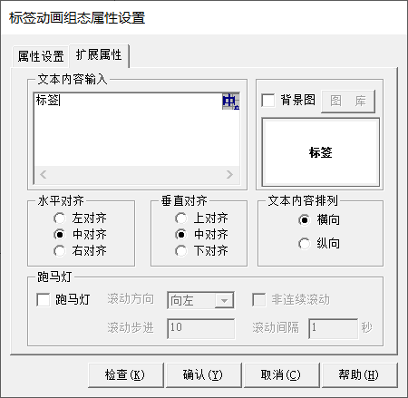

图 12.1-1 文本的多语言默认状态

1.  拖拽两个标准按钮拖拽到标签构件的下方，将其中一个按钮的文本设置为【中文】，抬起脚本设置为【!SetCurrentLanguageIndex(0)】，如图12.1-2所示。!SetCurrentLanguageIndex(语言ID)的作用是通过语言ID设定当前语言环境，本例中括号内的参数【0】是中文的语言ID，各语言的语言ID可从【语言选择对话框】中查看，如图12.1-9。将另一个按钮的文本设置为【英文】，抬起脚本设置为【!SetCurrentLanguageIndex(1)】，如图12.1-3所示。它的作用是将当前语言环境设置为英语，括号内的参数【1】是英语的语言ID。

>    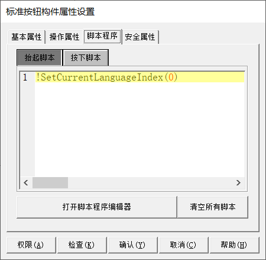

图 12.1-2 设置切换中文按钮

>    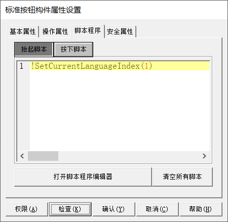

图 12.1-3 设置切换英语按钮

1.  组态好的画面如图12.1-4所示：

>   

图 12.1-4 默认语言画面

-   设置工程语言并编辑工程多语言内容
1.  点击菜单栏 → 工具 → 多语言或工具栏上的【多语言】图标按钮进行多语言设置。

>   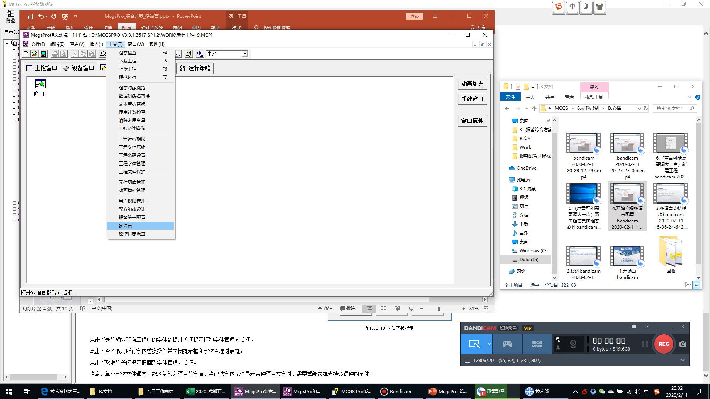

图 12.1-5 进入多语言设置界面

1.  如果是第一次设置，会弹出对话框询问是否进行文本收集，如图12.1-6所示，选择【是】。文本收集功能是指当前组态工程中，部分构件或功能模块的某些文本项目，未使用多语言，可通过文本收集功能统一收集这些未使用多语言的文本，并自动给它们分配多语言ID，使之成为多语言项目并可在多语言中心进行统一编辑，无需逐个构件或功能模块进行编辑。

>   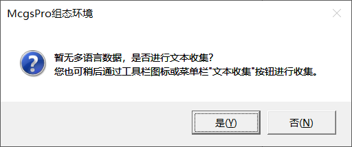

图 12.1-6 询问是否进行文本收集的对话框

1.  在【多语言文本收集】窗口选择【全选】 → 确定 → 是。

>   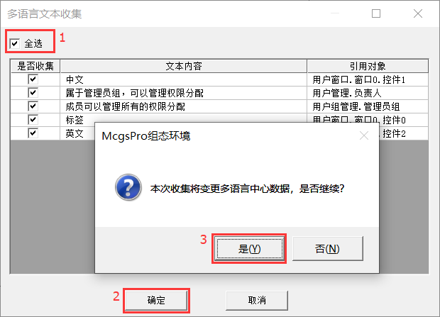

图 12.1-7 多语言文本收集窗口

1.  弹出的【多语言配置】窗口中，此时只有语言ID为0的【中文】列，该列中包含了系统默认生成的文本和我们刚才组态的构件中的文本，每条文本的左侧都显示了该文本对应的【文本ID】，比如文本【中文】的文本ID为【0】，【标签】的文本ID为【3】，【英文】的文本ID为【4】。然后点击工具栏上的【打开语言选择对话框】图标按钮。

>   

图 12.1-8 多语言配置窗口

1.  在弹出的窗口中勾选需要用到的其他语言，本例选择语言ID为1的英语 → 确定。在该窗口中可以选择工程的启动语言。下载工程后、工程未启动时，屏幕的【SETTING界面】的语言也会变成该语言。

>   

图 12.1-9 语言选择对话框

1.  可以看到，此时的多语言配置窗口中，多了一列【英语】列。

>   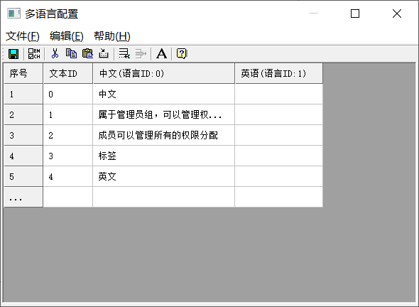

图 12.1-10 新增的英语列

1.  手动在英语列中输入中文文本对应的英语文本 → 保存 → 关闭。

>   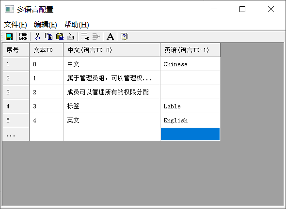

图12.1-11 手动翻译英语

1.  组态完成后，标签、按钮中的文本已经具备了多语言功能。

>   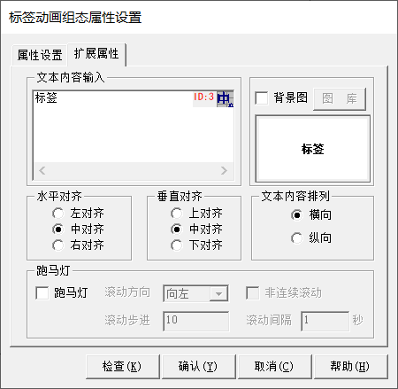 

图 12.1-12 标签的多语言

1.  保存工程后下载工程，然后启动运行。刚开始运行时，画面默认显示中文，点击切换英语的按钮后，画面中设置了多语言功能的文本切换成英语；点击中文按钮后，文本又被切换成中文。

>     

图 12.1-13 多语言工程运行效果

## 12.2 多语言：中文、自定义语种

McgsPro组态软件的多语言功能提供了12种语言可供选择，当这12种语言不能满足用户使用需求时，用户也可以通过【增加语言种类】来自定义一个新语言。本节介绍如何增加一个语言种类。

1.  在【语言选择对话框】界面点击【增加语言种类】按钮，进入【增加语言种类】设置界面。在【增加语种】处给新语言命名，然后按该语言的具体情况，选择【工程语种设置】和【内置语种设置】中的【语言字体】和【缩放比例】 → 确定。【语言字体】是Windows自带字体，用户根据添加的自定义语种情况自行选择。【使用继承语种属性】被勾选时，新增语种的字体与本对话框设置的字体一致，字形、字号设置将与表格中选择的“继承语种”保持一致；如果构件通过字体属性页重新设置了字体、字形和字号，则以重新设置之后的属性为准。

>   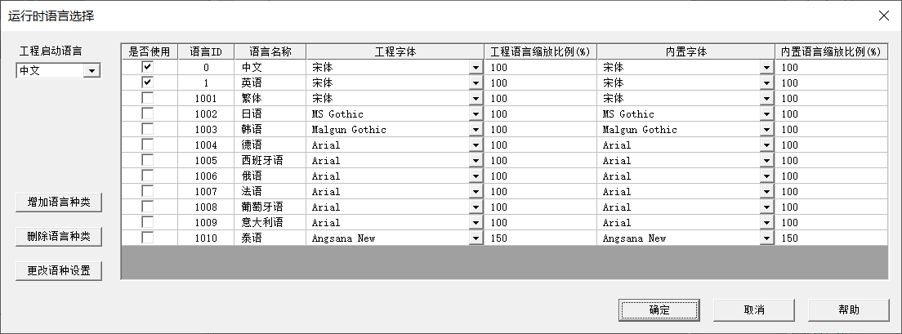 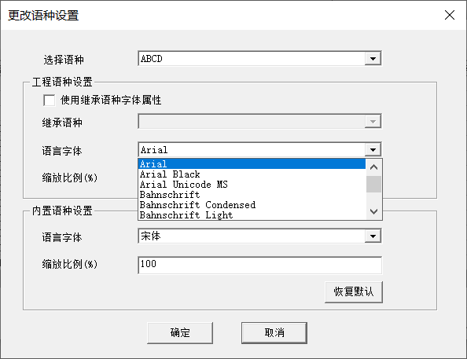

图 12.2-1 增加语言种类流程

1.  设置完成后，新增加的语言出现在【语言选择对话框】列表中。还可以通过【删除语言种类】按钮对除【工程启动语言】外的语言进行删除。也可以通过【更改语种设置】按钮对语言设置进行修改。

>   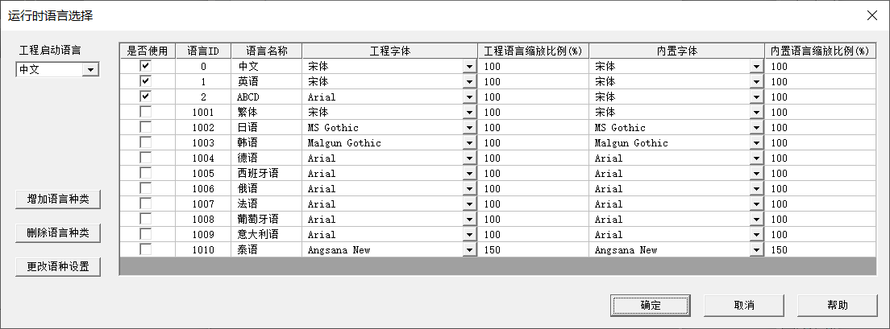

图 12.2-2 增加语言种类设置效果

1.  设置完成后，【多语言配置】窗口中增加了一列语言【ABCD】，需要手动在该列输入对应的文本。

>   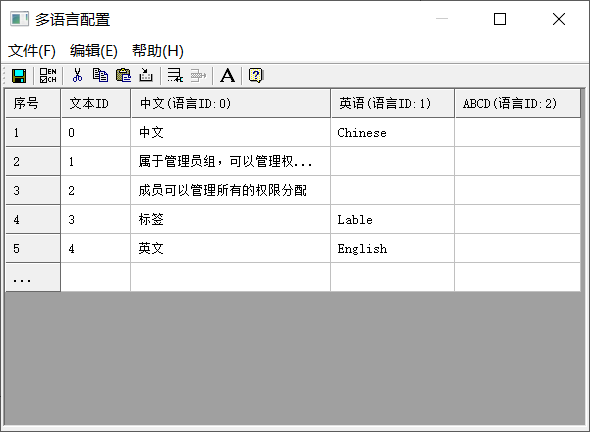

图 12.2-3 增加语言种类在多语言配置窗口的效果

1.  点击工具栏上的【内置语言编辑】图标按钮，进入内置语言编辑窗口。将【中文】列的文本翻译成新语言【ABCD】后，在对应位置进行输入，然后保存并关闭。

>   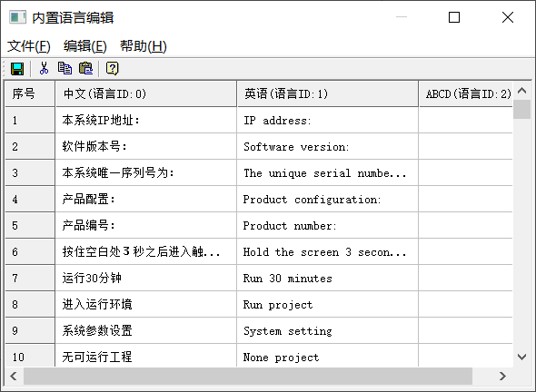

图 12.2-4 翻译内置语言为新语言

## 12.3 多语言的导入导出

当需要对多语言文本进行批量编辑时，可以使用多语言的【导入\\导出】功能，将多语言文本导出为XML格式后，使用Excel打开并编辑。

>   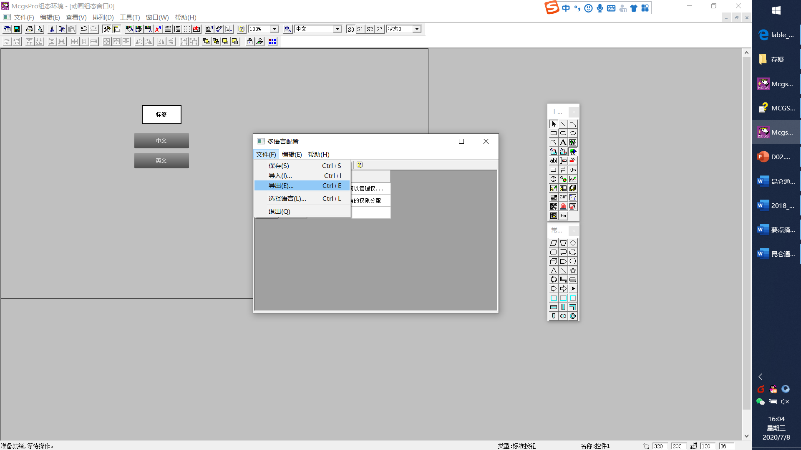

图 12.3-1 多语言的导入导出界面

1.  导出的内容进行编辑时不可修改其格式，否则会导入失败；
2.  导入文件的格式必须是xml(utf8)，列标题(语言名称)不能是纯数字或特殊符号，需遵守xml节点命名规则；
3.  使用Excel编辑xml文件时插入xml节点，需按住最后一条数据右下角往下拖动的方式增加（如图12.3-2所示红框部分）；

>   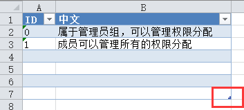

图 12.3-2 多语言导出为xml格式

1.  导出时已默认在xml文件之后追加10000个空白节点，方便用户编辑。

# 

# 第13章 安全功能应用实例

McgsPro提供了一套完善的安全机制，包括工程运行安全机制和工程师权益保护机制，本章将对其进行详细介绍。

## 13.1 工程运行安全机制

工程运行安全机制可保证工程运行时的安全，如防止误操作、操作追责等。

### 13.1.1 安全属性

输入框、组合框、标准按钮、动画按钮构件具有安全属性。其中，输入框的安全属性只具有使能控制功能，而组合框、标准按钮和动画按钮构件的安全属性除了使能功能以外还具有安全控制功能。

#### 13.1.1.1 使能控制

以输入框构件为例讲解使能控制功能。

>   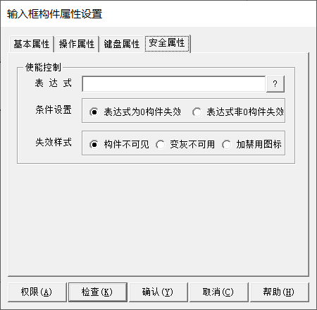

图 13.1-1 输入框构件的安全属性

1.  表达式：用表达式控制构件是否可操作（即是否使能）。若不设置任何表达式，则运行时，构件始终处于可操作状态。
2.  表达式为0构件失效（即不可操作）：当表达式的值为0时，按钮失效，否则，按钮有效。
3.  表达式非0构件失效：当表达式的值为非0时，按钮失效，否则，按钮有效。
4.  构件不可见：当构件失效时，隐藏构件。
5.  变灰不可用：当构件失效时，构件文本为灰色。
6.  加禁用图标：当构件失效时，构件上会出现一个禁用图标。
-   组态3个输入框构件展示不同的【失效样式】。
1.  将输入框构件的安全属性表达式关联变量【输入框安全属性】，选择【条件设置】为【表达式为0时构件失效】。复制3份后，分别设置其【失效样式】为【构件不可见】【变灰不可用】【加禁用图标】。然后新建一个【标准按钮】构件，双击 → 操作属性 → 数据对象值操作 → 取反 → 输入框按钮属性。
2.  保存工程后下载工程，然后启动运行。由于变量【输入框安全属性】默认初始值为0，所以刚开始运行时，输入框处于失效状态。点击按钮，变量【输入框安全属性】取反，变成1，则构件使能，变成了可操作状态，如图13.1-2所示。

>   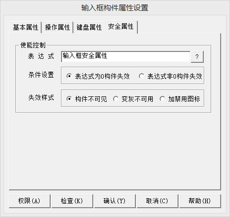  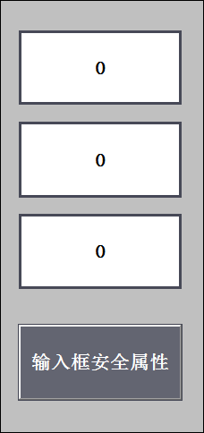

图13.1-2 输入框安全属性页和使用效果对比图

#### 13.1.1.2 安全控制

安全控制功能可以防止误操作。以标准按钮构件为例讲解安全控制功能。它的使能控制功能与输入框构件一致，不再赘述。

>   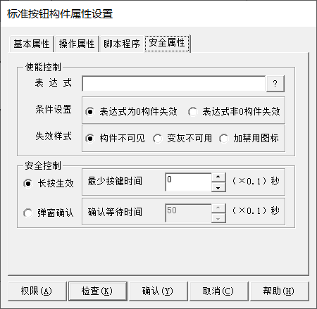

图 13.1-3 标准按钮构件的安全属性

1.  长按生效：按下按钮时长超过最少按键时间后按钮动作才生效；最少按键时间取值为0\~1000，单位0.1秒。
2.  弹窗确认：按下按钮弹出确认框，点击确认后按钮动作生效，点击取消后按钮动作无效；超过确认等待时间没有点击确认则确认框消失并且按钮动作无效；确认等待时间取值为10\~1000，单位0.1秒；当操作属性为数据对象值操作的“按1松0”和“按0松1”操作时，安全控制不可选择弹窗确认。

### 13.1.2 用户权限设置

添加用户权限既可以避免没有操作能力的人对画面进行误操作，又可以在出现了异常状况后，通过操作日志追查当时的操作人员和行为动作。

用户权限设置是采用用户组和用户的概念来进行操作权限的控制，类似于Windows开机时的用户登录。在McgsPro组态软件中可以定义多个用户组，每个用户组中可以包含多个用户，同一个用户可以隶属于多个用户组。操作权限是以用户组为单位来进行分配的，即某些用户组有权限操作某种功能，而某个用户能否对这个功能进行操作取决于该用户所在的用户组是否具备对应的操作权限。在McgsPro组态软件中，通过“用户权限管理”编辑用户和用户组。

#### 13.1.2.1 添加用户

点击菜单栏 → 工具 → 用户权限管理，打开【用户管理器】对话框，如图13.1-4所示。

在用户管理器窗口中，上半部分为已建用户的用户名列表，下半部分为已建用户组的列表。当用鼠标激活用户名列表时，在窗口底部显示有“新增用户”、“复制用户”、“删除用户”等对用户操作的按钮；当用鼠标激活用户组名列表时，在窗口底部显示有“新增用户组”、“删除用户组”等对用户组操作的按钮。

>   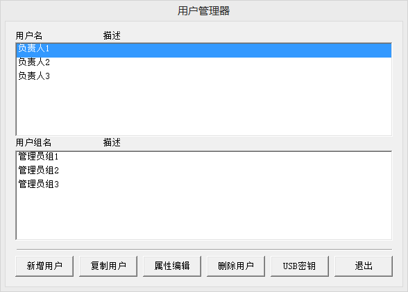

图13.1-4 用户管理器

单击新增用户按钮，可以添加新的用户名，选中一个用户时，点击“属性编辑”或双击该用户，会出现用户属性设置窗口，在该窗口中，用户可对用户名称、用户描述、用户密码及该用户隶属于哪个用户组进行设置，如图13.1-5所示。

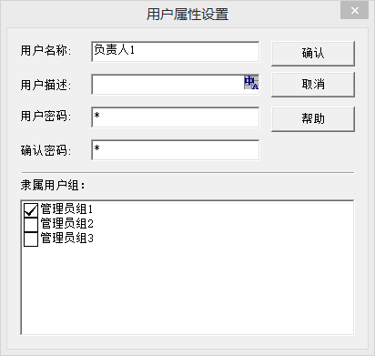

图13.1-5 用户属性设置

#### 13.1.2.2 添加用户组及成员管理

用鼠标激活用户组列表，单击新增用户组按钮，可以添加新的用户组，选中一个用户组时，点击 “属性编辑”或双击该用户组，会出现用户组属性设置窗口，在该窗口中，用户可对用户组名称、用户组描述及该用户组包括哪些用户或用户组进行设置，如图13.1-6所示。

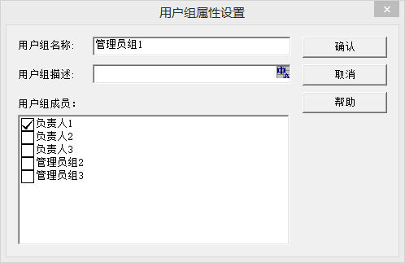

图13.1-6 用户组属性设置

#### 13.1.2.3 USB密钥

1.  USB密钥的功能为预先设定好用户的登录信息，生成密钥文件。设置步骤为：打开用户管理器，选择一个用户名，点击USB密钥，如图13.1-7所示。

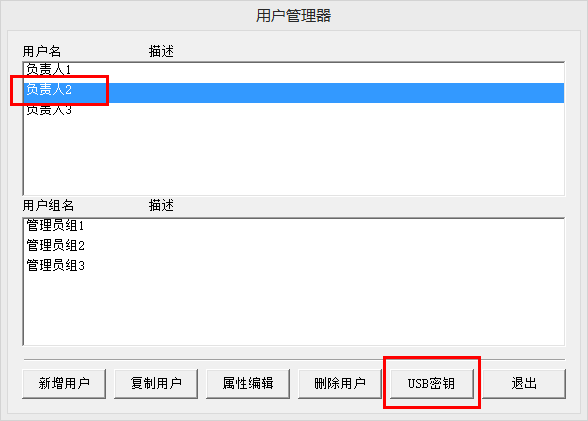

图13.1-7 USB密钥制作

1.  电脑上插上U盘，选择导出为U盘路径即可在U盘上生成密钥，密钥文件为“McgsUserKey”。设置界面如图13.1-8所示。

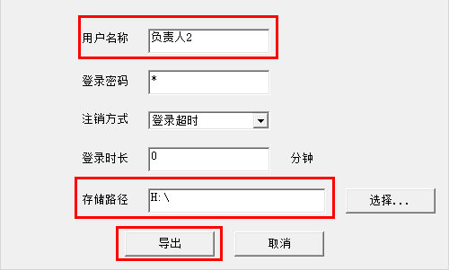

图13.1-8 USB密钥生成

1.  在工程运行中，当导出过USB秘钥的用户需要登录时，可以在屏的USB口插入U盘，然后点击登录界面的【USB登录】按钮即可登录，无需再输入密码。

>   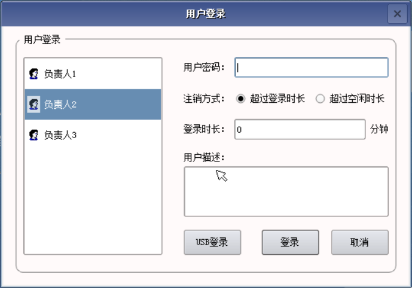

图13.1-9 用户登录界面

#### 13.1.2.4 用户权限函数

-   在McgsPro组态软件中，可以通过脚本函数来实现用户的登录、退出、登录用户名获取、登录用户组名获取、打开用户管理对话框、登录用户密码修改等操作。

    **!LogOn( )：**弹出登录对话框

    **!LogOff( )：**注销当前用户

    **!GetCurrentUser( )：**读取当前登录用户的用户名

    **!GetCurrentGroup( )：**读取当前登录用户的所在用户组名

    **!Editusers( )：**弹出用户管理窗口

    **!ChangePassword( )：**弹出改变密码窗口，供当前登录的用户修改密码。

-   以使用密码打开窗口为例进行用户权限函数的讲解

**例一：启动画面的密码保护**

本节主要讲解使用用户权限功能给启动画面设置密码，只有当用户输入正确的密码后，才能进入工程。

1.  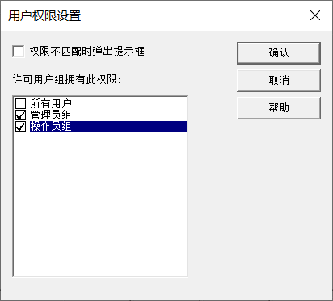进入工作台的【主控窗口】界面，双击【主控窗口】图标或点击右侧的【系统属性】按钮进入【主控窗口】设置界面 → 基本属性，选择运行权限为【进入登录，退出不登录】，点击【权限设置】按钮，勾选希望拥有该权限的用户组，点击确认。

>   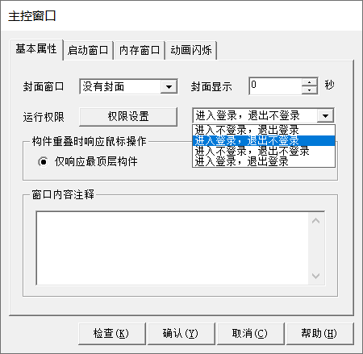

图13.1-10 用户权限设置步骤

1.  保存工程后下载工程，然后启动运行，在工程刚开始运行时，系统就会弹出用户登录框，只有选择了登录权限的用户组中的用户成功登录后，才能进入工程。

    **例二：子画面的密码保护**

组态一个按钮，当用户点击按钮后，弹出用户登录界面。此时，若登录成功，则打开子窗口，若登录不成功，不执行任何操作。

1.  组态好两个画面，一个命名为【主画面】，一个命名为【子画面】。
2.  在主画面窗口中新建一个按钮，将它的文本设置为【密码正确后打开子窗口】，将它的抬起脚本设置为【if !logon( )=0 then !OpenSubWnd(子窗口,0,0,300,150,1)】，如图13.1-11所示。脚本的作用是：当按钮抬起时，弹出用户登录窗口，若登录成功，打开【子窗口】，若登录不成功，不执行任何操作。

>   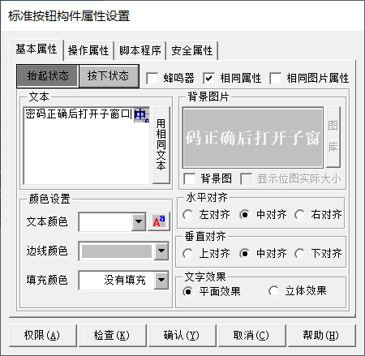 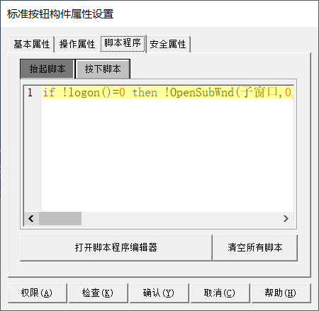

图13.1-11 密码正确后打开子窗口按钮设置

1.  然后在【子窗口】页面中新建一个按钮，将它的文本设置为【关闭子窗口】，抬起脚本设置为【!CloseSubWnd(子窗口)】，如图13.1-12所示。点击按钮后，将关闭【子窗口】。

>   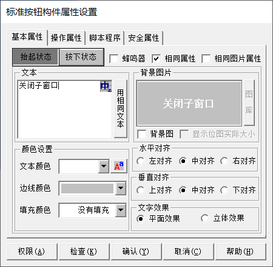 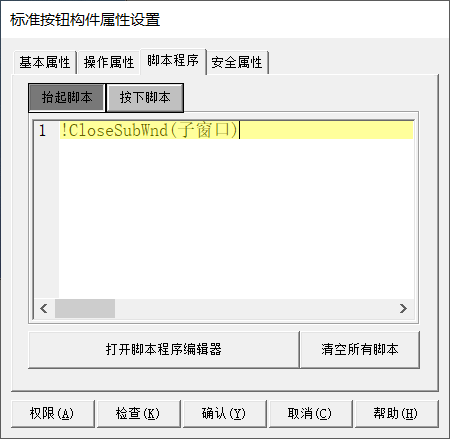

图13.1-12 关闭子窗口按钮设置

1.  保存工程后下载工程，然后启动运行。点击【密码正确后打开子窗口】按钮，系统弹出用户登录窗口，选择用户后输入登录密码即可打开子窗口，若密码不正确，提示密码输入错误，子窗口不打开。

>   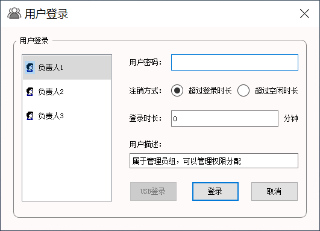

>   

图13.1-13 运行演示

#### 13.1.2.5 构件操作权限

另外，部分构件也可以设置用户操作权限，只有设置了拥有用户操作权限的用户组才能操作该构件，否则操作无反应或提示权限不匹配。用户操作权限在工程运行时才能体现出来。能进行用户操作权限设置的构件有标准按钮、输入框、动画按钮、组合框、滑动输入器。

以【标准按钮】构件为例，进行用于操作权限设置的步骤如图13.1-14所示。

>   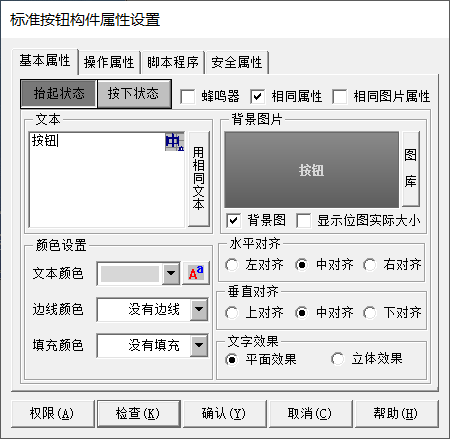 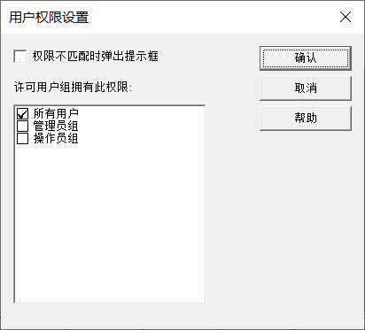

图13.1-14 按钮的用户操作权限设置

### 13.1.3 操作日志记录

在用户的使用过程中，通过对动画构件进行日志组态和编辑，可实时记录用户的某种动作（如鼠标点击、内容编辑、鼠标事件等）。当出现异常状况时，通过翻阅和分析日志记录，可以得知操作过程是否符合流程规范，便于问题查找和定位。

操作日志标准内容如图13.1-16所示。

>   

图13.1-15 操作日志标准内容示例

#### 13.1.3.1 组态显示操作日志的工程

本节将组态一个启用了操作日志的工程，并由存盘浏览构件显示操作日志。

1.  在实时数据库新建两个整数型对象【电机启动】和【电机停止】。
2.  组态两个按钮，一个按钮【控件0】设置基本属性 → 文本【电机启动】，操作属性 → 数据对象值操作 → 【置1】并关联对象【电机启动】，如图13.1-7所示。另一个按钮【控件1】设置基本属性 → 文本【电机停止】，操作属性 → 数据对象值操作 → 【置1】并关联对象【电机停止】。

>    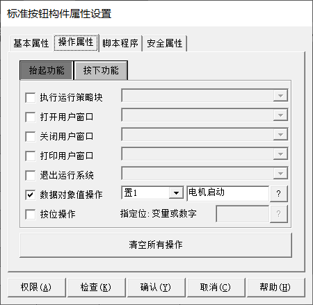

图13.1-16 电机启动按钮设置

1.  点击菜单栏中的【工具】 → 【操作日志设置】，弹出【操作日志】设置界面。

>   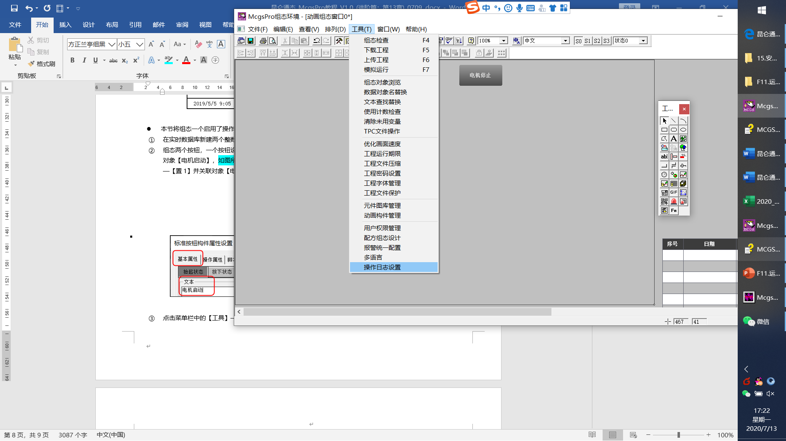

图13.1-17 打开操作日志

打开后界面如图13.1-18所示。【操作日志】设置界面是操作日志的编辑环境。用户可以在这里开启或关闭操作日志记录功能。在启用该功能时，可以开启指定构件的日志，和对日志描述文本进行编辑，日志描述文本支持多语言。

>   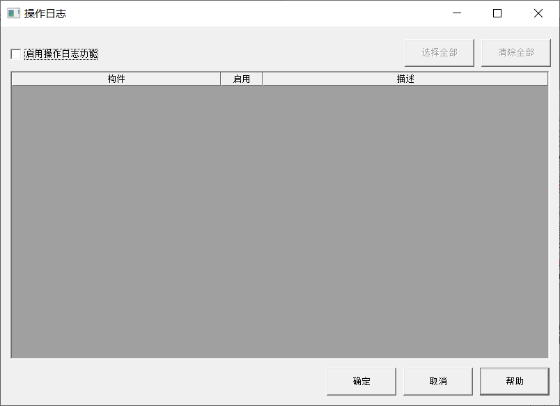

图13.1-18 操作日志设置界面

1.  勾选【启动操作日志功能】，点击【选择全部】则下方的所有构件前的复选框都被选中。设置【控件0】的描述为【电机启动】，【控件1】的描述为【电机停止】。点击【确认】保存设置并关闭窗口。

>   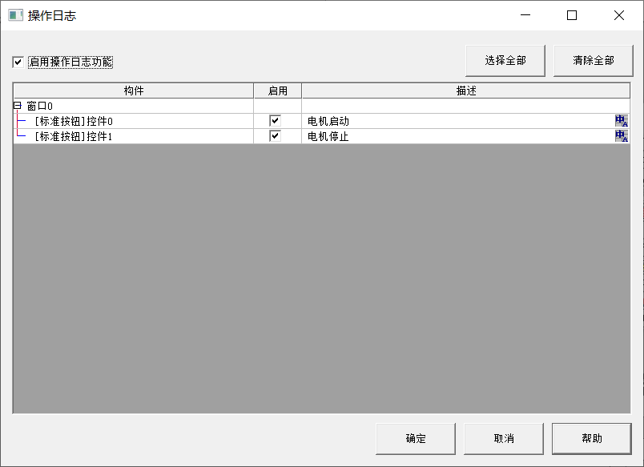

图13.1-19 操作日志设置流程

1.  从工具箱拖拽一个【存盘浏览构件】到画面中合适的位置和大小，双击打开【存盘数据浏览构件属性设置】界面。设置其【数据来源】为【操作日志】。

>   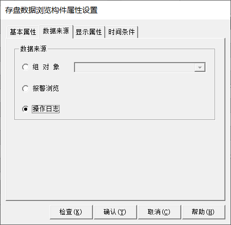 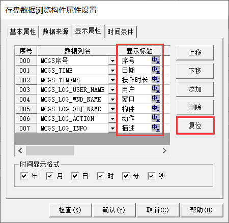

图13.1-20 存盘浏览构件设置流程

1.  进入【显示属性】功能页，点击【复位】按钮，然后修改【显示标题】列如图13.1-20所示。确认关闭界面。
2.  用鼠标选中【存盘数据浏览】构件，可以从窗口下方看到它的名称是【控件4】。
3.  在窗口空白处双击鼠标，弹出【用户窗口属性设置】界面，设置循环脚本为：*窗口0.控件4.Refresh( )，*循环时间为1000ms。它的作用是每隔一秒将【存盘数据浏览】构件刷新一次。

>   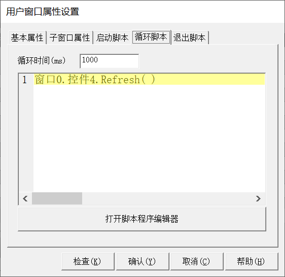

图13.1-21 设置循环脚本

1.  按照13.1.2的方法新建两个用户【管理员1】和【操作员1】，分别隶属于【管理员组】和【操作员组】。
2.  然后进入工作台的【主控窗口】属性设置界面，设置运行权限为【进入登录，退出登录】。接着点击【权限设置】按钮，进入【用户权限设置】窗口，勾选【所有用户】前的复选框。

>   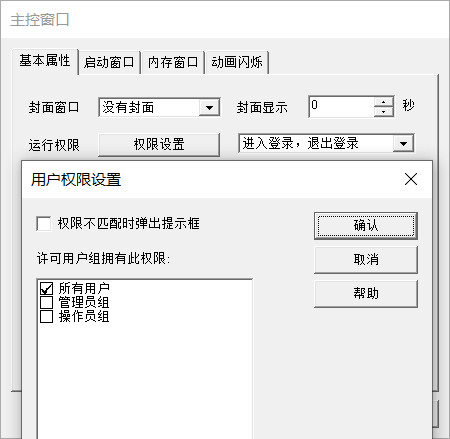

图13.1-22 设置用户权限

1.  保存工程后下载工程，然后启动运行。工程启动后弹出登录界面，选择【操作员1】，输入对应的密码，点击【登录】按钮，进入工程画面。

>   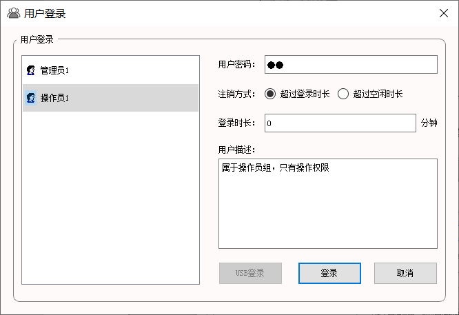

图13.1-23 用户登录界面

1.  点击【电机启动】按钮，【存盘数据浏览】构件中依次显示出序号为1-3的三行数据。数据由左往右依次是动作【鼠标按下操作】【鼠标抬起操作】【鼠标点击操作】的【序号】【日期】【操作时长】，操作的【用户】，动作所在的【窗口】，动作的【构件】名以及动作的【描述】内容。按下【电机停止】按钮也同样如此。

>   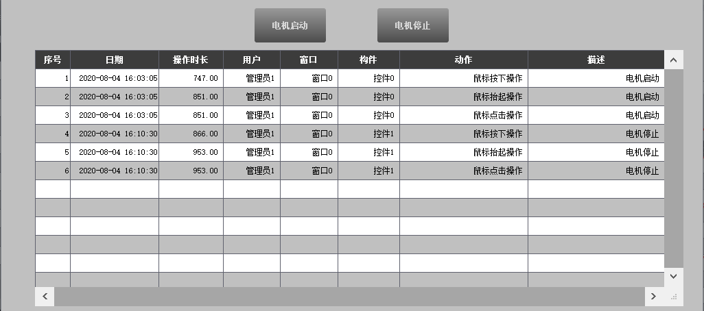

图13.1-24 操作日志运行效果

#### 13.1.3.2 对日志进行操作

本节主要介绍使用函数对操作日志进行开启、关闭、清除、导出操作。

1.  回到McgsPro组态软件中，在13.1.3.1工程的【存盘数据浏览】构件下方新建4个按钮，将它们的显示文本分别设置为【开启日志功能】【关闭日志功能】【清除日志】【日志导出】。

    其中【开启日志功能】按钮的脚本程序为：

    *!OperationLogEnable() ‘开启日志功能*

    【关闭日志功能】按钮的脚本程序为：

    *!OperationLogDisable() ‘关闭日志功能*

    【清除日志】按钮的脚本程序为：

    *!OperationLogClear()  ‘清除日志*

    【日志导出】按钮的脚本程序为：

    *!ExportOperationLogToCSV("log.csv", !TimeStr2I("2020-08-01 00:00:00"), !TimeStr2I("2020-08-31 23:59:59"), 2)*

    *‘将操作日志在2020年8月1日 00:00:00到2020年8月31日23:59:59时间段内的数据导出至U盘根目录，存储文件名为【log.csv】，如果文件已存在，则导出数据追加至文件末尾。*

2.  组态完成后保存工程，下载工程，下载成功后启动运行。
3.  点击【电机启动】按钮，下方的【存盘数据浏览】构件中出现操作日志数据。此时点击【关闭日志功能】按钮，再次点击【电机启动】按钮，则【存盘数据浏览】构件中没有新的数据出现。只有当点击【开启日志功能】按钮后，再次对【电机启动】按钮，新的操作日志才会出现。

>   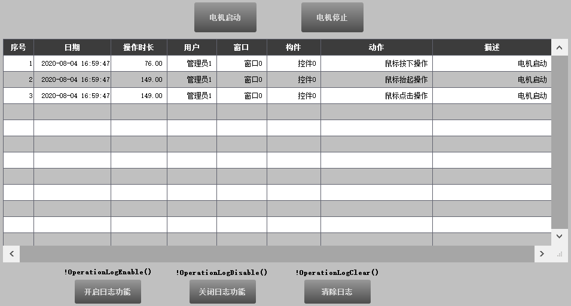

图13.1-25 关闭日志功能效果

>   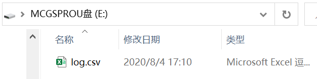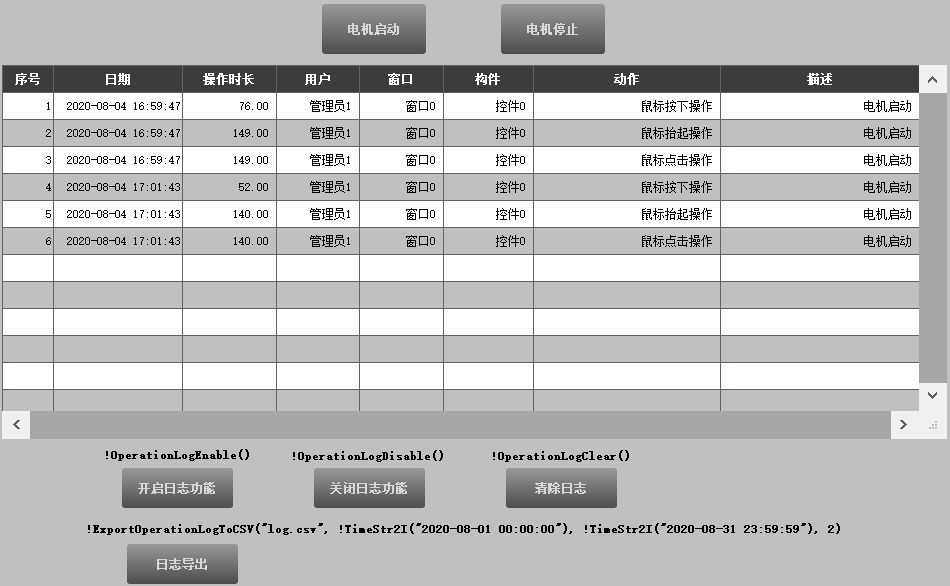

图13.1-26 开启日志功能和导出日志效果

1.  给TPC插上U盘，点击【日志导出】按钮，则按钮脚本中划定的时间范围内的操作日志被导出到U盘，导出文件名为【log.csv】。
2.  点击【清除日志】按钮，操作日志被清除，【存盘数据浏览】构件中显示的日志内容也随之清空。

>   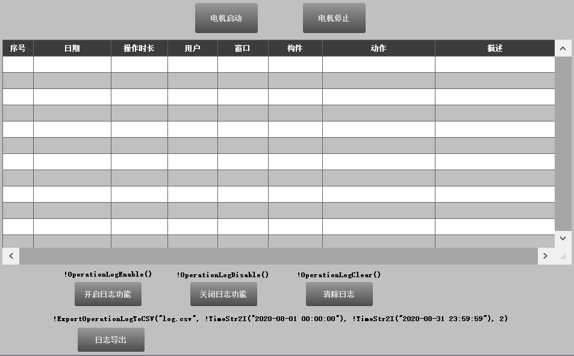

图13.1-27 清除日志效果

## 13.2 工程师权益保护

工程师权益保护机制可以保护工程师的开发成果。

### 13.2.1 工程密码设置

给工程设置了密码后，需要输入密码才能打开工程进行组态。设置步骤如下：

1.  点击菜单栏 → 工具 → 工程密码设置。

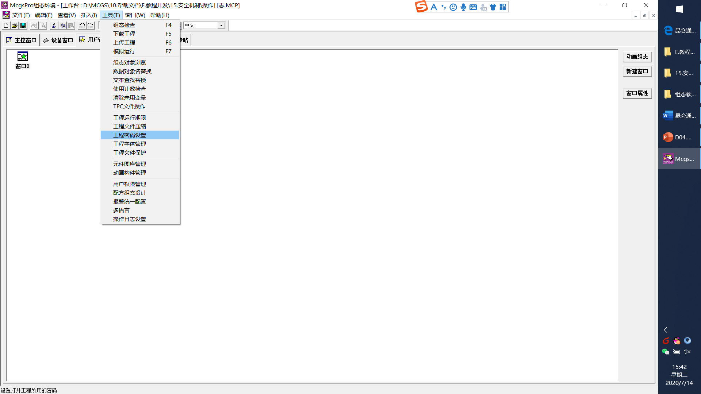

图13.2-1 进入工程密码设置

1.  弹出【修改工程密码】窗口，如图13.2-2所示。

>   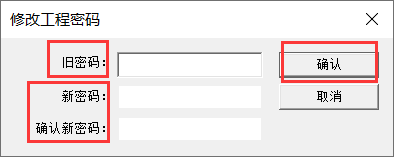

图13.2-2 修改工程密码窗口

1.  再次打开工程，就会提示输入工程密码。

>   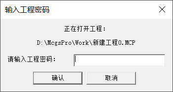

图13.2-3 输入工程密码窗口

### 13.2.2 TPC系统密码设置

TPC系统密码的作用是：设置了该密码后，以下操作均需要验证TPC系统密码：

1.  再次打开TPC系统设置界面；
2.  工程上传和下载；
3.  使用U盘部署或卸载某些特殊功能，以及升级NK版本或运行环境。

进入TPC系统设置界面的方法，将在后续章节：硬件篇2.1.1和2.1.2进行介绍。

>   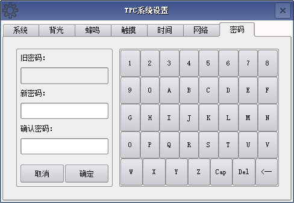

图13.2-4 TPC系统密码设置界面

### 13.2.3 工程文件保护

使用了工程文件保护功能后，工程只能在具有相同识别码的触摸屏上使用。触摸屏的识别码由设备商U盘工具设置，设备商U盘工具需要联系触摸屏供应商获取。设置步骤如下：

1.  点击菜单栏 → 工具 → 工程文件保护。

>   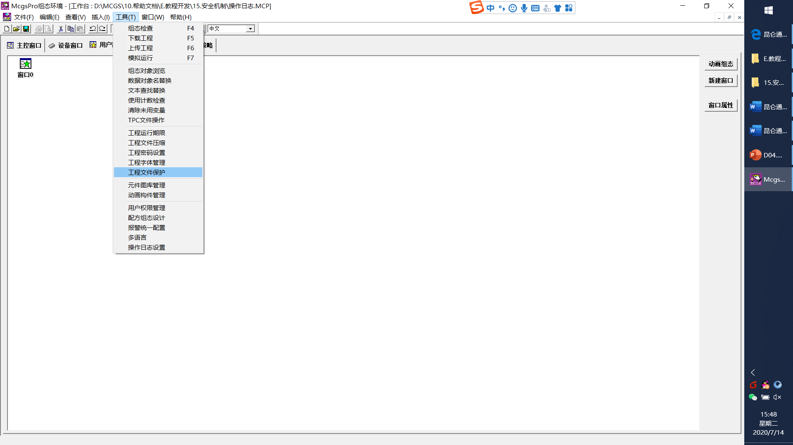

图13.2-5 进入工程文件保护

1.  弹出【工程文件保护】设置界面。

>   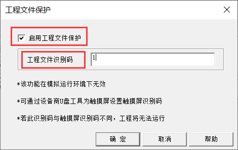

图13.2-6 工程文件保护设置界面

1.  设置完成后，工程只能在具有相同识别码的触摸屏上使用。

### 13.2.4 工程上传

在下载配置界面的下载选项中，有一个【支持工程上传】的选项。若在下载工程到屏幕的时候，勾选了该选项，则用户可以将工程从屏幕上传的电脑，若没有勾选此选项，工程则不能上传到电脑。

>   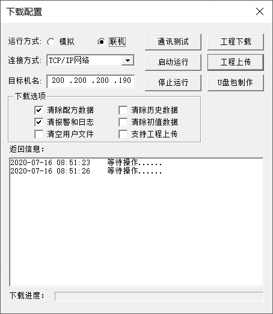

图13.2-7 工程是否上传选择

### 13.2.5 工程运行期限

工程运行期限功能主要用于实现分期付款。在组态环境配置了运行期限功能的工程，下载到触摸屏之后，运行到当期的截止日期之前，会根据组态设置的提前天数弹出警告窗口，提醒用户输入当期的激活密码，以激活下一分期。警告窗口为模态窗口，弹出时触摸屏无法对其之外的任何窗口和控件进行响应。该窗口显示当前分期的情况，便于用户提前了解工程运行期限，对生产活动作出及时安排。

-   进入【工程运行期限】设置界面
1.  点击菜单栏 → 工具 → 工程运行期限。

>   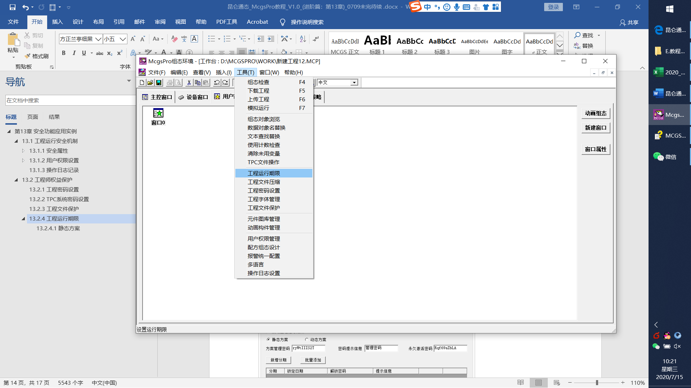

图13.2-8 进入工程运行期限界面

1.  弹出【运行期限】设置界面，如图13.2-9所示。

>   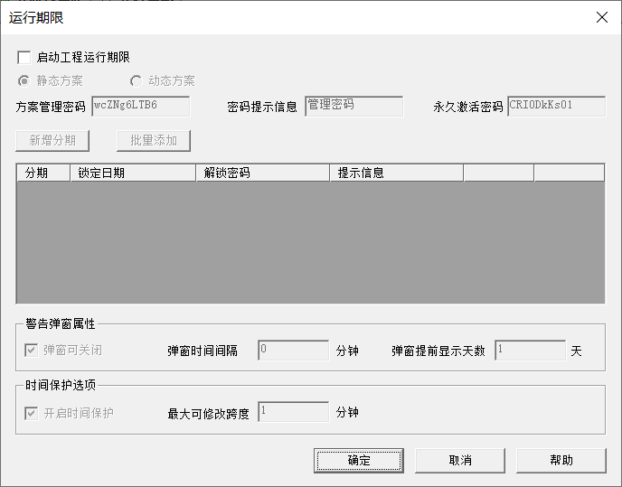

图13.2-9 运行期限设置界面

**运行期限设置界面配置信息：**

1.  设置是否启动工程运行期限。
2.  运行期限分为静态方案和动态方案，并且两种方案互斥。
3.  方案管理密码：使用“设备商U盘工具包”去管理期限时需输入的密码，可以设置密码提示信息，输入界面可见。
4.  永久激活密码：在永久激活密码输入框内输入永久密码，即可一次性解锁所有分期。
5.  分期密码列表。
6.  警告弹窗属性：可设置弹窗的属性，包括弹窗是否可关闭、间隔时间和提前显示天数。
7.  时间保护选项：勾选后，运行环境对系统时间的修改作一定的保护，避免用户通过修改系统时间来规避期限。
-   **组态静态方案**

在明确了分期支付期限的情况下，可选择静态方案。

1.  勾选【启动工程运行期限】前的复选框激活工程运行期限功能，然后选择【静态方案】。

>   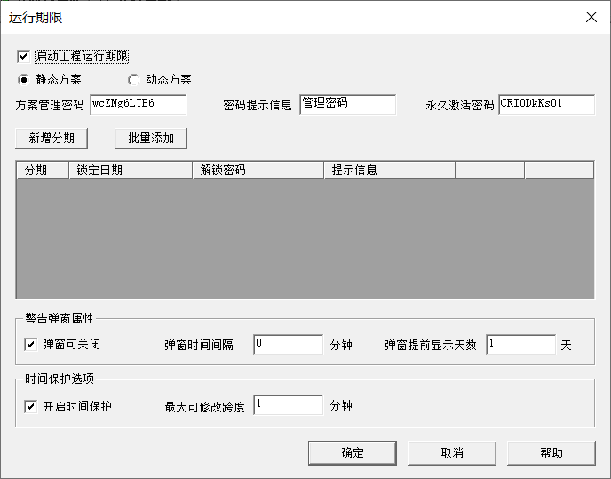

图13.2-10 组态静态方案

静态方案中新增分期的方式有两种：【新增分期】和【批量添加】。若点击【新增分期】，会按照当日日期增加一组分期，再点击时逐月增加，最多可设置48期。系统默认生成的锁定日期和解锁密码，用户均可修改（密码最大长度为20个字符）。本节样例使用【批量添加】的方式进行设置。

1.  点击【批量添加】，按照需要的分期期数、第一期截止日期和分期间隔生成一批期限。

>   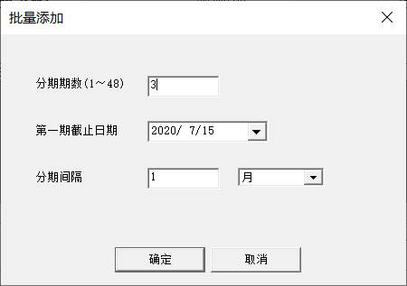

图13.2-11 批量添加静态分期期限

生成后效果如图13.2-12所示。

>   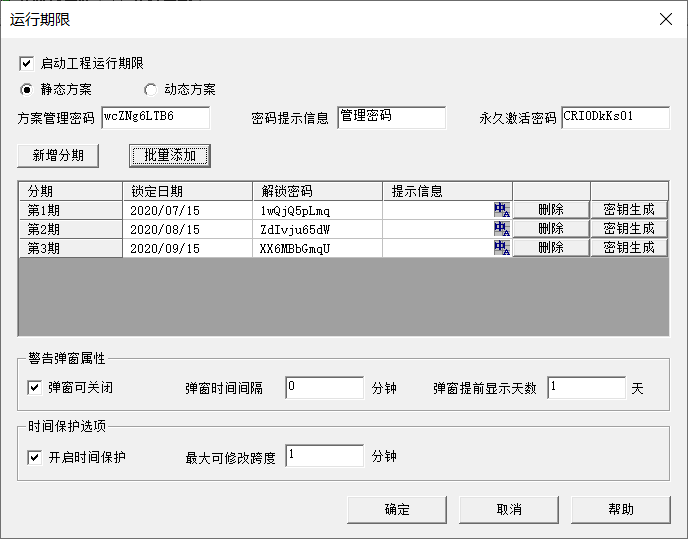

图13.2-12 静态分期设置效果图

1.  为了方便使用，McgsPro引入了【USB激活】功能，用户可点击【密钥生成】按钮弹出【运行期限秘钥生成】提示框，导出密钥文件到U盘上。

>   

>   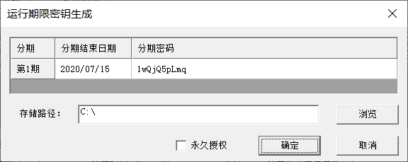

图13.2-13 USB秘钥生成步骤

1.  按工程需要设置【警告弹窗属性】。

>   

图13.2-14 警告弹窗属性设置

【弹窗可关闭】选项控制运行到期弹窗能否关闭；【弹窗时间间隔】控制运行到期弹窗弹出的时间，若设置1分钟，在关闭弹窗1分钟后会再次弹出此弹窗（排除已激活的情况）；【弹窗提前显示天数】设置1天，表示弹窗会在到期前1天弹出，提醒用户工程到期了。

1.  然后设置【时间保护选项】。

>   

图13.2-15 时间保护选项设置

用户使用时间保护选项一般是防止终端使用者通过修改系统时间来规避运行期限。比如，勾选【时间保护选项】，设置最大可修改跨度为1分钟（设置不得超过1440分钟），下载到TPC后，用户修改系统时间最多能往前修改1分钟，往后无限制。修改的时间跨度超过1分钟时，会弹出如图13.2-15所示的警告，点击继续，则时间修改成功。此时进入运行环境还是会弹出系统时间异常的警告，无法正常运行工程。用户不勾选“时间保护选项”则无此限制。

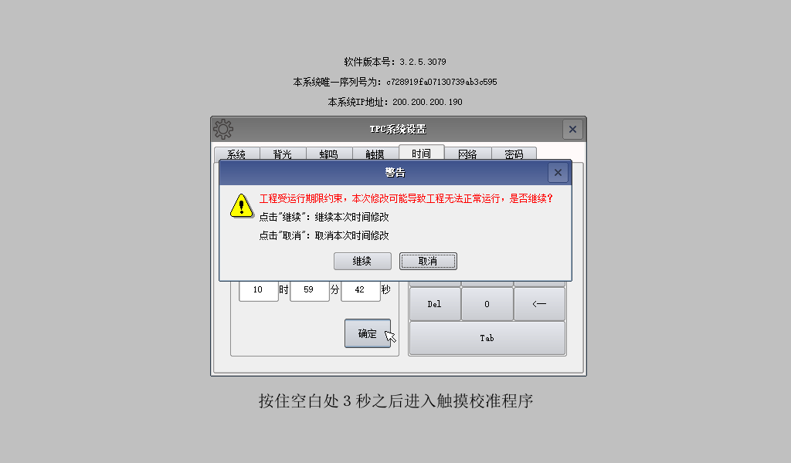

图13.2-16 修改TPC时间警告

1.  组态完成后点击确定，保存设置并关闭设置界面。
2.  模拟期限到期运行：工程启动后弹出【运行到期】提示框，如图13.2-16所示。用户在密码输入框内，输入组态时设定的对应分期的解锁密码，确认后即可激活该分期，工程可正常使用至下一分期的锁定日期。或插入含当期USB密钥的U盘，待识别后点击【USB激活】按钮，亦可激活分期。

>   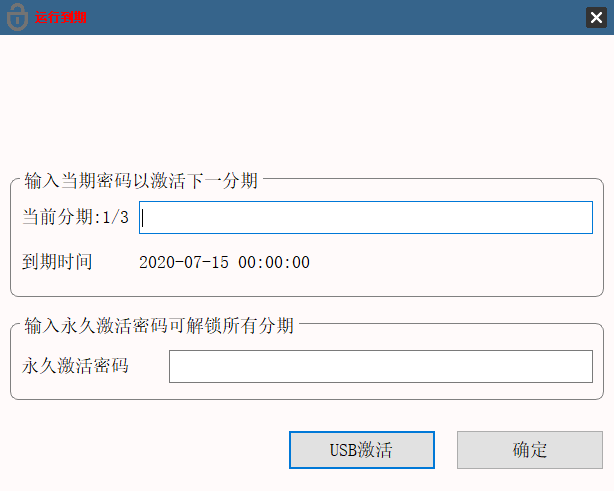

图13.2-17 静态方案运行到期提示框

-   **组态动态方案**

    在分期支付期限和批次不明确的情况下，可选择动态方案。

    注意，切换方案会有“切换方案会清空列表内容，是否继续?”的提示，请谨慎选择。

>   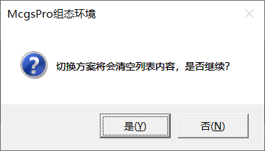

图13.2-18 切换方案提示框

设置分期方案为【动态方案】后，动态方案分期期数固定为1期，分期结束时间默认为当日日期，用户可根据需要自行修改。而分期密码是软件自动生成的长度为40个字符的随机密码，用户无法修改。与静态方案一样，用户可导出USB密钥，通过U盘来解锁分期。而【警告弹窗属性】和【时间保护选项】的定义和设置方法与静态方案一致，此处不再赘述。

第一次设置完成后将工程下载到触摸屏中使用。注意：下载工程时不勾选下载配置界面的【支持工程上传】选项，并且不将工程文件交给用户。

>   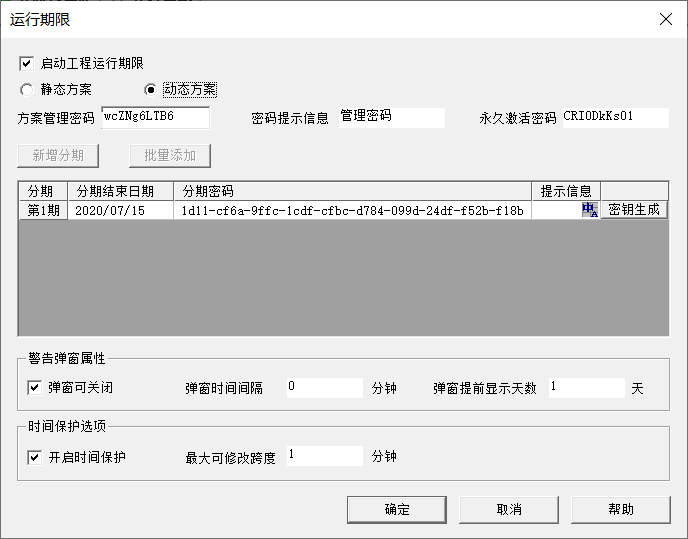

图13.2-19 动态方案设置界面

当设定的期限到期时，在组态状态下将【分期结束日期】设置成希望延长到的日期，然后将将此日期和软件新生成的40位密码提供给工程用户，此时不许要重新下载工程。工程用户在弹窗的日期输入框输入组态设定的截止日期，在密码输入框输入40位动态密码，验证通过即可继续正常使用至新设置的截止日期，如图13.2-20所示。

>   

图13.2-20 动态方案运行到期提示框

注：动态方案的分期密码是系统生成的随机密码，与分期结束时间和方案管理密码有关，分期结束时间或方案管理密码改变，分期密码随之改变，此时需要重新下载工程。

# 

# 第14章 打印功能应用实例

本章主要介绍TPC与炜煌微型打印机的连接与使用。

## 14.1 建立设备通道

首先在McgsPro中建立设备通道。

1.  新建工程 → 进入工作台 → 设备窗口 → 双击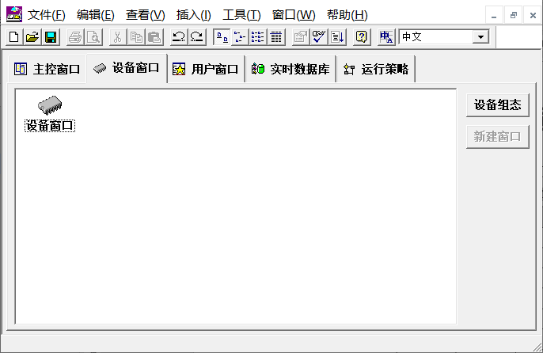图标或点击右侧的【设备组态】按钮 → 进入设备窗口
2.  点击工具栏的图标打开工具箱，若工具箱中没有【微型打印机】驱动，则点击工具箱中的【设备管理】按钮 → 目录树-所有设备-通用设备-微型打印机 → 双击将其添加到右侧【选定设备】窗口中 → 确定。

>   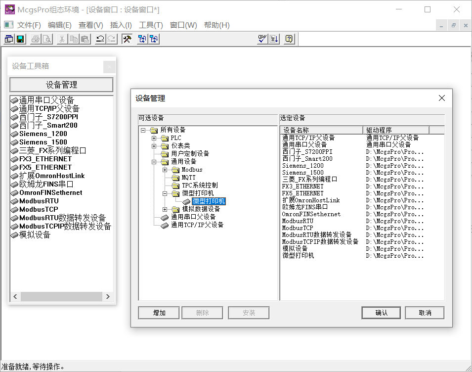

图 14.1-1 在工具箱中添加微型打印机驱动

1.  然后依次双击工具栏中的【通用串口父设备】和【微型打印机】添加驱动。

>   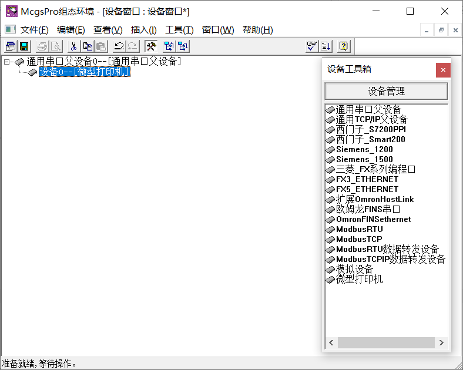

图 14.1-2 在设备窗口中添加微型打印机驱动

1.  双击父设备打开【通用串口设备属性编辑】界面，设置串口通讯参数，如图14.1-3所示。

>   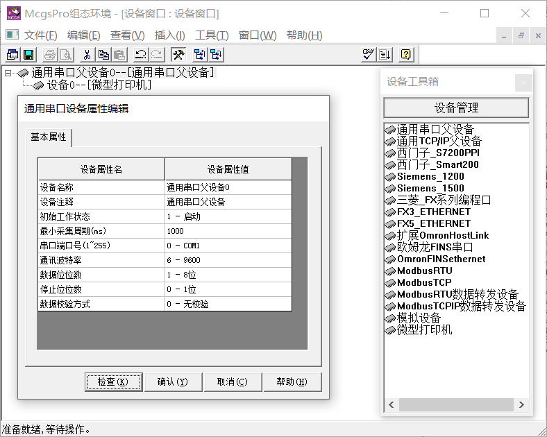

图 14.1-3 串口设备属性设置界面

1.  双击子设备打开【设备编辑窗口】，微型打印机子设备参数设置如下：

>   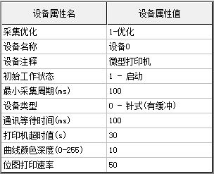

图 14.1-4 子设备参数

1.  **设备名称：**可根据需要来对设备进行重新命名，但不能和设备窗口中已有的其它设备构件同名。
2.  **初始工作状态**：用于设置设备的起始工作状态，设置为启动时，在进入MCGS运行环境时，MCGS即自动开始对设备进行操作，设置为停止时，MCGS不对设备进行操作。但可以用MCGS的设备操作函数和策略在MCGS运行环境中启动或停止设备。
3.  **最小采集周期：**为运行时，MCGS对设备进行操作的时间周期，单位为毫秒，默认为100ms。由于此驱动没有需要采集的通道，另外为了便于观察设备命令的返回值，建议在测量时设置为5000ms。
4.  **设备类型：**默认为针式（有缓冲）。

    0-针式(有缓冲)：主要适用于行点数不超过255，且带有缓冲区的打印机。每行点数240。如果打印机支持曲线打印命令则可完成曲线位图的打印功能。

    1–针式(无缓冲）：主要适用于行点数不超过255，不带缓冲区的打印机。每行点数240。如果打印机支持曲线打印命令则可完成曲线位图的打印功能。

    2–热敏：主要适用于行点数超过255，且带有缓冲区的打印机。主要特点是打印曲线命令使用高低位格式。每行点数384，如果打印机支持曲线打印命令则可完成曲线位图的打印功能。

5.  **通讯等待时间：**设备进行一次通讯的最长时间，单位为毫秒。在通讯等待时间内，如果通讯还没有完成，则报错。因此，建议通讯时间较长的设备，通讯等待时间可设长一点。默认为200毫秒。
6.  **打印机超时值：**此属性只适用于1–针式（无缓冲）打印机，单位为秒。如果打印机执行单次打印的时间超过此值，通讯状态将返回失败，默认为30s。
7.  **曲线颜色深度：**此属性只适用于打印曲线位图设备命令，默认值为10。在触摸屏使用打印曲线功能时，此值建议设置为60。如果打印出的图形颜色过深，请减小此值；同理，如果打印出的图形颜色过浅，甚至缺少部分图形，请增大此值，或者考虑加宽曲线的粗细。具体请根据实际情况自行调整。
8.  **位图打印速率：**此属性只适用于打印曲线位图设备命令，默认值为50。如果打印过程中发现打印出现乱码，可以适当增加此值，以保证正确打印曲线位图。

## 14.2 组态画面

组态一个工程：当点击按钮时，打印机打印从输入框输入的字符。

1.  在实时数据库中新建一个字符串数据对象【str】。
2.  进入用户窗口0，新建一个输入框构件，关联数据对象【str】。如图14.2-1所示。

>   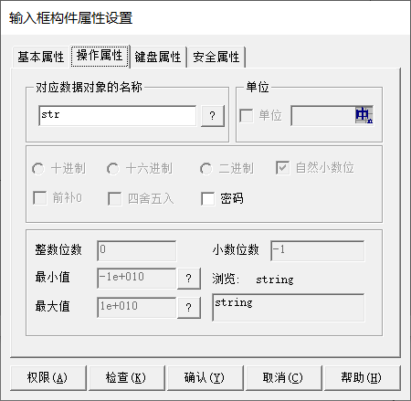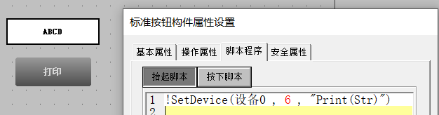

图14.2-1 组态画面

1.  在按钮的脚本框中输入脚本【!SetDevice(设备0 , 6 , "Print(Str)")】。如图14.2-1所示。

## 14.3 设置炜煌打印机

炜煌打印机的串行接口与RS-232C标准兼容，因此可直接将打印机与TPC相接。串行连接方式面板式和平台式插座引脚序号如图14.3-1和图14.3-2所示：

>   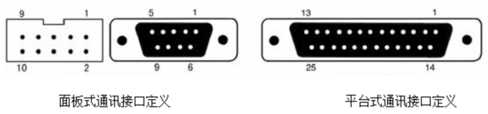 

图 14.3-1 炜煌打印机面板式通讯接口定义 图 14.3-2平台式通讯接口定义

串行接口引脚定义如下：

>   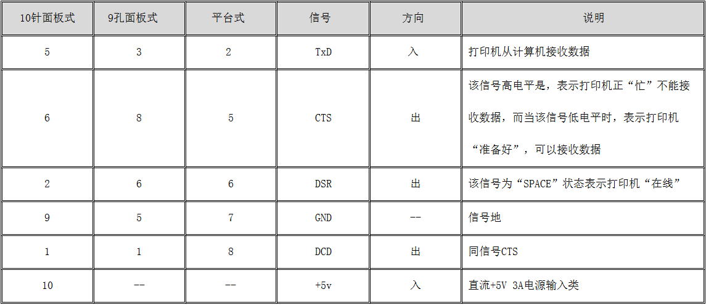

图 14.3-3 串行接口引脚定义

炜煌微型打印机按键如图14.3所示：

>   

图 14.3-4 炜煌微型打印机按键

修改打印机波特率和通讯模式：

1.  按住任意键后给打印机上电，打印机会将当前串口设置状态打印出来。
2.  按LF键切换打印机波特率。每按一次 LF 键，打印机立即打印出显示其当前波特率的状态报告。打印机出厂设置波特率为 9600。
3.  按SEL键切换串口的工作方式。出厂时默认设置为方式1。

    串行工作方式1:一帧信息为10位，1位起始位，8位数据位，1位停止位。

    串行工作方式3:一帧信息为11位，1位起始位，8位为数据位，1位校验位，1位停止位。

4.  设置完成后重启打印机。

本样例对打印机通讯参数不做修改。

连接完成后，打印机上电待命。

## 14.4 运行工程

1.  保存工程并下载工程，然后启动运行。
2.  在输入框中输入字符【打印测试】。
3.  然后点击按钮，打印机打印出输入的字符。

>   

图 14.4-1 打印输入的字符

# 

# 第15章 McgsPro监控应用

本章将对使用McgsPro与设备通讯进行讲解和应用举例。

## 15.1 设备驱动

设备驱动的作用是建立系统与外部硬件设备的连接关系，使系统能够从外部设备读取数据并控制外部设备的工作状态，实现对工业过程的实时监控。本节主要介绍设备驱动方面的内容。

### 15.1.1 添加设备驱动

1.  双击工作台中的图标进入设备组态界面。

>   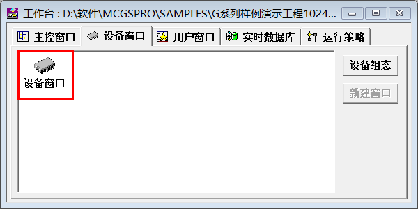

图 15.1-1 进入设备窗口

1.  点击工具栏中的【工具箱】图标打开的【设备工具箱】。【设备工具箱】中有两个特殊的设备 → 【通用TCP/IP父设备】和【通用串口父设备】。除个别驱动外，大部分驱动都是添加在父设备下，称之为 → 【子设备】。如果子设备是网口通讯，就选用【通用TCP/IP父设备】，子设备是串口通讯，就选用【通用串口父设备】。

>   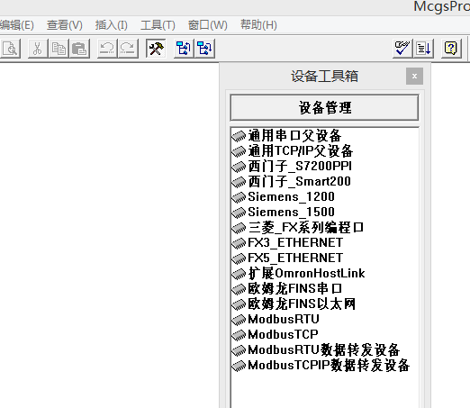

图 15.1-2 父设备

以添加ModbusRTU的驱动为例。首先双击设备工具箱中的【通用串口父设备】，然后双击【ModbusRTU】或直接拖拽【ModbusRTU】到父设备下。在弹出的对话框中选择【是】，添加完成。

>   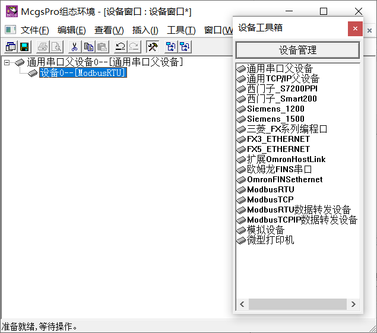

图 15.1-3 添加ModbusRTU驱动

网口设备的添加步骤相同。

>   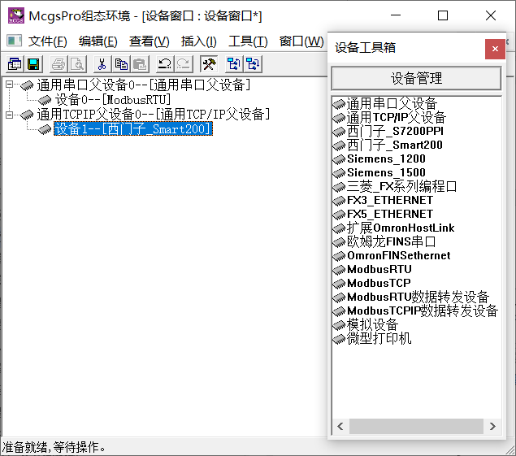

图 15.1-4 添加西门子_Smart200网口驱动

### 15.1.2 增加设备驱动

若【设备工具箱】中没有需要的驱动，可自行增加，步骤如下：

1.  点击【设备工具箱】的【设备管理】按钮。

>   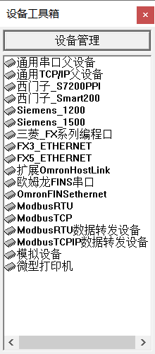

图 15.1-5 点击设备管理按钮

1.  在打开的【设备管理】界面中，选中左侧目录树中需要的驱动，双击或点击下方的【增加】按钮，可以将该驱动添加到右侧【选定设备】窗口中，确定后可添加到【设备工具箱】中。

>   

图 15.1-6 给工具箱添加驱动

### 15.1.3 安装设备驱动

若左侧的目录树中没有需要的驱动，则可点击下方的【安装】按钮，指定新增驱动程序所在的路径后确定安装。

>   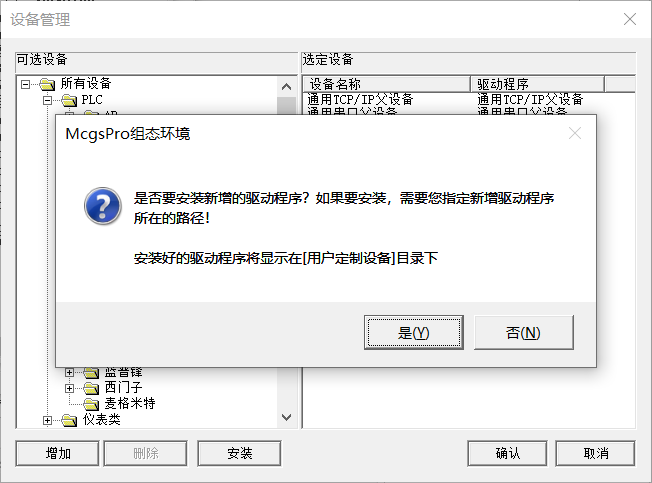

图 15.1-7 安装软件中没有的驱动

### 15.1.4 查找设备驱动

当用户工程已经加载的驱动无法找到时（如：驱动存放位置不在以前添加的位置），双击驱动会弹出驱动搜索功能界面。

>   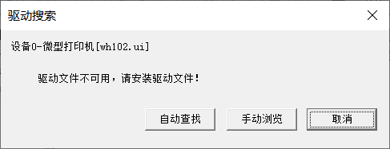

图 15.1-8 查找丢失的驱动

若驱动文件已放在了【（软件安装路径）\\Program\\Drivers】文件夹下，则可以选择【自动查找】功能来搜索驱动，此时驱动将使用新的加载路径。

若驱动文件未放在【（软件安装路径）\\Program\\Drivers】文件夹下，自动搜索功能搜索不到匹配的驱动，此时用户可点击【手动浏览】按钮，在弹出的窗口中选择驱动所在路径下对应的驱动文件，此时驱动将使用用户选择的驱动文件进行加载。

## 15.2 设置设备参数

添加好设备驱动后，还需要对父设备和子设备的参数进行设置，才能实现与外部设备间的正常通讯。

### 15.2.1 父设备参数

首先需要对父设备参数进行设置。

-   设置通用串口父设备

    双击【通用串口父设备】，打开【通用串口设备属性编辑】界面。按照所通讯设备的要求来设置串口端口号、通讯波特率等参数。如设置不正确，会导致无法正常通讯。【通用串口父设备】属性编辑界面如图15.2-1所示。

>   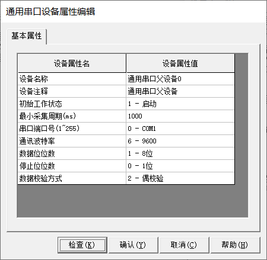

图 15.2-1 通用串口设备属性编辑界面

1.  **初始工作状态**：指运行时设备的初始工作状态，如父设备处于停止状态，则父设备下挂接的所有子设备都处于停止状态。
2.  **最小采集周期**：运行时，对设备进行定时操作的时间周期，单位为毫秒。
3.  **串口端口号**：可选范围COM1\~COM254，默认值COM2。
4.  **通讯波特率**：可选范围9600,19200,38400等，默认值9600。
5.  **数据位位数**：可选范围7、8，默认值8。
6.  **停止位位数**：可选范围1、1.5、2，默认值1。
7.  **奇偶校验位**：可选范围无校验、奇校验、偶校验、标志位、空格位，默认值无校验。
-   设置通用TCP/IP父设备

    双击【通用TCP/IP父设备】，打开【通用TCP/IP设备属性编辑】界面。同样的，按所通讯设备要求设置IP地址、端口号等参数。【通用TCP/IP父设备】属性编辑界面如图15.2-2所示。

>   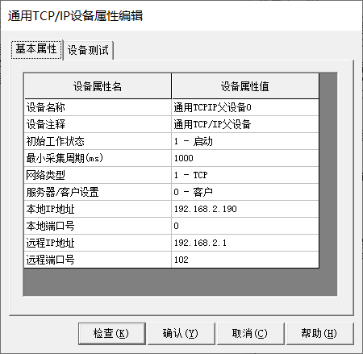

图 15.2-2 通用TCP/IP父设备编辑界面

1.  **初始工作状态**：指运行时设备的初始工作状态，如父设备处于停止状态，则父设备下挂接的所有子设备都处于停止状态。
2.  **最小采集周期**：运行时，对设备进行定时操作的时间周期，单位为毫秒。
3.  **网络类型**：可选择UDP或TCP中任意一种网络，服务器与客户端应使用同一种网络类型。
4.  **服务器/客户设置**：设置本工作站为服务器或客户端。
5.  **本地IP地址**：指触摸屏在TCP/IP网络中的IP地址。
6.  **本地端口号**：指触摸屏所使用的网络TCP/IP端口的地址。

    **注意：**若无特殊要求TCP客户端的本地端口号建议设置为0，为随机绑定本地端口号。

7.  **远程IP地址**：指和触摸屏进行通讯的远程设备的IP地址或域名地址。
8.  **远程端口号**：指远程设备使用的网络TCP/IP端口的地址。

### 15.2.2 子设备参数

不同子设备的参数配置不同，可在在设备帮助中查看相关说明。

1.  双击子设备，进入【设备编辑窗口】。【设备编辑窗口】的详细说明请参考：进阶篇_1.4.2设备窗口介绍。

>   

图 15.2-3 双击子设备

1.  点击【打开设备帮助】按钮，弹出该子设备对应的驱动帮助，包含【硬件配置】【参数设置】【设备属性】【通道信息】【设备命令】【通讯状态】【附录】（在附录中会有PLC端如何设置步骤，可供参考）等信息，点击帮助页上方的蓝色字体超链接可快速定位，用户可在需要的时候自行查看相关内容。

>   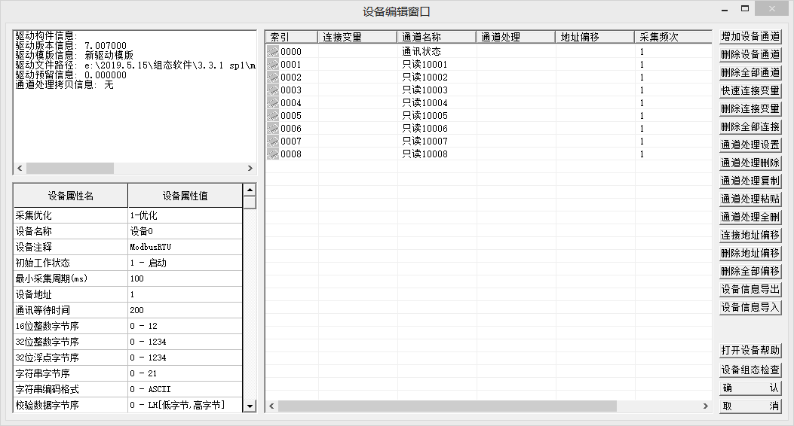

>   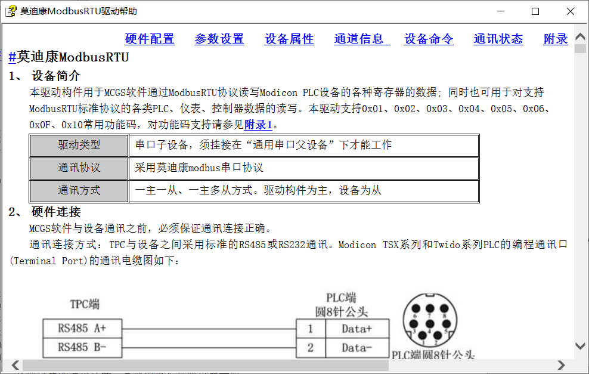

图 15.2-4 设备编辑窗口

### 15.2.3 设备命令

McgsPro除了可以在组态过程中对父设备或子设备的参数进行设置外，也可以在工程运行过程中，通过设备命令，对父设备或子设备参数进行设置。

-   函数介绍和应用举例

设备命令的格式如下：

**!SetDevice(DevName,DevOp,CmdStr)**

参数含义：DevName，字符型，设备名

DevOp，数值型，设备操作码

CmdStr，字符串，设备命令，只有当DevOp=6时CmdStr才有意义

DevOp取值范围及相应含义：

= 1，启动设备

= 2，停止设备

= 3，测试设备的工作状态

= 4，启动设备工作一次

= 5，改变设备的工作周期，CmdStr包含新的工作周期，单位ms

= 6，执行指定的设备命令，CmdStr中包含指定命令的格式

其中DevOp值为6时，CmdStr可以支持多种函数，如父设备的参数修改，子设备中通道数值读写等。

**通用TCP/IP父设备对应的设备命令和用法如下：**

| 设备命令                       | 命令格式                 | 命令举例                                                                                                                           |
|--------------------------------|--------------------------|------------------------------------------------------------------------------------------------------------------------------------|
| 获取以太网信息 GetIPInfo( )    | GetIPInfo(以太网信息)    | **例：!**SetDevice(通用TCPIP父设备0,6,"GetIPInfo(IpInfo)") 获取“通用TCPIP父设备0”的以太网信息                                      |
| 修改本地IP和端口号 SetLocal( ) | SetLocal(IP地址,端口号)  | **例：!**SetDevice(通用TCPIP父设备0,6,"SetRemote(200.200.200.190,0)") 设置“通用TCPIP父设备0”本地IP为200.200.200.190，本地端口号为0 |
| 修改远程IP和端口号SetRemote( ) | SetRemote(IP地址,端口号) | **例：!**SetDevice(通用TCPIP父设备0,6,"SetRemote(200.200.200.191,0)") 设置“通用TCPIP父设备0”远程IP为200.200.200.191，远程端口号为0 |

**通用串口父设备对应的设备命令和用法如下：**

| 设备命令                       | 命令格式                                            | 命令举例                                                                                                                                                            |
|--------------------------------|-----------------------------------------------------|---------------------------------------------------------------------------------------------------------------------------------------------------------------------|
| 修改串口端口号 ChangePort( )   | ChangePort(端口号)                                  | **例：**!SetDevice(通用串口父设备0,6,“ChangePort(1)”) 设置“通用串口父设备0”的串口端口号为1-COM2                                                                     |
| 修改通讯参数ChangePortParam( ) | ChangePortParam(波特率,数据位,停止位,校验位,返回值) | **例：**!SetDevice(通用串口父设备0,6,"ChangePortParam(9600,8,1,0,nReturn)“) 设置“通用串口父设备0”波特率为9600,数据位8,停止位1,校验方式无校验。函数返回值放入nReturn |

**通过设备命令控制子设备：**

以ModbusRTU为例，介绍如何利用设备命令控制子设备的启停。

1.  首先在设备窗口中新建如图15.2-5所示的驱动：

>   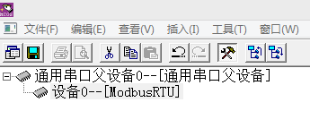

图 15.2-5 添加ModbusRTU驱动

1.  然后在用户窗口0中新建两个按钮，将按钮1的显示文本设置为【启动设备0】，脚本编辑为【!SetDevice(设备0,1,"")】，如图15.2-6所示。

>    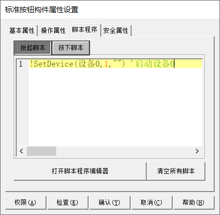

图 15.2-6 按钮1设置

1.  将按钮2的显示文本设置为【停止设备0】，脚本编辑为【!SetDevice(设备0,2,"")】，如图15.2-7所示。

>    

图 15.2-7 按钮2设置

1.  工程运行时，点击按钮1，则设备0启动；点击按钮2，则设备0停止。
-   通过设备命令，对数据进行读写操作。

    设备命令除了可以在运行过程中对父设备或子设备的参数进行设置外，还可以对子设备中通道数值进行读写操作。不同子设备的函数不同，可以在每个驱动的帮助中查看。子设备常用函数如下：

Read (寄存器名称, 寄存器地址, 数据类型=读取值)：按照指定数据格式读取寄存器某一地址数值。

Write (寄存器名称, 寄存器地址, 数据类型=写入值)：将数值以指定数据格式写入寄存器某一地址中。

ReadP：格式1：ReadP(寄存器名称, 寄存器起始地址, 数据类型, 操作个数n, 读取值1, 读取值2,.., 读取值n)

格式2：ReadP(寄存器名称, 寄存器起始地址, 数据类型, 操作个数n, 读取值1, 读取值2,.., 读取值n, 返回值)

从寄存器指定地址开始，按照指定数据类型连续读取n个数值，将读取值分别存放入变量。

WriteP：格式1：WriteP(寄存器名称, 寄存器起始地址, 数据类型, 操作个数n, 写入值1, 写入值2,..,写入值n)

格式2：WriteP(寄存器名称, 寄存器起始地址, 数据类型, 操作个数n, 写入值1, 写入值2,..,写入值n,返回值)

从寄存器指定地址开始，按照指定数据类型连续写入n个数值。

ReadPV：格式1：ReadPV (寄存器名称, 寄存器起始地址, 数据类型, 操作个数n, 读取值)

格式2：ReadPV (寄存器名称, 寄存器起始地址, 数据类型, 操作个数n, 读取值, 返回值)

从寄存器指定地址开始，按照指定数据类型连续读取n个数值，将读取值分别放入以“读取值”为起始，连续n个变量中。

WritePV：格式1：WritePV (寄存器名称, 寄存器起始地址, 数据类型, 操作个数n, 写入值)

格式2：WritePV (寄存器名称, 寄存器起始地址, 数据类型, 操作个数n, 写入值, 返回值)

读取以“写入值”为起始，连续n个的变量数值，将读取值从寄存器指定地址开始，按照指定数据类型分别写入n个寄存器中。

ReadBlock：格式1：ReadBlock (寄存器名称, 寄存器起始地址, [数据类型1][数据类型2][数据类型n], 操作个数n, 写入变量)

格式2：ReadBlock (寄存器名称, 寄存器起始地址, [数据类型1][数据类型2][数据类型n], 操作个数n, 写入变量,返回值)

从寄存器指定地址开始，按照指定数据类型格式连续读取n组数据，将读取值以特定CSV格式存入字符变量中。

WriteBlock：格式1：WriteBlock (寄存器名称, 寄存器起始地址, [数据类型1][数据类型2][数据类型n], 操作个数n, 写入值)

格式2：WriteBlock (寄存器名称, 寄存器起始地址, [数据类型1][数据类型2][数据类型n], 操作个数n, 写入值, 返回值)

将字符串变量中的数据，以指定格式解析并按照指定数据类型格式，写入寄存器指定地址开始的连续地址中。

**数据读写举例：**

!SetDevice(设备0,6,"Read(4,10,WUB=Data00;4,40,DF=Data01)")

释义：读取寄存器4区地址10的16位无符号值, 和地址40的浮点数值，放入MCGS变量Data00,Data01中。

!SetDevice(设备0,6,"Write(4,10,WUB=Data00;4,40,DF=Data01)")

释义：将Data00,Data01的值分别以16位无符号和浮点数写入4区寄存器地址10和40中。

## 15.3 添加通道并连接变量

设置完设备参数后，还需要将设备通道与实时数据库中的变量连接，通道数据才可通过变量被用户窗口中的构件和策略脚本等所使用。

>   

图 15.3-1 McgsPro组态软件原理图

### 15.3.1 添加通道

1.  双击【ModbusRTU】子设备进入其设备编辑窗口，点击右侧的【增加设备通道】按钮。选择【通道类型】为【[3区]输入寄存器】，【数据类型】为【16位无符号二进制】，【通道地址】为【0】，【通道个数】为【1】个。其他设置保持默认不变。点击【确认】。

>   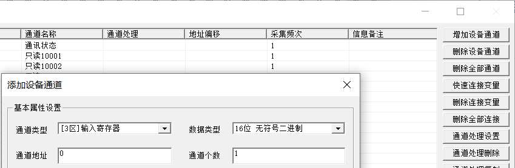

图 15.3-2 添加通道

1.  组态结果如图15.3-3所示。

>   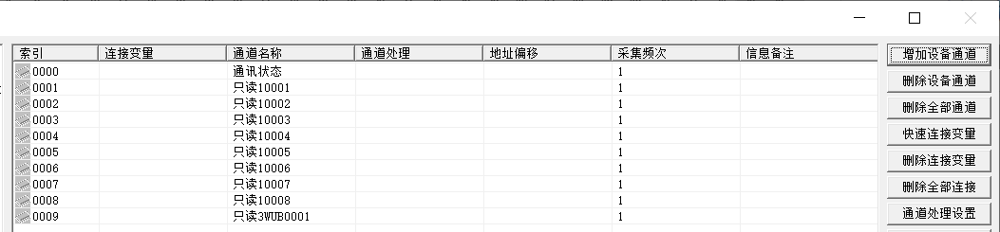

图 15.3-3 添加通道结果

### 15.3.2 快速连接变量

1.  点击【设备编辑窗口】右侧的【快速连接变量】按钮，弹出【快速连接】界面。
2.  此时，若选择【自定义变量连接】，则会按照在该界面的设置生成连接变量；若选择【默认设备变量连接】，则会以【设备名称_读写方式_通道名称】为规则生成所有通道的连接变量（无论通道是否已连接变量）。本例选择使用【默认设备变量连接】，点击确认，关闭【快速连接】界面。注意，此时只是在当前界面的【连接变量】列填入了变量的名称，实时数据库中还未添加这些变量。
3.  然后点击确认，关闭【设备编辑窗口】。系统弹出对话框告知变量未定义，询问是否添加变量，选择【全部添加】，则系统自动在实时数据库中添加未定义的变量。

>   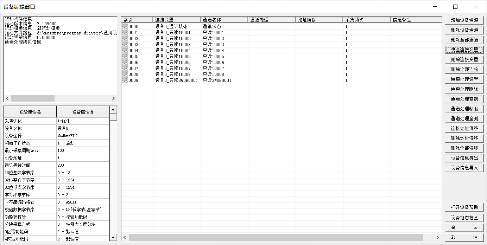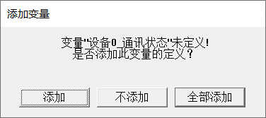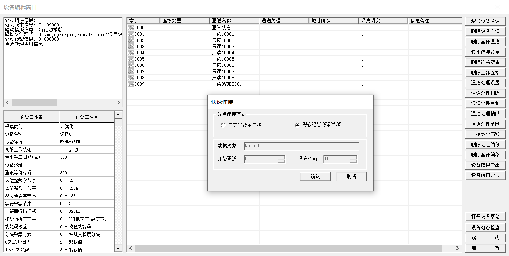

>   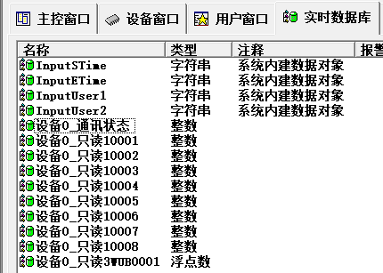

图 15.3-4 快速连接变量

### 15.3.3 其他连接变量的方式

方法一：若在建立通道前，已经在实时数据库中定义了变量，则可以在建立完通道后，在【连接变量】列点击右键，弹出【变量选择】界面。然后双击选择需要的变量即可。

>   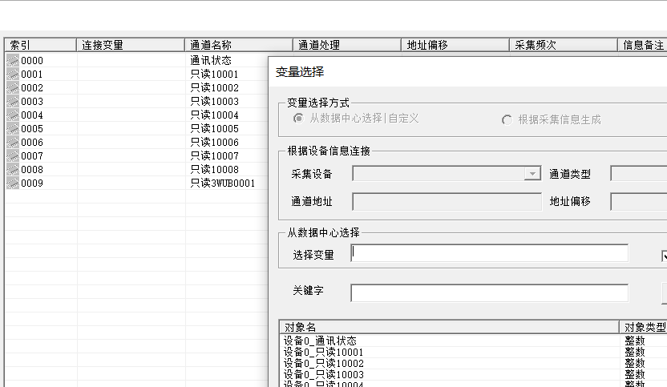

图 15.3-5 其他连接变量方法一

方法二：也可以在【添加设备通道】时，点击【连接变量】右侧的图标按钮，弹出【变量选择】设置界面，双击选择已经定义好了的变量如【Data1】。可以看到，【Data1】出现在了【连接变量】右侧的输入框中。也可以直接在该输入框处输入变量名。然后点击确认关闭【添加设备通道】界面。

>   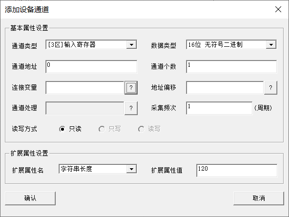

>   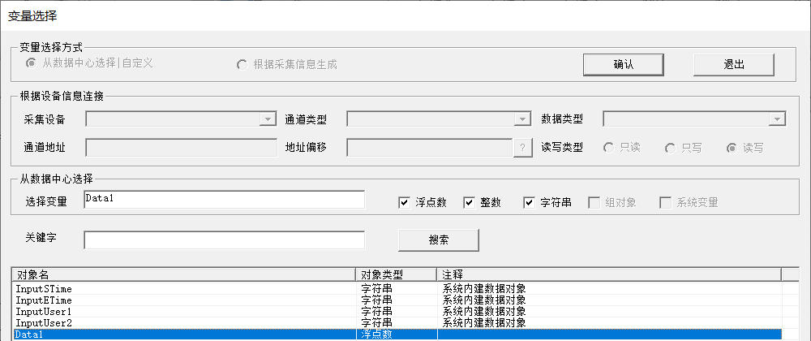

>   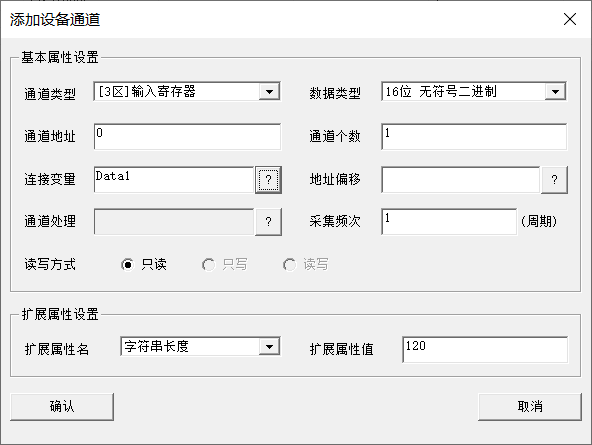

图 15.3-6 其他连接变量方法二

组态结果如图15.3-7所示。

>   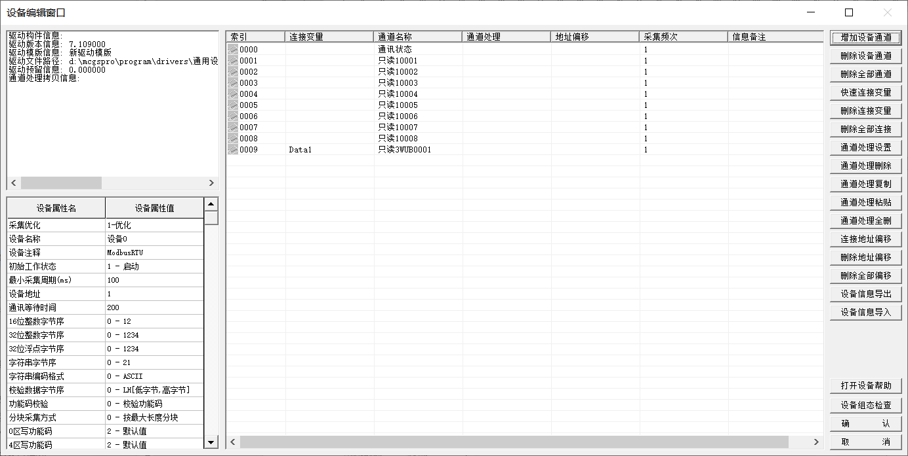

图 15.3-7 连接结果

## 15.4 McgsPro与西门子200PPI串口通讯及监控

本节样例实现的功能是：使用TPC接收西门子_S7200PPI发来的信号值，当信号值为1时，画面中的指示灯变绿；当信号值为0时，指示灯变红。使用到的地址为I0.0，通讯方式为RS485。

### 15.4.1 硬件连接

MCGS软件与设备通讯之前，必须保证通讯连接正确。

通讯连接方式：

⑴采用标准串口型号的西门子PC/PPI电缆。

⑵TPC触摸屏的RS485接口的A正B负与PLC编程口3正8负连接，如图15.4-1所示。

>   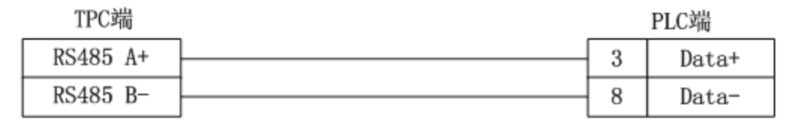

图 15.4-1 接线图

TPC的9针串口引脚定义如图15.4-2所示。

>   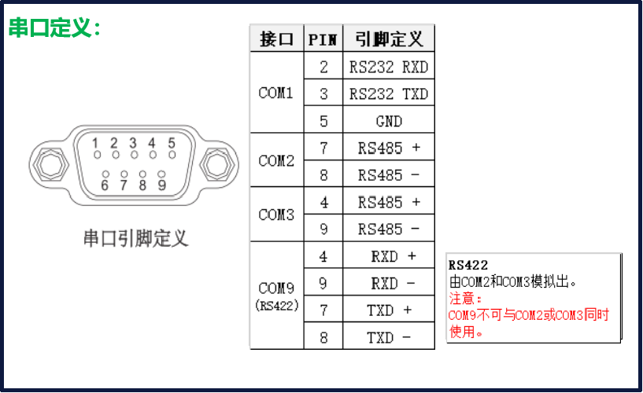

图 15.4-2 TPC9针串口引脚定义

### 15.4.2 TPC通讯设置

#### 15.4.2.1 父设备参数设置

1.  在McsgPro软件中，进入设备窗口，将【西门子_S7200PPI】驱动挂载到【通用串口父设备】下，如图15.4-3所示。

>   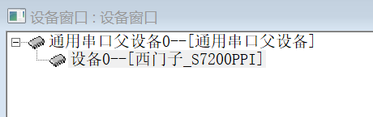

图 15.4-3 添加驱动

1.  双击【通用串口父设备】，进入其属性编辑界面，参数设置如图15.4-4所示。

>   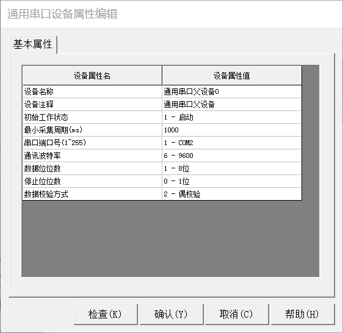

图 15.4-4 父设备参数设置

#### 15.4.2.2 子设备参数设置

【西门子_S7200PPI】子设备参数设置如图15.4-5所示，一般保持默认即可。

>   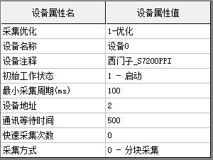

图 15.4-5 子设备参数设置

### 15.4.3 PLC通讯设置

进入Step7 - Micro/WIN，点击系统块打开通信端口设置，设置通信中的地址（默认2）和波特率（9.6Kbps）和McgsPro中父设备通讯参数一致。

>   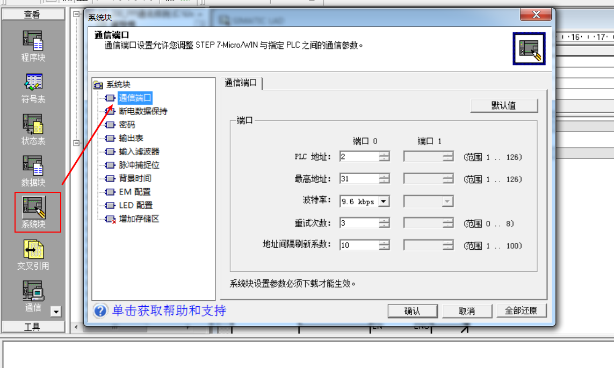

图 15.4-6 PLC通讯参数设置

设置完后，将程序下载到PLC。

### 15.4.4 组态画面

1.  在McgsPro中，依次进入工作台 → 用户窗口 → 窗口0。
2.  点击工具箱中的插入元件，弹出【元件图库管理】界面。
3.  依次选择图库类型为【公共图库】 → 指示灯 → 指示灯14 → 确定。
4.  指示灯14出现在用户窗口的左上角，将它拖拽到合适的位置和大小。

>   1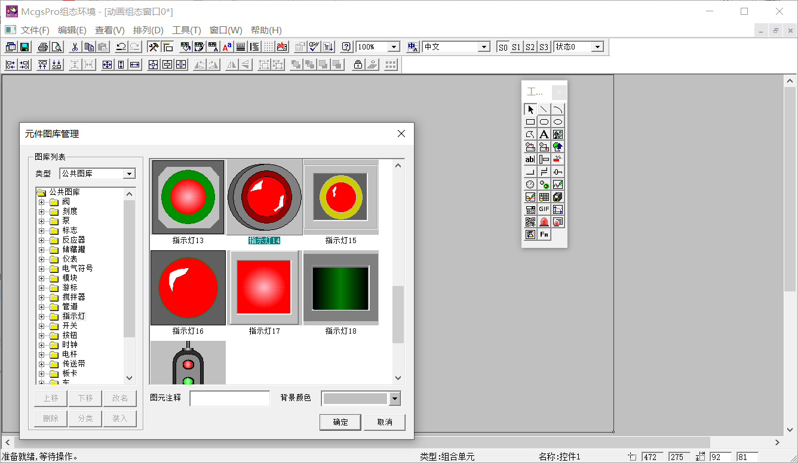

图 15.4-7 从添加指示灯

1.  双击指示灯，弹出【单元属性设置】界面。选中【变量列表】页的【表达式】，点击出现的图标，弹出【变量选择】界面。

>   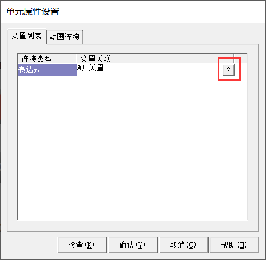

图 15.4-8 关联变量一

1.  选择变量选择方式为【根据采集信息生成】。采集设备为【设备0[西门子_S7200PPI]】，通道类型为【I寄存器】，数据类型为【通道的第00位】，通道地址为【0】，其他设置保持不变。点击确认。

>   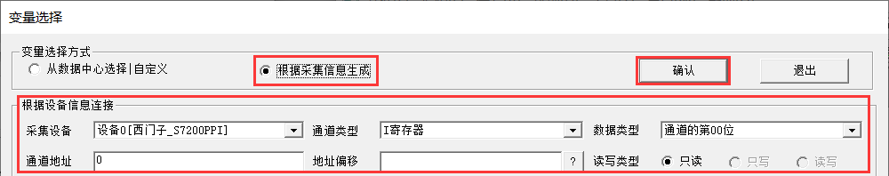

图 15.4-9 关联变量二

1.  设置完成后，表达式右侧的输入框中出现了上一步定义的变量，与此同时，该变量也在实时数据库中自动生成。

>   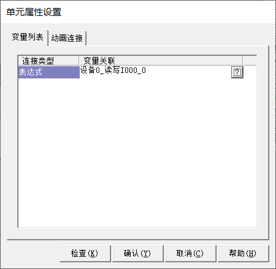 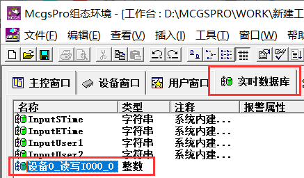

图 15.4-10 实时数据库自动生成变量

1.  设置完成后，保存工程。用USB线将电脑与TPC相连，将TPC上电。然后点击工具栏的下载运行图标按钮，弹出【下载配置界面】。
2.  选择【运行方式】为【联机】，连接方式为【USB通讯】。然后点击【工程下载】按钮，下载成功后点击【启动运行】。则TPC上开始运行我们刚才组态好的画面。

>   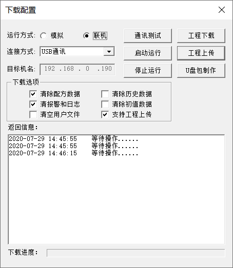

图 15.4-11 下载工程

1.  此时，若PLC的I0.0传来信号1，则指示灯变为绿色，传来0，则指示灯变为红色。

>    

图 15.4-12 运行效果

## 15.5 McgsPro与三菱FX3U网口通讯及监控

本节样例实现的功能是：在TPC画面中，第一次按下【按钮】时，发送一个信号值【1】给三菱FX3U PLC，使PLC的Y0.0置1；再次按下【按钮】时，发送信号值【0】给PLC，使PLC的Y0.0置0。本节样例的通讯方式为以太网。

### 15.5.1 硬件连接

通讯连接方式：采用RJ-45网线

### 15.5.2 TPC通讯设置

#### 15.5.2.1 父设备参数设置

在McsgPro软件中，进入设备窗口，将【FX3_ETHERNET】驱动挂载到【通用TCP/IP父设备下】，如图15.5-1所示。

>   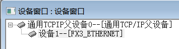

图 15.5-1 添加驱动

双击【通用TCP/IP父设备】，进入其属性编辑界面，通讯参数设置如图15.5-2所示。其中，本地IP地址设置成TPC的IP地址，远程IP地址设置成PLC的IP地址，两个IP地址应在同一网段。本例中本地IP地址为【200.200.200.190】，PLC的IP地址为【200.200.200.200】。

>   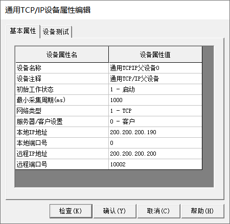

图 15.5-2 设置父设备属性

#### 15.5.2.3 设置子设备

双击子设备，打开FX3_ETHERNET的设备编辑窗口。点击【增加设备通道】按钮，在弹出的【添加设备通道】界面中，设置通道类型为【Y输出\<8进制地址\>】，通道地址为【0】，通道个数为【1】。其他设置保持默认不变，点击确认。

>   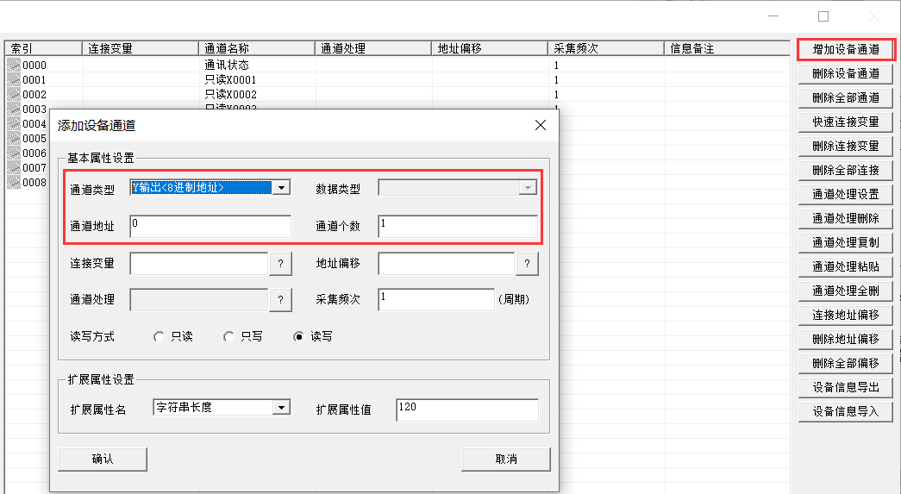

图 15.5-3 添加设备通道

设置完成之后，【设备编辑窗口】中将新增一条通道。点击【快速连接变量】按钮，在弹出的【快速连接】窗口中，选择变量连接方式为【自定义变量连接】，输入数据对象为【开关】，设置开始通道为【9】，通道个数为【1】。点击确认。

>   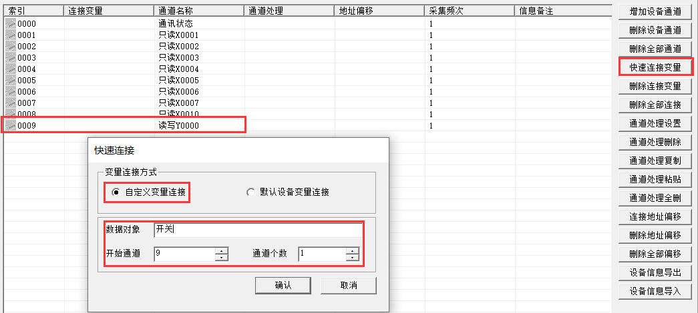

图 15.5-4 快速连接变量

点击设备编辑窗口的【确认】按钮，弹出对话框提示变量为定义，询问是否添加，选择【添加】。

>   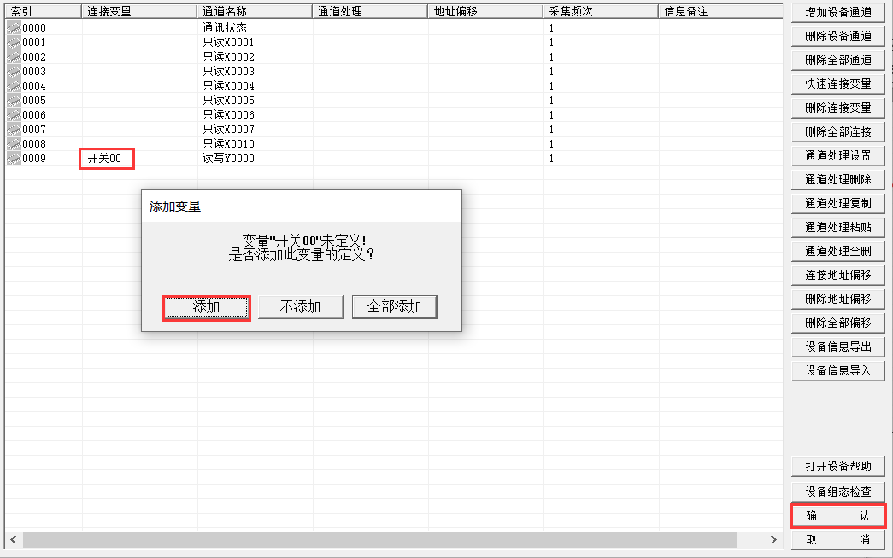

图 15.5-5 自动在实时数据库中添加变量的定义

此时，实时数据库中也自动添加了一个名为【开关00】的变量。

>   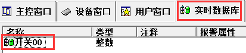

图 15.5-6 实时数据库

#### 15.5.2.4 设置 TPC的 IP地址

启动TPC，在读条时按住TPC液晶显示屏，进入TPC系统配置界面。

>   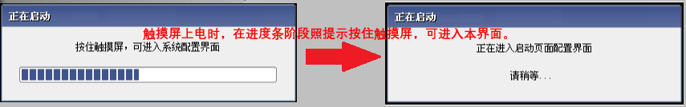

图 15.5-7 进入TPC系统配置界面

点击【系统参数设置】-\>【网络】修改TPC IP地址和组态时的本地IP地址设置一致。

>   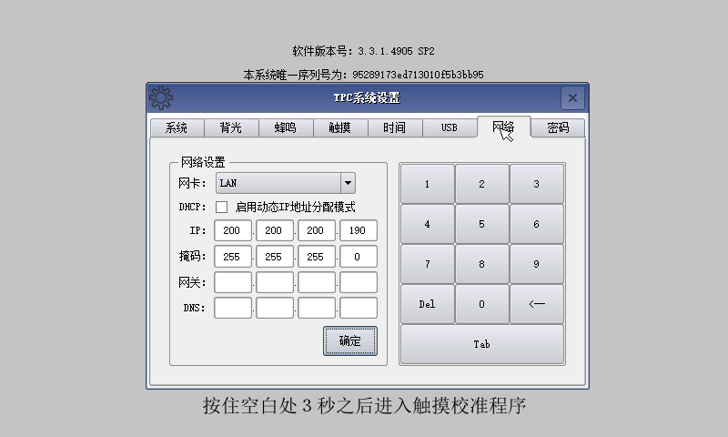

图 15.5-8设置TPCIP地址

### 15.5.3 PLC通讯设置

使用三菱GX Works2/GX Developer编程软件设置PLC通讯参数步骤如下：

#### 15.5.3.1 新建工程

打开软件，工程 → 新建，在弹出的【新建】界面中设置PLC系列、型号。

>   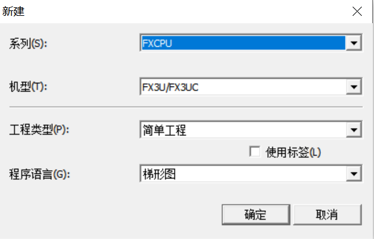

图 15.5-9 新建PLC工程

#### 15.5.3.2 设置PLC参数

1.  打开工程 → 参数 → PLC参数，打开【FX参数设置】界面。

>   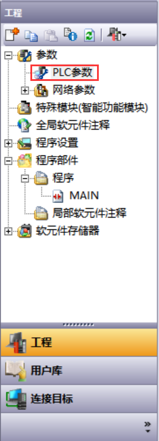

图 15.5-10 打开参数设置界面

1.  点击【以太网端口设置】功能页，选择使用CH为【CH2】，按照图15.5-11所示设置IP地址，然后点击【打开设置】按钮。弹出【以太网端口打开设置】界面。

>   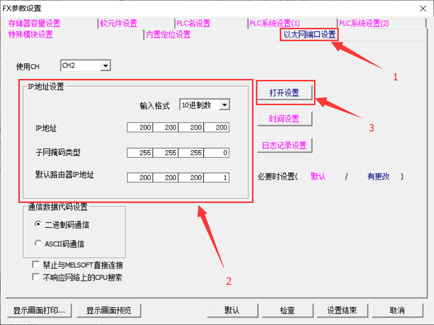

图 15.5-11 设置IP地址

1.  按照图15.5-12所示进行设置。

>   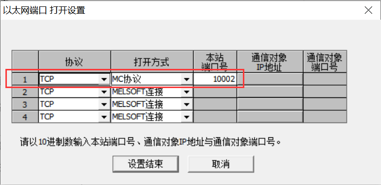

图 15.5-12 设置以太网端口

1.  点击【设置结束】按钮，结束以太网端口设置。

#### 15.5.3.3 连接目标设置

1.  点击连接目标 → 当前连接目标 → Connection1来设置连接目标。

>   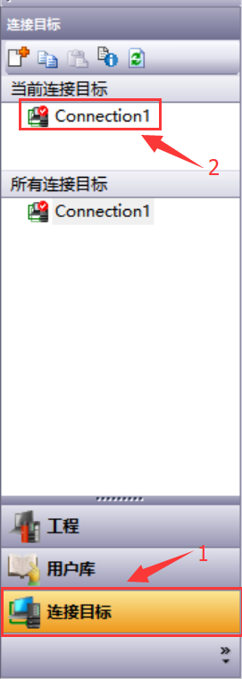

图 15.5-13 连接目标设置一

1.  按照以下步骤对连接目标进行设置。设置步骤1和步骤3时，在弹出的对话框中直接点击【确认】即可。在步骤2中设置IP地址与McgsPro中父设备参数中的【远程IP地址】一致。

>   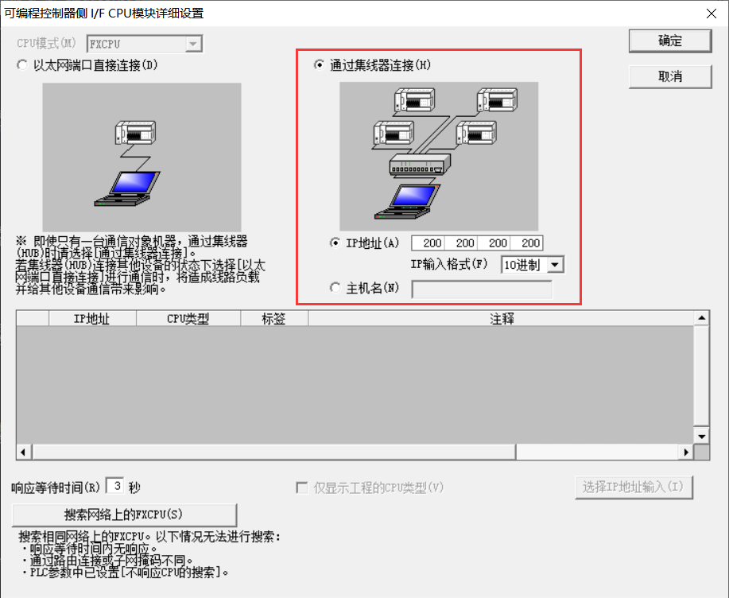 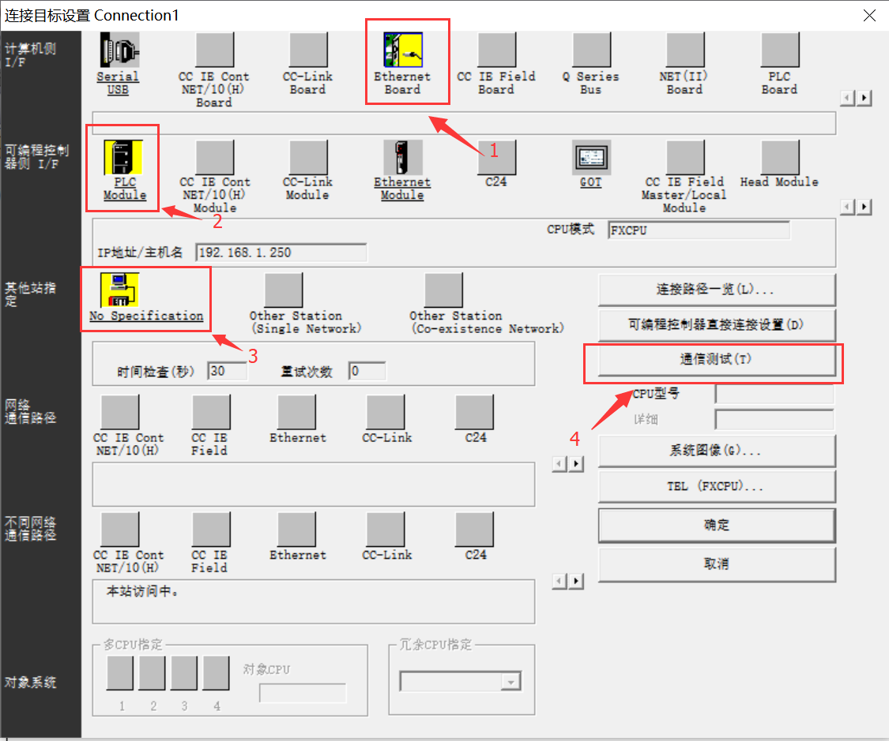

图 15.5-14 连接目标设置二

1.  按照顺序设置完成后，点击【通信测试】按钮，按钮下方 的CPU型号右侧显示PLC型号。
2.  设置结束，下载至PLC。

### 15.5.4 组态画面

在McgsPro中进入用户窗口0，从工具箱拖拽一个【按钮】构件到画面中合适的位置。双击该按钮，进入【操作属性】功能页，勾选【数据对象值操作】前的复选框，选择操作效果为【取反】，关联变量【开关00】。

>   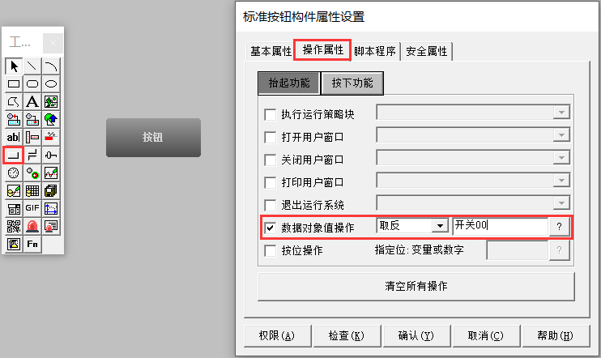

图 15.5-15 组态画面

设置完成后，保存工程。然后点击工具栏的下载运行图标按钮，弹出【下载配置界面】。

选择【运行方式】为【联机】，连接方式为【TCP/IP网络】，将TPC的地址输入到【目标机名】中。然后点击【工程下载】按钮，下载成功后点击【启动运行】。则TPC上开始运行我们刚才组态好的画面。

>   

图 15.5-16 下载运行

点击TPC画面中的按钮，PLC的Y0.0灯被点亮，再点击一次按钮，Y0.0熄灭。

## 15.6 模拟通讯

在工程调试的过程中，可能会遇到暂时没有TPC的情况，此时可以使用McgsPro自带的模拟器与外部设备进行通讯调试。本节主要介绍使用模拟器与支持ModbusRTU协议的设备进行调试。

### 15.6.1 硬件连接

McgsPro与设备通讯之前，必须保证通讯连接正确。TPC与设备之间采用标准的RS485或RS232通讯。本节样例使用RS485通讯，用USB转485的电缆将电脑与设备相连。

然后进入电脑的【设备管理器】查看端口号，如图15.6-1所示，本节样例中的模拟器的端口号为【COM3】。

>   

图 15.6-1 查看模拟器端口号

### 15.6.2 通讯设置

1.  组态在McgsPro中新建一个工程，进入设备窗口，将【ModbusRTU】挂载到【通用串口父设备】下。

>   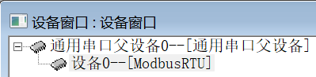

图 15.6-2 添加驱动

1.  双击父设备，设置父设备参数如图15.6-3所示。

>   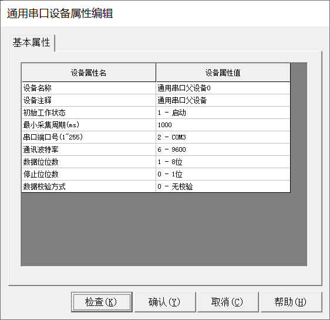

图 15.6-3 设置父设备参数

父设备通讯参数设置应与设备的通讯参数相同，否则无法正常通讯，默认为9600、8、1、E(偶校验)。设备通讯参数的具体设置请参见对应设备手册。

1.  双击【ModbusRTU】，进入子设备【设备编辑窗口】。子设备参数如图15.6-4所示。

>   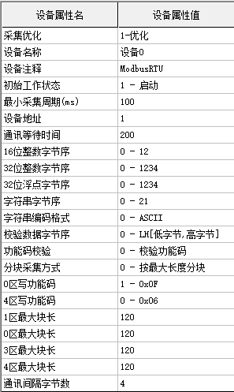

图 15.6-4 设置子设备参数

在【设备编辑窗口】中添加如图15.6-5所示的通道，再点击【快速连接变量】按钮 → 选择【变量连接方式】为【默认设备变量连接】 → 确认。设置完成后设备的通道和连接变量情况如图15.6-5所示。

>   

图 15.6-5建立通道和变量连接

然后点击【设备编辑窗口】的确认按钮，弹出对话框提示变量未定义，询问是否添加定义，选择【全部添加】。此时实时数据库中自动生成了上一步骤中连接的变量，如图15.6-6所示。

>   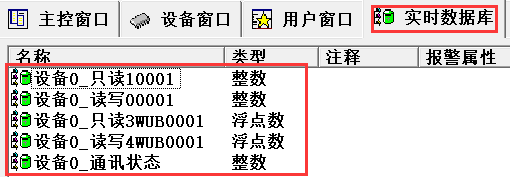

图 15.6-6 实时数据库

### 15.6.3 组态画面

进入用户窗口0，组态如图15.6-7所示的画面。

>   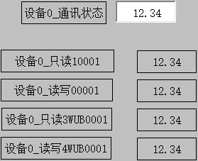

图 15.6-7 组态画面

画面右侧列的输入框中均关联了它们左侧列标签构件显示的变量。图15.6-8为关联变量【设备0_通讯状态】的输入框组态情况，其他输入框以次类推。

>   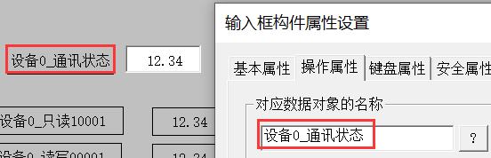

图 15.6-8 构件关联变量情况

### 15.6.4 模拟运行

组态完成后保存工程，然后模拟运行。步骤如图15.6-9所示。

>   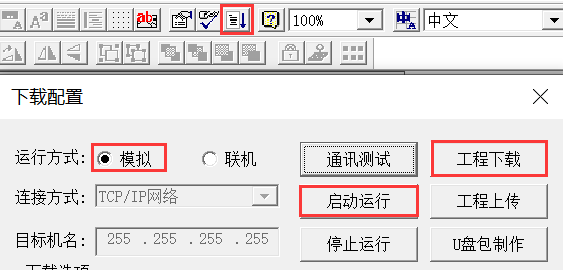

图 15.6-9 模拟运行

模拟运行窗口如图15.6-10所示。如果模拟器与设备通讯成功，通讯参数将显示【0】。如果通讯参数不为0，则可以通过参考设备帮助中通讯参数值的具体含义进行排错。

>   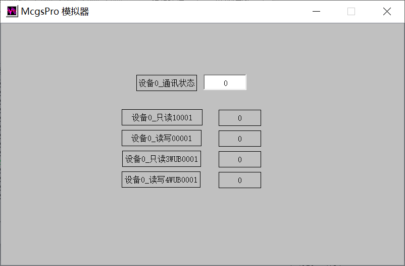

图 15.6-10 模拟器运行效果

## 15.7 通过通道导入导出替换PLC

由于在McgsPro中，设备通道首先与实时数据库中的变量连接，再通过变量被用户窗口中的构件和策略脚本等所使用。所以当用户需要替换外部设备时，只需要将变量与原外部设备通道间的连接断开，再重新添加变量与新设备通道之间的连接，即可不用重新组态画面、脚本等，便简单、快速地更换了外部设备。

本节以将外部设备从西门子_SMART200替换为三菱_FX3U为例进行讲解。

### 15.7.1 西门子_SMART200设备工程情况

现有一个使用McgsPro组态的控制冷床电机启停并显示电机状态的工程，工程画面如图15.7-1所示：

>   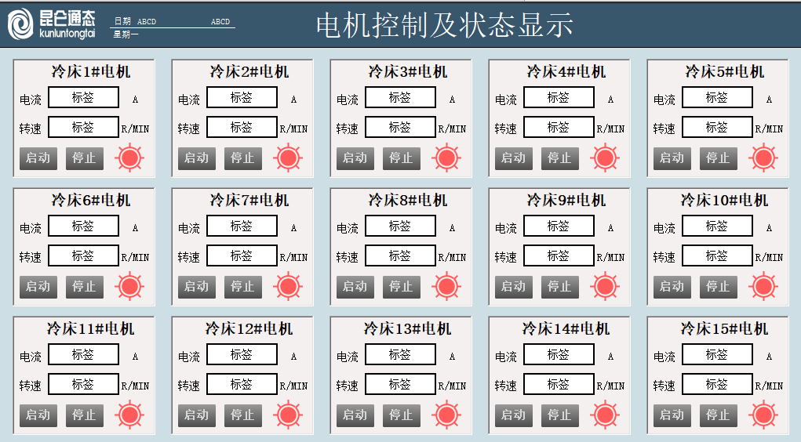

图 15.7-1 现有工程画面

画面中的构件都已经关联好了实时数据库中的变量。冷床1\#电机相关各个构件的变量关联情况如图15.7-2所示，其他电机关联变量情况以此类推。

>   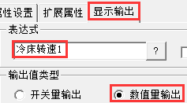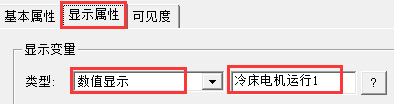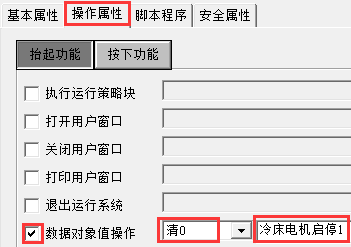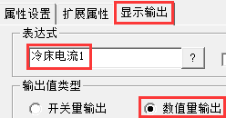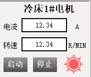

图 15.7-2 画面组态情况

实时数据库中有60个变量，分别是冷床电流1\~15，冷床转速1\~15，冷床电机启停1\~15，冷床电机运行1\~15。如图15.7-3所示。

>   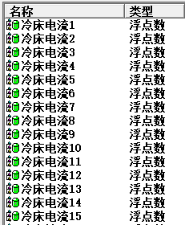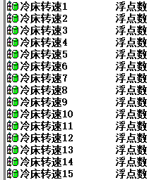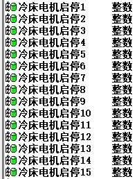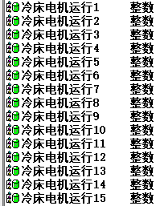

图 15.7-3 实时数据库情况

设备窗口中父设备为【通用TCP/IP父设备】，子设备为【西门子_Smart200】。

>   

图 15.7-4 设备窗口情况

双击子设备，进入【设备编辑窗口】。西门子_SMART200的通道【I000.0\~I001.6】连接变量【冷床电机启停1\~15】；通道【Q000.0\~Q001.6】连接变量【冷床电机运行1\~15】；通道【VDF000\~VDF056】连接【冷床电流1\~15】；通道【VDF060\~VDF116】连接【冷床转速1\~15】。如图15.7-5所示。

>   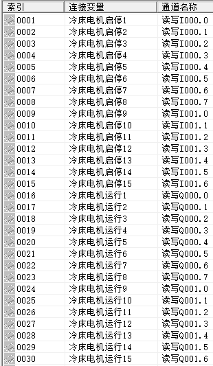 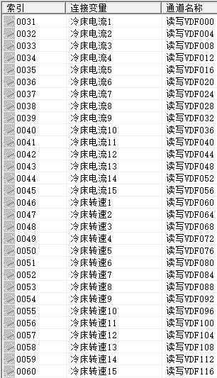

图 15.7-5 通道和变量连接情况

### 15.7.2 西门子_SMART200与三菱_FX3U通道对应关系

替换外部设备时，需要理清原设备的通道和新设备的通道之间的对应关系。在本例中，在西门子_SMART200中使用到的通道和三菱_FX3U通道之间的对应关系如图15.7-6所示。

>   

图 15.7-6 西门子PLC与三菱PLC通道类型对应关系

然后根据新设备的地址规划进行地址分配。本例中，我们将西门子_SMART200的通道【I000.0\~I001.6】替换成三菱_FX3U的通道【X0100\~X0116】；通道【Q000.0\~Q001.6】替换成三菱_FX3U的通道【Y0220\~Y0236】；通道【VDF000\~VDF056】替换成三菱_FX3U的通道【DDF0560\~DDF0588】；通道【VDF060\~VDF116】替换成三菱_FX3U的通道【DDF0590\~DDF0618】。

### 15.7.3 通过设备通道的导入导出进行设备替换

1.  进入西门子_SMART200的【设备编辑】窗口，点击右侧的【设备信息导出】按钮，在弹出的【另存为】对话框中，输入文件名【西门子_Smart200.csv】，默认保存类型为CSV。选择存储路径为桌面，然后点击保存。系统弹出设备信息导出成功的提示窗口，点击确定关闭即可。

>   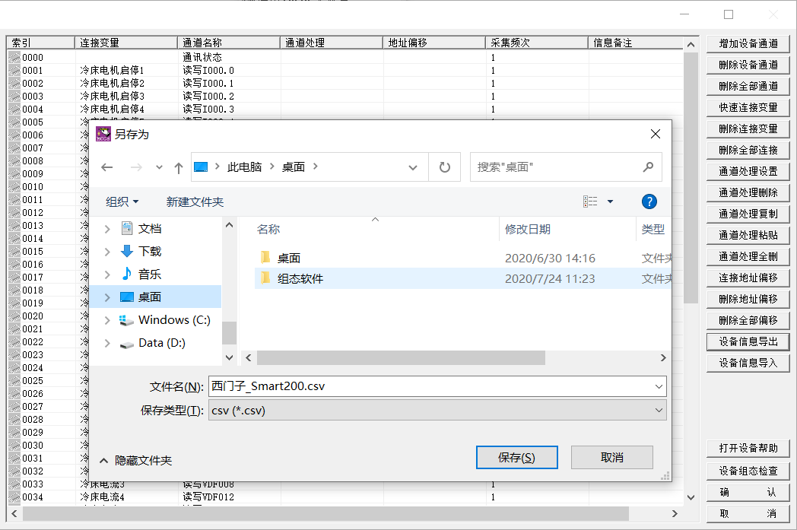

图 15.7-7 设备信息导出

1.  在设备窗口中，新建一个【通用TCP/IP父设备】，在它的下方添加【FX3_ETHERNET】子设备，双击打开。然后添加设备通道【X0100\~X0116】【Y0220\~Y0236】和【DDF0560\~DDF0618】。添加完成后，点击【设备信息导出】，导出文件名为【FX3_ETHERNET.csv】，保存路径为桌面。
2.  用EXCEL打开刚才导出的文件【西门子_Smart200.csv】和【FX3_ETHERNET.csv】，将【西门子_Smart200.csv】中变量名列的文字，复制到【FX3_ETHERNET.csv】中对应通道前的变量名列。复制完成后保存文件为CSV格式。

>   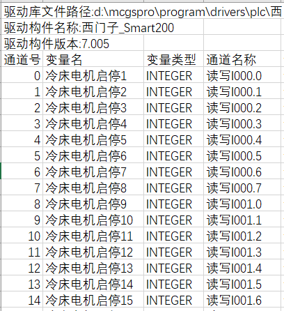 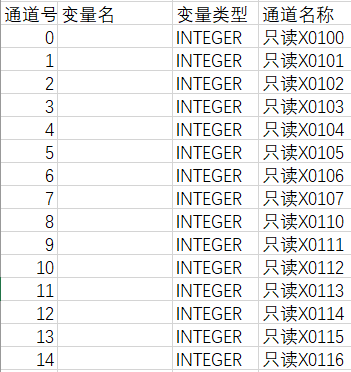

图 15.7-8 复制变量

1.  回到【FX3_ETHERNET】的【设备编辑窗口】，点击【设备信息导入】按钮，在桌面上选择保存好的【FX3_ETHERNET.csv】文件，点击【打开】按钮进行设备信息的导入。

>   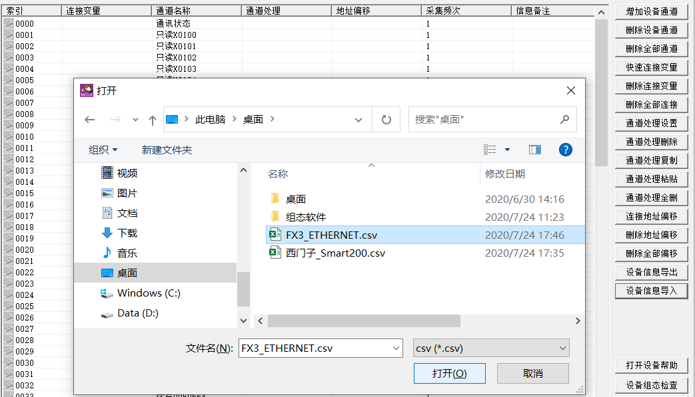

图 15.7-9 设备信息导入

1.  此时系统会弹出对话框提示【导入文件将自动删除设备中全部通道】询问【是否继续导入？】，选择【是】。

>   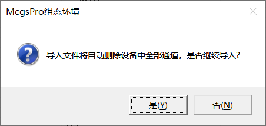

图 15.7-10 导入提示

1.  导入成功后，【FX3_ETHERNET】的【设备编辑窗口】如图15.7-11所示。

>   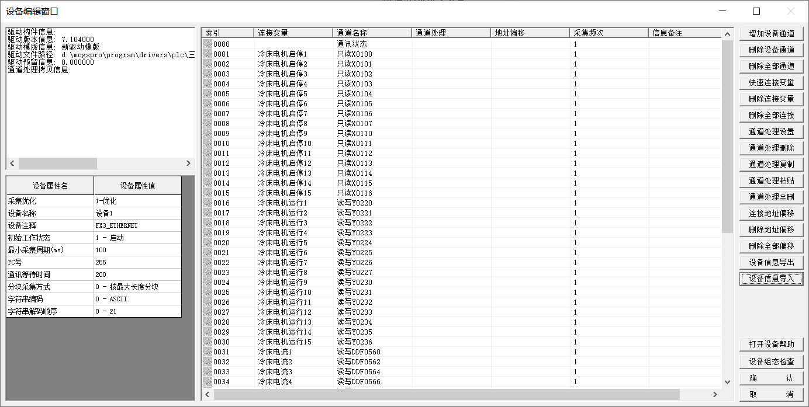

图 15.7-11 导入成功效果

1.  点击【确认】保存设置并关闭界面。
2.  双击【FX3_ETHERNET】的父设备，弹出【通用TCP/IP设备属性编辑】界面，将设备参数按TPC和当前外部设备的参数进行设置。

>   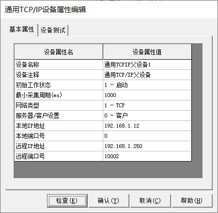

图 15.7-12 按新PLC设置新父设备参数

1.  添加完成新设备后，删除原设备驱动的父设备和子设备。

## 15.8 TPC系统控制

本驱动构件用在工程运行过程中控制TPC的蜂鸣、背光及IP地址设置。

本驱动为独立设备，只对本机进行操作不涉及通信。

本节主要介绍TPC系统控制驱动的功能和使用方法。

### 15.8.1 TPC系统控制功能介绍

首先添加一个TPC系统控制驱动。

1.  进入工作台 → 设备窗口 → 工具箱 → 设备管理，在【设备管理】界面中左侧的【可选设备】目录树下找到【TPC系统控制】。双击该驱动，将其添加到右侧的选定设备窗口中，然后点击确认保存设置并关闭窗口。

>   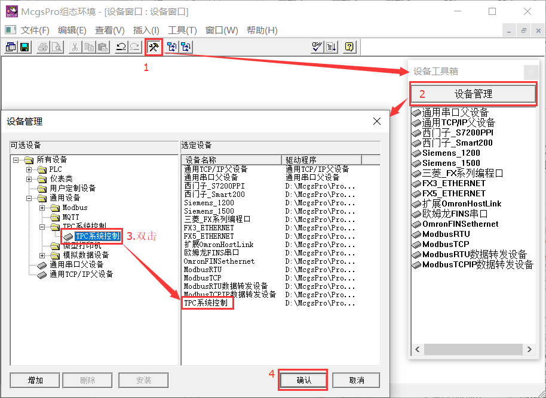

图 15.8-1 添加驱动

1.  TPC系统控制驱动不需要挂载在父设备下，直接双击工具箱中的【TPC系统控制】驱动，将它添加到设备窗口左侧的空白处。
2.  双击【TPC系统控制】设备，打开【设备编辑窗口】。如图15.8-2所示。

>   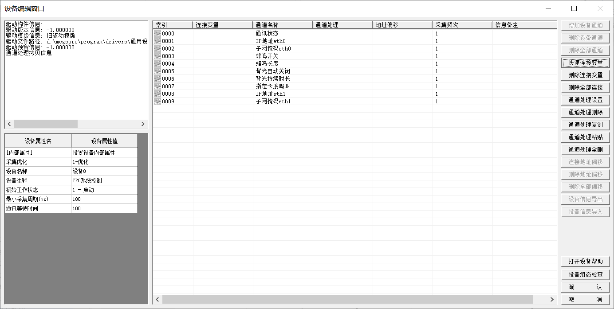

图 15.8-2 设备通道展示

**TPC系统控制设备编辑窗口配置信息：**

1.  通讯状态：为0表示当前驱动正常；为-1表示驱动加载失败。
2.  IP地址eth0：设置、获取本机IP地址。
3.  子网掩码eth0 ：设置、获取本机子网掩码。
4.  蜂鸣开关：蜂鸣器的开关，1为开，0为关。
5.  蜂鸣长度：设置系统蜂鸣器鸣叫声音长短。重启后生效。
6.  背光自动关闭：背光灯自动关闭是否生效，1为可用，0为不可用。
7.  背光持续时长：背光灯在开启了自动关闭功能的状态下，点亮持续时长后熄灭。
8.  指定长度鸣叫：产生指定长度的即时鸣叫，单位为MS。
9.  IP地址eth1：针对双网口TPC(单网口此通道无效)。
10. 子网掩码eth1：针对双网口TPC(单网口此通道无效)。

**注意：**本驱动用于无网络机型时，IP地址显示为空，其他功能可正常使用。

### 15.8.2 TPC系统控制的设备命令

我们也可以通过设备命令对TPC进行设置。相关设备命令如下：

| 设备命令     | 命令介绍 |                                          |
|--------------|----------|------------------------------------------|
| BACKLIGHTON  | 格式     | BACKLIGHTON()                            |
|              | 用途     | 打开背光灯                               |
|              | 例       | !SetDevice(设备0,6,"BACKLIGHTON()" )     |
|              |          | 打开背光灯                               |
| BACKLIGHTOFF | 格式     | BACKLIGHTOFF()                           |
|              | 用途     | 关闭背光灯                               |
|              | 例       | !SetDevice(设备0,6,"BACKLIGHTOFF ()" )   |
|              |          | 关闭背光灯                               |
| REFLESH      | 格式     | REFLESH()                                |
|              | 用途     | 重新获取当前所有通道值                   |
|              | 例       | !SetDevice(设备0,6,"REFLESH ()" )        |
|              |          | 获取一次当前所有通道值，对状态进行刷新。 |
| REBOOT       | 格式     | REBOOT()                                 |
|              | 用途     | 重新启动操作系统                         |
|              | 例       | !SetDevice(设备0,6,"REBOOT()" )          |
|              |          | 重新启动操作系统                         |

### 15.8.3 TPC系统控制应用举例

本节介绍通过TPC系统控制驱动，设置单网口TPC的IP地址。

1.  按照15.8.1中的步骤添加TPC系统控制子设备。双击子设备进入【设备编辑窗口】。在通道【IP地址eth0】左侧的连接变量处右击，弹出【变量选择】界面，在该界面的【选择变量】右侧的输入框中输入【IP地址】，点击确认关闭窗口。

>   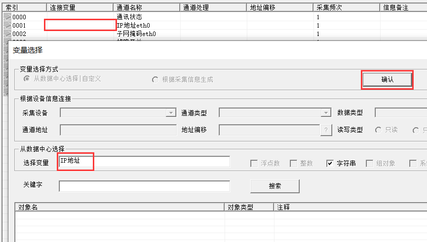

图 15.8-3 连接变量

1.  点击【确认】按钮后弹出对话框提示变量未定义，询问是否添加，选择【添加】。

>   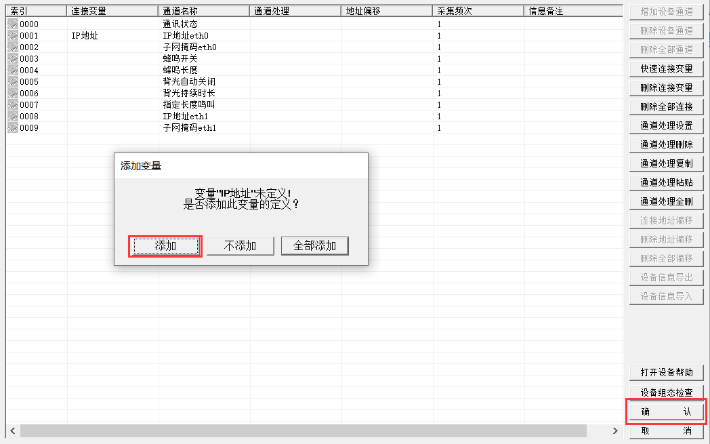

图 15.8-4 添加变量定义

此时，实时数据库中出现一个字符串型变量【IP地址】。

>   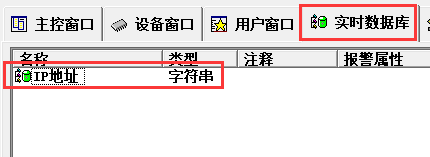

图 15.8-5 实时数据库中自动生成变量

1.  进入用户窗口，添加一个输入框构件，关联它操作属性中的数据对象为【IP地址】。

>   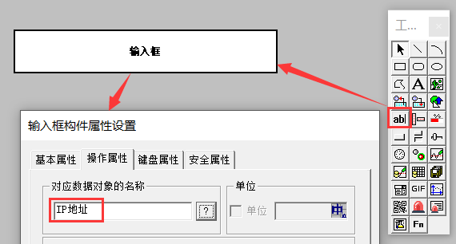

图 15.8-6 组态画面

1.  保存工程后下载工程，然后启动运行。可以看到输入框中显示当前IP地址【200.200.200.190】，我们将其重新设置为【200.200.200.191】。

>   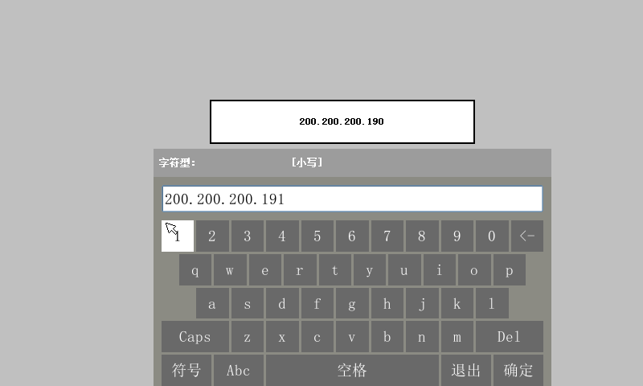

图 15.8-7 修改IP地址

1.  重启TPC，在读条界面按住屏幕，进入【启动页面配置界面】，点击【系统参数设置】按钮，进入【网络】设置界面。可以看到TPC的IP地址变成了【200.200.200.191】。

>   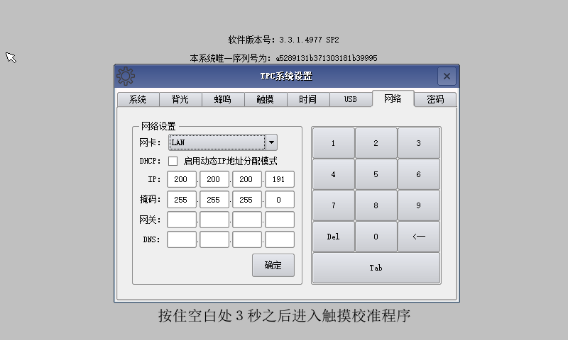

图 15.8-8 IP地址已修改

## 15.9 模拟设备

模拟设备可根据设置的参数产生一组模拟曲线的数据，以供用户调试工程使用。本设备可以产生标准的正弦波、方波、三角波、锯齿波信号，其幅值和周期都可以任意设置。本节主要介绍模拟设备的设置方法。

使用15.5.1中的方法在设备窗口中添加一个模拟设备。请注意：模拟设备也也不需要挂载在父设备下。

>   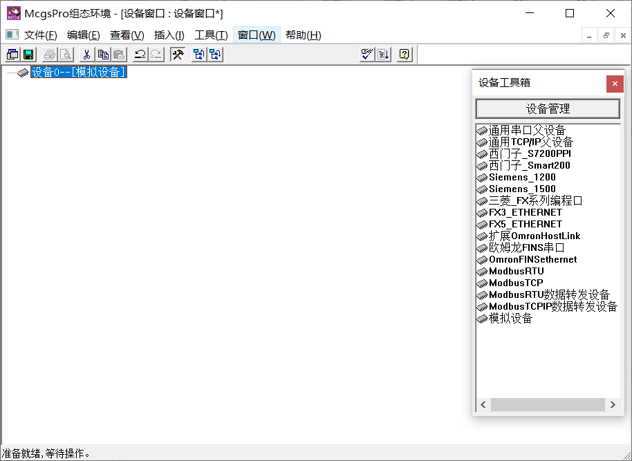

图 15.9-1 添加驱动

双击【模拟设备】弹出【设备编辑窗口】。

选择左下角的【内部属性】行，点击出现的图标，弹出模拟设备的【内部属性】设置界面。

>   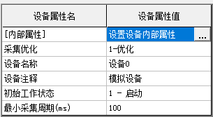 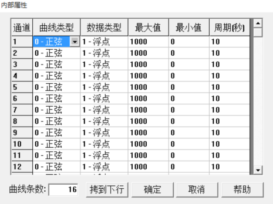

图 15.9-2 设置通道的曲线参数

在此处可以设置模拟设备的通道数量（即曲线条数），每条通道的曲线类型、数据类型、曲线的最大值、最小值和周期（单位为秒）。每个模拟设备可以产生多条曲线，每条曲线都可设置成不同的参数。本例保持默认不变。

具体操作如下

（1）用鼠标左键单击曲线类型下的某行，即可设置该行曲线的类型，单击数据类型下的某行，即可设置该行曲线的数据类型，可直接输入曲线的最大值，最小值，循环周期。

（2）在曲线条数输入框可以输入自己需要的曲线数。

（3）按拷到下行按钮，可以把鼠标所在行的所有数据拷贝到下一行。

（4）用鼠标选取多行，按Ctrl+F5 可将所选取的最上一行的数据拷贝到选的其它各行。

## 15.10 屏与屏之间的数据同步

本节主要介绍使用McgsPro组态软件中的【ModbusTCPIP数据转发设备】、【ModbusTCP】两个驱动实现屏TPC1与屏TPC2之间的数据同步。

### 15.10.1 硬件连接

使用交换机和网线，将组态用的电脑和两个屏幕相连。

### 15.10.2 组态画面

使用McgsPro新建一个工程，将工程另存为【TPC1】。

在实时数据库中新建整数型变量【data0】。

进入用户窗口0，新建一个按钮，将它的显示文本设置为【取反】，操作设置为点击后取反，关联的变量为【data0】。设置步骤如图15.10-1所示。

>   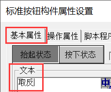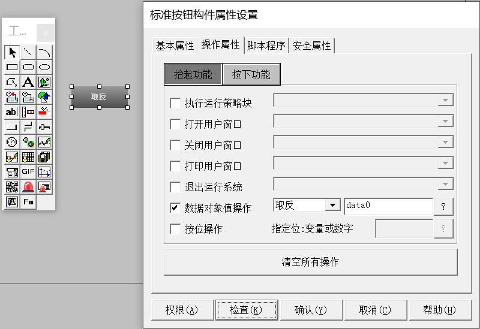

图 15.10-1 组态画面

在按钮左侧新建一个标签构件，将它的显示输出关联变量【data0】，当变量值为1时，显示信息为【开】，当变量值为0时，显示信息为【关】。设置步骤如图15.10-2所示。

>   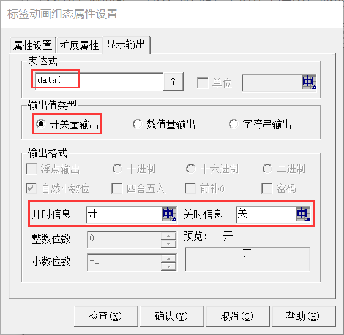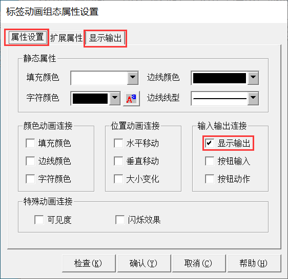

图 15.10-2 设置标签构件

再在实时数据库中新建一个整数型变量【通讯状态】。然后回到用户窗口0中，新建一个标签构件，按照关联【data0】的步骤将标签和变量【通讯状态】相关联，输出值类型设为【数值量输出】。

组态完画面后，保持工程，然后将工程另存为【TPC2】。

### 15.10.3 通讯设置

在本例中，TPC1的IP地址为【200.200.200.190】，TPC2的IP地址为【200.200.200.191】。

#### 15.10.3.1 组态TPC1中的设备

1.  用McgsPro打开工程【TPC1】，进入其设备窗口，添加【ModbusTCPIP数据转发设备】驱动到设备窗口中，该驱动没有父设备。

>   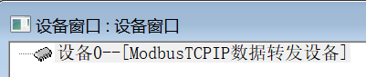

图 15.10-3 添加驱动

1.  双击设备驱动进入【设备编辑窗口】。设备参数设置如图15.10-4所示。

>   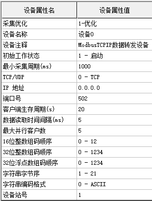

图 15.10-4 子设备属性

当该设备的IP地址为【0.0.0.0】时，表示绑定本机（TPC）的所有IP地址，即使本机的IP改变，工程IP也可不做修改。当然也可以直接将此处设置为TPC1的IP地址【200.200.200.190】。

1.  新建通道【读写00001】，将它与变量【data0】连接。设置步骤如图15.10-5所示。

>   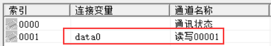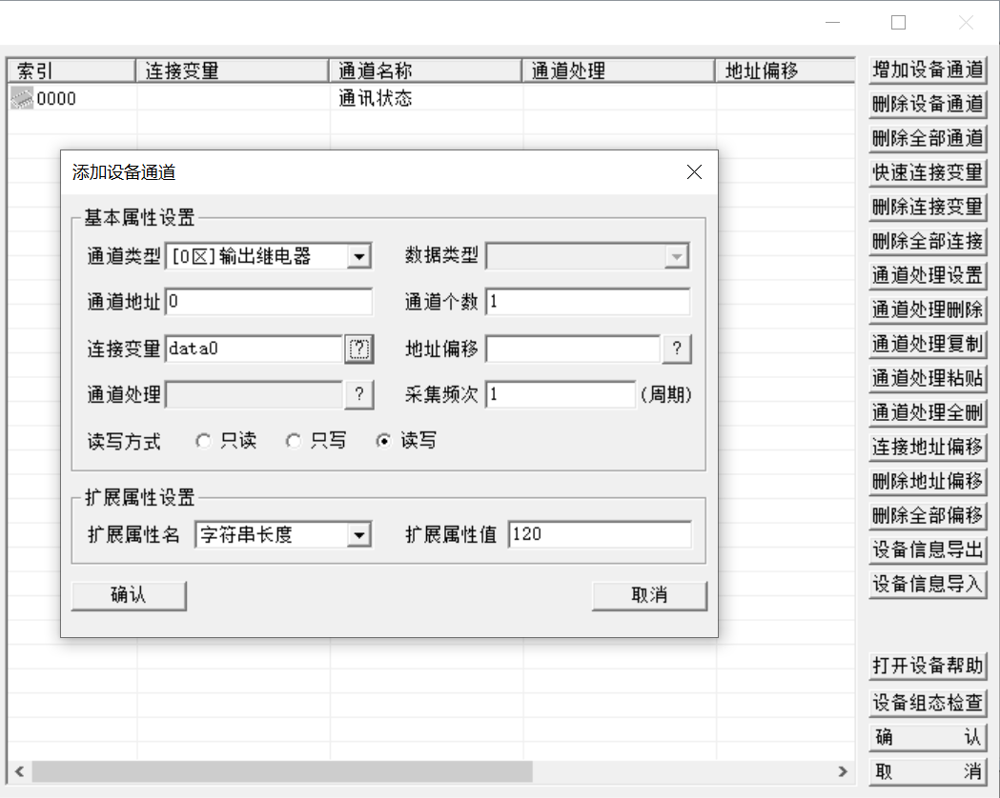

图 15.10-5 添加通道并连接变量

在通道【通讯状态】左侧的【连接变量】列右击或双击，弹出【变量选择】界面，双击变量【通讯状态】，如此，通道【通讯状态】便与变量【通讯状态】相连接。

组态完成后，保存工程，然后将该工程下载到TPC1中。下载配置界面设置如图15.10-6所示。其中，【200.200.200.190】是TPC1的IP地址。下载成功后点击【启动运行】按钮使工程运行。

>   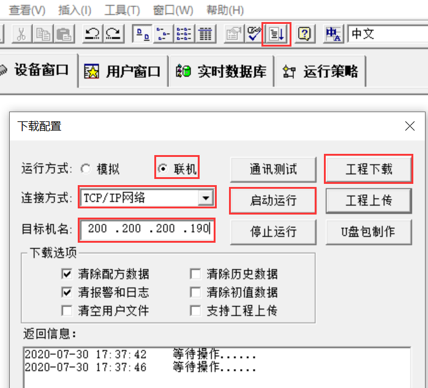

图 15.10-6 下载工程

此时由于TPC2还没有组态好，连接了【通讯状态】的标签显示为【-2】，表示【通讯端口打开失败】。通讯参数显示的数字所代表的意义，可以在设备的帮助中找到。

>   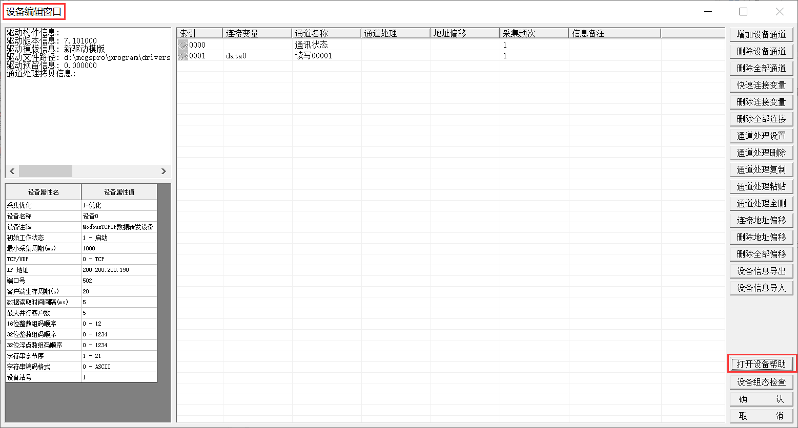

图 15.10-7 设备帮助的打开方法

#### 15.10.3.2 组态TPC2中的设备

用McgsPro打开工程【TPC2】，进入其设备窗口，将【ModbusTCP】驱动挂载到【通用TCP/IP父设备】下。

>   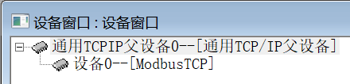

图 15.10-8 添加驱动

双击父设备，设置参数如图15.10-9所示。其中【200.200.200.191】是本机（TPC2） 的IP地址，【200.200.200.190】是远程设备（TPC1） 的IP地址，

>   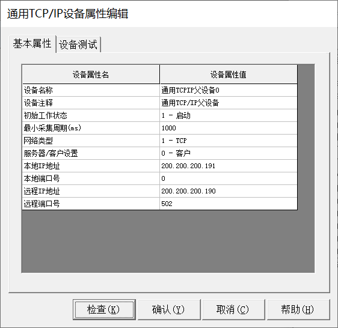

图 15.10-9 设置父设备参数

双击【ModbusTCP】，进入子设备【设备编辑窗口】。子设备的参数设置如图15.10-10所示。

>   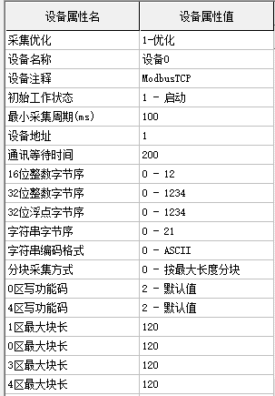

>   

图 15.10-10 设置子设备参数

参考15.3.3中的步骤，将通道【通讯状态】与变量【通讯状态】连接，再新建一个和TPC1中同样地址的通道【读写00001】，将它连接变量【data0】。设置完成后【设备编辑窗口】的通道和变量连接情况如图15.10-11所示。然后点击确认关闭界面。

>   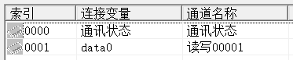

图 15.10-11 通道和变量连接情况

组态完成后，保存工程，然后将工程下载到TPC2，工程下载成功后点击启动运行。可以看到，此时显示TPC1和TPC2通讯参数的标签都显示为【0】，表示通讯正常。

### 15.10.4 运行展示

在TPC1的画面中点击取反按钮，则按钮前的标签的显示内容从【关】变成【开】，且在TPC2画面中按钮前的标签显示内容也跟随变化，从【关】变成【开】。由于在通道设置时选择通道读写方式为【读写】，所以数据的转发是双向的，即在TPC2画面中操作时，TPC1画面中的内容也跟随变化。

>   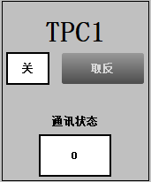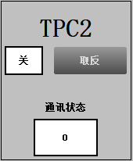 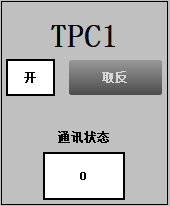 

图 15.10-12 运行效果

说明：数据转发是通过相同的通道实现的数据转发，所以即使在两个工程中，通道【读写00001】连接了不同名称的变量，也可以实现数据同步。比如在本例的两个工程中，通道【00001】分别连接了变量【A】和变量【B】，那么在TPC1中的变量【A】发生变化后，TPC2中的变量【B】也会随之变化，反之亦然。

## 15.11 PLC通过TPC1同TPC2传输数据

本节主要讲解内容是：PLC不直接与TPC2相连，而是通过TPC1的数据转发功能，将PLC的数据传递给TPC2。本例将在15.10样例的基础上进行组态，使用的PLC是Siemens_1200，其IP地址为【200.200.200.200】。

### 15.11.1 硬件连接

使用交换机和网线，将组态用的电脑和两个屏幕以及PLC相连。

### 15.11.2 组态设备

使用McgsPro进入工程【TPC1】，在它的设备窗口中将【Siemens_1200】驱动挂载到【通用TCP/IP父设备】下，如图15.11-1所示。

>   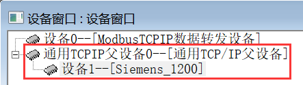

图 15.11-1 添加驱动

双击【通用TCP/IP父设备】，父设备参数设置如图15.11-2所示。其中【200.200.200.190】为TPC1的IP地址，【200.200.200.200】为PLC的IP地址。

>   

图 15.11-2 设置父设备参数

双击【Siemens_1200】进入子设备的【设备编辑窗口】，子设备参数如图15.11-3所示。

>   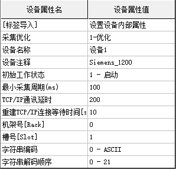

图 15.11-3 设置子设备参数

在【设备编辑窗口】中添加通道【读写Q000.0】并将它连接变量【data0】,设置步骤如图15.11-4所示。

>   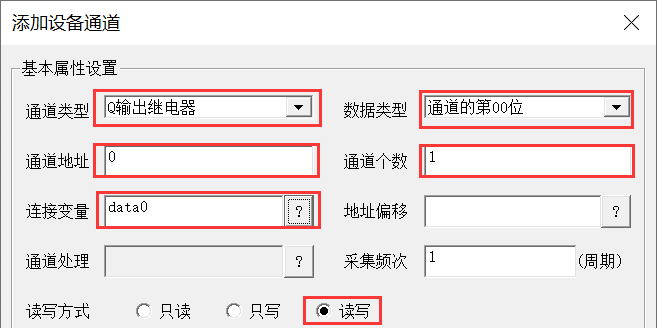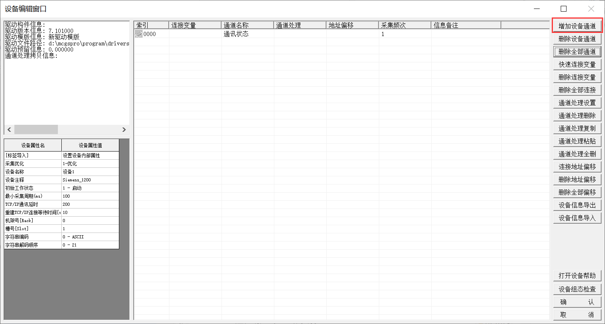

图 15.11-4 添加通道并连接变量

将通道【通讯状态】连接变量【PLC_通讯状态】。

>   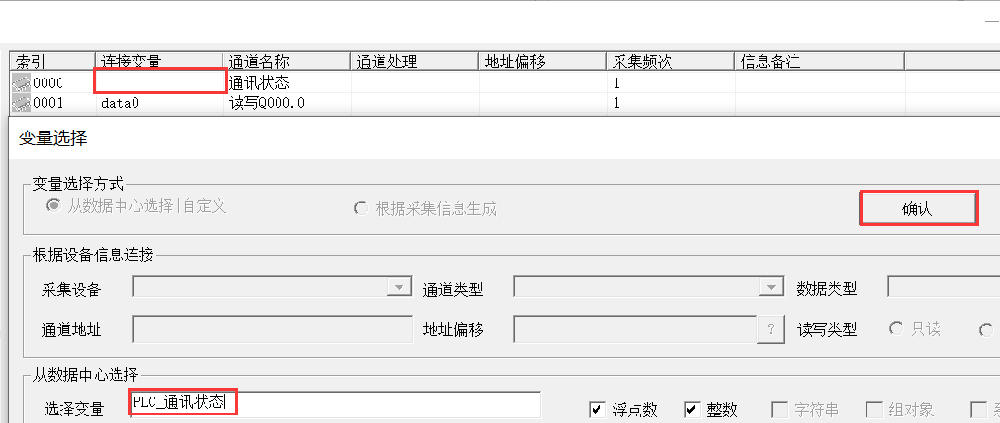

图 15.11-5 给设备通讯状态连接变量

连接完成后，通道与变量的连接情况如图15.11-6所示。

>   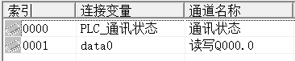

图 15.11-6 通道与变量的连接情况

点击【设备编辑窗口】的【确认】按钮，弹出对话框提示【变量“PLC_通讯状态”未定义！】，询问【是否添加此变量的定义？】，选择【添加】。

>   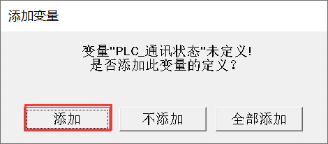

图 15.11-7 自动添加变量定义

此时实时数据库中自动添加一个整数型变量【PLC_通讯状态】。

>   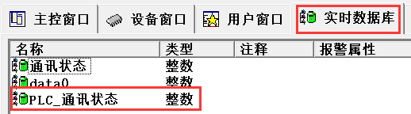

图 15.11-8 实时数据库情况

### 15.11.3 通讯设置

然后在用户窗口0中，新建一个标签，将它的显示输出关联新增加的变量【PLC_通讯状态】，输出值类型设为【数值量输出】。

组态完成后下载工程到TPC1，然后启动工程。TPC2的工程不做修改。

### 15.11.4 组态PLC

使用TIA Portal V15.1设置PLC的IP地址。设置步骤如图15.11-9所示。

>   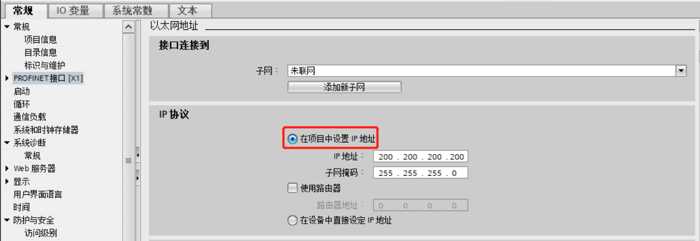

图 15.11-9 设置PLC参数一

勾选【属性】-\>【常规】-\>【防护与安全】-\>【连接机制】-\>【允许来自远程对象的PUT/GET通信访问】。

>   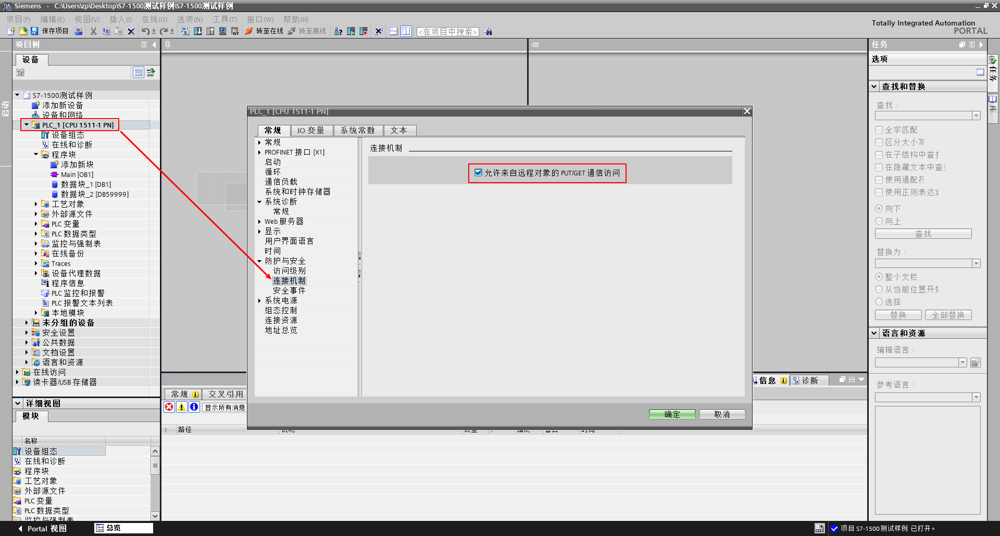

图 15.11-10 设置PLC参数二

设置完成后将程序下载到PLC。

### 15.11.5 运行展示

在TPC1的画面中点击取反按钮，则按钮前的标签的显示内容从【关】变成【开】，此时TPC2画面中标签显示内容跟随变化，从【关】变成【开】，PLC的输出点Q0.0的灯也随之变亮。由于在通道设置时选择通道读写方式为【读写】，所以PLC和两个TPC的数据可以相互传递，即其中一个设备的数据发生变化，另两个设备的数据也跟随变化。

>   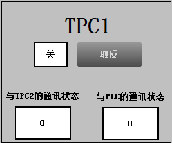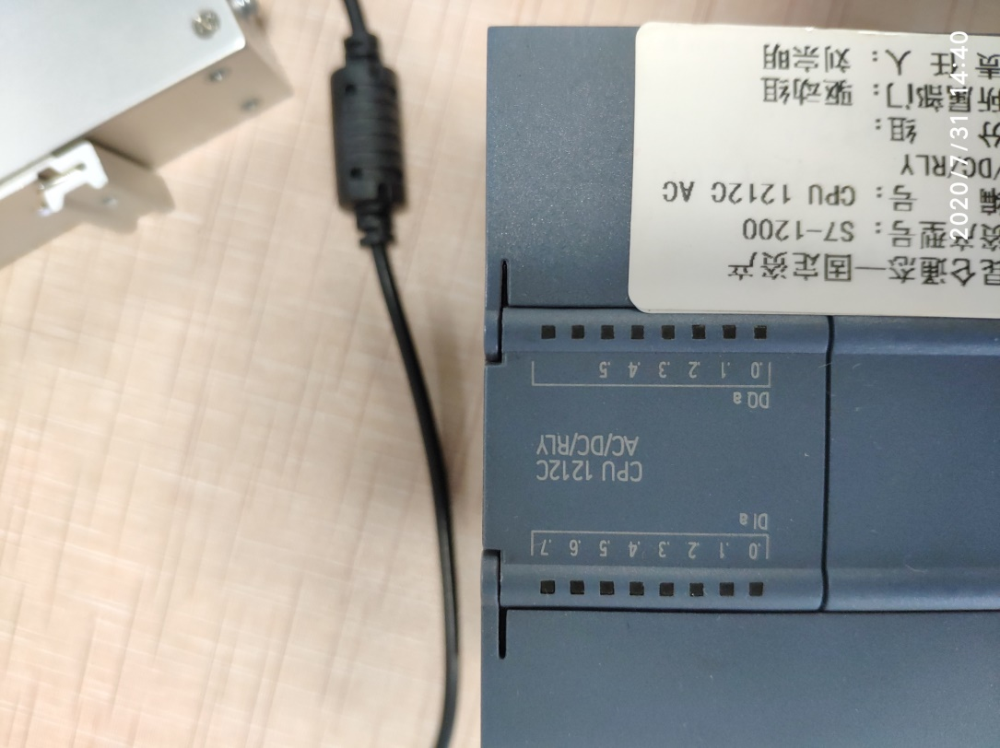

>   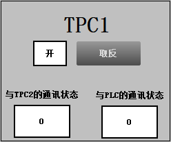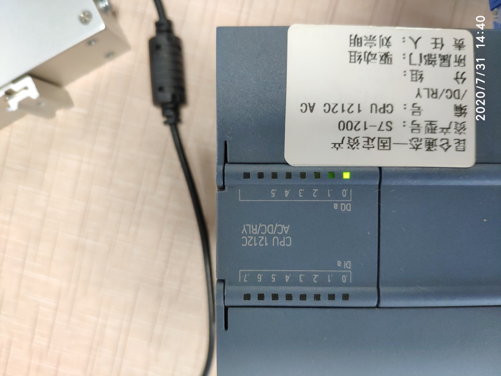

图 15.11-11 运行效果

## 15.12 通讯常见问题分析处理

### 15.12.1 通讯与否

当不确定通讯是否正常时候，建议都添加通讯状态来准确判断。

### 15.12.2 驱动最新

理论上通讯状态不为0，都建议确认驱动是否为最新版本，可与400客服热线确认。

### 15.12.3 通讯状态

通讯状态不为0，打开设备编辑窗口的设备帮助，里面有每个驱动通讯状态非0的排查措施。

>   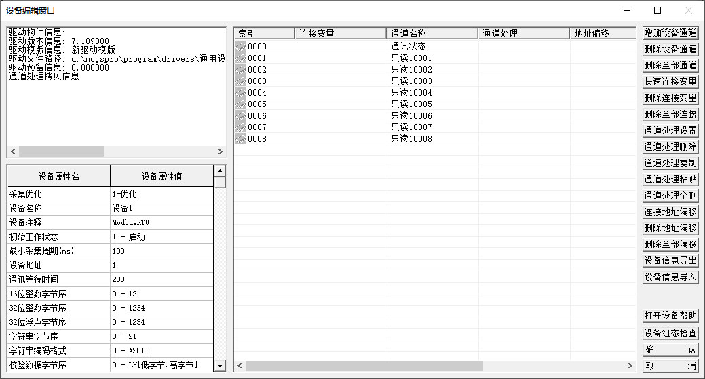

图 15.12-1 打开设备帮助

### 15.12.4 注意事项

1.  绝大部分客户问题主要集中在3个，组态错误，参数硬件，地址超范围，故建议不好排查通讯问题时候，都按照对应通讯测试工程去测试通讯，通讯测试工程请联系400客服热线获取。
2.  通讯测试工程包含MCGS工程，PLC程序，接线帮助等，故用通讯测试工程完成通讯，基本可排除组态错误和参数硬件问题，剩下的主要地址超范围问题排查就有了方向。

# 

# ※硬件篇※

# 第1章 TPC产品介绍

昆仑通态生产的基于Linux的TPC产品均通过了CE、FCC、RoSH认证。本章节主要以TPC1071Gi为例，进行TPC产品的硬件介绍。其他型号的TPC会有外观材料、接口数量等方面的差异。详细硬件资料请参考昆仑通态选型手册（访问昆仑通态官网或致电400获取）。

-   TPC外观和接口

TPC1071Gi外观和接口如图1.1-1和图1.1-2所示。

正面

>   

图1.1-1 TPC正面图

背面

>   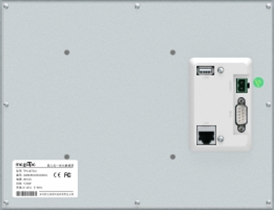

图1.1-2 TPC背面图

a . 显示/触控区域； b .USB主口（Type-A，作用：USB打印，上传/下载工程，数据导入/导出）； c .电源DC24V±20%；

d .DB9公头（作用：与下位机通讯）：（COM1、COM2、COM3）或（COM1、COM9），针脚定义如图1.1-3所示：

>   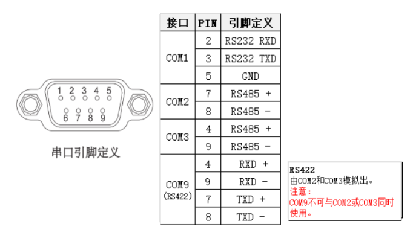

图1.1-3 TPC引脚定义

e .LAN网口（作用：与下位机通讯，网络打印，上传/下载工程）； f .TPC产品标签

# 第2章 TPC系统功能

本章节主要介绍TPC的系统时间、IP地址等系统功能设置，以及TPC常见异常处理。

## 2.1 TPC系统功能

### 2.1.1 TPC产品信息

进入TPC系统配置界面可显示TPC产品信息。

-   TPC系统配置界面进入方法：如图2.1.1所示，启动TPC时按住TPC液晶显示屏，进入TPC系统配置界面。

>   

图2.1-1 进入系统配置界面

-   系统配置界面如图2.1-2所示：

>   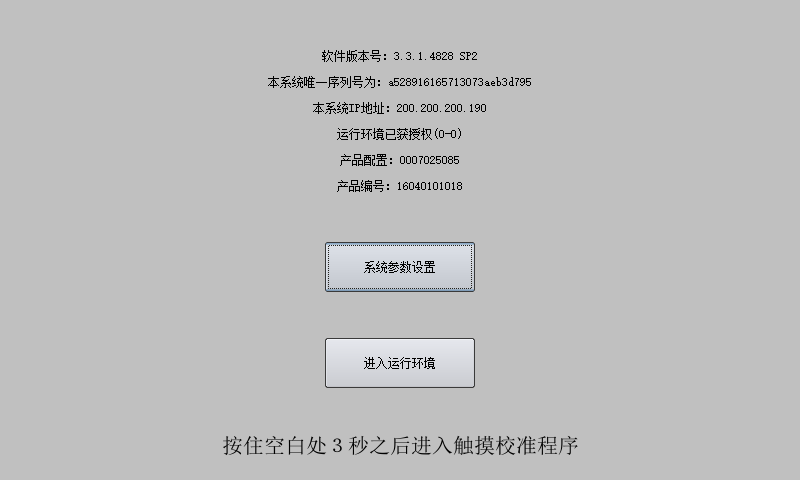

图2.1-2 系统配置界面

a. TPC运行环境版本 b. TPC序列号 c. IP地址（双网口TPC会显示2个IP地址） d. 授权状态

e.f. 产品配置编号 g. 系统参数设置 h. 运行TPC中的工程 i. 提示：按住页面空白处3秒，进行触摸校准

### 2.1.2 TPC系统设置

通过TPC系统设置，可以查看TPC系统信息、设置系统时间、IP地址等参数。

点击图2.1-2中的“g. 系统参数设置”进入TPC系统设置界面。如图2.1-3所示：

>   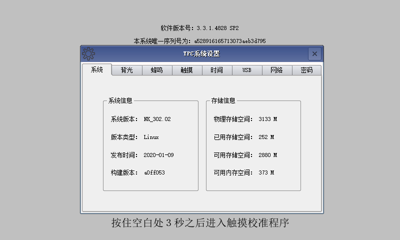

图2.1-3 TPC系统设置

-   系统：查看TPC系统NK版本，以及TPC磁盘、内存使用情况；

    注意：系统版本可以使用NK升级包进行升级，请参考TPC辅助工具章节1.3

-   背光：设置TPC液晶屏的背光时间。分辨率为1920\*1080的TPC，还支持背光亮度调节；
-   蜂鸣：设置点击TPC液晶显示面板时，蜂鸣器鸣叫持续时间；
-   触摸：选择是否显示鼠标指针，以及进行触摸校准；
-   时间：设置TPC的系统时间；
-   USB：进行USB主从口切换，只有同时具备USB主口（Type-A）和USB从口（Type-B）的TPC才有该选项；

    注意：TPC重启后默认为主口模式，进行主从口切换时，主口和从口禁止插入任何设备，否则可能导致切换失败；

-   网络：设置TPC的IP地址、掩码、网关、DNS、启用/停用DHCP。

    注意：必须将TPC连上支持DHCP的路由器，才能启用DHCP模式，实现TPC自动获取IP地址；

    单网口TPC默认IP地址：LAN 200.200.200.190；

    双网口TPC默认IP地址：LAN1 200.200.200.190；LAN2 192.168.0.1。LAN1与LAN2完全独立，互不干扰。

## 2.2 TPC常见异常

1.  **修改TPC系统时间导致工程无法正常运行**

现象：修改系统时间，弹出图2.2-1所示警告，【继续】修改后，工程无法正常运行；

原因：工程组态人员在当前工程中组态了运行期限功能，并开启了时间保护功能，用户无法随意修改系统时间；

处理：a.输入期限密码解锁所有工程期限；b.参考章节：进阶篇_13.2.5 工程运行期限，重新组态工程，取消时间保护功能，再将新工程下载到TPC（重新组态并下载工程会清空TPC中的已有工程）。

>   

图2.2-1 系统时间约束

1.  **TPC运行过程弹出【运行到期】提示框**

现象：TPC运行过程突然弹出图2.2-2所示的运行到期提示框，要求输入激活密码，否则工程无法正常使用；

>   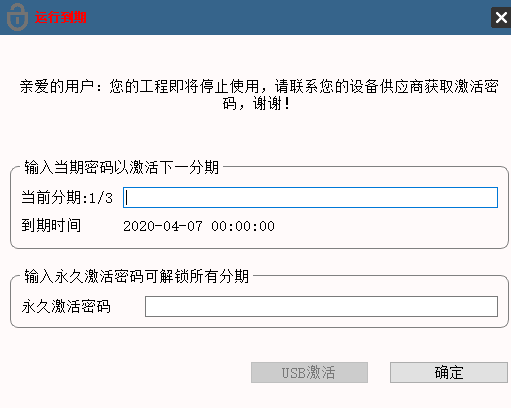 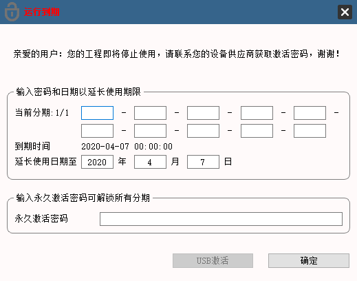

静态期限弹窗 动态期限弹窗

图2.2-2 工程运行到期弹窗

原因：工程组态人员在当前工程中组态了运行期限功能，导致工程运行到期后工程被锁定；

处理：a.输入当期激活密码或永久激活密码，解锁工程期限；b. 参考章节：进阶篇_13.2.5 工程运行期限，重新组态工程，取消期限功能，再将新工程下载到TPC（重新组态并下载工程会清空TPC中的已有工程）。

1.  **TPC运行工程提示“用户工程文件已受保护“**

现象：TPC运行工程，弹出图2.2-3所示提示框“用户工程文件已受保护“，工程无法运行；

原因：工程组态人员在当前工程中启用了【工程文件保护】功能，而TPC却没有设置正确的触摸屏识别码；

处理：参考章节：进阶篇13.2.3 工程文件保护，重新组态工程，关闭【工程文件保护】，重新下载工程（重新组态并下载工程会清空TPC中的已有工程）；。

>   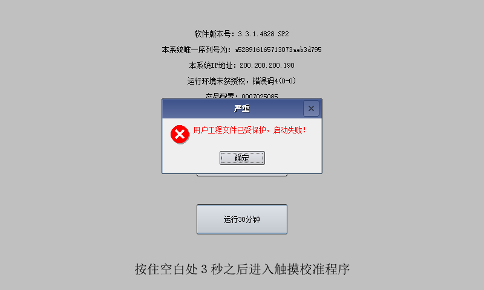

图2.2-3 工程文件保护弹窗

1.  **TPC运行工程提示“系统时间异常“**

现象：TPC运行工程，如图2.2-4所示，弹窗提示“TPC系统时间异常“，TPC系统时间从1970年0时0分0秒重新计时。修改系统时间并重启TPC，系统时间恢复成1970年0时0分0秒；

>   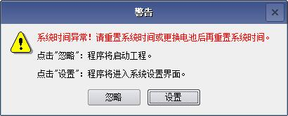

图2.2-4 系统时间异常

原因：TPC主板上的纽扣电池松动或电量耗尽；

处理：如图2.4-5所示，购买新CR2032纽扣电池，卸下TPC后盖进行替换，并固定好新电池。再重新进入TPC系统设置修改系统时间，系统时间修改方法参考硬件篇章节2.1.2。

>   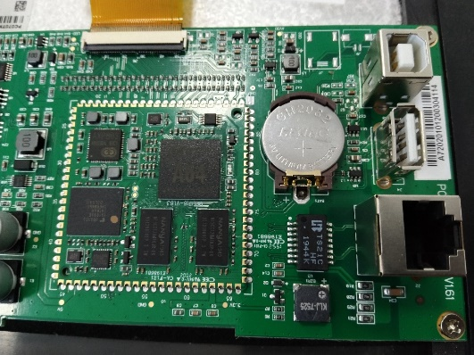

图2.4-5

注意：如果该处理办法无效，则可能是触摸屏故障，建议从购买渠道进行返修。

1.  **TPC主从口切换无效**

现象：显示TPC主从口切换成功，但实际上无法通过主口或从口连接TPC；

原因：进行主从口切换时，主口或从口上插入了U盘或者从口线等设备；

处理：进行主从口切换时，主口和从口禁止插入任何设备，见硬件篇章节2.1.2。

1.  **DHCP启用失败**

现象：TPC的DHCP功能启用失败，无法自动获取IP地址；

原因：TPC网口未连接支持DHCP的路由器情况下，无法启用DHCP功能；

处理：TPC网口连接支持DHCP的路由器后，再进入TPC系统设置启用DHCP功能，见硬件篇章节2.1.2。

1.  **TPC密码遗失**

现象：无法进行任何需要输入TPC密码的操作，比如更新工程、更新运行环境、更新系统NK、进入TPC系统设置；

处理：TPC密码遗失后无法找回，只能使用专用工具对TPC恢复出厂设置，该操作会清空TPC中包括用户工程在内的所有用户数据，该工具可致电400热线电话获取。

注意：此处的TPC密码指的是硬件篇章节2.1.2讲解的【TPC系统设置】→【密码】，不是工程密码或者工程用户登录密码。

# ※辅助工具※

# 第1章 TPC辅助工具

用户可以使用昆仑通态提供的专用U盘包对TPC进行维护，主要功能包括：TPC运行环境升级、TPC系统NK升级、TPC系统功能维护等。

除“运行环境升级包”、“U盘功能包”之外，“NK升级包”和“特殊功能包”需要向当地代理索取，各地代理联系方式可致电400获取。

## 1.1 运行环境升级包

TPC的运行环境可以看作运行在TPC中McgsPro软件平台，运行环境升级指的就是升级运行在TPC中的McgsPro软件版本。用户可在重启TPC时，按照提示按住TPC液晶显示屏，进入系统配置界面查看TPC运行环境版本。

如图1.1-1所示，McgsPro运行环境升级包一般跟随McgsPro组态软件一起发布。该升级包可强制将TPC运行环境升级到目标版本，无视TPC当前运行环境版本。

>   

图1.1-1 运行环境升级包

操作步骤：

1.  解压图1.1-1所示的运行环境升级包，拷贝解压文件“tpcbackup”到U盘；
2.  将U盘插入TPC，等待TPC弹出图1.1.-2所示对话框，按照需要选择升级包语言（仅3.3.1.4828 SP及之后版本可选择语言），点击【是】进行运行环境升级，升级完成后拔出U盘，重启TPC即可。

>   

图1.1-2 U盘更新运行环境

注意：新版本运行环境可兼容旧版本工程；旧版本运行环境可能不兼容新版本工程。

## 1.2 U盘功能包

此处的U盘功能包，指在电脑端运行McgsPro组态软件制作的U盘功能包，该功能包可用于更新TPC工程和运行环境。使用方法请参考入门篇章节2.5.2。

## 1.3 NK升级包

TPC系统NK： 标准TPC产品自带TPC系统NK环境，可以简单的看作TPC的操作系统。

昆仑通态会根据需要更新迭代TPC的NK版本。对于有更新TPC系统NK版本需求的客户，可向代理索取NK升级包。

《U盘升级包_G系列_NK302.02_V1.0_20200420.rar》，该升级包可将G系列符合要求的TPC系统NK版本升级到NK_302.02，我们以该升级包为例讲解，操作步骤如下：

1.  解压“U盘升级包_G系列_NK302.02_V1.0_20200420.rar”，如图1.3-1，先阅读 “使用前必读.txt”，然后将“tpcbackup”拷贝到U盘根目录；

>   

图1.3-1

1.  将U盘插入符合“使用前必读.txt”要求的TPC，按照提示启动升级流程，NK升级时TPC会多次重启，不要拔出U盘或断电；
2.  用户必须等TPC弹出图1.3-2所示对话框，才可拔出U盘，并重启TPC。

>   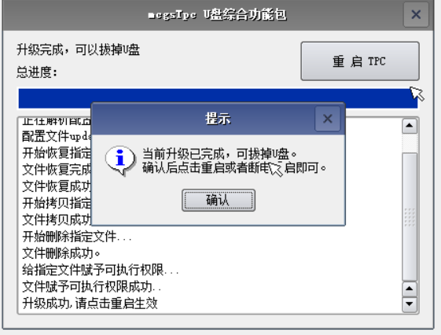

图1.3-2升级成功提示框

注意事项：

-   U盘必须采用FAT32格式，否则TPC无法识别U盘；
-   NK升级属于TPC系统升级，升级过程严禁拔出U盘或者给断电，否则可能导致TPC无法启动（如意外拔出了U盘或断电，建议不要修改U盘文件，直接插入U盘重启TPC继续升级流程，此为补救办法，不一定有效）；
-   标准版本NK升级会备份包括TPC工程在内的所有用户数据和用户文件，如用户TPC中保存的数据较多，将会大大增加“文件完整性校验”、“数据备份”和“数据恢复”耗时，请用户耐心等待。

## 1.4 特殊功能包

针对一些用户可能需要在TPC中实现某些特殊功能的需求，昆仑通态提供了对应的功能包供用户使用，如VNC功能包、MySQL客户端部署包等。这些功能包需要向代理索取，且不具备普适性，对TPC型号有一定限制，用户在使用时需要先阅读图1.3-1所示的“使用前必读.txt”，确认目标TPC是否支持部署。特殊功能包使用方法与普通U盘功能包类似，用户参考TPC辅助工具章节1.3所述的NK升级包使用方法即可。

# 

# 附录1 McgsPro支持的驱动

下表中列出了McgsPro当前版本支持的驱动。同时客户的非标设备、自研设备也可向代理申请驱动定制。

| **序号** | **驱动名称**               |
|----------|----------------------------|
| 1        | Beckhoff_ADS               |
| 2        | LG_MasterK系列编程口       |
| 3        | LG-MasterK系列Cnet模块     |
| 4        | ModbusAscii                |
| 5        | ModbusRTU                  |
| 6        | ModbusRtuBaseZero          |
| 7        | ModbusRTU数据转发设备      |
| 8        | ModbusTCPIP数据转发设备    |
| 9        | ModbusTCP                  |
| 10       | MQTT                       |
| 11       | AB_DF1_ETHERNET            |
| 12       | AB-半双工                  |
| 13       | AB-全双工                  |
| 14       | CompactLogixTCP            |
| 15       | 安川MEMOBUS扩展以太网      |
| 16       | 安川MEMOBUS扩展以太网_3000 |
| 17       | 安川MP控制器MEMOBUS以太网  |
| 18       | 岛电数字控制器             |
| 19       | VIGOR_VS                   |
| 20       | VIGOR系列PLC               |
| 21       | HaiWell_PLC                |
| 22       | LE_ModbusRTU               |
| 23       | 和利时PLC-ModbusRTU        |
| 24       | 横河西仪FA-M3 TCP以太网    |
| 25       | 汇川AM600-ModbusTCP        |
| 26       | H3U_MODBUSTCP              |
| 27       | 基恩士KV5500_以太网        |
| 28       | 基恩士PLC_KV1000           |
| 29       | 麦格米特EC系列plc          |
| 30       | OmronNj                    |
| 31       | 欧姆龙E5□N系列仪表         |
| 32       | 扩展OmronHostLink          |
| 33       | 欧姆龙FINS串口             |
| 34       | 欧姆龙FINS以太网           |
| 35       | FX3_ETHERNET               |
| 36       | FX5_ETHERNET               |
| 37       | 三菱_FX系列串口            |
| 38       | PLC_MELSEC_Q_TCPIP         |
| 39       | 三菱_Q系列编程口           |
| 40       | 三菱_Q系列串口             |
| 41       | 三菱_FX系列编程口          |
| 42       | 松下FP7以太网              |
| 43       | 松下FP系列通讯口           |
| 44       | 松下FP系列以太网           |
| 45       | 台达dtle_as300TCP          |
| 46       | 台达DVP系列PLC             |
| 47       | 微型打印机                 |
| 48       | 西门子CP443-1以太网模块    |
| 49       | 西门子S7_300_400MPI        |
| 50       | 西门子_S7200PPI            |
| 51       | 西门子_Smart200            |
| 52       | 西门子S7200_CP243-1以太网  |
| 53       | Siemens_1200               |
| 54       | Siemens_1500               |
| 55       | XINJE_XL5E_ModbusTCP       |
| 56       | 信捷XC系列PLC              |
| 57       | 信捷ModbusRTU              |
| 58       | 永宏PLC                    |
| 59       | 宇光智能仪表               |

# 附录2 样例工程

教程中使用到的样例工程清单列表如下，下载地址请拨打400热线电话获取。

| **序号** | **样例名称**                                      |
|----------|---------------------------------------------------|
| 1        | 入门篇：第3章_液位保持系统.MCP                    |
| 2        | 进阶篇：2.3.2_自定义键盘.MCP                      |
| 3        | 进阶篇：2.5_异常弹窗提示.MCP                      |
| 4        | 进阶篇：3.1_旋转仪表.MCP                          |
| 5        | 进阶篇：3.2.1_GIF.MCP                             |
| 6        | 进阶篇：3.2.2-3.2.4_闪烁+可见度+跑马灯.MCP        |
| 7        | 进阶篇：3.3.1_动画显示.MCP                        |
| 8        | 进阶篇：3.3.2_动画按钮.MCP                        |
| 9        | 进阶篇：3.4_组合框构件_演示工程.MCP               |
| 10       | 进阶篇：3.5.4_GIF构件方法.MCP                     |
| 11       | 进阶篇：3.6.4_构件事件.MCP                        |
| 12       | 进阶篇：5.1_实时趋势曲线.MCP                      |
| 13       | 进阶篇：5.2_历史数据功能.MCP                      |
| 14       | 进阶篇：第6章_多重复制.MCP                        |
| 15       | 进阶篇：7.1_地址偏移.MCP                          |
| 16       | 进阶篇：7.2_变量指针.MCP                          |
| 17       | 进阶篇：8.1-8.2_配方构件+方法.MCP                 |
| 18       | 进阶篇：8.3_配方函数.MCP                          |
| 19       | 进阶篇：8.4_工艺顺控器应用示例.MCP                |
| 20       | 进阶篇：第9章_XY曲线.MCP                          |
| 21       | 进阶篇：10.1.2_声明脚本.MCP                       |
| 22       | 进阶篇：10.2.2_传送带移动（IF).MCP                |
| 23       | 进阶篇：11.10_内存操作函数.MCP                    |
| 24       | 进阶篇：11.11_计时器函数.MCP                      |
| 25       | 进阶篇：11.11_计时器函数ALL.MCP                   |
| 26       | 进阶篇：11.2.1_数组操作函数.MCP                   |
| 27       | 进阶篇：11.2.1_设置数组大小，获取数组大小.MCP     |
| 28       | 进阶篇：11.2.2_运行策略.MCP                       |
| 29       | 进阶篇：11.2.3_窗口操作函数.MCP                   |
| 30       | 进阶篇：11.2.4_打印屏幕.MCP                       |
| 31       | 进阶篇：11.2.4_系统操作函数.MCP                   |
| 32       | 进阶篇：11.2.5_操作日志函数.MCP                   |
| 33       | 进阶篇：11.3.1_数据设置函数+组对象操作函数.MCP    |
| 34       | 进阶篇：11.3.3_历史数据操作函数+保存初值.MCP      |
| 35       | 进阶篇：11.3.5_报警操作函数.MCP                   |
| 36       | 进阶篇：11.5_时间函数.MCP                         |
| 37       | 进阶篇：11.6_数学函数.MCP                         |
| 38       | 进阶篇：11.7_字符串操作函数.MCP                   |
| 39       | 进阶篇：11.8_系统变量函数.MCP                     |
| 40       | 进阶篇：11.9_文件操作函数.MCP                     |
| 41       | 进阶篇：12.1_多语言.MCP                           |
| 42       | 进阶篇：第12章_多语言.MCP                         |
| 43       | 进阶篇：13.1.2_用户权限（密码正确打开子窗口）.mcp |
| 44       | 进阶篇：13.1.3_操作日志.MCP                       |
| 45       | 进阶篇：第14章_打印功能应用实例.MCP               |
| 46       | 进阶篇：15.10_1_ModbusTCPIP转发附PLC.mcp          |
| 47       | 进阶篇：15.10_2_ModbusTCPIP转发附PLC.mcp          |
| 48       | 进阶篇：15.6_模拟通讯.mcp                         |
| 49       | 进阶篇：15.7_替换PLC.MCP                          |
| 50       | 进阶篇：15.8_TPC系统控制.MCP                      |
| 51       | 进阶篇：15.9_模拟设备.MCP                         |
